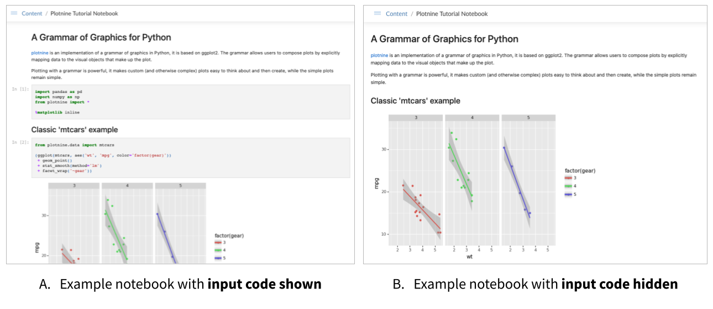

# Python Updates

At RStudio we know that many data science teams leverage both R and Python in their work, so it's important that we build products to support the best tools available in both languages. For an overview of all the ways our pro products support data science teams using R and Python, check out our [Single Home for R and Python](https://www.rstudio.com/solutions/r-and-python/) page.

APIs are a key to integrating your data science results into other applications and processes ([see this blog post](https://blog.rstudio.com/2021/05/04/rstudio-and-apis/) for more on APIs). With this RStudio Connect release, you can deploy, manage, and scale Python APIs built with FastAPI and several other ASGI-compliant frameworks. The list of supported Python content types has grown steadily over the last two years. This feature edition extends the capabilities even further with several options that enable asynchronous API development.

### RStudio Connect Supported Python Content Types in 2021

| Content Type             | Framework                     |
|--------------------------|-------------------------------|
| Documents & Notebooks    | Jupyter Notebooks             |
| Interactive Applications | Dash, Streamlit, Bokeh        |
| WSGI Frameworks          | Flask                         |
| ASGI Frameworks          | FastAPI, Quart, Falcon, Sanic |

### Additional Python Updates:

-   **New Feature** Support for hiding input code cells in Jupyter Notebooks.

-   **Announcement** Support for the Python 2 in RStudio Connect will end in January 2022. Planning and migration recommendations are described in the post below.

> NOTE on versioning: As part of this release, we've moved to calendar-based versioning. [See this blog post](https://blog.rstudio.com/2021/08/30/calendar-versioning-for-commercial-rstudio-products/) for details.

<a class="btn btn-primary btn-lg mt-5" href="https://www.rstudio.com/products/connect/">Click through to learn more about RStudio Connect</a>

## New Content Type: FastAPI

*Support for Python ASGI frameworks in RStudio Connect.*

[FastAPI](https://fastapi.tiangolo.com/) is a Python [ASGI](https://asgi.readthedocs.io/en/latest/) web API framework. Endpoints in FastAPI are Python `async` functions, which means that multiple requests can be processed concurrently. This is useful when the response of a request depends on the results of other `async` functions.

Example: If you use an asynchronous database client to access a remote database, your FastAPI endpoint function can `await` the results of the database query. This means that rather than getting blocked waiting for a response, new requests can begin to be processed while earlier requests are awaiting their results.

Learn more about FastAPI in the [RStudio Connect User Guide](https://docs.rstudio.com/connect/user/fastapi/).

### Additional ASGI Frameworks

Although ASGI is a standard, frameworks differ in the configuration settings required to support being deployed behind a proxy server (as is the case for APIs deployed within RStudio Connect). These frameworks have been validated for deployment in RStudio Connect:

-   [Quart](https://gitlab.com/pgjones/quart)
-   [Falcon](https://falconframework.org/)
-   [Sanic](https://sanicframework.org/en/)

### New Jump Start Example

The new FastAPI jump start example should look familiar to those who experimented with Flask. We've implemented the Stock Pricing Service example again in FastAPI so you can quickly see the differences between the two frameworks:

### Get Started

FastAPI and other ASGI-compatible APIs can be deployed to RStudio Connect with the `rsconnect-python` package. Follow the same [basic deployment steps](https://docs.rstudio.com/connect/user/publishing/#publishing-python-apis) required from our other python content types:

Pre-flight checks:

-   Install (or upgrade) the `rsconnect-python` command line interface using `pip`.
-   Add an RStudio Connect server for deployment by specifying the server URL and your API key.
-   Verify that you have activated the `virtualenv` environment that you want to reproduce on the server.
-   Ensure that you specify the [correct app entrypoint](https://docs.rstudio.com/connect/user/publishing/#publishing-rsconnect-python-entrypoint).

Deploy your ASGI-compliant API with:

    rsconnect deploy fastapi -n myServer MyApiPath/

<a class="btn btn-primary btn-lg mt-5" href="https://docs.rstudio.com/rsconnect-python/#installation">Upgrade your rsconnect-python CLI</a>

## Jupyter Notebook Feature: Hiding Code Cells

*Introduced in RStudio Connect 1.9.0.*

Hiding input code cells can be useful when preparing notebooks for audiences where a cleaner or less code-heavy presentation would be more appreciated.

There are two options for hiding input code cells in Jupyter Notebooks published to RStudio Connect:

-   Hide all input code cells
-   Hide only selected input code cells

If you've already set up the push-button publishing plugin for Jupyter Notebooks, make sure to upgrade [rsconnect-jupyter](https://docs.rstudio.com/rsconnect-jupyter/upgrading/), and [rsconnect-python](https://docs.rstudio.com/rsconnect-python/#installation) so you can get access to the new publishing features.

Learn more in the [RStudio Connect User Guide](https://docs.rstudio.com/connect/user/jupyter-notebook/#hide-input).

## Ending Support for Python 2

*Starting January 2022, RStudio Connect will no longer support Python 2.*

Python 2.7 has reached end of life maintenance status. Support from the Python language governing body ended on January 1, 2020 and it is no longer receiving security patches.

RStudio Connect has continued to support Python 2.7 beyond its EOL status, but we will join the community in ending support as of January 2022.

Factors that have gone into our decision include the following:

-   Python 3 is now widely adopted and is the actively-developed version of the Python language.
-   In January 2021, the `pip` 21.0 release officially dropped support for Python 2.  
-   A large number of projects pledged to drop support for Python 2 in 2020 including TensorFlow, scikit-learn, Apache Spark, pandas, XGBoost, NumPy, Bokeh, Matplotlib, IPython, and Jupyter notebook.

### Steps for planning your migration:

**Administrators** should determine whether Python 2 content exists on your RStudio Connect server today.

-   Customers who have RStudio Connect 1.8.6 or higher can audit the complete list of content items on their server and which versions of R/Python they use by deploying [this report](https://github.com/sol-eng/rsc-audit-reports/blob/main/environment-audit/environment-audit-report.Rmd).

**Publishers** should review the official porting guide and redeploy any mission critical content that currently relies on Python 2.

-   Read the official ["Porting Python 2 Code to Python 3" guide](https://docs.python.org/3/howto/pyporting.html) and the [Python 3 Statement Practicalities](https://python3statement.org/practicalities/) for advice on how to sunset your Python 2 code.

## Upgrade to RStudio Connect 2021.08.0

Before upgrading, please review the [full release notes](http://docs.rstudio.com/connect/news). This release contains additional features described in the Custom Branding [blog announcement](https://blog.rstudio.com/2021/08/30/rstudio-connect-2021-08-custom-branding/).

> #### Upgrade Planning
>
> Upgrading RStudio Connect should require less than five minutes. If you are upgrading from a version earlier than 1.9.0.1, be sure to consult the release notes for the intermediate releases, as well. As noted above, this release has features that require updates to [`rsconnect-python`](https://docs.rstudio.com/rsconnect-python/#installation) and, if applicable, [`rsconnect-jupyter`](https://docs.rstudio.com/rsconnect-jupyter/upgrading/).

To perform an RStudio Connect upgrade, download and run the installation script. The script installs a new version of Connect on top of the earlier one. Existing configuration settings are respected.

    # Download the installation script
    curl -Lo rsc-installer.sh https://cdn.rstudio.com/connect/installer/installer-v1.9.3.sh

    # Run the installation script
    sudo bash ./rsc-installer.sh 2021.08.0

<a class="btn btn-primary btn-lg mt-5" href="https://rstudio.com/about/subscription-management/">Sign up for RStudio Professional Product Updates</a>

