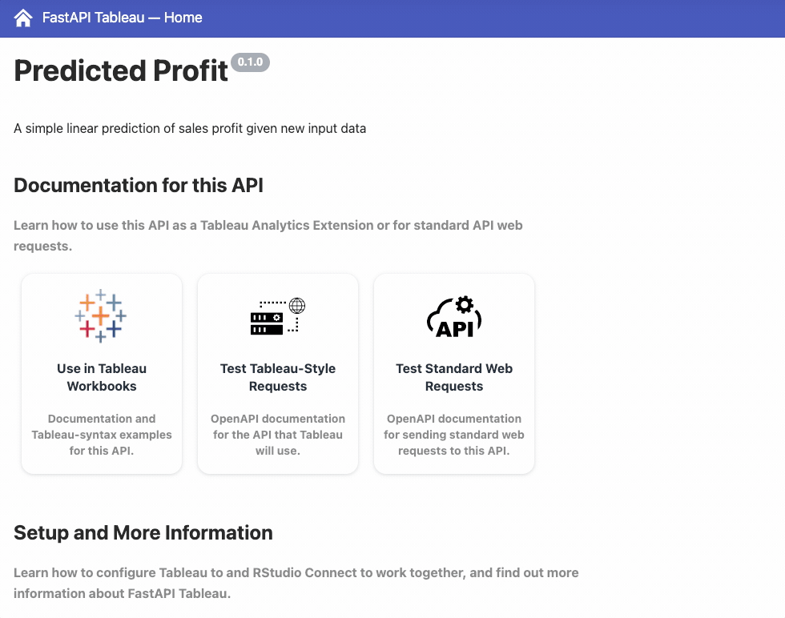
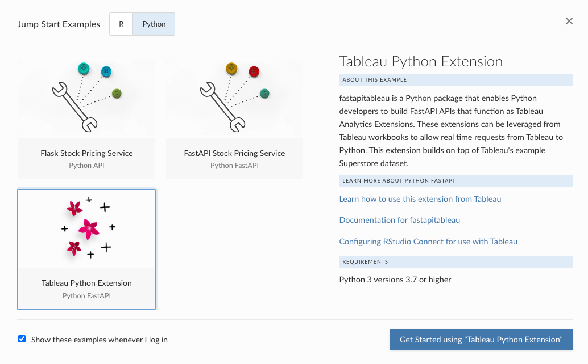

## Improve your reach

This edition of RStudio Connect introduces support for Tableau Analytics Extensions, our first external integration with a BI tool. Tableau Analytics Extensions provide a way to create calculated fields in workbooks that can execute scripts outside of the Tableau environment. This RStudio Connect integration enables you to create R or Python HTTP API extensions for use across all your Tableau workbooks.

Compared to existing methods for integrating R and/or Python in Tableau, integration via APIs hosted on RStudio Connect provides better security and dependency management:

-   Logic is contained within the API, preventing arbitrary code execution on the server.
-   RStudio Connect is a commercially-supported platform that provides access management, dials for tuning performance to meet the expected demand, and the ability to manage dependencies for multiple versions of R and Python on a per-project basis.
-   RStudio Connect also allows a single Tableau workbook to use R and Python extensions simultaneously.

### Why Build Web APIs?

Plumber and FastAPI are popular HTTP API generators for R and Python respectively. They can quickly and easily be leveraged to create powerful web APIs that get used by other developers, applications, and systems. Learning one (or both) of these frameworks allows you, a data scientist, to turn your functions into tools. In fact, by writing a function, you may have already created a powerful tool:

> ##### One of the best ways to improve your reach as a data scientist is to write functions. - *R for Data Science, Chapter 19*

In [R for Data Science](https://r4ds.had.co.nz/functions.html), authors Hadley and Garrett show us that functions are an excellent way to automate common tasks. Functions make code easier to understand and maintain, and reduce the chance of introducing unforced errors. But to truly extend your reach, you need a means for making those functions available to other people and systems. To distribute functions that reach users and consumers outside of your own domain, it's hard to beat the benefits of building and hosting a web API. We wrote about the many advantages of building APIs in [this blog post](https://blog.rstudio.com/2021/05/04/rstudio-and-apis/).

<h3 align="center"><a href="https://www.rstudio.com/solutions/bi-and-data-science/">Visit our BI and Data Science overview page</a></h3>

### R & Python for Tableau

In principle, extending Tableau should be as simple as directing a workbook to reach out to any existing web API, but [Tableau Analytic Extensions](https://tableau.github.io/analytics-extensions-api/) require special handling to make valid requests and receive results. To simplify this process, RStudio has introduced two new open source libraries which add functionality to Plumber and FastAPI:

-   For R: [`plumbertableau`](https://rstudio.github.io/plumbertableau/)
-   For Python: [`fastapitableau`](https://github.com/rstudio/fastapitableau)

These libraries can be used to create as many extensions as you want to manage. Publishing Tableau extensions to RStudio Connect works just like regular Plumber and FastAPI content, and the new Tableau integration is enabled by default after upgrading Connect to this release. Publishers can learn more in the [RStudio Connect User Guide](https://docs.rstudio.com/connect/user/tableau/). Administrators should review the full [integration and set up instructions](https://docs.rstudio.com/rsc/integration/tableau/) upon upgrade.

Extensions hosted on RStudio Connect allow Tableau users to reference extensions without needing to know how the extension was implemented, or even what language the extension is using. `plumbertableau` and `fastapitableau` provide documentation for getting started:

RStudio Connect is currently the only platform that allows a single Tableau workbook to use R and Python extensions simultaneously. This solution is different from Tableau's existing integrations with Rserve and TabPy, both of which require passing R or Python scripts to an external language interpreter. By using `plumbertableau` and/or `fastapitableau`, all of the logic for the extension is contained in the API hosted on Connect. As shown in the documented example above, this should help simplify setup and usage in Tableau.

<h3 align="center"><a href="https://www.linkedin.com/events/6850853311420108800/">October 29th: Join us for a Tableau Integration Meetup</a></h3>

### Resources for Getting Started

In addition to the documentation sites for [`plumbertableau`](https://rstudio.github.io/plumbertableau/) and [`fastapitableau`](https://github.com/rstudio/fastapitableau), we have added a new chapter to [RStudio Connect User Guide](https://docs.rstudio.com/connect/user/tableau/), and deployable Jump Start extension examples that build on Tableau's "Superstore" example dataset.

To learn more about Tableau Analytics Extensions, visit the [documentation site](https://tableau.github.io/analytics-extensions-api/) maintained by Tableau.

To learn more about how RStudio Team can be positioned in relation to traditional BI tooling, take a look at our [Data Science Leadership article](https://blog.rstudio.com/2021/03/18/bi-and-data-science-the-tradeoffs/).

### Interested in Integrating Shiny with Tableau?

RStudio also has a new experimental package called [`shinytableau`](https://rstudio.github.io/shinytableau/) and we'd love to [get your feedback](https://community.rstudio.com/) on it. `shinytableau` makes use of a new extensibility feature in Tableau called Dashboard Extensions. This feature lets programmers use JavaScript to create custom objects that Tableau users can drop into their dashboard layouts, providing custom visualizations and interactive features beyond Tableau's native capabilities. The `shinytableau` package is a bridge between the JavaScript-based Tableau Dashboard Extension API, and Shiny code that you as an R practitioner will write.

To get started:

-   Review the [package documentation](https://rstudio.github.io/shinytableau/)
-   Read the Tutorial and Motivating Example: [Introduction to shinytableau](https://rstudio.github.io/shinytableau/articles/shinytableau.html)

## RStudio Connect Administrator Digest

**Important:** Support for Ubuntu 16.04 LTS will be removed in the next RStudio Connect release. Please review our [Platform Support](https://www.rstudio.com/about/platform-support/) page for information on which vendor operating systems are supported. Operating system server migrations can take time and planning. [Server migration instructions](https://docs.rstudio.com/connect/admin/directories/#server-migrations) can be found in the Admin Guide.

**New Features of Note:**

-   The configuration option `Server.ViewerKiosk` will now take effect on content permission requests in addition to its existing role request behavior. When enabled, users with a "viewer" role will not be allowed to request access to individual content items or elevated role privileges.
-   An [API endpoint has been added](https://docs.rstudio.com/connect/api/#get-/v1/experimental/groups/%7Bguid%7D/content) to return a list of all the content items a given group has access to. This can be useful for auditing access control lists for content on your server, or validating that the various groups you manage have access to all the content they should. This API is being released as [experimental](https://docs.rstudio.com/connect/api/#overview--experimentation) and requires administrator privileges to utilize. See the [cookbook section](https://docs.rstudio.com/connect/cookbook/groups/#search-content-group-ownership) on this API for more information.

**LDAP Authentication Updates:**

-   **BUGFIX** RStudio Connect will now correctly use locally-defined groups for access control in a double-bind LDAP setup.
-   **KNOWN ISSUE** [Automatic user role mapping](https://docs.rstudio.com/connect/admin/authentication/ldap-based/ldap-double-bind/#user-role-mapping) currently contains a bug where user roles are only set on first login. This issue will be addressed in an upcoming release. If you need to change roles for users after they log in for the first time, the [usermanager command line tool](https://docs.rstudio.com/connect/__unreleased__/admin/appendix/cli/#usermanager) can be used as a manual workaround.

Additional updates are described in the [full release notes](http://docs.rstudio.com/connect/news).

## Upgrade to RStudio Connect 2021.09.0

> #### Upgrade Planning
>
> Upgrading RStudio Connect should require less than five minutes. If you are upgrading from a version earlier than 2021.08.2, be sure to consult the [release notes](http://docs.rstudio.com/connect/news) for the intermediate releases, as well. As noted above, support for Ubuntu 16.04 LTS will be removed in an upcoming release. We recommend starting [migration planning](https://docs.rstudio.com/connect/admin/directories/#server-migrations) as soon as possible.

To perform an RStudio Connect upgrade, download and run the installation script. The script installs a new version of Connect on top of the earlier one. Existing configuration settings are respected.

    # Download the installation script
    curl -Lo rsc-installer.sh https://cdn.rstudio.com/connect/installer/installer-v1.9.4.sh

    # Run the installation script
    sudo bash ./rsc-installer.sh 2021.09.0

<h3 align="center"><a href="https://rstudio.com/about/subscription-management/">Sign up for RStudio Professional Product Updates</a></h3>
