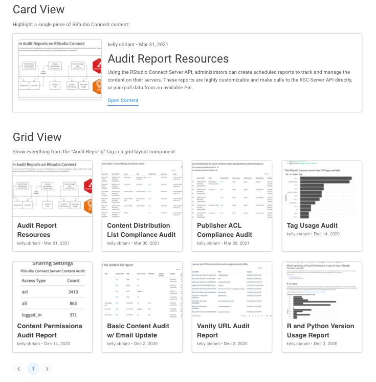

# RStudio Connect Highlights for Data Scientists

It's been a busy year for the RStudio Connect team. In case you missed it, here is a quick summary of the most interesting product highlights for **RStudio Connect Publishers**:

-   [Content curation with the `connectwidgets` package](#content-curation)
-   [Updates for Python developers](#updates-for-python-developers)
-   [Updates for data scientists who work with Tableau](#updates-for-developers-working-with-tableau)
-   [Upcoming changes: How to prepare for 2022](#upcoming-changes-preparing-for-2022)

## Content Curation

As you publish more data science artifacts (applications, documents, APIs, etc.) to RStudio Connect, the organization, distribution, and discovery of those projects can become more challenging.

### Introducing [connectwidgets](https://rstudio.github.io/connectwidgets/)

*This feature requires RStudio Connect version 1.9.0 or newer.*

This year the RStudio Connect team produced an R package that can be used to query a Connect server for your existing content items, then organize them within `htmlwidget` components in an R Markdown document or Shiny application.

**Present your content** in cards, grids, or tables:

Card and grid components display metadata about each piece of content. Each card or grid item links to the "open solo" version of the associated content item on RStudio Connect.

**Filter content** using `connectwidgets` helper functions and `dplyr` to produce the curated set of content you'd like to display:

-   `by_tags()` Filters the data frame to only include content that has been tagged with the specified tag name(s).
-   `by_owners()` Filters the data frame to only include content with the specified owner(s) by username.

**Customization is up to you** - `connectwidgets` components support styling via the `bslib` package.

**Learn more:**

-   Visit the [RStudio Connect User Guide](https://docs.rstudio.com/connect/user/curating-content/)
-   [Watch a webinar](https://youtu.be/GBNzhIkObyE)

### Content Access Requests

*This feature requires RStudio Connect version 1.8.8 or newer.*

Since `connectwidgets` components are rendered with the same permissions you have on the RStudio Connect server, viewers of your curated presentation pages may encounter links to content they wouldn't otherwise have access to. If a viewer follows a link to a content item they don't have permission to visit, they will be directed to request access.

  
In this example, the user is a **Publisher**, so they can choose to request either **Collaborator** or **Viewer** permissions. This action triggers an email notification to the content managers who can confirm or deny the request.

**Note:** Administrators can disable content access requests for an entire server with [`Applications.PermissionRequest`](https://docs.rstudio.com/connect/admin/appendix/configuration/#Applications.PermissionRequest).

### Send Visitors to a Custom Page

*This feature requires RStudio Connect version 2021.08.0 or newer.*

If you've created a showcase page that you'd like to route all RStudio Connect visitors to see upon logging in, work with your server administrator to configure [`Server.RootRedirect`](https://docs.rstudio.com/connect/admin/appendix/configuration/#Server.RootRedirect).

`Server.RootRedirect` is a configuration setting that can be used to divert users to a URL other than the standard RStudio Connect dashboard.

If your administrator customizes the `RootRedirect` URL, it will be important to notify publishers and other administrators about where they can access the content dashboard view of RStudio Connect. This URL can be customized with the [`Server.DashboardPath`](https://docs.rstudio.com/connect/admin/appendix/configuration/#Server.DashboardPath) setting. By default, the content dashboard is available at `/connect`.

Follow this [How To Guide](https://docs.rstudio.com/how-to-guides/users/pro-tips/widgets/) to learn more.

**Note:** If your organization would rather change the branding of RStudio Connect itself, there are new customization options available including logo, favicon, and platform display name. These can all be configured by a server administrator. [Learn more here](https://docs.rstudio.com/connect/admin/appendix/branding/) or [watch a video demo](https://youtu.be/2cCOeC_bPxU).

## Updates for Python Developers

*These features require RStudio Connect version 2021.08.0 or newer.*

### ASGI Frameworks

The list of supported Python content types has been growing over the last two years. In August, our team released an update to RStudio Connect which adds support for ASGI frameworks including FastAPI, Quart, Falcon, and Sanic.

**RStudio Connect Supported Python Content Types in 2021**

| Content Type             | Framework                     |
|--------------------------|-------------------------------|
| Documents & Notebooks    | Jupyter Notebooks             |
| Interactive Applications | Dash, Streamlit, Bokeh        |
| WSGI Frameworks          | Flask                         |
| ASGI Frameworks          | FastAPI, Quart, Falcon, Sanic |

FastAPI and other ASGI-compatible APIs can be deployed to RStudio Connect with the [rsconnect-python](https://docs.rstudio.com/rsconnect-python/index.html) package. To get started, follow the [same basic deployment steps](https://docs.rstudio.com/connect/user/publishing/#publishing-python-apis) required from our other Python content types.

Read more: [Announcement blog post](https://www.rstudio.com/blog/rstudio-connect-2021-08-python-updates/)

### Jupyter Notebooks Feature: Hiding Code Cells

Hiding input code cells can be useful when preparing notebooks for audiences where a "cleaner" or less code-heavy presentation would be more appreciated.

RStudio Connect now supports two options for hiding input code cells in Jupyter Notebooks:

-   [Hide all input code cells](https://docs.rstudio.com/connect/user/jupyter-notebook/#hide-all-input)
-   [Hide only selected input code cells](https://docs.rstudio.com/connect/user/jupyter-notebook/#hide-tagged-input)

Work with a server administrator to upgrade [rsconnect-jupyter](https://docs.rstudio.com/rsconnect-jupyter/upgrading/) and [rsconnect-python](https://docs.rstudio.com/rsconnect-python/#installation) so you can get access to the new publishing features.

## Updates for Developers Working with Tableau

*These features require RStudio Connect version 2021.09.0 or newer.*

In September, RStudio Connect introduced support for [Tableau Analytics Extensions](https://help.tableau.com/current/pro/desktop/en-us/r_connection_manage.htm), our first external integration with a BI tool. Data Scientists can use Analytics Extensions backed by Plumber and FastAPI to replace arbitrary R and Python code execution in Tableau Workbooks.

-   [Watch the Webinar](https://youtu.be/t25Lbi5D6kg)

**Why did we do this?**

When Tableau users want to leverage R scripts in their workbooks, they would use an open source tool called RServe to establish a connection with an execution server running an R session. The RServe solution was not developed or supported by RStudio, and this caused some confusion. Tableau users wanted RStudio to help solve various installation, environment management, configuration, and security challenges they encountered with RServe.

As an alternative to RServe, we've invested in new open source packages for creating analytics extensions using Plumber (R) and FastAPI (Python). The APIs created with [`plumbertableau`](https://rstudio.github.io/plumbertableau/) and [`fastapitableau`](https://github.com/rstudio/fastapitableau) are easy to host on RStudio Connect which is configured by default to host and serve them.

**What are Analytics Extensions?**

[Tableau Analytics Extensions](https://help.tableau.com/current/pro/desktop/en-us/r_connection_manage.htm) provide a way to create calculated fields in workbooks that can execute scripts outside of the Tableau environment. To use Analytics Extensions, you must configure an instance of Tableau Server, Tableau Online or Tableau Desktop ([Instructions](https://docs.rstudio.com/rsc/integration/tableau/#tableau-setup)).

**Why not just build a Shiny application?**

Do you already build interactive applications in Shiny or a Python framework? Great! We know many RStudio users don't have or use Tableau, and that's totally reasonable. We love when people choose Shiny over other alternatives. We also want to support data science teams who have access to both RStudio Pro products and Tableau. This integration is for the folks who need to bridge both worlds.

**How do you get started?**

In principle, extending Tableau should be as simple as directing a workbook to reach out to any existing web API, but Tableau Analytics Extensions require special handling to make valid requests and receive results. To simplify this process, we introduced two new open source libraries which add functionality to Plumber and FastAPI:

-   For R: [`plumbertableau`](https://rstudio.github.io/plumbertableau/)
-   For Python: [`fastapitableau`](https://github.com/rstudio/fastapitableau)

These libraries can be used to create as many extensions as you want to manage. Data Scientists can learn more in the [RStudio Connect User Guide](https://docs.rstudio.com/connect/user/tableau/). Server administrators should review the full [integration and set up instructions](https://docs.rstudio.com/rsc/integration/tableau/) upon upgrade.

**Take a look at an example:** [Detect outliers and predict profit with the built-in Superstore Tableau dataset](https://github.com/sol-eng/tableau-examples/tree/main/superstore).

## Upcoming Changes: Preparing for 2022

In early 2022, RStudio Connect will release an edition that removes support for the following:

-   **Experimental v1 Server APIs**
-   **Python 2**

To prepare for these changes, we recommend reviewing the [API Reference Documentation](https://docs.rstudio.com/connect/api/#overview--versioning-of-the-api) and the Python 2 support [announcement post](https://www.rstudio.com/blog/rstudio-connect-2021-08-python-updates/) from August 2021.

**Data Scientists** should review the official porting guide and redeploy any mission critical content that currently relies on Python 2.

-   Read the official ["Porting Python 2 Code to Python 3" guide](https://docs.python.org/3/howto/pyporting.html) and the [Python 3 Statement Practicalities](https://python3statement.org/practicalities/) for advice on how to sunset your Python 2 code.

Notify your **Administrators** so they can determine whether Python 2 content exists on your RStudio Connect server today.

-   Audit the complete list of content items on their server and which versions of R/Python they use by deploying [this report](https://github.com/sol-eng/rsc-audit-reports/blob/main/environment-audit/environment-audit-report.Rmd).

If you have any questions or concerns about these upcoming changes, please contact your RStudio Customer Success representative.

## Upgrade to RStudio Connect 2021.12.0

The latest release of RStudio Connect is 2021.12.0. To perform an upgrade, a **server administrator** should download and run the installation script. The script installs a new version of Connect on top of the earlier one. Existing configuration settings are respected. Be sure to consult the [release notes](http://docs.rstudio.com/connect/news) before beginning an upgrade to make note of any breaking changes introduced since your last installation.

    # Download the installation script
    curl -Lo rsc-installer.sh https://cdn.rstudio.com/connect/installer/installer-v1.9.5.sh

    # Run the installation script
    sudo -E bash ./rsc-installer.sh 2021.12.0
