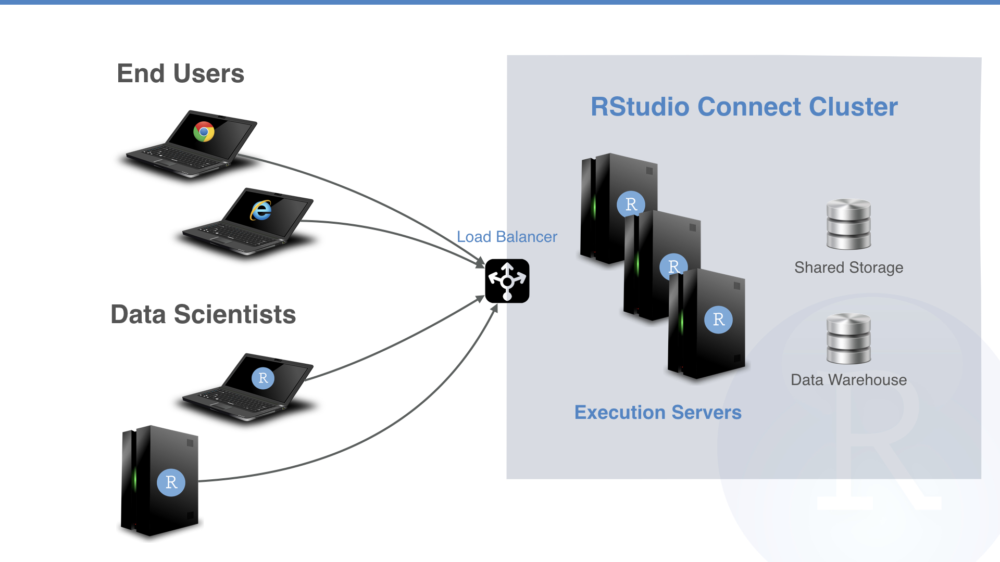

We’re pleased to announce version 1.5.10 of RStudio Connect and the general availability of RStudio Connect Execution Servers. Execution Servers enable horizontal scaling and high availability for all the content you develop in R. The 1.5.10 release also includes important security improvements and bug fixes. 

**RStudio Connect Execution Servers**

Support for high availability and horizontal scaling is now generally available through RStudio Connect Execution Servers. Execution Servers enable RStudio Connect to run across a multi-node cluster. 

Today, Execution Servers act as identically configured Connect instances. Requests for Shiny applications and Plumber APIs are split across nodes by a load balancer. Scheduled R Markdown execution is distributed across the cluster through an internal job scheduler that distributes work evenly across nodes. Over time, more of Connect’s work will be handled by the internal scheduler, giving admins control over what nodes accomplish certain tasks. 

The [admin guide](https://docs.rstudio.com/connect/admin) includes configuration instructions. Contact [sales](mailto: sales@rstudio.com) for licensing information.

**Other Improvements**

- For configurations using SQLite, the **SQLite database is automatically backed up** while Connect is running. By default, three backups are retained and a new backup is taken every 24 hours. To disable, setup `[Sqlite].Backup` to false in the server configuration file.

- RStudio Connect has always isolated user code from the file system. For example, application A can not access data uploaded with application B. In 1.5.10, **R processes can now read from the `/tmp` and `/var/tmp` directories**. This change enables shared files to be stored in `/tmp` and `/var/tmp` and helps facilitate Kerberos configurations. R processes still have isolated temporary directories provided at runtime and accessible with the `tempdir` function and `TMPDIR` environment variable. See [section 12](http://docs.rstudio.com/connect/admin) of the admin guide for more details on process sandboxing.

- Improvements have been made in RStudio Connect and the `rsconnect` package to **support deployments using proxied authentication**. See the admin guide for details on setting up the proxy. Anonymous viewers and requests authenticated with API keys are also now supported with proxied auth.

- Scheduled reports are now re-run if execution is interrupted by a server restart. In a cluster, reports are automatically re-run if a node goes down, assuring high availability for scheduled renderings.

- `AdminEditableUsernames` is disabled by default for compatibility with the `RequireExternalUsernames` flag introduced in 1.5.8. These changes increase security by preventing changes to data supplied by authentication providers.

- User session expiration is better enforced. All user browser sessions will need to login  after the 1.5.10 upgrade.

- Runtime environments for [Shiny R Markdown Documents](https://rmarkdown.rstudio.com/authoring_shiny.html) have changed to support `rmarkdown` versions 1.7+. 

You can see the full release notes for RStudio Connect 1.5.10 [here](http://docs.rstudio.com/connect/news).

> **Upgrade Planning** There are no special precautions to be aware of when upgrading from 1.5.8 to 1.5.10. Installation and startup should take less than a minute.

If you haven’t yet had a chance to download and try [RStudio Connect](https://www.rstudio.com/products/connect/) we encourage you to do so. RStudio Connect is the best way to share all the work that you do in R (Shiny apps, R Markdown documents, plots, dashboards, Plumber APIs, etc.) with collaborators, colleagues, or customers.

You can find more details or download a 45 day evaluation of the product at https://www.rstudio.com/products/connect/. Additional resources can be found below.

- [RStudio Connect Admin Guide](http://docs.rstudio.com/connect/admin)
- [Detailed Release Notes](http://docs.rstudio.com/connect/news)
- [Pricing](https://rstudio.com/pricing)
- [Online preview of RStudio Connect](https://beta.rstudioconnect.com)

