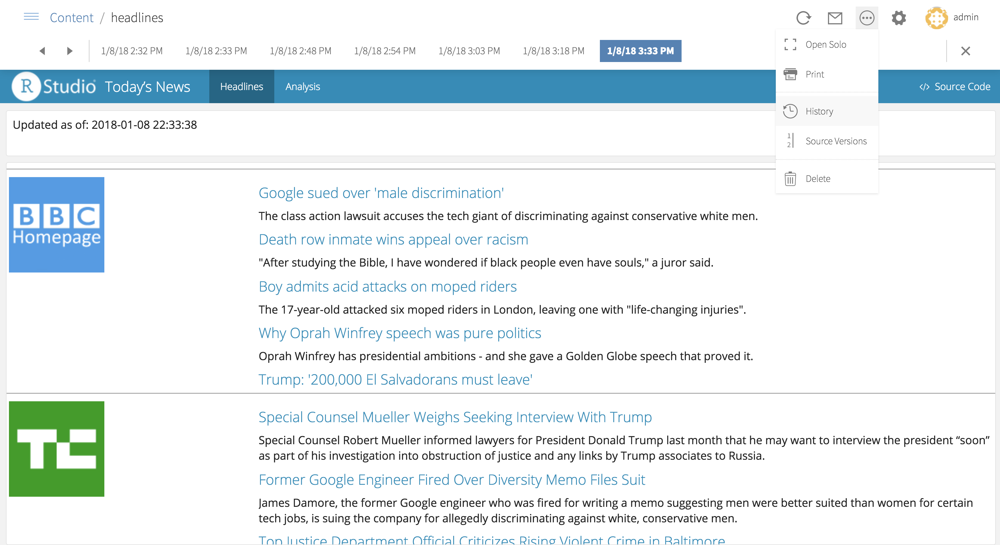

We’re pleased to announce RStudio Connect 1.5.12. This release includes support for viewing historical content, per-application timeout settings, and important improvements and bug fixes.

## Historical Content

RStudio Connect now retains and displays historical content. By selecting the content’s history, viewers can easily navigate, compare, and email prior versions of content. Historical content is especially valuable for scheduled reports.  Previously published documents, plots, and custom versions of parameterized reports are also saved.  Administrators [can control](http://docs.rstudio.com/connect/1.5.12/admin/appendix-configuration.html#appendix-configuration-applications) how much history is saved by specifying a maximum age and/or a maximum number of historical versions.

## Timeout Settings

Timeout settings can be customized for specific Shiny applications or Plumber APIs. These settings allow publishers to optimize timeouts for specific content. For example, a live-updating dashboard might be kept open without expecting user input, while a resource-intensive, interactive app might be more aggressively shut down when idle. Idle Timeout, Initial Timeout, Connection Timeout, and Read Timeout can all be customized.

Along with this improvement, be aware of a **BREAKING CHANGE**. The `Applications.ConnectionTimeout` and `Application.ReadTimeout` settings, which specify server default timeouts for all content, have been deprecated in favor of `Scheduler.ConnectionTimeout` and `Scheduler.ReadTimeout`.

## Other Improvements

- A *new security option*, “[Web Sudo Mode](http://docs.rstudio.com/connect/1.5.12/admin/security-auditing.html#web-sudo-mode)”, is enabled by default to require users to re-enter their password prior to performing sensitive actions like altering users, altering API keys, and linking RStudio to Connect.
- The *usermanager* command line interface (CLI) can be used to update user first and last name, email, and username in addition to user role. User attributes that are managed by your external authentication provider will continue to be managed externally, but the CLI can be used by administrators to complete other fields in user profiles. 
- The Connect dashboard will show administrators and publishers a warning as license expiration nears.
- **BREAKING CHANGE** The `RequireExternalUsernames` option deprecated in 1.5.10 has been removed. 
- **Known Issue** After installing RStudio Connect 1.5.12, previously deployed content may incorrectly display an error message. Refreshing the browser will fix the error.

You can see the full release notes for RStudio Connect 1.5.12 [here](http://docs.rstudio.com/connect/1.5.12/news/).

> #### Upgrade Planning
> There are no special precautions to be aware of when upgrading from v1.5.10 apart from the breaking changes and known issue listed above and in the release notes. You can expect the installation and startup of v1.5.12 to be complete in under a minute. 
>
> If you’re upgrading from a release older than v1.5.10, be sure to consider the “Upgrade Planning” notes from the intervening releases, as well.

If you haven't yet had a chance to download and try [RStudio Connect](https://rstudio.com/products/connect), we encourage you to do so. RStudio Connect is the best way to share all the work that you do in R (Shiny apps, R Markdown documents, plots, dashboards, Plumber APIs, etc.) with collaborators, colleagues, or customers.

You can find more details or download a 45-day evaluation of the product at [https://www.rstudio.com/products/connect/](https://www.rstudio.com/products/connect/). Additional resources can be found below.
 
 - [RStudio Connect home page & downloads](https://www.rstudio.com/products/connect/)
 - [RStudio Connect Admin Guide](http://docs.rstudio.com/connect/admin/)
 - [What IT needs to know about RStudio Connect](https://www.rstudio.com/wp-content/uploads/2016/01/RSC-IT-Q-and-A.pdf)
 - [Detailed news and changes between each version](http://docs.rstudio.com/connect/news/)
 - [Pricing](https://www.rstudio.com/pricing/#ConnectPricing)
 - [An online preview of RStudio Connect](https://beta.rstudioconnect.com/connect/)

