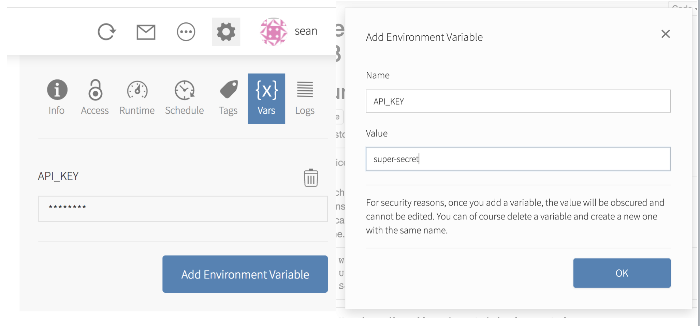
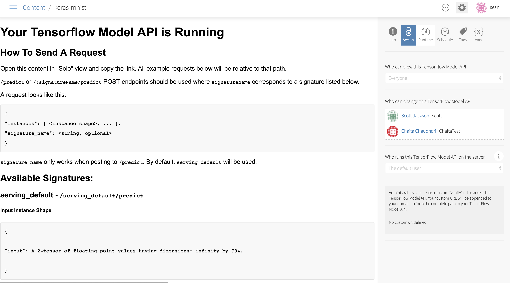

RStudio Connect v1.5.14 is now available! This release includes support for secure environment variables, customizing email subject lines, and beta support for serving TensorFlow models. 

This release introduces beta support for SuSE and will be the last version of RStudio Connect to support Ubuntu 12.04 and Internet Explorer 10. Contact sales@rstudio.com for more information on supported platforms.

## Secure Environment Variables



Environment variables for executable content can be configured in the RStudio Connect Dashboard. Values assigned to environment variables are available from within your R code using the `Sys.getenv` function. Once saved, environment variables are obscured in the Connect dashboard and are encrypted at rest. 

These variables are a good way to specify values that should not be embedded in code, such as API keys, database credentials, or other kinds of sensitive data. Environment variables can also be used with the [config package](https://github.com/rstudio/config) to manage configuration options across environments, including development, staging, and production.

## Email Customization


RStudio Connect has always been able to send emails notifying users when new or scheduled versions of R Markdown reports are available, but now version 1.5.14 allows report authors to [customize the email subject line](http://docs.rstudio.com/connect/1.5.14/user/r-markdown.html#email-customization). 

The subject line can be set using a new function in the rmarkdown package (version >= 1.8). Reports can hard-code a custom subject line, or the subject line can be computed dynamically in the report. For example, in the image above, the subject line was generated with the code:

```{{r}}
rmarkdown::output_metdata$set(“rsc_email_subject” = 
        paste0(params$ticker, ‘ is ‘, sign, ‘ today by $’ change)
```
Convey the most important results of an analysis to stakeholders at a glance!


## TensorFlow Models



RStudio recently announced a set of packages giving R users powerful access to TensorFlow. In v1.5.14, models developed in TensorFlow can be deployed to Connect and served as RESTful APIs.  

As an example, a data scientist can write and train a TensorFlow model for fraud detection using R. The data scientist can then export and deploy the model to RStudio Connect. Once deployed, non-R systems such as front-end web applications or back-end ETL services can call the model using standard HTTP requests to classify whether or not new records are fradulent.

Like other content on Connect, deployed TensorFlow models can be scaled, and access can be restricted through API keys. The [RStudio TensorFlow site](https://TensorFlow.rstudio.com) has more details on model creation and deployment.

## Other Improvements

- Beta Support for running RStudio Connect on SuSE Linux Enterprise Server versions 12 sp3+. Contact sales@rstudio.com if you are interested in running Connect on SLES.
- **BREAKING**: `[Applications].ConnectionTimeout` and `[Applications].ReadTimeout` settings deprecated in version 1.5.12 have been removed from the configuration. They have been replaced with `[Scheduler].ConnectionTimeout` and `[Scheduler].ReadTimeout`, respectively.
- Version 1.5.12 introduced a new license expiration warning shown to publishers and administrators. As of v1.5.14, this warning can be permanently disabled using the `[Licensing].ExpirationUIWarning` configuration flag.
- The `-unstable` flag has been removed from the `migrate` utility's `rebuild-packrat` command. The admin guide contains more information on [server migration](http://docs.rstudio.com/connect/1.5.14/admin/files-directories.html#server-migrations).

All changes in v1.5.14 and previous versions are available in the [release news](http://docs.rstudio.com/connect/1.5.14/news/).


## Deprecation Announcement 

Version 1.5.14 is the last version of RStudio Connect that will support Ubuntu 12.04 and Internet Explorer 10. 


> #### Upgrade Planning
> There are no special precautions to be aware of when upgrading from v1.5.12 apart from the breaking changes listed above and in the release notes. You can expect the installation and startup of v1.5.14 to be complete in under a minute. 
>
> If you’re upgrading from a release older than v1.5.12, be sure to consider the “Upgrade Planning” notes from the intervening releases, as well.

If you haven't yet had a chance to download and try [RStudio Connect](https://rstudio.com/products/connect), we encourage you to do so. RStudio Connect is the best way to share all the work that you do in R (Shiny apps, R Markdown documents, plots, dashboards, Plumber APIs, etc.) with collaborators, colleagues, or customers.

You can find more details or download a 45-day evaluation of the product at [https://www.rstudio.com/products/connect/](https://www.rstudio.com/products/connect/). Additional resources can be found below.
 
 - [RStudio Connect home page & downloads](https://www.rstudio.com/products/connect/)
 - [RStudio Connect Admin Guide](http://docs.rstudio.com/connect/admin/)
 - [What IT needs to know about RStudio Connect](https://www.rstudio.com/wp-content/uploads/2016/01/RSC-IT-Q-and-A.pdf)
 - [Detailed news and changes between each version](http://docs.rstudio.com/connect/news/)
 - [Pricing](https://www.rstudio.com/pricing/#ConnectPricing)
 - [An online preview of RStudio Connect](https://beta.rstudioconnect.com/connect/)


