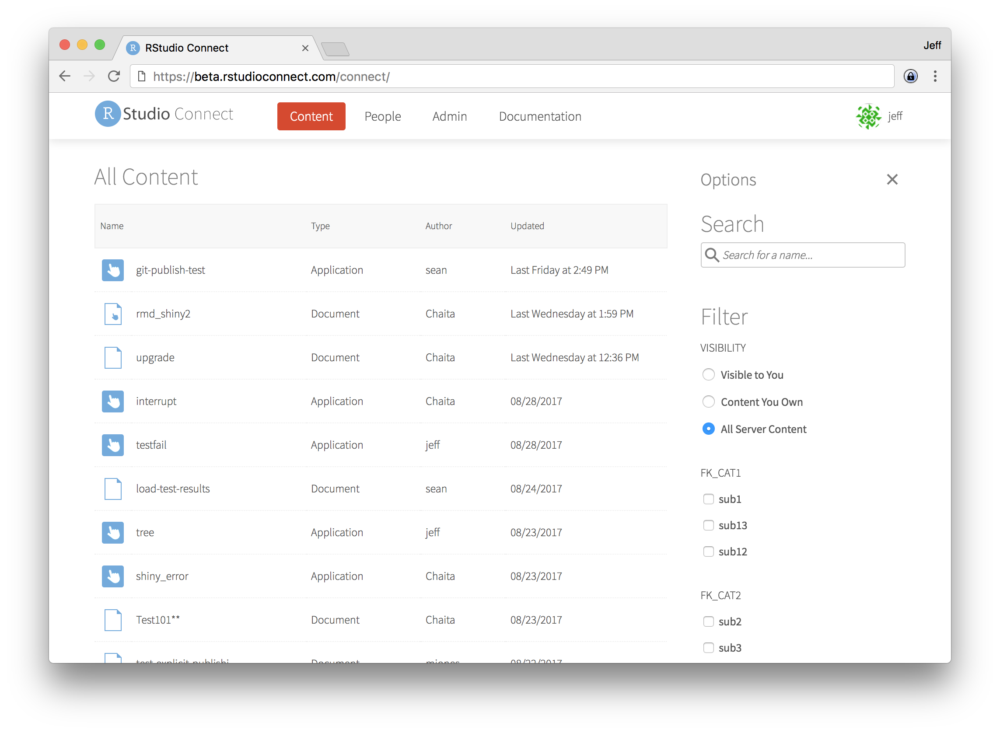

We're pleased to announce support for Kerberos in [RStudio Connect: version 1.5.6](https://www.rstudio.com/products/connect/). Organizations that use Kerberos can now run Shiny applications and Shiny R Markdown documents in tailored processes that have access only to the appropriate resources inside the organization.

The notable changes this release include:

 - **Full support for Kerberos** across Shiny applications and Shiny R Markdown documents by running R in an authenticated PAM session that uses the cached credentials of the current user. See [the documentation](http://docs.rstudio.com/connect/1.5.6/admin/process-management.html#pam-credential-caching-kerberos) for more details.
 - Content **deployment no longer requires explicit publishing**. New content is available immediately after it is deployed and visible only to the owner. Enable the `[Applications].ExplicitPublishing` setting to revert this behavior.
 - Heterogeneous **server migrations** are now supported, allowing administrators to upgrade their distribution or change to a different (supported) Linux distribution. See [the migration documentation](http://docs.rstudio.com/connect/1.5.6/admin/files-directories.html#server-migrations) for more details.
 - Admins are now able to toggle the content filtering settings to **enumerate all content on the server** so that they can manage settings, regardless of whether or not they have visibility into that content. The permissions here are unchanged; the admin will only be able to view the settings for the content, not the content itself. To view the content, the admin would need to add themselves as a viewer or collaborator of the content, which is an audited action.
 - **Shiny error sanitization** is enabled by default. Disable the `[Applications].ShinyErrorSanitization` setting to revert this behavior. See [the Shiny documentation](https://shiny.rstudio.com/articles/sanitize-errors.html) for more information about Shiny error sanitization.
 - Improved **LDAP group lookup performance** on large LDAP servers that don't support `memberof`. Additionally, improved LDAP logging and error handling.
 - **Security enhancements** around proxy authentication, redirects, and brute-force password attacks. This release adds support for a challenge-response (**CAPTCHA**) to help mitigate brute-force attacks on users' passwords. Set `[Authentication].ChallengeResponseEnabled` to true to enable this feature.
 - **Customize the subject prefix** for all outgoing emails using the `[Server].EmailSubjectPrefix` setting. The default is still `[RStudio Connect]`.
 - BREAKING: Running content as the current user is now disabled for content other than Shiny Applications or Shiny R Markdown Documents. Reports will execute as the application `RunAs`, falling back to the system `Applications.RunAs` if none is specified.

You can see the full release notes for RStudio Connect 1.5.6 [here](http://docs.rstudio.com/connect/1.5.6/news/).

> #### Upgrade Planning
> 
> There are no special precautions to be aware of when upgrading from v1.5.4. You can expect the installation and startup of v1.5.6 to be complete in under a minute. 
> 
> If you’re upgrading from a release older than v1.5.4, be sure to consider the “Upgrade Planning” notes from those other releases, as well.
 
If you haven't yet had a chance to download and try [RStudio Connect](https://www.rstudio.com/products/connect/) we encourage you to do so. RStudio Connect is the best way to share all the work that you do in R (Shiny apps, R Markdown documents, plots, dashboards, Plumber APIs, etc.) with collaborators, colleagues, or customers.

You can find more details or download a 45 day evaluation of the product at [https://www.rstudio.com/products/connect/](https://www.rstudio.com/products/connect/). Additional resources can be found below.
 
 - [RStudio Connect home page & downloads](https://www.rstudio.com/products/connect/)
 - [RStudio Connect Admin Guide](http://docs.rstudio.com/connect/admin/)
 - [What IT needs to know about RStudio Connect](https://www.rstudio.com/wp-content/uploads/2016/01/RSC-IT-Q-and-A.pdf)
 - [Detailed news and changes between each version](http://docs.rstudio.com/connect/news/)
 - [Pricing](https://www.rstudio.com/pricing/#ConnectPricing)
 - [An online preview of RStudio Connect](https://beta.rstudioconnect.com/connect/)

