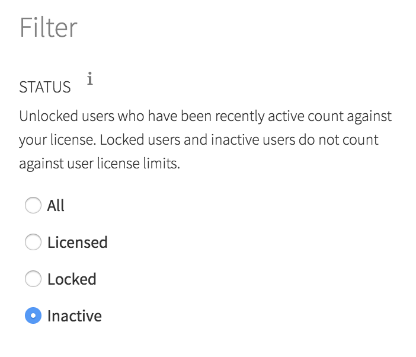
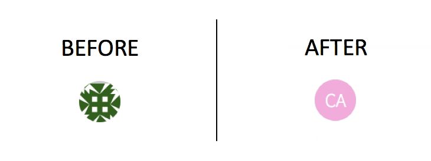

RStudio Connect version 1.6.2 is [now available](https://www.rstudio.com/products/connect/)! 

There are a handful of new features that are highlighted below.  We encourage
you to upgrade as soon as possible!

## Recommend Building R from Source

If you have installed R using `apt-get`, `yum`, or some other package manager,
we recommend that you [install R from
source](http://docs.rstudio.com/connect/1.6.2/admin/getting-started.html#r-source)
instead.  This protects you from application breakages when the system version
of R is upgraded.  We have updated our documentation to reflect these best
practices concerning R administration for use with Connect.

Installing R from source allows installing multiple versions of R side by side,
and allows content to persist as published without risk of breaking during an
upgrade to the version of R.  This also allows publishers to publish to a
version of R that more closely approximates their development environment.

## User Filtering

For Connect implementations with many users, we have added features to the User
page that allow administrators to filter users by various states.  Last release,
we added the ability for administrators to filter between users that are
counting against the Connect license and those that are inactive.  This release,
we also exposed the ability for administrators to filter inactive users into
those that were manually locked and those that are not counting against your
license due to inactivity.

## Other Changes

**Connect Server API**

The Connect Server API was introduced in Connect 1.6.0.  This release, we added
[an endpoint called
`/audit_logs`](http://docs.rstudio.com/connect/1.6.2/api/#get-audit-logs) where
audit logs can be accessed and paged.  There is an example of how to use the API
in the [Connect Server API
Cookbook](http://docs.rstudio.com/connect/1.6.2/user/cookbook.html#get-all-audit-logs).
Stay tuned as we add endpoints to the Connect Server API to allow programmatic
interaction with the features of RStudio Connect.

**Content Filtering**

Content searching and content filtering state now persists when a user navigates
to a new page and then returns.  To return to the default content screen, the
user can select “Reset all filters.”

**Email Customization**

In the last few releases, Connect has added features that allow publishers of
RMarkdown documents to customize the email output of scheduled RMarkdown
reports. In this release, publishers gain the ability to optionally suppress
attachments or suppress email output altogether.
 
These options can be set in the YAML header for a RMarkdown document, but are
probably more useful when [set inline by editing
`rmarkdown::output_metadata`](http://docs.rstudio.com/connect/1.6.2/user/r-markdown.html#r-markdown-email-suppress-scheduled).
For instance, in financial market analysis, I might decide that variance is not
significant enough to warrant an email update, and thereby ensure email updates
only occur when there is critical information to deliver.

**New Icons**

Connect previously used [Gravatar icons](https://en.gravatar.com/).  We have
changed this to standard monogram icons, which should fit better with offline
installations and other enterprise applications.

> #### Upgrade Planning
> There are no special precautions to be aware of when upgrading from v1.6.0 to
> v1.6.2. You can expect the installation and startup of v1.6.2 to be complete in
> under a minute.
>
> If you’re upgrading from a release older than v1.6.0, be sure to consider the
> “Upgrade Planning” notes from the intervening releases, as well.

If you haven't yet had a chance to download and try [RStudio
Connect](https://rstudio.com/products/connect/), we encourage you to do so.
RStudio Connect is the best way to share all the work that you do in R (Shiny
apps, R Markdown documents, plots, dashboards, Plumber APIs, etc.) with
collaborators, colleagues, or customers.

You can find more details or download a 45-day evaluation of the product at
[https://www.rstudio.com/products/connect/](https://www.rstudio.com/products/connect/).
Additional resources can be found below.
 
 - [RStudio Connect home page & downloads](https://www.rstudio.com/products/connect/)
 - [RStudio Connect Admin Guide](http://docs.rstudio.com/connect/admin/)
 - [What IT needs to know about RStudio Connect](https://www.rstudio.com/wp-content/uploads/2016/01/RSC-IT-Q-and-A.pdf)
 - [Detailed news and changes between each version](http://docs.rstudio.com/connect/news/)
 - [Pricing](https://www.rstudio.com/pricing/#ConnectPricing)
 - [An online preview of RStudio Connect](https://beta.rstudioconnect.com/connect/)

