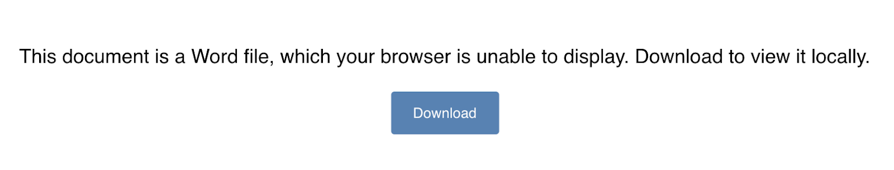
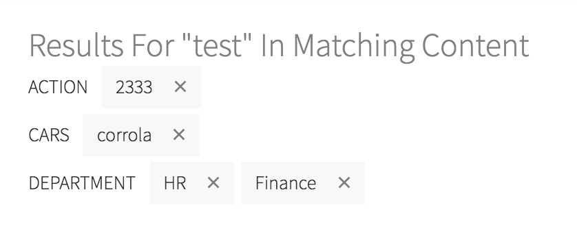
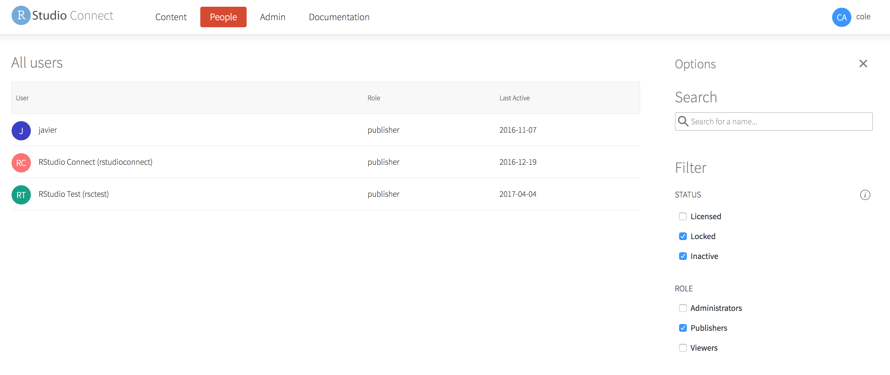

RStudio Connect version 1.6.4 is [now available](https://www.rstudio.com/products/connect/)! 

There are a few breaking changes and a handful of new features that are highlighted below. 
We encourage you to upgrade as soon as possible!

## Breaking

Please take note of important breaking changes before upgrading.

### Pandoc 2

RStudio Connect includes Pandoc 1 and will now also include Pandoc 2.  Admins do
not need to install either.

If you have deployed content with rmarkdown version 1.9 or higher, then that
content will now use Pandoc 2 at runtime. This brings in several bug fixes and
enables some new functionality, but does introduce some backwards
incompatibilities. To protect older versions of rmarkdown, Pandoc 1 will still
be used for content deployed with any rmarkdown version prior to 1.9.  Content
not using the rmarkdown package will have Pandoc 2 available.

Pandoc is dynamically made available to content when it is executed, so content
using the newer version of rmarkdown will see Pandoc 2 immediately upon
upgrading RStudio Connect, whether or not you have updated the content recently.
The types of backwards incompatibilities we expect are issues like minor
white-space rendering differences.

### R Markdown Rendering

The R Markdown rendering environment has been updated, which will break a
certain class of R Markdown documents.  No action is needed for the majority of
R Markdown documents.  Publishers will need to rewrite R Markdown documents that
depended on locally preserving and storing state in between renderings.

The update isolates renderings and protects against clashes caused by concurrent
writes, but also means that files written to the local directory during a render
will not be present or available the next time that the report is rendered.

For example, a report that writes a CSV file to disk on day 1 at a local
location, `write.csv(‘data.csv’)`, and then on day 2 reads the same CSV
`read.csv(‘data.csv’)`, will no longer work.  Publishers should refactor this
type of R Markdown document to write data to a database or a shared directory
that is not
[sandboxed](http://docs.rstudio.com/connect/1.6.4/admin/process-management.html#process-management-sandboxing).
For instance, to `/app-data/data.csv`.

## New Features

### File Download

When a user accesses a `Microsoft Word` file or some other file type that is not
rendered in the browser, Connect previously downloaded the content immediately.
We have added a download page that simplifies the presentation of
browser-unfriendly file types.

### Content Filtering

The RStudio Connect Dashboard now includes interactive labels for tag filters in
the content listing view. This simplifies keeping track of complex searches,
especially when returning to the Dashboard with saved filter state.

### Log Download

The Connect UI truncates log files to show the latest output. However, when
someone downloads log files, the downloaded file is no longer truncated. This
makes it easier for a developer to inspect asset behavior with the full log file
available on Connect.

### User Management

Connect now allows administrators to filter the users list by multiple account
statuses. The last day that each user was active is now displayed along with the
user list.

> #### Upgrade Planning
> Besides breaking changes above, there are no special precautions to be aware of 
> when upgrading from v1.6.2 to v1.6.4. You can expect the installation and startup 
> of v1.6.4 to be complete in under a minute.
>
> If you’re upgrading from a release older than v1.6.2, be sure to consider the
> “Upgrade Planning” notes from the intervening releases, as well.

If you haven't yet had a chance to download and try [RStudio
Connect](https://rstudio.com/products/connect/), we encourage you to do so.
RStudio Connect is the best way to share all the work that you do in R (Shiny
apps, R Markdown documents, plots, dashboards, Plumber APIs, etc.) with
collaborators, colleagues, or customers.

You can find more details or download a 45-day evaluation of the product at
[https://www.rstudio.com/products/connect/](https://www.rstudio.com/products/connect/).
Additional resources can be found below.
 
 - [RStudio Connect home page & downloads](https://www.rstudio.com/products/connect/)
 - [RStudio Connect Admin Guide](http://docs.rstudio.com/connect/admin/)
 - [What IT needs to know about RStudio Connect](https://www.rstudio.com/wp-content/uploads/2016/01/RSC-IT-Q-and-A.pdf)
 - [Detailed news and changes between each version](http://docs.rstudio.com/connect/news/)
 - [Pricing](https://www.rstudio.com/pricing/#ConnectPricing)
 - [An online preview of RStudio Connect](https://beta.rstudioconnect.com/connect/)

