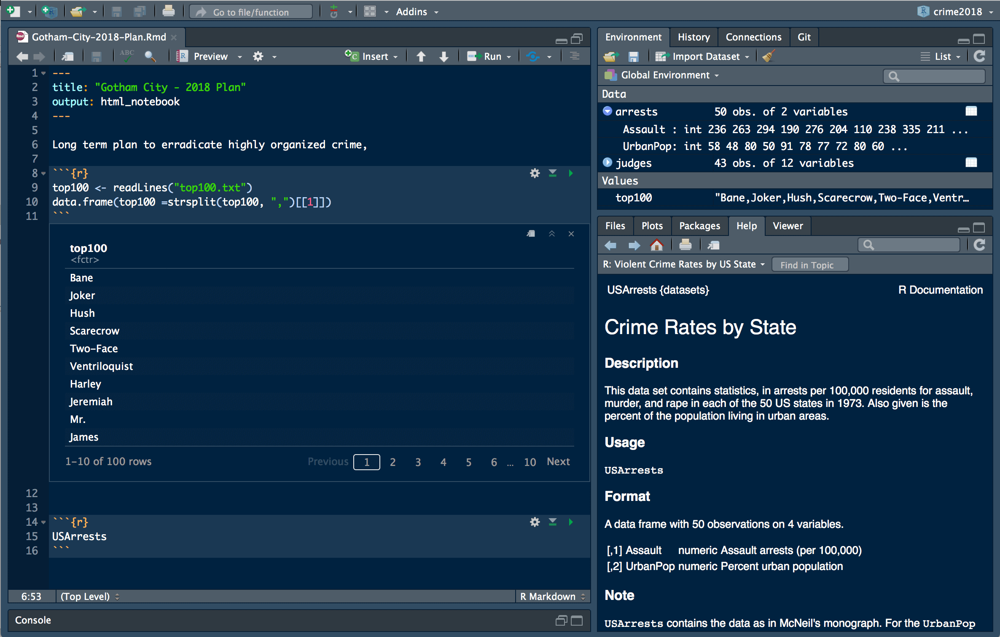
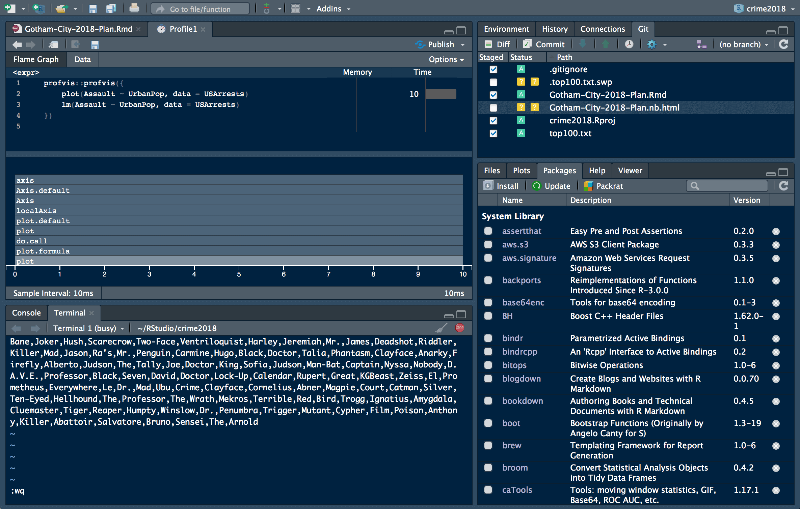
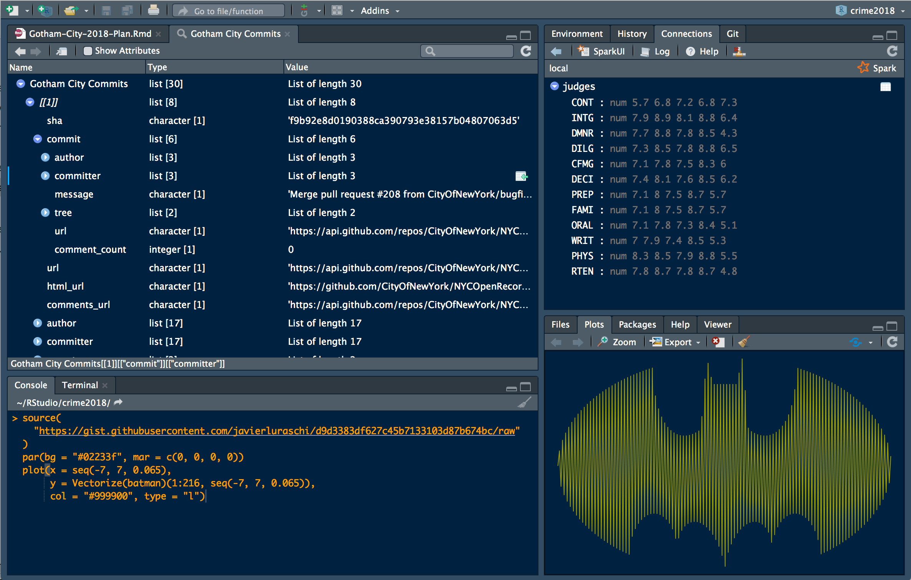

*Today, we're continuing our blog series on new features in RStudio 1.1. If you'd like to try these features out for yourself, you can [download a preview release of RStudio 1.1](https://www.rstudio.com/products/rstudio/download/preview/).*

## I Only Work in Black

For those of us that like to work in black or very very dark grey, the dark theme can be enabled from the 'Global Options' menu, selecting the 'Appearance' tab and choosing an 'Editor theme' that is dark.

Icons are now high-DPI, a 'Modern' and 'Sky' theme were also added, read more about them under [Using RStudio Themes](https://support.rstudio.com/hc/en-us/articles/115011846747-Using-RStudio-Themes).

All panels support themes: Code editor, Console, [Terminal](https://blog.rstudio.com/2017/08/11/rstudio-v1-1-preview-terminal/), Environment, History, Files, [Connections](https://blog.rstudio.com/2017/08/16/rstudio-preview-connections/), Packages, Help, Build and VCS. Other features like [Notebooks](https://blog.rstudio.com/2016/10/05/r-notebooks/), Debugging, Profiling , Menus and the [Object Explorer](https://blog.rstudio.com/2017/08/22/rstudio-v1-1-preview-object-explorer/) support this theme as well.

However, the Plots and Viewer panes render with the default colors of your content and therefore, require additional packages to switch to dark themes. For instance, [shinythemes](https://rstudio.github.io/shinythemes/) provides the `darkly` theme for Shiny and [ggthemes](https://cran.r-project.org/web/packages/ggthemes/vignettes/ggthemes.html) support for `light = FALSE` under `ggplot`. If you are a package author, consider using `rstudioapi::getThemeInfo()` when generating output to these panes.

Enjoy!

