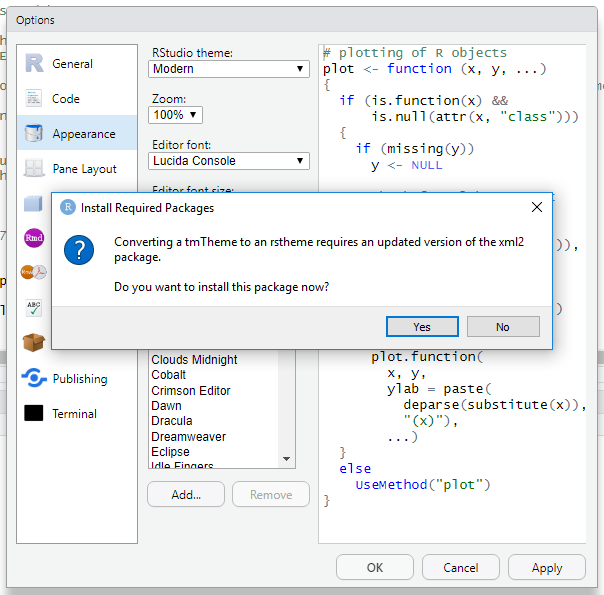

We're excited to announce that RStudio v1.2 has added support for custom editor themes. Custom editor themes will allow you to adjust the background color of the editor and syntax highlighting of code in RStudio to better suit your own personal style.

New editor themes can be added to RStudio by importing a tmTheme or sharing an existing rstheme file. The tmTheme file format was first introduced for the TextMate editor, and has since become a standard theme format. The rstheme format is specific to RStudio.

## Importing a Custom Theme
Before you can add a theme to RStudio, you'll have to find a theme in the right format. This [online tmTheme editor](https://tmtheme-editor.herokuapp.com) will allow you to create your own tmThemes or download an existing theme from a large collection of themes. If you are interested in writing your own theme be sure to read this [RStudio Extensions article about writing themes](https://rstudio.github.io/rstudio-extensions/rstudio-theme-creation.html).

Once you have a tmTheme or rstheme file for your favorite theme or themes, you can import it to RStudio. Follow the instructions below to import a theme.

1. In the menu bar, open the "Tools" menu.

2. From the drop down menu, choose "Global Options".

3. In the pane on the left hand side of the options window, click "Appearance".

4. To import a theme, click on the "Add..." button.

5. In the file browser, navigate to the location where you've saved your theme file.

6. If prompted to install R packages, select "Yes".

7. You should now see your newly added theme in the list of editor themes. Simply click the "Apply" button to apply your theme to RStudio.

The theme pictured in these examples is called Night Owlish, and was adapted from the Night Owl theme by RStudio's own Mara Averick. It can be found on [her github page](https://github.com/batpigandme/night-owlish).

## Removing a Custom Theme
If you accidentally added a theme, or you want to add an updated version, you can remove the theme from RStudio. To do so, follow the instructions below.

1. As above, navigate to the Appearance Preferences Pane in the Global Options.

2. If the theme you wish to remove is the active theme, be sure to switch to a different theme first.

3. Select the theme you wish to remove from the list of themes and click the "Remove" button.

4. Select "Yes" when prompted for confirmation.

## Sharing Themes
If you've found (or made) a really cool theme that you want to share, you can do so just by sharing the tmTheme or rstheme file. Then the recipient can import it as per the instructions in the [Importing a Custom Theme section](#importing-a-custom-theme). There is no difference between sharing the tmTheme file, or the rstheme file that is generated after the theme gets imported to RStudio, unless you or someone else has made changes to the rstheme file itself.

rstheme files can be found in the `.R` directory under your home directory. On Windows, the path is `C:\Users\<your user account>\Documents\.R\rstudio\themes`. On all other operating systems, the path is `~/.R/rstudio/themes`.

## Some of Our Favorite Themes
To find out more about themes in RStudio, check out this [support article about themes](https://support.rstudio.com/hc/en-us/articles/115011846747-Using-RStudio-Themes). In the meantime, here is RStudio styled using some of our favorite themes:

[Ayu Dark, Light, and Mirage by dempfi](https://github.com/dempfi/ayu):

Ayu Dark

Ayu Mirage

Ayu Light

[Candy Brights](https://tmtheme-editor.herokuapp.com/#!/editor/theme/Candy%20Brights):

[Wombat, by randy3k](https://github.com/randy3k/dotfiles/blob/master/.R/rstudio/themes/Wombat.rstheme):

This theme is an example of a theme where the rstheme file was modified directly. Without editing the rstheme file, it wouldn't have been possible to change the style of non-editor elements of RStudio, like the tabs above the different panes. To learn more about creating new custom themes for RStudio, take a look at this [RStudio Extensions article about writing themes](https://rstudio.github.io/rstudio-extensions/rstudio-theme-creation.html).

We look forward to seeing what great new themes the RStudio community comes up with!

You can download the RStudio 1.2 Preview Release at <https://www.rstudio.com/products/rstudio/download/preview/>. If you have any questions or comments, please get in touch with us on the [community forums](https://community.rstudio.com/c/rstudio-ide).

