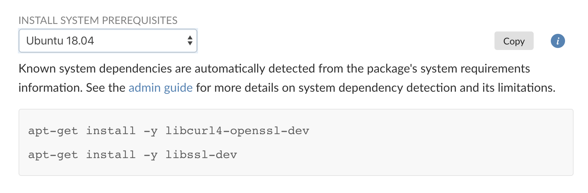
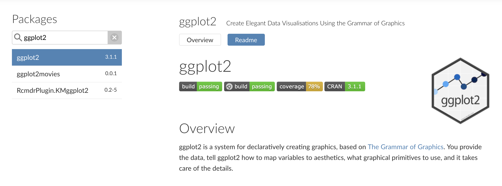

Installing R packages on Linux systems has always been a risky affair. In RStudio
Package Manager 1.0.8, we're giving administrators and R users the information
they need to make installing packages easier. We've also made it
easier to use Package Manager offline and improved search performance.

#### New to RStudio Package Manager? 

[Download](https://rstudio.com/products/package-manager/) the 45-day evaluation
today to see how RStudio Package Manager can help you, your team, and your
entire organization access and organize R packages. Learn more with our [online
demo server](https://demo.rstudiopm.com) or [latest webinar](https://resources.rstudio.com/webinars/introduction-to-the-rstudio-package-manager-sean-lopp).




## Updates

### Introducing System Prerequisites

R packages can depend on one another, but they can also depend on software
external to the R ecosystem. On Ubuntu 18.04, for example, in order to install the `curl` R package, you must have previously run `apt-get install libcurl`. R
packages often note these dependencies inside their DESCRIPTION files, but this
information is free-form text that varies by package. In the past, system
administrators would need to manually parse these files. In order to install
`ggplot2`, you'd need to look at the system requirements for `ggplot2` and all
its dependencies. This labor-intensive process rarely goes smoothly. Frequently,
system dependencies are not be uncovered until a package failed to install,
often with a cryptic error message that can leave R users and administrators frantically
searching StackOverflow.

To address this problem, we've begun cataloging and testing
[system
prerequisites](https://docs.rstudio.com/rspm/1.0.8/admin/system-dependency-detection.html).
The result is a list of install commands available for administrators and R
users. We've tested this list by installing all 14,024 CRAN packages across six
Linux distributions.

```{r echo=FALSE, eval=TRUE}
library(tibble)
library(ggplot2)
library(ggthemes)
dat <- tibble::tribble(
  ~OS, ~rules, ~coverage, ~weighted,
  "REHL/CentOS 6", "Yes", 92, "% of Packages",
  "REHL/CentOS 6", "No", 77, "% of Packages",
  "REHL/CentOS 7", "Yes", 94, "% of Packages",
  "REHL/CentOS 7", "No", 78, "% of Packages",
  "Ubuntu 16", "Yes", 94, "% of Packages",
  "Ubuntu 16", "No", 78, "% of Packages",
  "Ubuntu 18", "Yes", 96,"% of Packages",
  "Ubuntu 18", "No", 78,"% of Packages",
  "SLES/openSUSE 42.3", "Yes", 89, "% of Packages",
  "SLES/openSUSE 42.3", "No", 78, "% of Packages",
  "SLES/openSUSE 15.0", "Yes", 90,"% of Packages",
  "SLES/openSUSE 15.0", "No", 78,"% of Packages",
  #weighted
  # "REHL/CentOS 6", "Yes", 98,  "% Adjusted by Downloads", 
  # "REHL/CentOS 6", "No", 90,  "% Adjusted by Downloads",
  # "REHL/CentOS 7", "Yes", 99,  "% Adjusted by Downloads", 
  # "REHL/CentOS 7", "No", 90,  "% Adjusted by Downloads",
  # "Ubuntu 16", "Yes", 99, "% Adjusted by Downloads", 
  # "Ubuntu 16", "No", 90,  "% Adjusted by Downloads",
  # "Ubuntu 18", "Yes", 99,"% Adjusted by Downloads", 
  # "Ubuntu 18", "No", 90, "% Adjusted by Downloads",
  # "SLES/openSUSE 42.3", "Yes", 96, "% Adjusted by Downloads",
  # "SLES/openSUSE 42.3", "No", 90, "% Adjusted by Downloads",
  # "SLES/openSUSE 15.0", "Yes", 96, "% Adjusted by Downloads",
  # "SLES/openSUSE 15.0", "No", 90,"% Adjusted by Downloads"
)

ggplot(dat) + geom_col(aes(OS, coverage, fill = rules), position = "dodge") +
  #facet_wrap(~weighted) +
  coord_flip() +
  theme_minimal() +
  labs(
    y = "% of CRAN that Installs",
    fill = "Using RSPM Rules",
    x = NULL,
    title = "Installing R Packages",
    subtitle ="The importance of system prerequisites",
    caption =  "Run on April 4, 2019 with R version 3.5"
  ) +
  theme(
    legend.position = "bottom"
  ) +
  scale_fill_economist()
```


For any package, Package Manager shows you if there are system pre-requisites
and the commands you can use to install them. Today this support is limited to
Linux, but we plan to support Windows and Mac requirements in the future.
Package Manager automatically rolls up prerequisites for dependent R packages.
As an example, the `httr` R package depends on the `curl` package which depends
on `libcurl`. Package Manager will show the `libcurl` prerequisite for the
`httr` package--and for all of `httr`'s reverse dependencies!


### New Offline and Air-Gapped Downloader

In most cases, RStudio Package Manager provides the checks and governance
controls needed by IT to bridge the gap between offline production systems and
RStudio's public CRAN service. However, in certain cases it may be necessary to
run RStudio Package Manager offline. Version 1.0.8 introduces [a new
tool](https://docs.rstudio.com/rspm/1.0.8/admin/air-gapped.html) to help offline
customers. A new utility has been created to make cloning packages into an
air-gapped environment safe and fast.

## Other Improvements

In addition to these major changes, the new release includes the following updates:  

- Support for [using Amazon S3 for storage](https://docs.rstudio.com/rspm/1.0.8/admin/s3-config.html) is out of beta and ready for production systems.  
- Logs for [Git sources](https://docs.rstudio.com/rspm/1.0.8/admin/repositories.html#git-sources) have been improved, making it easier to track down cases where a repository fails to build.  
- Package search and listing performance has been significantly improved.  
- The [support for README files](https://blog.rstudio.com/2019/03/13/rstudio-package-manager-1-0-6-readme/) introduced in version 1.0.6 has been expanded to better support READMEs with links, badges, and images.



Please review the [full release notes](https://docs.rstudio.com/rspm/news).

> #### Upgrade Planning
> Upgrading to 1.0.8 from 1.0.6 will take less than five minutes. If you are
> upgrading from an earlier version, be sure to consult the release notes for the
> intermediate releases, as well.

Don't see that perfect feature? Wondering why you should be worried about
package management? Want to talk about other package-management strategies?
[Email us](mailto:sales@rstudio.com), our product team is happy to help!

- [Admin Guide](https://docs.rstudio.com/rspm/admin)
- [Overview PDF](https://www.rstudio.com/wp-content/uploads/2018/07/RStudio-Package-Manager-Overview.pdf)
- [Introductory Webinar](https://resources.rstudio.com/webinars/introduction-to-the-rstudio-package-manager-sean-lopp)
- [Online Demo](https://demo.rstudiopm.com)
