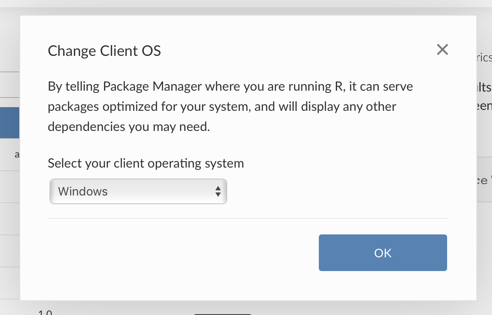

RStudio Package Manager 1.1.2 introduces beta support for Windows package
binaries. These binaries make it easier and faster to install R packages on
Windows Desktop. With this release, all the benefits of Package Manager are
available to desktop users including versioned repositories, curated subsets of
CRAN, centralized access to CRAN, Git, local packages, and usage tracking.
Now data scientists on Windows can easily share work, collaborate, and spend
more time doing analysis instead of debugging packages.

## Other Updates

In addition to adding support for Windows package binaries, the 1.1.2 release
includes:  

- [Eviction policies](https://docs.rstudio.com/rspm/1.1.2/admin/appendix-configuration.html#appendix-configuration-eviction) that make it easier for administrators to manage the amount of utilized space.
- Package binaries and system dependencies are now available for CentOS/RHEL 8  
- A [migration utility](https://docs.rstudio.com/rspm/1.1.2/admin/changing-database-provider.html) to help upgrade from a single node installation to a highly available installation using Postgres.  
- A performance improvement that prevents increased CPU usage over time on installations using SQLite.  

Please review the [full release notes](https://docs.rstudio.com/rspm/news).

> #### Upgrade Planning
> Upgrading to 1.1.2 from 1.1.0 is a minor upgrade. However, be aware that this
> upgrade may take up to 30 minutes to complete. If you are upgrading a multi-node
> installation, allow the first node to update completely before upgrading other
> nodes. If you are upgrading from an earlier version, be sure to consult the release notes for the
> intermediate releases, as well.

Package management is critical for making your data science reproducible, over
time, and across your organization. Wondering where you should start? [Email
us](mailto:sales@rstudio.com), our product team is happy to help!

#### New to RStudio Package Manager? 

[Download](https://rstudio.com/products/package-manager/) the 45-day evaluation
today to see how RStudio Package Manager can help you, your team, and your
entire organization access and organize R packages. Learn more with our [online
demo server](https://demo.rstudiopm.com) or [latest webinar](https://resources.rstudio.com/webinars/introduction-to-the-rstudio-package-manager-sean-lopp).

- [Admin Guide](https://docs.rstudio.com/rspm/admin)
- [Overview PDF](https://www.rstudio.com/wp-content/uploads/2018/07/RStudio-Package-Manager-Overview.pdf)
- [Introductory Webinar](https://resources.rstudio.com/webinars/introduction-to-the-rstudio-package-manager-sean-lopp)
- [Online Demo](https://demo.rstudiopm.com)

