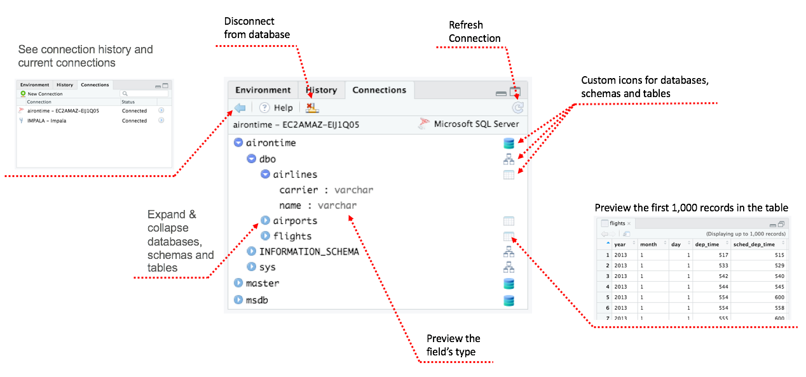

*Today, we're continuing our blog series on new features in RStudio 1.1. If you'd like to try these features out for yourself, you can [download a preview release of RStudio 1.1](https://www.rstudio.com/products/rstudio/download/preview/).*

## Data Connections

Connecting to data sources in R isn't always straightforward; even when you're able to establish a connection, navigating within it and understanding the shape of the data inside can be difficult. We built the Connections tab to make it easy to establish connections to data sources and access the data they contain.

### Connecting to Data

#### New Connection Wizard

RStudio 1.1 includes a new Connection wizard which makes it easy to connect to any data source on your system. 

Clicking on a connection type shows a form which you can fill to create the appropriate R code for creating a new connection. It's now just as easy to connect to a data source as it is to import a CSV file.

RStudio can show you data sources from a variety of places, including:

- ODBC drivers installed on your machine, using the [odbc](https://github.com/rstats-db/odbc/) package
- Spark connections, using the [sparklyr](https://spark.rstudio.com/) package
- Connections supplied by an administrator, on RStudio Server
- Data sources defined by any installed R packages; see [RStudio Connections](https://rstudio.github.io/rstudio-extensions/rstudio-connections.html) for more

#### Saved Connections

Once you have established a connection, RStudio saves it for future reference (even if you didn't create it using the wizard!). This makes it easy to connect to the same data again later, without having to find the connection command in your R console history or dig up the R script you used to establish the connection.

Your connection history is available in all your projects. Never look up a server name again!

## Exploring Connections

When you're connected to a data source, RStudio will show you all of the objects available. You can explore this list, and preview the data, using the tools in the Connections pane.

## Professional ODBC Drivers

Finally, RStudio will be providing professional ODBC drivers for the most important enterprise databases to our Pro customers. We developed the Connections tab to work seamlessly with these drivers; they will give your users easy, consistent access to the data in your company's systems. More news about these ODBC drivers is coming soon!

## Further Reading

The Connections tab is just one part of a larger effort at RStudio to advance the state of the art in data connectivity with R. Here's some more reading on both the big picture and the technical details:

- [Using Databases with R](http://db.rstudio.com/) describes best practices for working with data from databases using R and RStudio.
- [Using RStudio Connections](https://support.rstudio.com/hc/en-us/articles/115010915687-Using-RStudio-Connections) contains more detailed information on the Connections tab.
- [Extending RStudio Connections](https://rstudio.github.io/rstudio-extensions/rstudio-connections.html) describes how to add new connection types to RStudio and make it possible to browse your connection's data in the pane.

We hope you [download the RStudio 1.1 preview](https://www.rstudio.com/products/rstudio/download/preview/) and [let us know what you think](http://support.rstudio.com/hc/en-us)!

