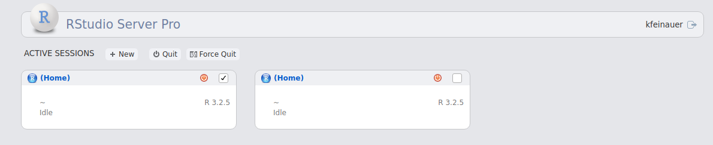
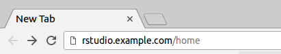
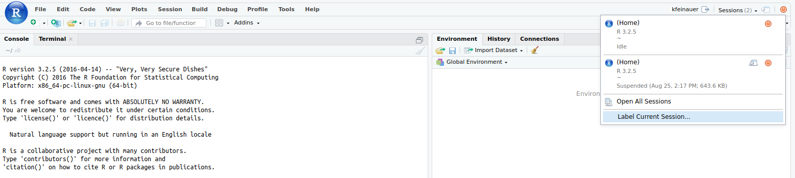
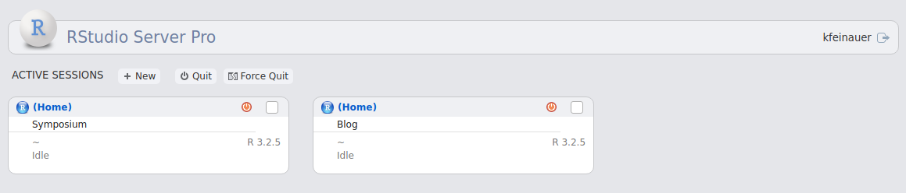
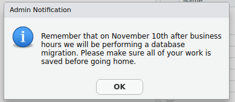

*Today, we're continuing our blog series on new features in RStudio 1.1.  If you’d like to try these features out for yourself, you can download a [preview release of RStudio Server Pro 1.1](https://www.rstudio.com/products/rstudio/download/preview/).*

# RStudio Server Pro

Today we are going to be talking about some of the great new features we have added to RStudio Server Pro v1.1, which make users’ and administrators’ workflows more efficient. Let’s begin!

## Features for Users

### Homepage Improvements

One of the key features of RStudio Server Pro is the ability for users to run multiple concurrent R sessions. In order to help you keep track of your active sessions, RStudio Server Pro comes with a **home page** that allows you to see the status of your sessions, such as if they are idle, executing or suspended. In RStudio Server Pro v1.1, we’ve made a few improvements that will help you manage your sessions.

#### Managing Multiple Sessions

The homepage now allows you to select multiple active sessions and kill them, allowing you to cleanup many sessions with one single action. Simply select the desired sessions by clicking their checkboxes, and click on either the Quit or Force Quit buttons. The Quit button will attempt to gracefully kill your sessions by giving them the opportunity to properly shut down. The Force Quit button immediately kills your sessions by sending them SIGKILL and cleans up all child processes as well. Note that in both cases, any unsaved data may be lost.



#### Accessing the Home Page

We’ve made accessing the home page easier, allowing you to get there without having to first get into a running session. To do so, simply type in the address of your company’s RStudio in your browser, and add /home, like so:



#### Session Labels

In the past, it could be difficult to keep track of your sessions and know which was which when looking at them on the home page. Now you can label your sessions so that they show up clearly on the home page. To do that, simply click the **Label Current Session** button from the Sessions dropdown in the top right corner from within an active session and give the session a name. 



The label will be displayed on the home page making it easy for you to properly drop back in to the correct session.



## Features for Admins

### Floating Licensing

Floating licensing allows you to run fully licensed copies of RStudio Server Pro easily in ephemeral instances, such as Docker containers, virtual machines, and EC2 instances. Instances don't have to be individually licensed, and you don't have to manually activate and deactivate a license in each instance. Instead, a lightweight license server distributes temporary licenses ("leases") to each instance, and the instance uses the license only while it's running. 

This model is perfect for environments in which RStudio Server Pro instances are frequently created and destroyed on demand, and only requires that you purchase a license for the maximum number of concurrent instances you want to run.

Technical details on the floating licensing system are available in the [RStudio Server Pro Administration Guide](http://docs.rstudio.com/ide/server-pro/1.1.345/license-management.html#floating-licensing).

### Session Notifications

Administrators can now broadcast notifications to users in real-time with our new notification system. The system is very flexible, so we will just cover the basics here. For more in-depth information, see the [RStudio Server Pro Administration Guide](http://docs.rstudio.com/ide/server-pro/1.1.345/r-sessions.html#notifications), or take a look at the documentation in the **/etc/rstudio/notifications.conf** file. 

To broadcast a notification to all of your users, add lines like the following to your **/etc/rstudio/notifications.conf** file:

```{{ini}}
StartTime: 2017-11-06
EndTime: 2017–11-11
Message: Remember that on November 10th after business hours we will be performing a database migration. Please make sure all of your work is saved before going home.
```

This will create a notification that starts broadcasting to your users on the 6th of November, and stops on midnight of the 11th. Each user will only see the message until they have acknowledged it, usually once in the first session they create during the notification window, or to any sessions that are currently active. The notification will look something like:



### Automatically Deleting Unused Sessions

As an administrator, you have the ability to automatically suspend sessions to disk after a certain period of inactivity by specifying the **session-timeout-minutes** option in **/etc/rstudio/rsession.conf**. RStudio Server Pro v1.1 adds the ability to also kill and delete these sessions entirely after a certain amount of hours, freeing up valuable system resources. Simply add the following line to **/etc/rstudio/rsession.conf**.

```{{ini}}
session-timeout-kill-hours=96
```

This setting will kill and delete any inactive sessions that have not been used for the specified hours. You should set a long timeout period to ensure that only sessions users have forgotten about or no longer need are deleted, as the session’s data is lost forever. Again, for more information, see the RStudio Server Pro Administration Guide.

Thank you for using RStudio Server Pro. We hope these new features improve both user and administrator workflows! 

