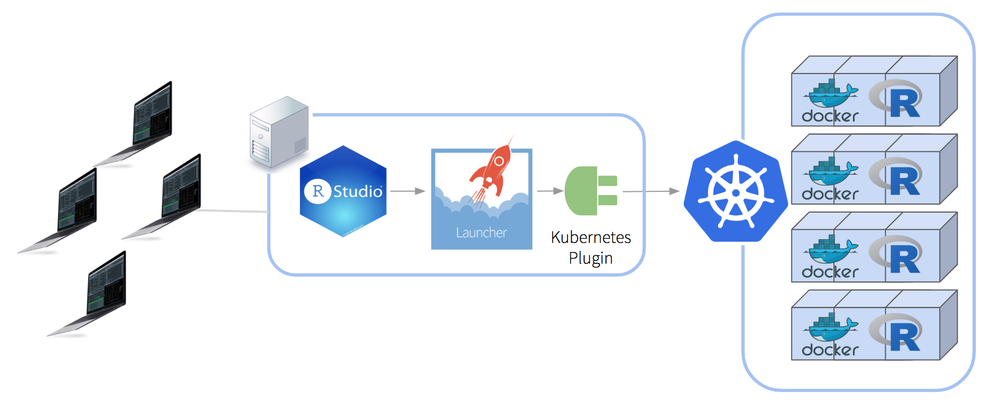
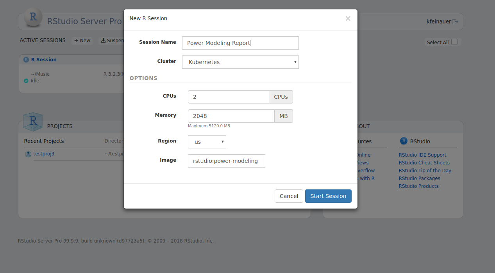
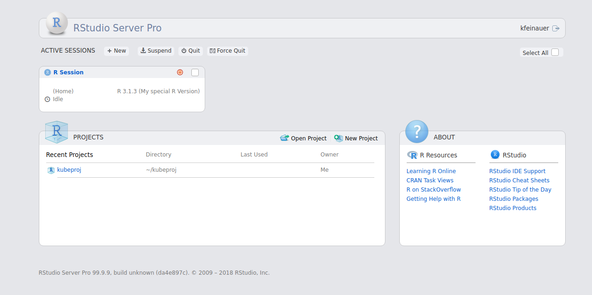
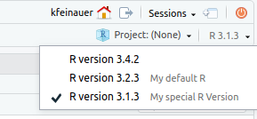
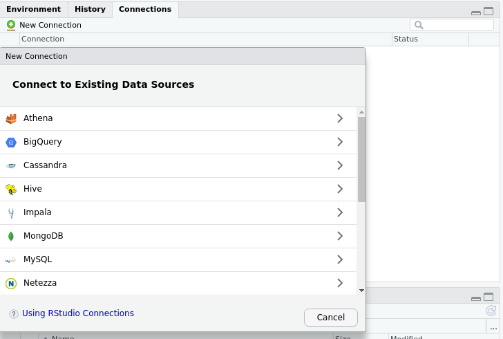
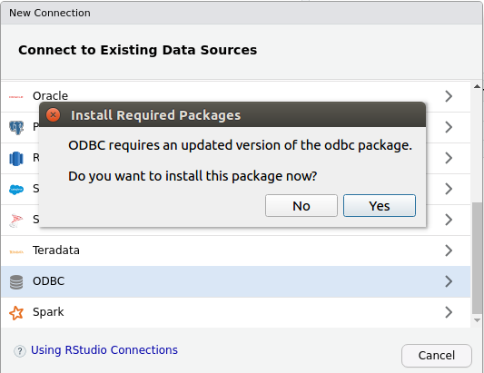

*Today, we're continuing our blog series on new features in RStudio 1.2.  If you’d like to try these features out for yourself, you can download a [preview release of RStudio Pro 1.2](https://www.rstudio.com/products/rstudio/download/preview/).*


We've added some great new features to RStudio Pro for v1.2, which includes not only Server Pro, but also the new and improved Pro Desktop. Let's get started!


## RStudio Server Pro

### The Job Launcher

Perhaps the biggest new change in v1.2 is the Job Launcher. This allows you to run RStudio sessions and ad-hoc R scripts within your already existing cluster workload managers, such as Kubernetes, allowing you to leverage your existing infrastructure instead of provisioning load balancer nodes manually. At release, we will support the following clusters:

* [Kubernetes](https://kubernetes.io)
* [Slurm](https://slurm.schedmd.com)

The following diagram shows an example of how you can use the Job Launcher with Kubernetes to painlessly scale RStudio Server Pro across potentially hundreds of nodes.



When starting RSP sessions via the Launcher, users will still use the same home page that they are familiar with, but will have additional options for controlling the creation of their sessions within your distributed environment of choice.



We determined that most RSP users were already using Slurm and Kubernetes, so integration with them was added first. However, the Job Launcher is an extensible system that makes it fairly simple to develop plugins to target different cluster types. We plan to develop more plugins in the future, and would love to hear from you about what we should tackle next! At present, we plan to add support for [LSF](https://www.ibm.com/us-en/marketplace/hpc-workload-management).

For more information on launching ad-hoc jobs, see our upcoming blog post on background jobs. For more information on using the Job Launcher with RStudio Server Pro, see the [documentation](http://docs.rstudio.com/ide/server-pro/1.2.1086-1/job-launcher.html).

### Improved R Version Management

We've improved management of various versions of R within your environments, allowing you to:

* Label each version so users can have a friendly name associated with each version. This makes it easy to differentiate between similar versions for different environments, such as when running parallel versions of Microsoft R and Vanilla R.
* Execute an arbitrary script when the version is loaded, perhaps to dynamically alter any important environment variables (such as LD_LIBRARY_PATH)
* Load an arbitrary environment module, if using Environment Modules (see [environment modules](https://en.wikipedia.org/wiki/Environment_Modules_(software)))

When specifying a label, users will see the label on the home page, as well as within the session itself when accessing the version switch menu. The following screenshots show an example where the R version 3.1.3 was given the label `My Special R Version`.




For a more detailed guide on configuring R Versions, see the [documentation](http://docs.rstudio.com/ide/server-pro/1.2.1086-1/r-versions.html#extended-r-version-definitions).

### Configuration Reload

We've added the ability to reload some of Server Pro's configuration at run-time, without having to stop the server and interrupt users' sessions. Currently, the following is supported:

* Reloading `/etc/rstudio/load-balancer` to add new nodes or remove existing nodes. Note that when removing nodes, removed nodes need to have their RStudio processes stopped by running `sudo rstudio-server stop` on that node before invoking the configuration reload.
* Reloading the list of server R versions specified in `/etc/rstudio/r-versions`. 

In order to perform the configuration reload, simply edit the above files as desired and then send the `SIGHUP` signal to the `rserver` executable, like so:

```
pidof rserver | sudo xargs kill -s SIGHUP
```


## RStudio Pro Desktop

With the release of RStudio v1.2 we are excited to announce the RStudio Pro Desktop, a fully licensed platform that provides enterprise users with an enhanced version of RStudio Desktop that comes with professional priority support. The Pro Desktop will be built on over time to include new capabilities and integrations with other RStudio professional products.

### Bundled ODBC Drivers

Pro Desktop now adds support for installing the [RStudio Pro Drivers](https://www.rstudio.com/products/drivers) for connecting to various ODBC data sources, such as MongoDB, Oracle, and PostgreSQL (just to name a few!).

Connecting to a database is simple - just click on the New Connection button under the Connections pane, and you'll be greeted with a dialog from which to select your database type.



When connecting to a data source for the first time, you will be prompted to install the ODBC package. Simply click yes, and then you will be able to connect to many of the most popular databases available today!



For more information on database connectivity within RStudio Pro, see the [documentation](http://db.rstudio.com).

---

If you're interested in giving the new RStudio Pro features a try, please [download the RStudio 1.2 preview](https://www.rstudio.com/products/rstudio/download/preview). For more detailed documentation on RStudio Pro features, see the [admin guide](http://docs.rstudio.com/ide/server-pro/1.2.1086-1).


