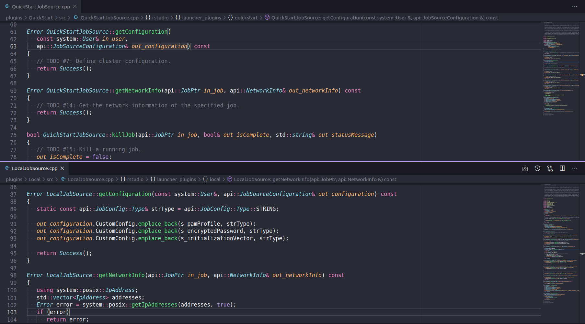

## Improving Interoperability through the RStudio Job Launcher

In a <a href="https://blog.rstudio.com/2020/07/15/interoperability-maximize-analytic-investments/" target="_blank" rel="noopener noreferrer">previous blog post</a> we discussed how improving interoperability between the multiple environments required by data scientists can improve productivity and ROI on IT investments. With the help of the <a href="https://rstudio.com/resources/rstudioconf-2019/rstudio-job-launcher-changing-where-we-run-r-stuff/" target="_blank" rel="noopener noreferrer">RStudio Job Launcher</a>, <a href="https://rstudio.com/products/team/" target="_blank" rel="noopener noreferrer">RStudio Team</a> products can make use of IT-managed computing resources in Kuberenetes or Slurm clusters. Data scientists can launch their RStudio, Jupyter, or VS Code sessions directly through RStudio Server Pro. They can also launch remote background jobs to leverage the hardware that is available in their organization's computing cluster.

However, there are many more job management systems available besides Kubernetes and Slurm. Data scientists may want or need access to the resources available in their organization's preferred system to run complex analyses. Data science leaders may want to increase productivity in their teams by making use of powerful pre-existing systems. IT departments may want to increase the utilization of job management systems which are expensive to configure and maintain.

## The RStudio Job Launcher Plugin System

The <a href="https://rstudio.com/resources/rstudioconf-2019/rstudio-job-launcher-changing-where-we-run-r-stuff/" target="_blank" rel="noopener noreferrer">RStudio Job Launcher</a> allows RStudio Team products to integrate with multiple types of job management systems through a Plugin-based system. Each Plugin should allow the Job Launcher to communicate with one type of job management system. The Job Launcher currently has Plugins for integrating with Kubernetes and Slurm, as well as a Plugin which allows jobs to be launched directly on the Job Launcher host.

To support additional job management systems, a new Plugin needs to be developed for each job management system. The <a href="https://rstudio.com/products/launcher-plugin-sdk/" target="_blank" rel="noopener noreferrer">RStudio Launcher Plugin SDK</a> (Software Development Kit) facilitates rapid development of these Plugins in C/C++. 

### The QuickStart Plugin & Guide

A developer can follow along with the <a href="https://docs.rstudio.com/rlps/quickstart/" target="_blank" rel="noopener noreferrer">QuickStart Guide</a> to transform the RStudio QuickStart Plugin into a functioning Plugin. The <a href="https://docs.rstudio.com/rlps/quickstart/" target="_blank" rel="noopener noreferrer">QuickStart Guide</a> includes 16 steps, or '`TODO` items', that correspond to different features that need to be implemented in the QuickStart Plugin.

* `TODO`s #1 - #4 help the developer get the Plugin renamed and rebranded as desired. 
* `TODO` #5 shows how configuration options can be added to the Plugin, although it may become more obvious what options will be needed as development continues. 
* `TODO`'s #6 - #16 take the developer through the bulk of the work to create a functioning RStudio Job Launcher Plugin. 

Provided with the SDK is a utility called "Smoke Test". The Smoke Test tool can be used during development to trigger many of the major code paths in a Plugin. Debugging a Plugin that is in use by an RStudio Team product can be difficult because the developer is not in control of which API calls are made and when. The Smoke Test makes debugging a Plugin much easier by giving the developer that control.

While following the RStudio Launcher Plugin SDK QuickStart Guide, most `TODO`s will follow a similar development process. For example, the development process for `TODO` #7 might look like this:

1. Implement <a href="https://docs.rstudio.com/rlps/quickstart/todos.html#todo-7" target="_blank" rel="noopener noreferrer">`TODO` #7: Define cluster configuration</a>
2. Compile the plugin and the smoke-test tool
3. <a href="https://docs.rstudio.com/rlps/devguide/smoke-test.html#smoke-test-start" target="_blank" rel="noopener noreferrer">Launch the plugin through the smoke-test tool</a>
4. Trigger the Cluster Info API call using the <a href="https://docs.rstudio.com/rlps/devguide/smoke-test.html#st-menu-1" target="_blank" rel="noopener noreferrer">first option in the smoke test tool</a>
5. Validate that all of the desired configuration information is returned
6. Repeat the previous steps until satisfied, attaching a debugger to the plugin if necessary

<figure>

<caption>
Figure 1: A side-by-side comparison of the QuickStart template method for `TODO` #7 and the sample Local plugin implementation of `TODO` #7.</caption>
</figure>

After the developer is getting the desired results from the Smoke Test tool, they may wish to test their Plugin against an RStudio Team product. The Smoke Test tool will only cover the basic pathways of the Plugin.

### The Developer's Guide

Some Plugin developers may find it necessary to do something more complex than what is presented in the <a href="https://docs.rstudio.com/rlps/quickstart/" target="_blank" rel="noopener noreferrer">QuickStart Guide</a>. For example, they may wish to allow administrators to set resource limits on a per-user or per-group basis. In that case, the Plugin developer can turn to the <a href="https://docs.rstudio.com/rlps/devguide" target="_blank" rel="noopener noreferrer">Developer's Guide</a>. The <a href="https://docs.rstudio.com/rlps/devguide/advanced-features.html" target="_blank" rel="noopener noreferrer">Advanced Features section of the Developer's Guide</a> covers optional advanced features that may be added to a Plugin as needed.

The <a href="https://docs.rstudio.com/rlps/devguide" target="_blank" rel="noopener noreferrer">Developer's Guide</a> also covers the high level architecture of the SDK, how some RStudio Team products integrate with the RStudio Job Launcher, and a detailed description of all the Smoke Test Utility options. Additionally, the API between the RStudio Job Launcher and a Plugin is described in full. If developers prefer to work in a language other than C or C++, a Plugin developer can use the <a href="https://docs.rstudio.com/rlps/devguide/pluginapi.html" target="_blank" rel="noopener noreferrer">Launcher Plugin API</a> section to develop a Plugin from scratch in any other language. The <a href="https://docs.rstudio.com/rlps/devguide/pluginapi.html" target="_blank" rel="noopener noreferrer">Launcher Plugin API</a> describes the communication mechanism between the RStudio Job Launcher and a Plugin.

### The API Reference

The RStudio Launcher Plugin SDK also includes a complete <a href="https://docs.rstudio.com/rlps/apiref/annotated.html" target="_blank" rel="noopener noreferrer">API Reference</a> for all of its C/C++ code. The <a href="https://docs.rstudio.com/rlps/apiref/annotated.html" target="_blank" rel="noopener noreferrer">API Reference</a> may be useful if the developer wishes to see detailed class hierarchy information or reference doxygen comments outside of the codebase.

### Our GitHub

The RStudio Launcher Plugin SDK is open source. If you find any bugs or wish to request enhancements, please file an issue on the <a href="https://github.com/rstudio/rstudio-launcher-plugin-sdk" target="_blank" rel="noopener noreferrer">RStudio Launcher Plugin SDK GitHub Repository</a>. Pull requests for improvements or bug fixes are also welcome!
