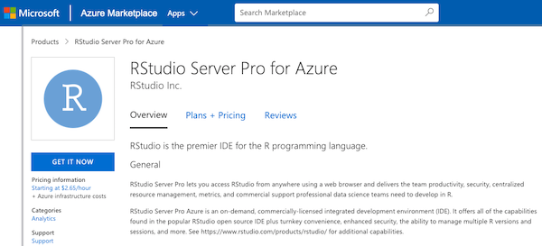

RStudio is excited to announce the availability of its flagship, enterprise-ready, integrated development environment for R in Azure Marketplace.

[RStudio Server Pro for Azure](https://azuremarketplace.microsoft.com/en-us/marketplace/apps/rstudio-5237862.rstudioserverpro?tab=Overview) is an on-demand, commercially-licensed integrated development environment (IDE) for R on the Microsoft Azure Cloud. It offers all of the capabilities found in the popular RStudio open source IDE, plus turnkey convenience, enhanced security, the ability to manage multiple R versions and sessions, and more. It comes pre-configured with multiple versions of R, common systems libraries, and the most popular R packages.

RStudio Server Pro Azure helps you adapt to your unique circumstances. It allows you to choose different Azure computing instances whenever a project requires it, and helps avoid the sometimes complicated processes for procuring on-premises software.

If the enhanced security, elegant support for multiple R versions and multiple sessions, and commercially licensed and supported features of RStudio Server Pro appeal to you, consider RStudio Server Pro for Azure!

[Read the FAQ Getting Started with RStudio Server Pro for Azure](https://support.rstudio.com/hc/en-us/articles/360014725833-Getting-Started-with-RStudio-Server-Pro-for-Azure)

