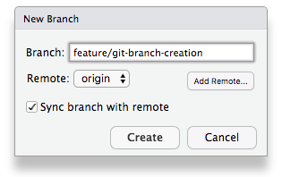
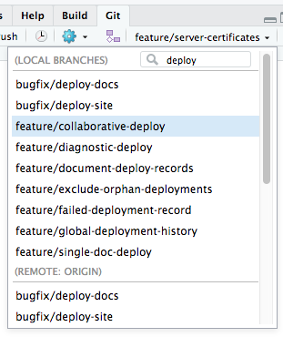
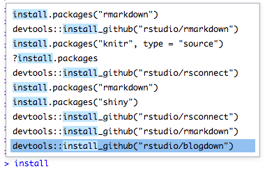
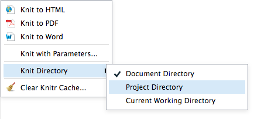
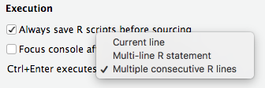
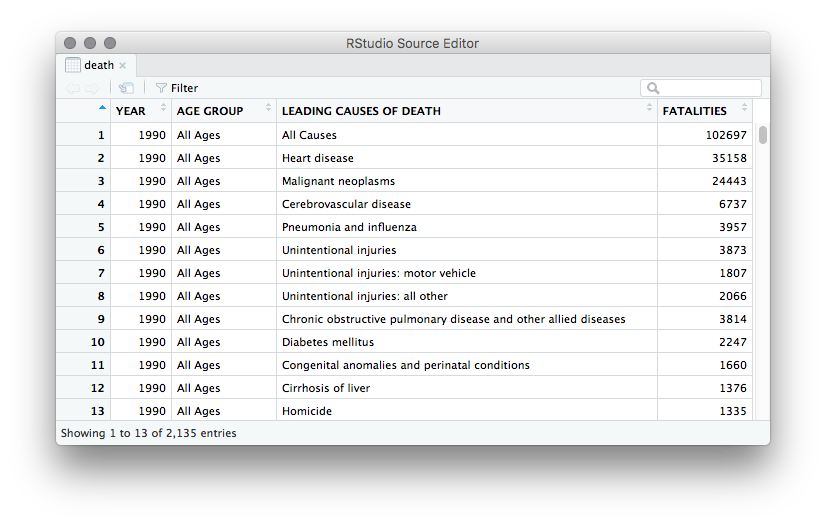
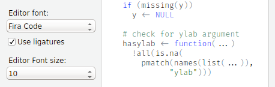
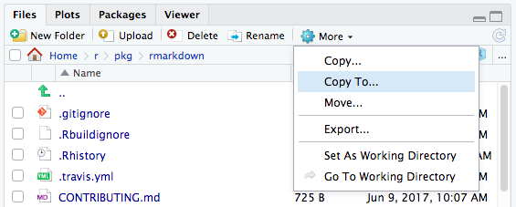
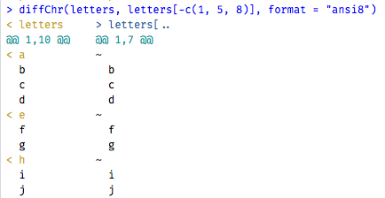

*Today, we're concluding our blog series on new features in RStudio 1.1. If you'd like to try these features out for yourself, you can download a [preview release of RStudio 1.1](https://www.rstudio.com/products/rstudio/download/preview/).*

## Details matter

Throughout this blog series, we've focused on some of the big features we added in RStudio 1.1. It's not just the big things that matter, though; it's sometimes the little ones that make the most difference in your day-to-day work. Towards that end, we spent a chunk of time during RStudio 1.1's development implementing small but significant improvements to the core IDE features you use every day. Many of these were based on requests and ideas from the R community -- we're very thankful for everyone's input and perspective!

### Create Git branches

We've significantly improved Git branch management. Now you can add a new branch right from the IDE, and set it up to track a remote branch at the same time.



You can even type to search your branch names, which is helpful if you have a lot of them!



### Ctrl+R command search

Regular RStudio users will know that *Ctrl+Up* (or *Cmd+Up* on MacOS) lets you recall a previous R command by typing only a few letters from the beginning of the command. In RStudio 1.1, we've added *Ctrl+R*, which--just like in your favorite shell--performs an incremental history search. Now you can recall a previous R command based on text anywhere in the command, not just at the beginning.



### Change knit directory

In RStudio 1.0, knitting R Markdown documents (and executing notebook chunks) was always done in the context of the document's directory. This has some advantages, but many people prefer to use more contextual paths. In RStudio 1.1, you can now choose to evaluate chunks in the current working directory, or in the directory of the document's project.



This setting can be different for each R Markdown document, and it affects both the execution of notebook chunks and the behavior of the Knit button, so you'll get consistent results no matter how your R chunks are evaluated.

### Run R code between blank lines

In older versions of RStudio, *Ctrl+Enter* sent a single line of R code to the console. In 1.0, we added the ability to automatically send an entire R statement to the console, even if it was spread over multiple lines. And in 1.1, we've made it possible to execute consecutive R lines, delimited by blank lines (like "paragraphs" in [ESS](https://ess.r-project.org/)). You can opt into this behavior in Options -> Code -> Editing -> Execution:



This behavior is helpful if you use blank lines to delimit sections of your R script, and usually want to execute each section as a unit. For instance, in the example below you would press Ctrl+Enter once to execute the first section, and again to execute the second.

```{{r}}
# Let's run these two commands to build some data.
categories <- c("first", "second")
data <- data.frame(
  group   = factor(categories),
  measure = c(40, 60))

# Then, this last one to view it.
ggplot(data = data, aes(group, measure), geom_bar(stat = "identity"))
```

It's also possible to mix and match execution styles, as we've added new commands that specifically use each style (regardless of the default behavior of Ctrl+Enter). Set Ctrl+Enter to your most-used style and bind keyboard shortcuts to the others you use; you'll rarely find yourself reaching for the mouse to execute R code!

### Data viewer improvements

We have removed the 100-column limit in the data viewer. We've also made it possible to resize the columns, so you can see more of your data when it contains long text.



### Execute code from Help

Ever wanted to execute the example code from a function's Help? Now you can just highlight it right in the Help pane and press Ctrl+Enter (Cmd+Enter on macOS) to send it to the console.


### Project templates

Any R package can now supply RStudio with a template for new projects based on the package. For instance, when you install the [bookdown](https://bookdown.org/yihui/bookdown/) package, you'll start seeing an option for new **bookdown** projects in RStudio, which will get you started with the skeleton of a book right away.


This project template isn't hard-coded into RStudio -- it's provided by the R package, so any package can provide a project template. If you're a package author, see our [RStudio Project Templates](https://rstudio.github.io/rstudio-extensions/rstudio_project_templates.html) documentation for information on how to add a project template to your package.

### Ligature support

In the last few years we've seen an uptick in fonts designed specifically for code. [Many of these use "ligatures"](https://www.hanselman.com/blog/MonospacedProgrammingFontsWithLigatures.aspx), which combine two or more individual characters into a single typographical glyph (see [Fira Code](https://github.com/tonsky/FiraCode) for examples). RStudio Server and RStudio on MacOS have always supported these natively; in RStudio 1.1 we added support for them on Windows and Linux, too.



### Files pane ergonomics

The *Copy* command in the Files pane makes it easy to copy a file from one place to another, but sometimes you want the file to have a different name in the new location. We've added a new command called *Copy To...* which does this: just like `cp`, you can now specify a destination filename.



We've also significantly improved *Rename*: when you use the Files pane to rename a file that you have open, it's no longer necessary to close and re-open the file; the editor buffer adapts immediately to the new name. 

### ANSI colors in the R console

R packages like [crayon](https://cran.r-project.org/web/packages/crayon/index.html) make it possible for R's output to include colors and highlighting, using standard ANSI escape sequences. We've added support for these to RStudio's R console; packages that use *crayon*, like [diffobj](https://cran.r-project.org/web/packages/diffobj/index.html), can now emit colored, styled text right inside the R console.



## Conclusion

This wraps up our blog series on the RStudio 1.1 preview. If you just can't get enough, there's lots more: see the [RStudio 1.1 Preview Release Notes](https://www.rstudio.com/products/rstudio/download/preview-release-notes/) for a full list of the changes in RStudio 1.1.

If you'd like to learn more, we have two upcoming webinars in which we'll be taking a deeper dive:

- **New Features of the IDE** on December 6th, 2017: we'll show you what's new in RStudio 1.1 and walk you through how to apply the new features to your workflow.
- **Terminal Updates** on December 20th, 2017: we'll get into the details of the new RStudio 1.1 Terminal.

We hope you've enjoyed learning about the new features and capabilities ahead of the official release of RStudio 1.1, and we look forward to putting an official release in your hands in the coming months.


