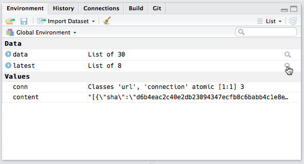
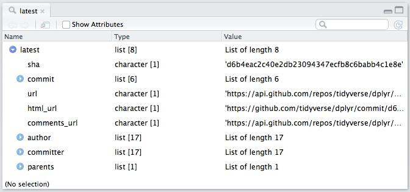
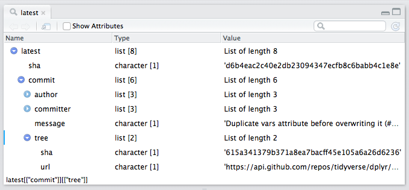
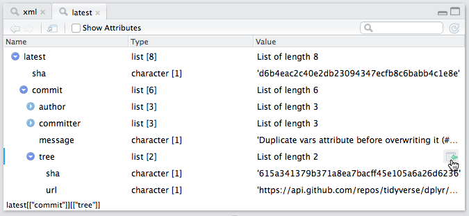
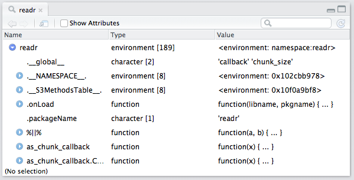
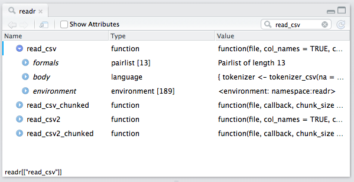
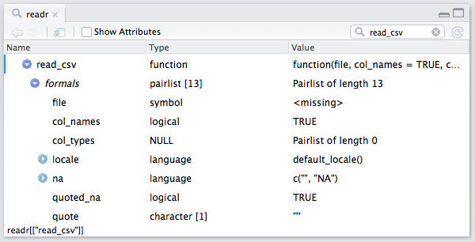
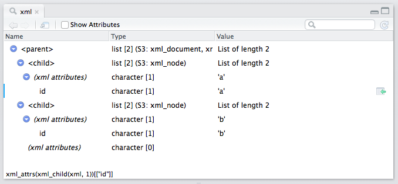

*Today, we're continuing our blog series on new features in RStudio 1.1. If you'd like to try these features out for yourself, you can [download a preview release of RStudio 1.1](https://www.rstudio.com/products/rstudio/download/preview/).*

## Object Explorer

You might already be familiar with the **Data Viewer** in RStudio, which allows for the inspection of data frames and other tabular R objects available in your R environment. With RStudio v1.1, it will be possible to inspect hierarchical (list-like) R objects as well, using the **Object Explorer**.

### Exploring an Object

The same workflows you're familiar with for opening the data viewer apply when opening the object explorer. Let's start by inspecting some data returned by the GitHub API -- we'll inspect the latest commit made on the [dplyr](https://github.com/tidyverse/dplyr) repository. First, let's start by downloading and reading this data into R:

```{{r}}
# read from the commits API endpoint
conn <- url("https://api.github.com/repos/hadley/dplyr/commits")
content <- readLines(conn, warn = FALSE)
close(conn)

# convert from JSON to R list object
data <- jsonlite::fromJSON(content, simplifyDataFrame = FALSE)

# extract the most recent commit
latest <- data[[1]]
```

Within the environment pane, explorable objects will be shown with a magnifying glass, and clicking on this icon will open the associated item in the object explorer. (Alternatively, such objects can also be opened by directly calling the `View()` function on the object of interest.)



After clicking on this icon, the object explorer will open, and we can begin exploring the latest `dplyr` commit.



### Interacting with the Object Explorer

The object explorer displays information within a tree with three (resizable!) columns:

- **Name**: Either the name of the element (when present); or the index of the element in its parent container;
- **Type**: The underlying R type (or class) of a particular element, alongside its length;
- **Value**: A brief description of the value for a particular element.

Expandable nodes (e.g. sub-lists) can be expanded by clicking the blue arrow to the left of the expandable field. In the following image, the `commit` and `tree` sub-nodes are opened:



You might also notice the text at the bottom left of the explorer, indicating the R code that can be used to access this particular object. If you mouse over a particular row in the object explorer, you'll see an icon drawn on the right side of that row -- this icon can be clicked to send that code to the R console.



## Filtering with the Explorer

All kinds of R objects can be inspected within the object explorer -- environments, S4 objects, R6 objects, R functions, and other base R objects. For example, we can explore the `readr` namespace, and learn a bit about the functions contained within. We'll use the object explorer to explore the `read_csv()` function definition.

```{{r}}
readr <- asNamespace("readr")
View(readr)
```



There are quite a few top-level objects in the `readr` namespace (189 in total). Rather than scrolling to find the `read_csv()` in the explorer, we can use the search box at the top-right of the explorer to quickly filter down to entries containing `read_csv` in their name:



Notice how the object explorer displays the *formals*, *body* and *environment* for an R function definition. This allows you to explore the 'guts' of an R function -- for example, the expression tree associated with a function's body, and the default parameter values associated with the function arguments. We can expand the *formals* entry to view the function arguments accepted by `read_csv()`:



### xml2 Integration

The object explorer also comes with special handling for XML and HTML documents produced by the `xml2` package:

```{{r}}
library(xml2)
text <- "<parent><child id='a'>child 1</child><child id='b'>child 2</child></parent>"
xml <- xml2::read_xml(text)
View(xml)
```



Similarly, the generated code uses the `xml2` package APIs to access nodes from within the XML document.

---

We hope you find the **Object Explorer** to be a useful tool in your workflows. If you're interested in giving it a test drive, please [download the RStudio 1.1 preview](https://www.rstudio.com/products/rstudio/download/preview/).

If you have any questions or feedback, please get in touch with us at the [support forums](http://support.rstudio.com/hc/en-us).


