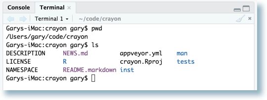
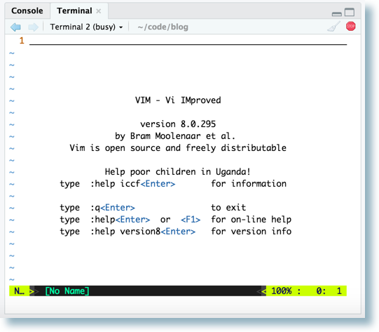
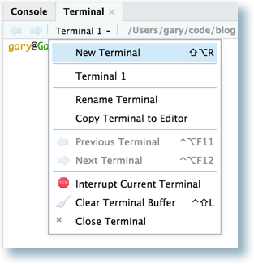
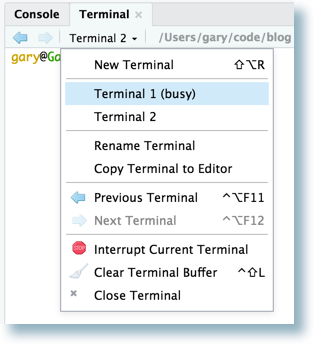
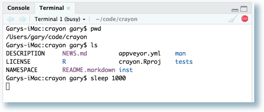
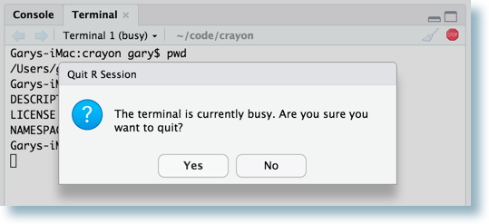
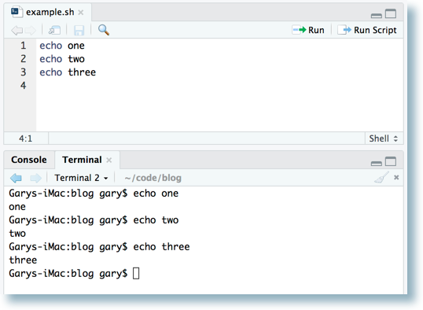
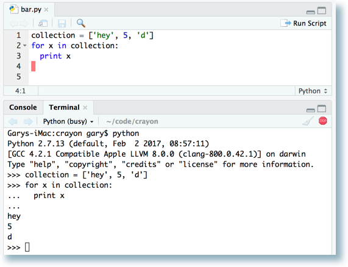
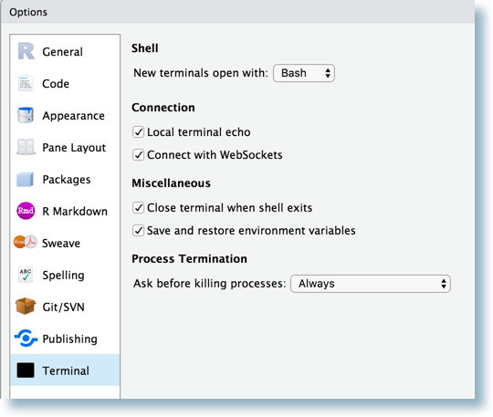
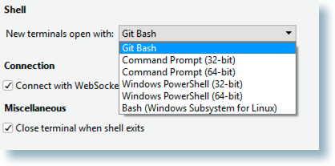

Today we're excited to announce availability of our first Preview Release for RStudio 1.1, a major new release which includes the following new features:

- A **Connections** tab which makes it easy to connect to, explore, and view data in a variety of databases.
- A [Terminal tab](https://support.rstudio.com/hc/en-us/articles/115010737148-Using-the-RStudio-Terminal) which provides fluid shell integration with the IDE, xterm emulation, and even support for full-screen terminal applications.
- An **Object Explorer** which can navigate deeply nested R data structures and objects.
- A new, modern **dark theme** and Retina-quality icons throughout.
- Improvements to the [RStudio API](https://github.com/rstudio/rstudioapi) which add power and flexibility to RStudio add-ins and packages.
- RStudio Server Pro support for floating licensing, notifications, self-service session management, a library of professional ODBC drivers, and more.
- Dozens of other small improvements and bugfixes.

You can try out these new features in the [RStudio Preview Release](https://www.rstudio.com/products/rstudio/download/preview/). 

## Terminal

Over the next few weeks we'll be blogging about each of these new features. We start today with an overview of the integrated support for full-featured system terminals via the **Terminal tab**.

The Terminal tab provides access to the system shell within the RStudio IDE. Potential uses include advanced source-control operations, execution of long-running jobs, remote logins, and interactive full-screen terminal applications (e.g. text editors, terminal multiplexers).

### Opening Terminals

The Terminal tab is next to the Console tab. Switch to the Terminal tab to automatically create a new terminal, ready to accept commands. If the tab isn't visible, show it via **Shift+Alt+T** or the **Tools -> Terminal -> Move Focus to Terminal** menu. Here's a terminal with the output of some simple commands:

Support for xterm enables use of full-screen programs:

Additional terminal sessions can be started using the **New Terminal** command on the terminal drop-down menu, or via **Shift+Alt+R**.

Each terminal session is independent, with its own system shell and buffer. Switch between them using the arrows next to the drop-down menu or by clicking on the terminal's name in that menu.

Programs running in a terminal do not block the rest of the RStudio user-interface, so you can continue working in RStudio even when the terminal is busy. On Mac, Linux, or Server, a busy terminal will have **(busy)** next to its name, and the close [x] changes to a **stop** button:

If there is a busy terminal (Mac, Linux, or Server) trying to exit RStudio (or any other operation that will stop the current R session) will give a warning. Proceeding will kill the running programs.

### Run in Terminal

When editing a shell script in RStudio, the **Run Selected Line(s)** command (**Cmd+Enter** on Mac / **Ctrl+Enter on others**) executes the current line, or selection, in the current terminal. This can be used to step through a shell script line-by-line and observe the results in the terminal.

Here's an example where Cmd+Enter was hit three times, with focus on the editor and the cursor starting on the first line.

In other text file types, including R source files, the new **Send to Terminal** command (**Cmd+Alt+Enter** on Mac, **Ctrl+Alt+Enter** on others) may be invoked to send the current selection to the current terminal. This can be handy for other languages with a command-line interpreter. Below, Python was started in the current terminal, then **Cmd+Alt+Enter** was used to step through each line of the Python source file.

### Closing Terminals

To close a terminal session, use the Close Terminal command on the Terminal dropdown menu, click the [x] on the far-right of the Terminal pane toolbar, or exit from within the shell itself.

If the Terminal tab is not useful to your workflows, simply click the [x] on the tab itself to close it, and it will not reappear in future RStudio sessions. To restore the tab, start a terminal via the **Tools/Terminal/New Terminal** menu command.

### Terminal Options

Various aspects of the terminal can be configured with the new Terminal Options pane. Invoke with Tools/Global Options... and click on the Terminal icon.

### Windows-Specific Shell Options

On the RStudio IDE for Microsoft Windows, you can select between Git-Bash, Command Prompt, Windows PowerShell, or the Windows Subsystem for Linux. The choices available depend on what is installed on the system.

We look forward to seeing how people use the [Terminal tab](https://support.rstudio.com/hc/en-us/articles/115010737148-Using-the-RStudio-Terminal) in RStudio 1.1. If you want to give it a test drive, please download the [RStudio Preview Release](https://www.rstudio.com/products/rstudio/download/preview/).

We hope you try out the preview and [let us know](https://support.rstudio.com/) how we can make it better.

