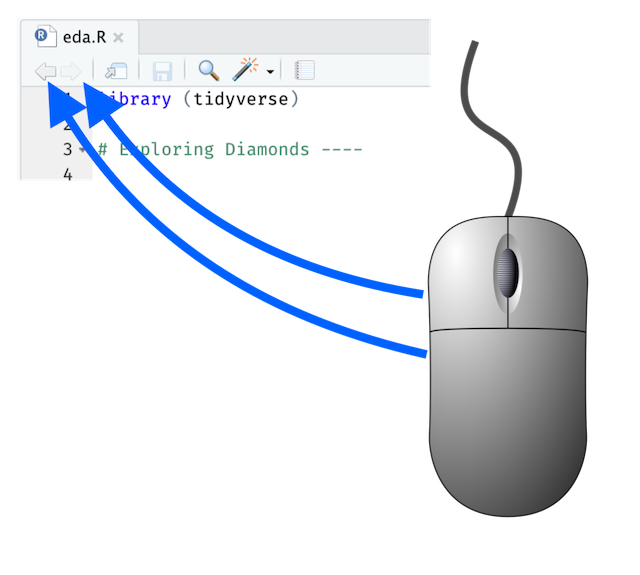
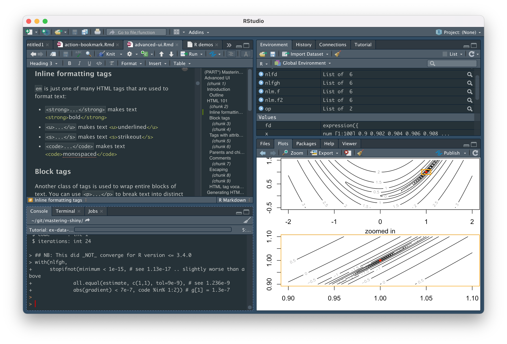

*This post is part of a series on new features in RStudio 1.4, currently available as a [preview release](https://www.rstudio.com/products/rstudio/download/preview/).*

Today, we continue a [long](https://www.rstudio.com/blog/2017-09-13-rstudio-v1-1-little-things/) [tradition](https://www.rstudio.com/blog/rstudio-1-3-the-little-things/) of concluding our preview blog series with a look at some of the smaller features we've added to the IDE. 

### Deeper Outlines for R Scripts

If you write R scripts longer than a couple of pages, you probably already use RStudio's document outline pane, which makes it easy to see an overview of your R script and navigate quickly to any section. To make it easier to navigate in longer and more nested scripts, we've added support for subsections in the outline.


Add subsections to your code by using Markdown-style comment headers, with the label followed by four or more dashes. For example:

```
# Section ----

## Subsection ----

### Sub-subsection ----
```

More information on code sections can be found on our help site: [Code Folding and Sections](https://support.rstudio.com/hc/en-us/articles/200484568-Code-Folding-and-Sections).

### History Navigation with the Mouse

If you have a mouse with side buttons, you can now use them to jump backwards and forwards through your source history (recent editing locations).



### Render Plots with AGG

AGG (Anti-Grain Geometry) is a high-performance, high-quality 2D drawing library. RStudio 1.4 integrates with a new AGG-powered graphics device provided by the [ragg R package](https://github.com/r-lib/ragg) to render plots and other graphical output from R. It's faster than the one built into R, and it does a better job of rendering fonts and anti-aliasing. Its output also is very consistent, no matter where you run your R code. 


To start using this new device, go to *Options -> General -> Graphics -> Backend* and select "AGG".

### Pane Focus and Navigation

If you primarily use the keyboard to navigate the IDE, we've introduced a couple of new tools that will make it easier to move around. Check *Options -> Accessibility -> Highlight Focused Panel* and RStudio will draw a subtle dotted border around the part of the IDE that has focus. For example, when your cursor is in the Console panel:



We've also added a new keyboard shortcut, <kbd>F6</kbd>, which moves focus to the next panel. Using these together makes it much easier to move through the IDE without the mouse!

### Natural Sorting in Files Pane

Do you find yourself giving your R scripts names like `step_001.R` so that they are sorted correctly in the Files pane? It's no longer necessary: RStudio 1.4 uses [natural sort order](https://en.wikipedia.org/wiki/Natural_sort_order) instead of alphabetical sort order for the Files pane, so that `step10.R` comes after `step9.R`, not after `step1.R`.


(See also [Jenny Bryan's advice on naming things](https://speakerdeck.com/jennybc/how-to-name-files).)

### Show Grouping Information in Notebooks

[Grouping data](https://dplyr.tidyverse.org/articles/grouping.html) is a very useful operation, but it isn't always obvious how data has been grouped. R Notebooks now show you information about grouping when displaying data:


### Custom Fonts on RStudio Server

RStudio Desktop can use any font you have installed on your system, but if you use RStudio Server you've always been stuck with the default. No longer! RStudio Server can now use popular coding fonts like [Fira Code](https://github.com/tonsky/FiraCode), [Source Code Pro](https://fonts.google.com/specimen/Source+Code+Pro), and [JetBrains Mono](https://www.jetbrains.com/lp/mono/).


These fonts can even be [installed on the server itself](https://docs.rstudio.com/ide/server-pro/1.4.912-1/r-sessions.html#fonts) so it isn't necessary to have them installed on the Web browser you use to access RStudio Server. 

You can try out all these features by installing the [RStudio 1.4 Preview Release](https://www.rstudio.com/products/rstudio/download/preview/). If you do, we welcome your feedback on the [community forum](https://community.rstudio.com/c/rstudio-ide). We look forward to getting a stable release of RStudio 1.4 in your hands soon!

