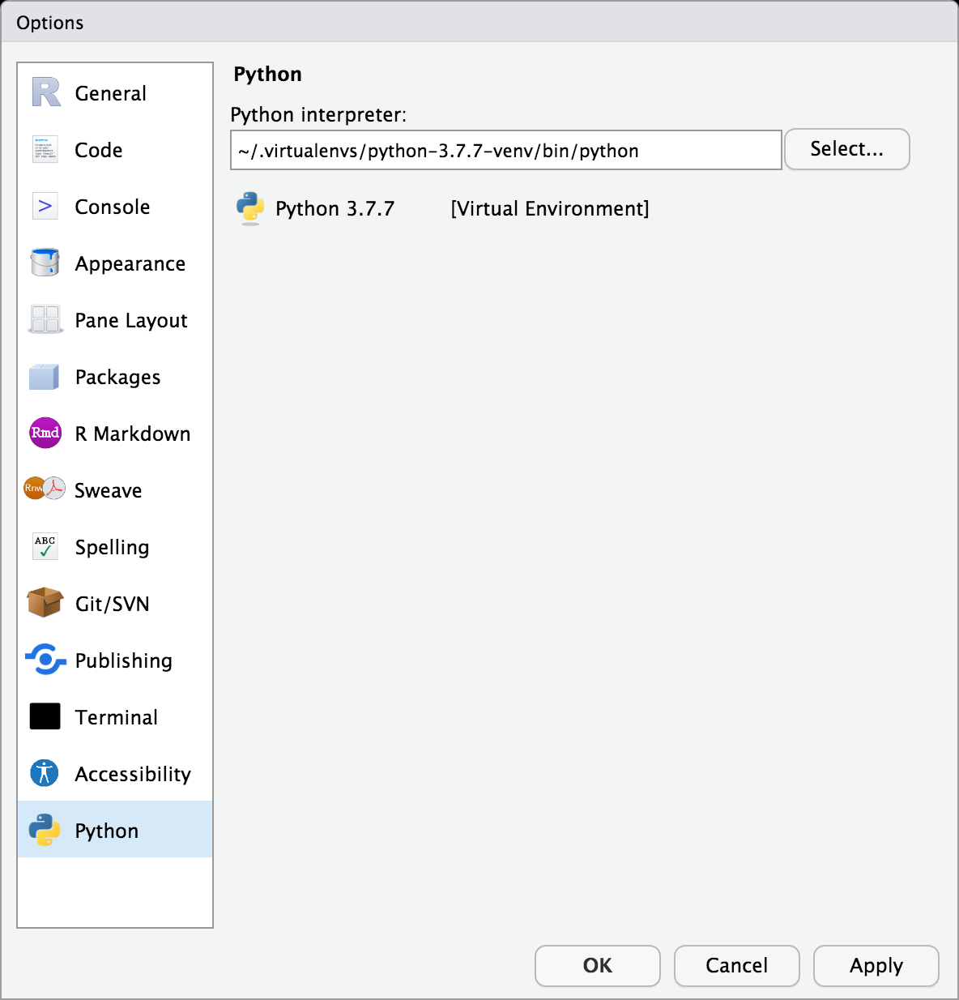
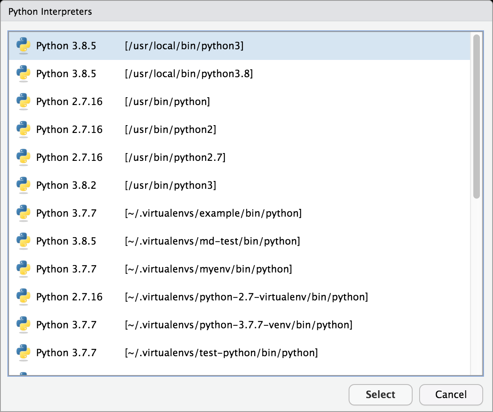
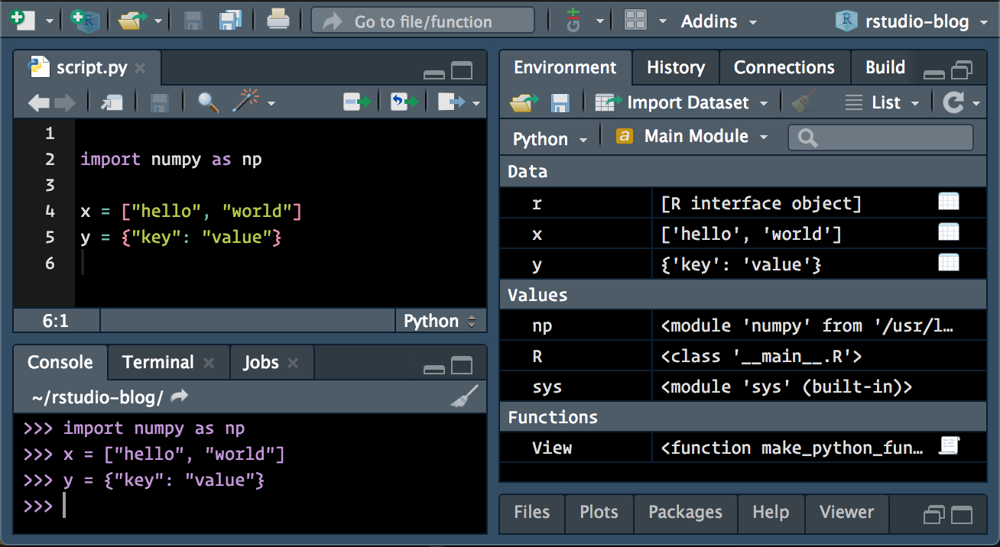
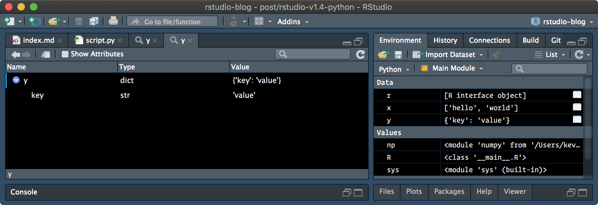
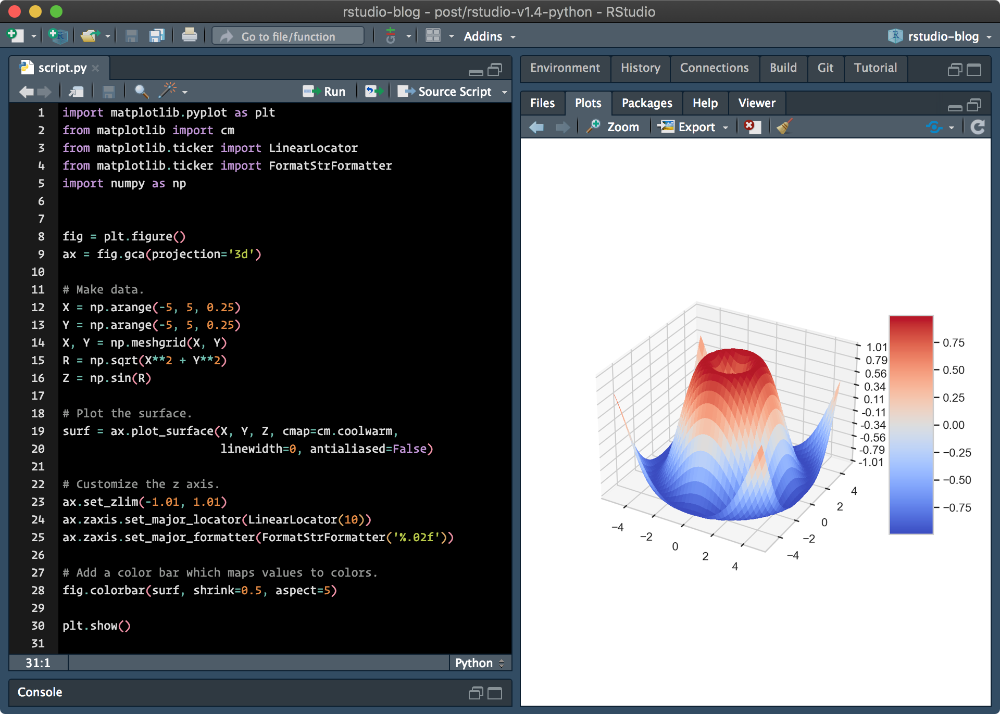

Last week, we introduced RStudio's new [visual markdown editor](https://blog.rstudio.com/2020/09/30/rstudio-v1-4-preview-visual-markdown-editing/). Today, we're excited to introduce some of the expanded support for Python in the next release of RStudio.

## Python Support

The RStudio 1.4 release introduces a number of features that will further improve the Python editing experience in RStudio:

-   The default Python interpreter to be used by RStudio / `reticulate` can now be customized in the Global Options pane,

-   The Environment pane now displays a summary of Python objects available in the main module when the `reticulate` REPL is active,

-   Python objects can now be viewed and explored within the RStudio data viewer and object explorer,

-   `matplotlib` plots are now displayed within the Plots pane when `show()` is called.

### Configuring the Default Python Interpreter

When working with `reticulate`, one normally selects a Python interpreter using `reticulate` functions -- for example, via `reticulate::use_python(…, required = TRUE)` or by setting the `RETICULATE_PYTHON` environment variable. (Or, alternatively, they trust `reticulate` to find and activate an appropriate version of Python as available on their system.)

However, one might want to control the version of Python without explicitly using `reticulate` to configure the active Python session. RStudio now provides a Python options pane, available both globally (via `Tools -> Global Options…`), or per-project (via `Tools -> Project Options…`), which can be used to configure the default version of Python to be used in RStudio.

Within the Python preferences pane, the default Python interpreter to be used by RStudio can be viewed and modified:

When the `Select…` button is pressed, RStudio will find and display the available Python interpreters and environments:

RStudio will display system interpreters, Python virtual environments (created by either the Python `virtualenv` or `venv` modules), and Anaconda environments (if Anaconda is installed). Once an environment has been selected, RStudio will instruct `reticulate` to use that environment by default for future Python sessions.

Note that the `RETICULATE_PYTHON` environment variable still takes precedence over the default interpreter set here. If you'd like to use RStudio to configure the default version of Python, but are setting `RETICULATE_PYTHON` within your `.Renviron` / `.Rprofile` startup files, you may need to unset it.

### Environment Pane Support

The RStudio environment pane is now capable of displaying the contents of Python modules when the `reticulate` REPL is active. By default, the contents of the main module are displayed.

Similar to how R environments are displayed within the Environment pane, one can also view the contents of other loaded Python modules.

In addition, [pandas](https://pandas.pydata.org/ "pandas - Python Data Analysis Library") `DataFrame` objects can be opened and viewed similarly to R `data.frame` objects, and other Python objects can be viewed in the object explorer.

### Exploring Python Objects

Python objects can be explored either by calling the `View()` function from the `reticulate` REPL, or by using the associated right-most buttons in the Environment pane.

### Displaying `matplotlib` Plots

[`matplotlib`](https://matplotlib.org/) is a popular Python module, used to create visualizations in Python. With RStudio 1.4, the IDE can now also display `matplotlib` plots within the Plots pane.

Data scientists using Python might also be familiar with the [`seaborn`](https://seaborn.pydata.org/) module, which provides a higher-level interface on top of `matplotlib` for producing high quality data visualizations. RStudio can also render plots generated by the `seaborn` package:

Currently, only static (non-interactive) plots are supported -- we hope to support interactive graphics in a future release of RStudio.

### Getting Started

You can try out the new Python features by installing the [RStudio 1.4 Preview Release](https://www.rstudio.com/products/rstudio/download/preview/). If you do, please let us know how we can make it better on the [community forum](https://community.rstudio.com/c/rstudio-ide)!
