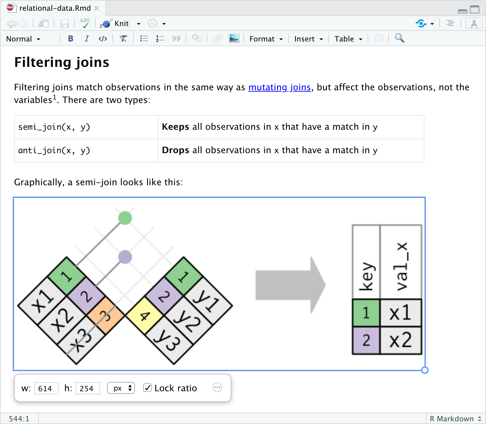
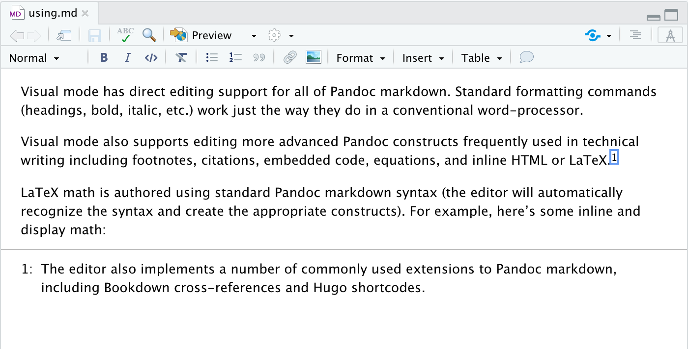
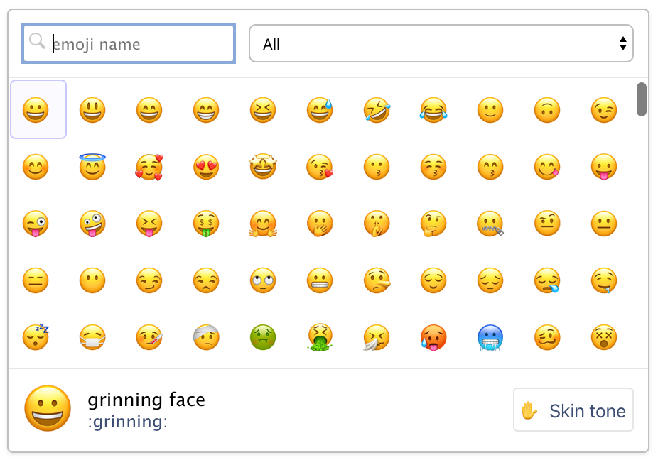
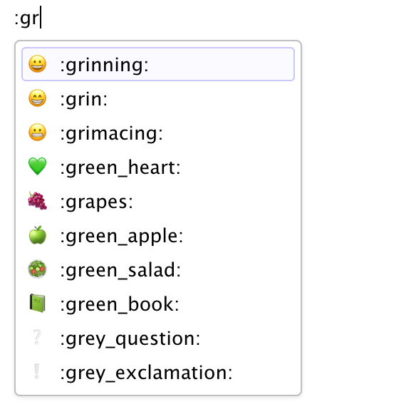

Today we're excited to announce availability of our first [Preview Release](https://www.rstudio.com/products/rstudio/download/preview/) for RStudio 1.4, a major new release which includes the following new features:

-   A [visual markdown editor](https://rstudio.github.io/visual-markdown-editing) that provides improved productivity for composing longer-form articles and analyses with R Markdown.
-   New [Python capabilities](https://github.com/rstudio/rstudio/pull/6862), including display of Python objects in the Environment pane, viewing of Python data frames, and tools for configuring Python versions and conda/virtual environments.
-   The ability to add [source columns](https://github.com/rstudio/rstudio/pull/7339) to the IDE workspace for side-by-side text editing.
-   A new [command palette](https://github.com/rstudio/rstudio/pull/6848) (accessible via <kbd>Ctrl+Shift+P</kbd>) that provides easy keyboard access to all RStudio commands, add-ins, and options.
-   Support for [rainbow parentheses](https://github.com/rstudio/rstudio/pull/7027) in the source editor (enabled via **Options -\> Code -\> Display).**
-   New RStudio Server Pro features including SAML authentication, local launcher load-balancing, and support for project sharing when using the launcher.
-   Dozens of other small improvements and bugfixes.

You can try out these new features now in the [RStudio v1.4 Preview Release](https://www.rstudio.com/products/rstudio/download/preview/).

Over the next few weeks we'll be blogging about each of these new features in turn.
Today we'll take a quick tour of the new visual markdown editor (see the full [Visual Markdown Editing](https://rstudio.github.io/visual-markdown-editing) documentation for more details).

## Visual Markdown Editing

R Markdown users frequently tell us that they'd like to see more of their content changes in real-time as they write, both to reduce the time required by the edit/preview cycle, and to improve their flow of composition by having a clearer view of what they've already written.

To switch into visual mode for a markdown document, use the <kbd></kbd> button with the compass icon at the top-right of the editor toolbar:

With visual mode, we've tried to create a [WYSIWYM](https://en.wikipedia.org/wiki/WYSIWYM) editor for people that love markdown.
The editor maintains a lightweight feel that emphasizes semantics over styling.
You can also still use most markdown constructs (e.g., `##` or `**bold**`) directly for formatting, and when switching between visual and source mode your editing location and undo/redo state are fully preserved:

You can also configure visual mode to write markdown using [one sentence per-line](https://rhodesmill.org/brandon/2012/one-sentence-per-line/), which makes working with markdown files on GitHub much easier (enabling line-based comments for sentences and making diffs more local to the actual text that has changed).
See the documentation on markdown [writing options](https://rstudio.github.io/visual-markdown-editing/#/markdown?id=writer-options) for additional details.

Anything you can express in pandoc markdown (including tables, footnotes, attributes, etc.) can be edited in visual mode.
Additionally, there are many productivity enhancements aimed at authoring technical content like embedded code, equations, citations, cross-references, and inline HTML/LaTeX.

## Embedded Code

R, Python, SQL and other code chunks can be edited using the standard RStudio source editor.
You can execute the currently selected code chunk using either the run button at the top right of the code chunk or using the <kbd>Cmd+Shift+Enter</kbd> keyboard shortcut:

Chunk output is displayed inline (you can switch to show the output in the console instead using the Options toolbar button, accessible via the gear icon), and all of the customary commands from source mode for executing multiple chunks, clearing chunk output, etc. are available.

## Tables

You can insert a table using the **Table** menu.
You can then use either the main menu or a context menu to insert and delete table rows and columns:

Note that if you select multiple rows or columns the Insert or Delete command will behave accordingly.
For example, to insert two rows first select two rows then use the Insert command.

Try editing a table in visual mode then see what it looks like in source mode: all of the table columns will be perfectly aligned (with cell text wrapped as required).

## Citations

Visual mode uses the standard Pandoc markdown representation for citations (e.g. `[@citation]`).
Citations can be inserted from a variety of sources:

1.  Your document bibliography.
2.  [Zotero](#citations-from-zotero) personal or group libraries.
3.  [DOI](#citations-from-dois) (Document Object Identifier) references.
4.  Searches of [Crossref](https://www.crossref.org/), [DataCite](https://datacite.org/), or [PubMed](https://pubmed.ncbi.nlm.nih.gov/).

Use the <kbd></kbd> toolbar button or the <kbd>Cmd+Shift+F8</kbd> keyboard shortcut to show the **Insert Citation** dialog:

If you insert citations from Zotero, DOI look-up, or a search, they are automatically added to your document bibliography.

You can also insert citations directly using markdown syntax (e.g. `[@cite]`).
When you do this a completion interface is provided for searching available citations:

## Equations

LaTeX equations are authored using standard Pandoc markdown syntax (the editor will automatically recognize the syntax and treat the equation as math).
When you aren't directly editing an equation it will appear as rendered math:

As shown above, when you select an equation with the keyboard or mouse you can edit the equation's LaTeX.
A preview of the equation will be shown below it as you type.

## Images

You can insert images using either the **Insert -\> Image** command (<kbd>Ctrl+Shift+I</kbd> keyboard shortcut) or by dragging and dropping images from the local filesystem.
If an image isn't already in your markdown document's directory, it will be copied to an `images/` folder in your project.

Select an image to re-size it in place (automatically preserving their aspect ratio if you wish):

## Cross References

The [bookdown](https://bookdown.org) package includes markdown extensions for cross-references and part headers.
The [blogdown](https://bookdown.org/yihui/blogdown/) package also supports bookdown style cross-references, as does the [distill](https://rstudio.github.io/distill/) package.

Bookdown cross-references enable you to easily link to figures, equations, and even arbitrary labels within a document.
In raw markdown, you would for example write a cross-reference to a figure like this: `\@ref(fig:label)`, where the `label` is the name of the code chunk used to make the figure.
For figure cross-referencing to work, you'll also need to add a figure caption to the same code chunk using the knitr chunk option `fig.cap`, such as `fig.cap="A good plot"`.

Cross-references are largely the same in visual mode, but you don't need the leading `\` (which in raw markdown is used to escape the `@` character).
For example:

As shown above, when entering a cross-reference you can search across all cross-references in your project to easily find the right reference ID.

Similar to hyperlinks, you can also navigate to the location of a cross-reference by clicking the popup link that appears when it's selected:

You can also navigate directly to any cross-reference using IDE global search:

See the bookdown documentation for more information on [cross-references](https://bookdown.org/yihui/bookdown/cross-references.html).

## Footnotes

You can include footnotes using the **Insert -\> Footnote** command (or the <kbd>Cmd+Shift+F7</kbd> keyboard shortcut).
Footnote editing occurs in a pane immediately below the main document:

## Emojis

To insert an emoji, you can use either the **Insert** menu or use the requisite markdown shortcut plus auto-complete:

<table><thead><tr class="header"><th>
<strong>Insert -&gt; Special Characters -&gt; Emoji...</strong>
</th><th>
Markdown Shortcut

</th></tr></thead><tbody><tr class="odd"><td>

</td><td>

</td></tr></tbody></table>

For markdown formats that support text representations of emojis (e.g. `:grinning:`), the text version will be written.
For other formats the literal emoji character will be written.
Currently, GitHub Flavored Markdown and Hugo (with `enableEmjoi = true` in the site config) both support text representation of emojis.

## LaTeX and HTML

You can include raw LaTeX commands or HTML tags when authoring in visual mode.
The raw markup will be automatically recognized and syntax highlighted.
For example:

The above examples utilize *inline* LaTeX and HTML.
You can also include blocks of raw content using the commands on the **Format -\> Raw** menu.
For example, here is a document with a raw LaTeX block:

## Learning More

See the [Visual Markdown Editing](https://rstudio.github.io/visual-markdown-editing) documentation to learn more about using visual mode.

You can try out the visual editor by installing the [RStudio 1.4 Preview Release](https://www.rstudio.com/products/rstudio/download/preview/).
If you do, please let us know how we can make it better on the [community forum](https://community.rstudio.com/c/rstudio-ide)!

