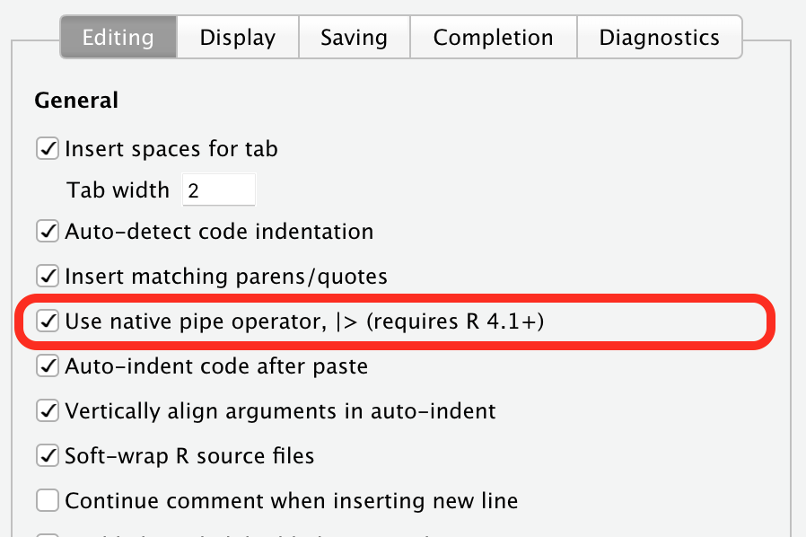
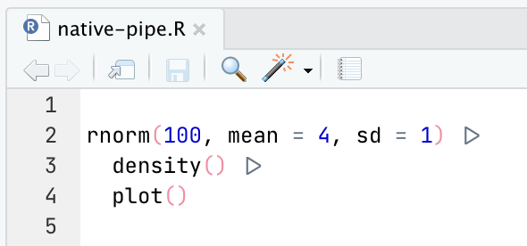
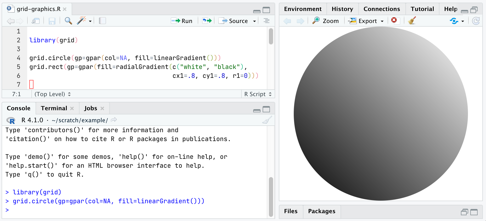
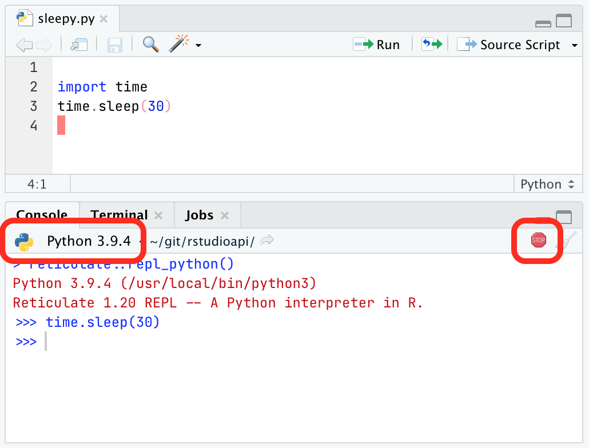
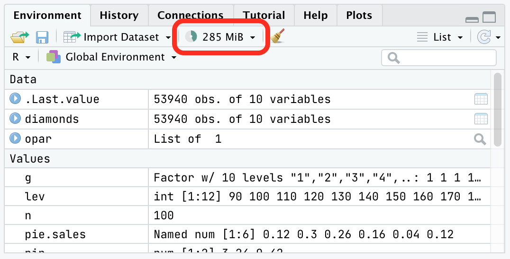
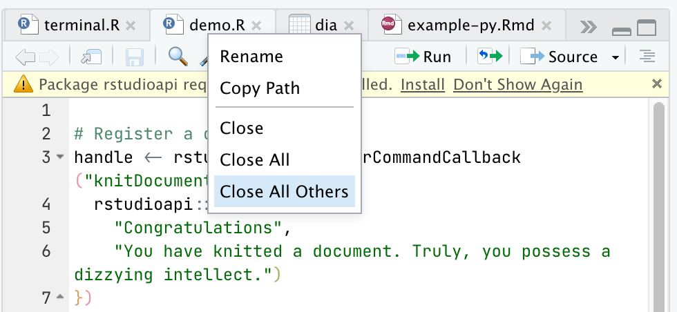
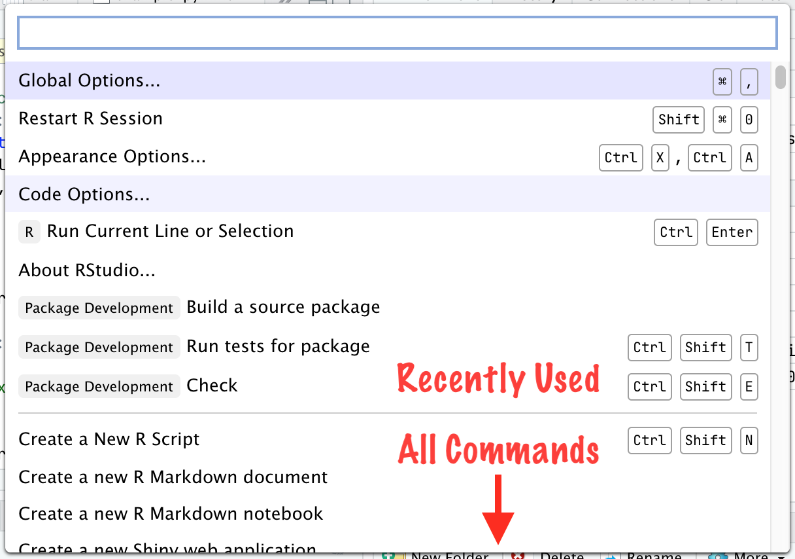

Photo by <a href="https://unsplash.com/@arizz?utm_source=unsplash&utm_medium=referral&utm_content=creditCopyText">jurissa yanoria</a> on <a href="https://unsplash.com/s/photos/flower-bloom?utm_source=unsplash&utm_medium=referral&utm_content=creditCopyText">Unsplash</a>
  
We've just covered the recent [name change from RStudio Server Pro to RStudio Workbench](https://www.rstudio.com/blog/announcing-rstudio-workbench/) we made in the last RStudio update, and the [improvements we've made to VS Code sessions](https://www.rstudio.com/blog/rstudio-workbench-vscode-sessions/). However, this update (codenamed "Juliet Rose") comes with a lot of other small features, too, available to open source users as well as those who use RStudio's professional suite of products. Today we're taking a look at some of these smaller features.

### R 4.1 Support

First, we've **added support for R 4.1**. This update to the core R language adds more features than usual, and previous versions of RStudio are not compatible with these changes, so this RStudio update is **required** if you plan to work with the new version of R. 

#### New Native Pipe Operator, |>

R 4.1 adds a [native pipe operator](https://developer.r-project.org/blosxom.cgi/R-devel/NEWS/2020/12/04), `|>`. Many R users will be be familiar with pipe operators already; they were popularized in R by the [magrittr package](https://cran.r-project.org/web/packages/magrittr/vignettes/magrittr.html)'s `%>%` pipe and have become a [fixture in the tidyverse](https://style.tidyverse.org/pipes.html). 

RStudio now supports this new native pipe operator. If you're working primarily in code that uses the new `|>` operator, you'll want to change RStudio's *Insert Pipe* command (Cmd/Ctrl + Shift + M) so that it inserts native pipes instead of matrittr-style pipes. To do this, go to *Options -> Code -> Editing* and check *Use native pipe operator*. 

Also, if you're using a ligature font like [FiraCode](https://github.com/tonsky/FiraCode) or [JetBrains Mono](https://www.jetbrains.com/lp/mono/) with RStudio, you'll see a nice triangle glyph representing the new operator.

#### New Anonymous Function Syntax, \(x)

R 4.1 also adds new syntax for anonymous functions; you can write `\(x) .. ` instead of the more cumbersome `function (x) ...`). RStudio now supports this syntax.

Read more about [the new pipe operator and anonymous functions in R 4.1](https://www.jumpingrivers.com/blog/new-features-r410-pipe-anonymous-functions/). 

#### New Graphics Engine

Finally, R 4.1 adds a [new graphics engine](https://developer.r-project.org/Blog/public/2020/07/15/new-features-in-the-r-graphics-engine/). This graphics engine isn't compatible with previous releases of RStudio (crashes will ensue when using ggplot2 or other grid-based graphics), which is the primary reason you need this RStudio update to work with R 4.1. Here's RStudio demonstrating support for linear gradient fills, one of the new graphics engine features:

Note that if you want to use the new graphics device features, you'll need to use the Cairo graphics backend on most platforms; you can enable it in *Options -> General -> Graphics*. 

### Python Improvements

We're continuing to improve support for Python in RStudio. There are a bunch of improvements in this update, but chief among them is that we now show you the version of Python you're working with, right in the Console tab. Python environment configuration is [notoriously tricky](https://xkcd.com/1987/), and this makes it just a *little* easier to see what you're working with.

We've also made it possible to interrupt Python when it's running (in other words, the Stop button works now), improved detection of Python environments on the system, made sure that Python versions match up when you're knitting and publishing, put Python on `$PATH` on the Terminal, and lots more.

Note that to take full advantage of all of the Python improvements, you'll need the [latest version of the reticulate package](https://cran.r-project.org/web/packages/reticulate/index.html) (1.20 or higher).

### Apple Silicon Support

RStudio for macOS now works with the [native arm64 builds of R](https://cran.r-project.org/bin/macosx/), meaning you'll now experience the full benefits of the M1's [considerable processing power](https://www.cpubenchmark.net/cpu.php?cpu=Apple+M1+8+Core+3200+MHz&id=4104) when running your R code inside RStudio. 

Note that, while the components of RStudio that interface with R are now fully native, the front end is still compiled only for Intel and runs under Rosetta2 due to upstream dependencies that don't yet have binaries available for the new architecture. We will produce a fully native version of RStudio for Apple Silicon in an upcoming release.

### Visualizing Memory Usage

RStudio's Environment pane now includes a small widget that shows both how much memory your R session is using and how much free memory is available on your system. 

Clicking on this widget will generate a memory usage report that gives you more information about available memory. It's a helpful tool for understanding how much memory your data is taking up, and letting you know that you're approaching the limit if you're using RStudio in a memory-constrained environment. Read more about [understanding memory usage in RStudio](https://support.rstudio.com/hc/en-us/articles/1500005616261-Understanding-Memory-Usage-in-RStudio).

### Document Context Menu

Document tabs in RStudio now have a context menu, which makes it more convenient to take actions on the file/tab directly instead of going through the top-level menus. Right-click on the file's name in the tab to invoke the context menu. 

### Command Palette Upgrade

The [Command Palette](https://blog.rstudio.com/2020/10/14/rstudio-v1-4-preview-command-palette/) was one of the most popular features we introduced in RStudio 1.4. With this update, we've upgraded it with a new Most Recently Used (MRU) section at the top. 

This puts your most recently used commands within easier reach. They also match first in searches, so just a letter or two is often enough to recall one. And --  for the extremely <strike>lazy</strike> efficient -- you can just hit Enter in the Palette to re-run the most recent command.

You can clear this list using the *Clear Recently Executed Command List* command, or turn off the feature if you'd like the Palette to be pristine every time you use it by disabling the *Remember Recently Used Items in Command Palette* setting. This setting is only accessible via the Command Palette itself.

There's lots more in this release, and it's [available for download today](https://www.rstudio.com/products/rstudio/download/). You can read about all the features and bugfixes in the "Juliet Rose" update in the [RStudio Release Notes](https://www.rstudio.com/products/rstudio/release-notes/), and we'd love to hear your feedback about the new release on our [community forum](https://community.rstudio.com/c/rstudio-ide/9).

