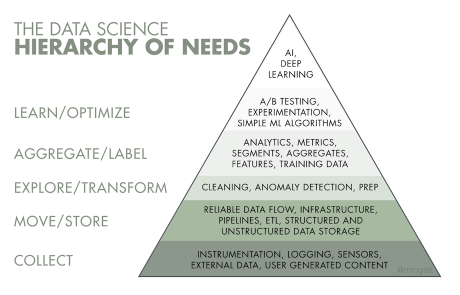

For the first piece in our new RStudio Voices series, we decided to interview one of our open source package developers as their work defines our organization’s focus on making data science tools available to everyone. We spoke with Julia Silge, who is a maintainer of the [tidytext](https://github.com/juliasilge/tidytext) package, which uses tidy data principles to make text mining tasks easier and more effective for R developers.

Beyond simply a legal entity, any corporation is a collective. It is the sum of its individual employees’ work and principles weighted by their roles in the company. My name is Michael Demsko Jr. For the past three years, I have worked at RStudio, and my goal is to show you, the reader, developer, contributor, or customer what RStudio is by showing you who RStudio is– to allow each agent of our mission to introduce themselves to you, one at a time, in their own voices.  

I plan to ask three questions of everyone I interview for this series:

- **Who is your inspiration or role model**
- **What brings you the most joy at work?**
- **Why do you work at RStudio?** 

Julia lives in Salt Lake City, UT with her husband, three kids, and two cats. She was kind enough to lend some time to talk about her journey from academia to data science, her thoughts on machine learning’s place in the data science life cycle, her experience with the open source data science community, and the ethical questions open source developers face in making their work available to the world. As of the writing of this article, tidytext has been downloaded via CRAN 1,538,977 times– a number I found using [Guangchuang Yu’s dlstats package](https://github.com/GuangchuangYu/dlstats). 

**Michael:** Time and time again, I’ve seen this migration from working in academia to working in data science, and if I'm not mistaken, this was the case for you as well. What did that transition look like for you?

**Julia:** My academic background is in physics and astronomy. That's what I did for my PhD, that's what I did for my post-doc research, and that's what I taught when I worked in academia. I didn't go straight from my academic life into data science.

I worked at an ed tech startup doing content development for physics and astronomy courses, and then I actually spent a few years out of the workforce altogether doing the stay-at-home mom thing. Then, I worked as a contractor doing various writing and coding work. It was during that time that I made the transition into data science.

I think there's a lot of people now who are going straight from a post-doc or grad school to data science. My own path was a little more circuitous, I think, because of the particular age I was when data science roles were becoming more plentiful. When I was in grad school, people who were leaving for industry were going straight into finance, straight into quant roles or software engineering roles. 

During my research years I was an observational astronomer, so I dealt with real world, messy data. I wrote code to analyze the data. I wrote code to make plots. I made presentations about this real-world data that was generated by “some process” and then had to try to communicate to people:  “what is this data telling us? What can we learn from it?” When I started to see more data science roles becoming available, I thought, “wait, what? Is that a job? What is it that they’re doing in that job? Hey, that's exactly what I do!” Those were my favorite parts of the research process. That's what I found interesting and fun. 

**Michael:** Did you begin working with R as a means to perform that physics and astronomy research?

**Julia:** No, when I was in physics and astronomy there were people who wrote their own code, and there were people who used what you might consider “closed source,” expensively licensed tools.

In the stats world, it would be similar to open source Python and R versus something like SPSS. There were analogs in the physics and astronomy world. Back when I was in it, people who wrote their own code wrote C and Fortran. That's actually my computational background, just vanilla C. Not even C ++. In that circuitous path that I talked about, I learned a lot of random things like content development and various front end approaches for things like interactive homework or college courses and whatnot.

When I started to see these data science roles, I was certain that it was a good fit, but I didn’t know Python, I didn’t know R. I actually didn't even know R existed.  As a C programmer, I had never heard of R. I knew about front-end technologies, I knew about Python, and I started out learning Python and I thought, “okay, this is fine,” but I think because of the programming background I have, which is based on numerical recipes– how a physicist writes C and all that entails– I began thinking “I don't know about this Python thing...” 

Then there was basically a six month period where I took every data science MOOC [massive open online course] that exists, and that was how I got exposed to R. Actually, it was through the [Johns Hopkins/Coursera MOOCs](https://www.coursera.org/specializations/jhu-data-science?utm_source=gg&utm_medium=sem&utm_campaign=03-DataScience-JHU-US&utm_content=03-DataScience-JHU-US&campaignid=313639147&adgroupid=121203872804&device=c&keyword=&matchtype=b&network=g&devicemodel=&adpostion=&creativeid=507187136066&hide_mobile_promo&gclid=Cj0KCQjw6s2IBhCnARIsAP8RfAi73-YuP1myujGsUESycPud953mS3Y1r-KeiEb_ZmffghZofvaQYbgaAha6EALw_wcB).

At that point, [the Tidyverse](https://rviews.rstudio.com/2017/06/08/what-is-the-tidyverse/) was pretty mature. [Purrr](https://purrr.tidyverse.org/) existed, and so I was presented with these, very functional programming approaches to data analysis. I thought, “I love this. This is way better than the way you get introduced to doing data analysis in Python.”

**Michael:** You mentioned the Tidyverse. Was it the way that activities were segmented, the way that the development life cycle works out in that paradigm that clicked with you?

**Julia:** This is a little bit overly simplified, but being presented with a functional programming approach to data analysis, as opposed to an object-oriented programming approach, really clicked with me. I found it a good fit for how I think about what data is, how it works, and how I want to move from, “okay, I need to do something simple” to, “ah, now I need to do something really involved.”

**Michael:** In my head I'm compiling a list of  attributes. So far we've got experience in a low-level programming language like C and an inclination toward a specific approach to data analysis. When you were performing observational astronomy work, it sounds like a lot of that data was unstructured or simply messy. Do you think that it was that confluence of ideas that led you to machine learning and specifically text analysis?

**Julia:** When I came up through physics and astronomy, I would say it was very rare for people to use modern machine learning methods on astronomical data. People were using traditional statistical methods. I was very familiar with some of these ideas as they related to observational data. You can't do a randomized controlled trial with observational data. You have to think about random, natural experiments. You have to think about  how we use observational data. You have to think about the biases inherent in the data we're observing because that comes with the territory when you're talking about astronomy. It’s core to what you're doing.

I think that was very formative in how I think about methods for analyzing data. I didn't have a lot of exposure to modern machine learning methods until I I thought, “okay, I want to think about data science as a career.” I am interested– very interested– in different quantitative approaches or machine learning methods, but I'm interested in them as a means to an end. I'm interested in how people use them in the real world. I mean, I love math, but what I’m most interested in is people's real world problems and how they use these tools to solve them.

**Michael:** I've read your blog, and that's apparent. From what I can tell, it seems like there's no desire to do math for the sake of doing math. It's not just for sport– it's for a purpose. Do you think that you were attracted to machine learning specifically because that area gives you the most opportunity to solve the most problems?

**Julia:** I don't actually know that it does offer the most answers to the most people’s questions. Monica Rogati, an important data science leader and writer, has what she calls [“The AI Hierarchy of Needs.”](https://hackernoon.com/the-ai-hierarchy-of-needs-18f111fcc007) At the bottom, you have logging and collecting data and then you move up to things like analytics in the middle. Topics like machine learning are way at the top of this pyramid. You get a lot of value from analytics, from simply counting things. You get a lot of value from the first models you train– simple models, linear models. You have to be pretty mature, pretty high up on your hierarchy of needs to get value from a fancy machine learning model that's learning non-linear relationships or taking advantage of complicated math. So I wouldn't say I'm motivated to work on machine learning because it's the thing that offers the most value, or because it's the thing that solves the most problems. I think what solves the most problems is making data accessible to people in their workplaces, and that they have the tools to be able to do basic analytics or train that first model. You get the biggest wins at those lower levels.



*Monica Rogati's "AI Hierarchy of Needs" via Hackernoon*


I think machine learning tooling is interesting because it’s complex and people enter into it with different levels of experience. Being able to build tools to make that process more streamlined is an interesting challenge.
   
<h2> *"What solves the most problems is making data accessible to people in their workplaces, and that they have the tools to be able to do basic analytics or train that first model. You get the biggest wins at those lower levels."* </h2>
--- Julia Silge
   

**Michael:** As far as personal challenges and real-world applications go, I want to briefly talk about the analysis you did on the collected Jane Austen works. In my own experience, and in speaking with other professionals that have made a similar career change, data science is like Florida. Nobody's from Florida. Everybody moves there from somewhere else, and there’s usually an interesting story for how they got there. Was that project a way of motivating your learning for making that move?

**Julia:** As I started making that transition [from academia to data science], I was  thinking, “I need to learn the right skills to be marketable and I need to demonstrate that I have these skills.” I had a lot of confidence that I was going to be able to do the job, but I needed to show people that I was going to be able to do the job. So part of my plan was to publish projects that people could interact with.

I kind of had a weird resume at that point. I had been out of school awhile, I had done other random things, I had a gap in my working life, and I had all these ideas for projects. My vision for those projects was that they would be hard for people to forget after a conversation or an interview. If you look back, a lot of those early posts on my blog are working with data specific to where I live– Utah– because I pictured myself interviewing for jobs in my city. 

I was just looking around for data to analyze. I knew I didn't want to use any super clean data sets that are available–  that you see a million times in people's posts, projects, or demos– because it gets pretty boring, you know? I knew I didn't want to do that. I saw that you can get the full text of books that are in the public domain from [Project Gutenberg](https://www.gutenberg.org/) if you follow their rules. I've always been a big reader.

“Let's see what they have here. Do they have my favorite book?” They did– Pride and Prejudice is in the public domain.“Oh look, all of Jane Austen's works are in the public domain.” It really  started out motivated by the desire to demonstrate my abilities to people who may want to hire me. Those first couple analyses were written with existing tools for text analysis at the time. 

Some of it was kind of annoying. I wished that some of it were a little easier and that I could use some other approaches that I really liked. I was really fortunate to go to the [ROpenSci](https://ropensci.org/) Unconference in 2016 and there I met [Dave Robinson](https://www.rstudio.com/authors/david-robinson/) for the first time. Dave asked, “would you want to write a package to do text analysis, but with tidyverse principles?” 

“I would love to do that. I would love to do that.”

During the Unconference hackathon we got the skeleton of it done, and tidytext was on CRAN within a couple months after that. Honestly, it was life-changing. I ended up getting jobs, I ended up publishing a book–  it hugely changed the course of my career and my life.

**Michael:** That's really special.

**Julia:** It is really special. The Tidyverse itself was at a point in its maturity where it could be built on. People were feeling the frustration of dealing with text data and it was easier to turn to other programming languages or other environments to deal with text data at that time. No one had yet come in to say, “why don't we just make it better?”

All the code I had ever written to that point was for myself, and I think, without knowing it, I had used open source software back in my physics and astronomy days, but I didn't realize what the open source community was like, and I certainly didn't see myself as someone who could contribute. What happened with tidytext was a real combination of circumstances. Right place, right time.

Those circumstances included the support of a community. Specific people and the community overall. People tell you, “you should start here, you should do this, and this,” and, eventually, you get to a point where you can say, “oh, I understand. I understand what maintaining an open source package is now,” which is quite the path.

**Michael:** Can you describe what it’s like to be a part of that community for some time now – specifically as a maintainer of a widely-adopted package?

**Julia:** Thinking back to that transitional time again, I did think “alright, I'm going back in there, time to grow my thick skin again. Time to get tough again. Time to get ready for all the crap.” Yet my experience was so the opposite. Entering into data science, entering into the open source community, of course there are problems, but it was so different from my experience in the academic world. People are happy to have you contribute, people are excited to hear your ideas. I was floored. I was shocked. I had no idea it could be like this. I was entirely unprepared–  in a good way.

**Michael:** So many folks– yourself included– are beneficiaries of what the open source community provides. In a unique way, you were able to provide back almost from the get-go. I'm curious, because I've never had the opportunity to ask one of our package developers before, do you keep any running list of projects that have used your packages in mind? Positively or negatively speaking.

**Julia:** I don't think I keep a running list, but as you ask the question, one really positive project comes to mind. There's a data journalist at Buzzfeed named [Peter Aldhous](https://www.buzzfeednews.com/author/peteraldhous), who has used tidytext in a couple of different analyses. One was about [State of the Union addresses](https://www.buzzfeednews.com/article/peteraldhous/trump-state-of-the-union-words). He showed that the reading [comprehension] level for the address has been dropping over time, and that the sentiment has remained fairly stable.

On the negative side, I think what has bothered me the most have been the cases where people  used data that raise ethical issues. Things can become fraught when it comes to text data. Especially if you are a technically savvy person, you can decide to go out and get text data that it feels yucky for one to have access to. A lot of these cases are not illegal, but you have to think, “is it a good choice for you to be dealing with that information?”

**Michael:** The open source world is, in many ways, a double-edged sword and I think machine learning libraries are at the tip of that sword right now. That removal of any barrier to entry, it allows for opportunity for folks like you and I, for the entire community, but that’s just it– it grants use for whatever purposes. Do you feel as though there should be some sense of accountability for how those libraries are used?

**Julia:** This is something that we, as a community, need to think through. Where are we going to land on this? FOSS, free and open-source software, arose in the eighties– or sometime around then– with the idea that you should be able to open it up and do what you want with it. The licensing that this was built on, has it ever been challenged? Not really. At least it has never been tested so well that we know what the rules really are. As people generally understand it, someone can do anything with a package, and I– as the developer– cannot tell them otherwise if I am morally opposed to what they do. They are free to use it. In fact, most of the licenses that we put on our software make it so people can use it to make money. People can use it to do good and bad things, which I think is very challenging.

The framework that we have right now doesn't give developers any say. With professional software, you have a little more say, because you can decide to whom you will or won't sell your software. That was the point of it originally– you can do what you want with it. That was the goal, but you start to think, “do I then have to accept all of that?”

More recently, there's been discussion around that. People have found out that their software was being used by particularly morally reprehensible groups, and they ask “do I have any options?” Do I have any freedom in licensing?” For example, there's a new-ish license called the [Hippocratic license](https://firstdonoharm.dev/). It basically lays out the accepted uses– different purposes, including commercial purposes– for which you can use a package in your business. It also has a list of things that the package cannot be used for such as human rights violations. This is a new license, and the old licenses still haven't really been legally tested, so this one, of course, hasn't been legally tested at all. Regardless, some people have started to use it, and I think it's a statement of value.

**Michael:** I’d like to ask three questions that we'll ask everyone that's a part of this series. The first of those is **who would you consider to be your inspiration or role model?**

**Julia:** I have a hard time with questions about inspiration and role models. Partly because I have a core belief that like we're all a little amazing and a little messed up, but, if I were to list some people, I would list the writer Madeleine L'Engle, the writer and activist Dorothy Day, and one of my kids who has special needs. It's incredible how hard she works in so many areas of her life.

**Michael:** The next question: **what brings you the most joy at work?**

**Julia:** When I think about joy at work, I think about two different modes of joy. One is a little bit of a high– when something that I've built or released gets a response. It helps someone and they tell me, “I used this to do ‘x’… I couldn't do ‘x’ before and now I can!”

The other mode of joy that I often get at work is a little bit more meditative, a little bit more “in the zone.” When something's not working well in code that I'm writing and I'm able to get it working better, more organized, or aligned with what we're trying to accomplish.

**Michael:** Lastly, **why do you work at RStudio?**

**Julia:** I work at RStudio because it gives me this incredible opportunity to have a real impact on the lives of a lot of people who work with data, and to work on interesting problems with amazing coworkers.


If you would like to see more of Julia’s work:

- [Julia's Blog](https://juliasilge.com/)
- [Julia's Twitter](https://twitter.com/juliasilge)
- [Julia's YouTube Channel](https://www.youtube.com/juliasilge)


```{r setup, include=FALSE}
knitr::opts_chunk$set(echo = FALSE)
```
