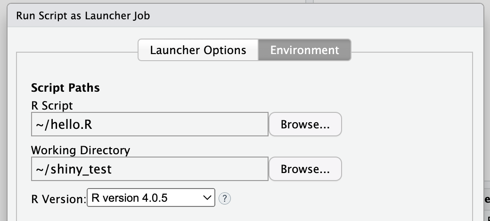
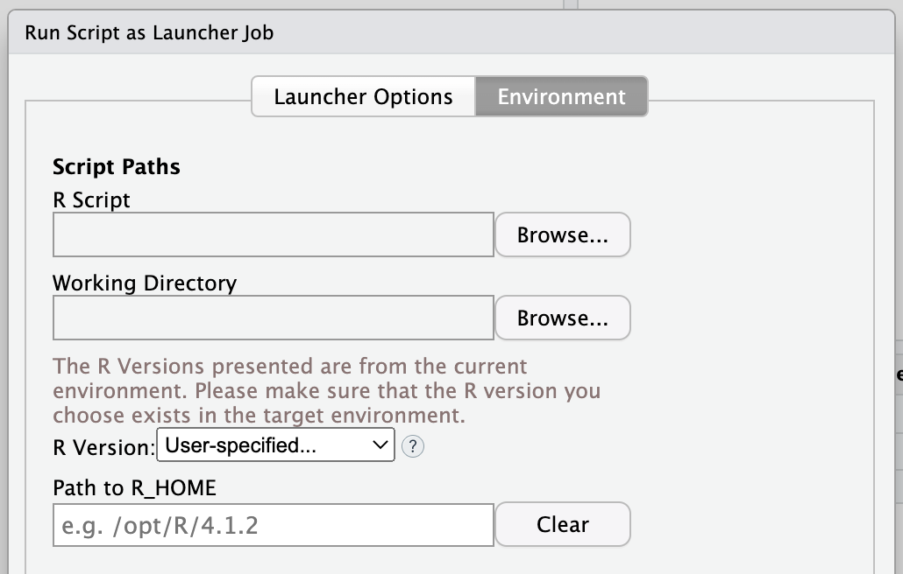
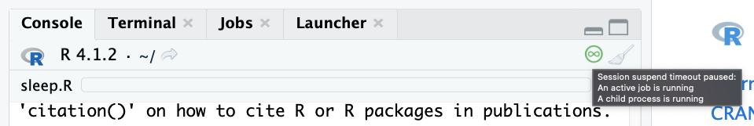

RStudio Workbench's 2022.02 release, code-named Prairie Trillium, includes many new and exciting features and updates. Today we'll highlight a few noteworthy features:

-   [Specifying R Versions in the Ad Hoc Job Launcher](#specifying-r-versions-in-the-ad-hoc-launcher)

-   [Session Suspension](#session-suspension)

-   [SSL Communication Between RStudio Workbench and Launcher Sessions](#ssl-communication-between-rstudio-workbench-and-launcher-sessions)

-   [New Job Launcher Release](#new-job-launcher-release).

To read about all of the new features and updates available in this release, check out the latest <a href="https://www.rstudio.com/products/rstudio/release-notes/" target="_blank">Release Notes</a>. For more detailed explanations, visit the <a href="https://docs.rstudio.com/ide/server-pro" target="_blank">RStudio Workbench Admin Guide</a>.

# Specifying R Versions in the Ad Hoc Launcher

You are now able to select the R version your script will run with when running a script as a launcher job. From the Environment tab, simply select the version from the new R version drop-down menu, as shown below. The default option is "(Use System Default)", which is the version that was used prior to this new option. 

If you've configured the script to run in a different cluster or with a different image from your active RStudio session, a "User-specified..." option will be available in the menu. Selecting this option displays a free-form text field where you can type the `R_HOME` path of the R version you'd like the script to run with.

# Session Suspension

RStudio sessions now provide more insight into session states that will prevent a session from auto-suspending. This is particularly useful for RStudio Cloud users, or other RStudio Server or RStudio Workbench environments where users are charged for the amount of time a session is active.

To indicate that RStudio is doing something that will prevent auto-suspension, a new icon () appears in the console toolbar. A mouse-over the icon will list everything that is currently blocking auto-suspension:

By default, the icon will appear 5 seconds after a suspension-blocking task begins. This behavior can be configured or disabled in the Global Options Console pane.

## Session Welcome Message

When returning to a session that is either active or was suspended, you are now greeted with a welcome message in the R console.

For example, when returning to a session that was suspended, you will see a message like the following:

    Session restored from your saved work on 2022-Feb-19 11:26:00 UTC (2 days ago)

And when returning to a session that has been active, you will see a message like this:

    Connected to your session in progress, last started 2022-Feb-11 15:36:00 UTC (4 hours ago)

## Session Suspend Logs

Server logs can be generated each time a session is blocked from suspending. These can be useful in determining why a session did not suspend. To view them, ask your System Administrator to enable Information-level logging and look for the `SessionTimeoutSuspendBlocked` message.

# SSL Communication Between RStudio Workbench and Launcher Sessions

This release adds secure socket communication between RStudio Workbench and sessions running in Kubernetes or Slurm clusters. This applies to all session types: RStudio, VS Code, and Jupyter. It's enabled by default using automatically provisioned certificates, created per job. Read more in the <a href="https://docs.rstudio.com/ide/server-pro/latest/access_and_security/secure_sockets.html#secure-session-communication" target="_blank">RStudio Workbench Admin Guide</a>.

# New Job Launcher Release

RStudio Workbench 2022.02 comes bundled with our latest release of the Job Launcher. The new release adds an exciting new feature - Kubernetes Templating. You have complete control over how the Launcher submits jobs and services to Kubernetes, by editing them using a format similar to <a href="https://helm.sh/" target="_blank">Helm Charts</a>. This Helm-style format provides conditional logic to allow you to change fields on the job like annotations, labels, as well as providing you the ability to run user-defined functions for complete integration with outside business logic.

This new feature can be enabled by setting `use-templating=1` in `launcher.kubernetes.conf`. This feature completely supersedes the job-json-overrides feature, which is now deprecated. See the <a href="https://docs.rstudio.com/job-launcher/kube.html" target="_blank">Kubernetes plugin documentation</a> for more details.

Thank you for taking the time to read about a few of the features we're most excited about in the 2022.02 RStudio Workbench release! For detailed instructions on upgrading from a prior release or RStudio Open Source, visit <a href="https://docs.rstudio.com/rsw/upgrade/" target="blank_">Upgrade RStudio Workbench</a>.
