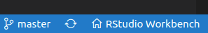
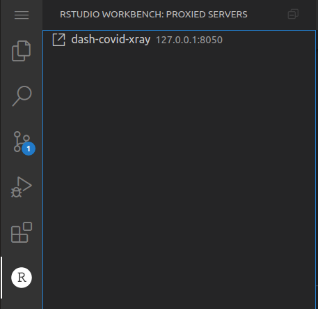

The RStudio Workbench Juliet Rose release introduces support for VS Code sessions. Previously released as a <a href="https://blog.rstudio.com/2020/11/16/rstudio-1-4-preview-server-pro/" target="_blank" rel="noopener noreferrer">preview feature in RStudio Server Pro v1.4</a>, VS Code sessions are now fully supported.

Once VS Code sessions have been configured, users can launch them simply by changing the ‘Editor’ field in the New Session dialog.

With addition of support for VS Code sessions alongside standard RStudio sessions, Jupyter Lab sessions, and Jupyter Notebook sessions, RStudio Workbench now allows data scientists to more easily analyze their data, whatever their preferred language and editor. Note that RStudio Workbench includes the launcher support that is required in order to use non-standard editors. To learn more feel free to read our <a href="https://support.rstudio.com/hc/en-us/articles/1500012472761" target="_blank" rel="noopener noreferrer">FAQ here</a> on the recent release of RStudio Workbench, formerly known as RStudio Server Pro.

## Installing VS Code

To get started with VS Code sessions, RStudio Workbench administrators will need to install Code Server, which is an open source project that provides VS Code sessions over a server. RStudio Workbench includes a new command to help you easily and quickly install and configure VS Code sessions:


```{{.bash}}
sudo rstudio-server install-vs-code /opt/code-server
```

For more details about installing and configuring VS Code, please see our <a href="https://docs.rstudio.com/ide/server-pro/vs-code-sessions.html" target="_blank" rel="noopener noreferrer">Admin Guide</a>.

## Using VS Code Sessions

Once VS Code is installed and configured, users can launch VS Code sessions easily from the RStudio Workbench Homepage. Just like in the desktop version of VS Code, users will be able to edit, test, debug their code, and use all the other features they are already familiar with.

## The RStudio Workbench VS Code Extension

RStudio Workbench VS Code sessions will have the RStudio Workbench VS Code extension automatically installed. This extension gives users an easy way to get back to the RStudio Workbench Homepage from within their VS Code session.



The RStudio Workbench VS Code extension will also help users access their development web servers. When developing a web server, like Shiny, Dash, or Streamlit, with a remote VS Code session through RStudio Workbench, the application will also be running remotely - on the same machine as the VS Code session. Because of that, users won’t be able to access their web servers over 127.0.0.1, like they would if they were developing locally. The ‘Proxied Servers’ view in the RStudio Workbench container of VS Code shows a list of the user’s running web servers. Users can click on an item in that list to open a link that will let them access their web server running on the remote host.



To learn more on the recent release of RStudio Workbench you can read our <a href="https://blog.rstudio.com/2021/06/02/announcing-rstudio-workbench/" target="_blank" rel="noopener noreferrer">post here</a>.
