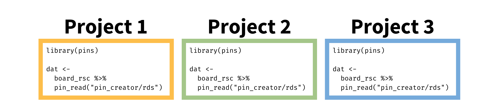

<caption>
Photo by <a href="https://unsplash.com/@universaleye?utm_source=unsplash&utm_medium=referral&utm_content=creditCopyText">Universal Eye</a> on <a href="https://unsplash.com/@ivelasq/likes?utm_source=unsplash&utm_medium=referral&utm_content=creditCopyText">Unsplash</a>
</caption>

Teams often need access to key data to do their work, but have you ever opened your coworker's script to see:

```{{r}}
dat <-  
 read_csv("C://Users/someone_else/data/dataset.csv")

more_dat <- 
 read_csv("S://Path_to_mapped_drive_that_you_dont_have/dataset.csv")
```

Yikes! How will you get these files? Let's hope you can reach your coworker before they’ve logged off for the day.

How can your code be reproducible if you have to manually change the file paths? _Shudder_.

What if you need to make edits to the data, will you have to keep copying CSVs and emailing files forever? _Double shudder._

What if your coworker accidentally forwards your email to someone who is not supposed to have access? _Oh no._

We can struggle to share data assets easily and safely, relying on emailed files to keep our analyses up to date. This makes it difficult to keep current or know what version of the data we’re using. If you've ever experienced any of the scenarios above, consider <a href="https://www.rstudio.com/blog/pins-1-0-0/" target = "_blank">pins</a> as a solution that can help you share your data assets.

## What _is_ a pin, anyway?

Pins, from the <a href="https://pins.rstudio.com/" target = "_blank">R package of the same name</a>, are a versatile way to publish R objects on a virtual corkboard so you can share them across projects and people.

Good pins are data or assets that are a few hundred megabytes or smaller. You can pin just about any object: data, models, JSON files, feather files from the Arrow package, and more. One of the most frequent use cases is pinning small data sets — often ephemeral data or reference tables that don't quite merit being in a database, but seemingly don't have a good home elsewhere (until now).

Pins get published to a board, which can be an <a href="https://www.rstudio.com/products/connect/" target = "_blank">RStudio Connect</a> server, an AWS S3 bucket or Azure Blob Storage, a shared drive like Dropbox or Sharepoint, or a <a href="https://pins.rstudio.com/reference/index.html#section-boards" target = "_blank">variety of other options</a>. Try it out for yourself — read in this data set we’ve pinned for you on RStudio Connect!

```{{r}}
# Install the latest pins from CRAN
install.packages("pins")

library(pins)

# Identify the board
board <-
  board_url(c("penguins" = "https://colorado.rstudio.com/rsc/example_pin/"))

# Read the shared data
board %>%
  pin_read("penguins")
```

In short, if you’ve ever wondered where to put an R object that you or your colleague will need to use again, you might just want to pin it.

## Pins for Sharing Across Projects and Teams

One of the greatest strengths of pins is how your pin becomes accessible directly from your R scripts  _and_ the R scripts of anyone else to whom you’ve given access. Different projects can include code that reads the same pin without creating more copies of the data:



It's easier (and safer) to share a pin across multiple projects or people than to email files around. Pins respect the access controls of the board. Say you’ve pinned to RStudio Connect: you can control who gets to use the pin, just like any other piece of content.

## Pins for Updating and Versioning

You may be wondering why use pins if you already have a shared drive with your teammates. But what happens if you need to replace the dataset with a new one? Do you email everybody to let them know? Is it dataFINALv2.csv? Or dataFINALfinal.csv?

The pins package retrieves the newest version of the pin by default. That means pin users never have to worry about getting a stale version of the pin. If you need to update your pin regularly, a scheduled R Markdown on RStudio Connect can handle this task for you, so your pin stays fresh.

But you’re not locked into losing old versions of a pin. You can version pins so that writing to an existing pin adds a new copy rather than replacing the existing data.

Here's what versioning looks like using a temporary board:

```{{r}}
library(pins)


board2 <- board_temp(versioned = TRUE)

board2 %>% pin_write(1:5, name = "x", type = "rds")
#> Creating new version '20210304T050607Z-ab444'
#> Writing to pin 'x'

board2 %>% pin_write(2:6, name = "x", type = "rds")
#> Creating new version '20210304T050607Z-a077a'
#> Writing to pin 'x'

board2 %>% pin_write(3:7, name = "x", type = "rds")
#> Creating new version '20210304T050607Z-0a284'
#> Writing to pin 'x'

# see all versions
board2 %>% pin_versions("x")
#> # A tibble: 3 × 3
#>   version                created             hash 
#>   <chr>                  <dttm>              <chr>
#> 1 20210304T050607Z-0a284 2021-03-04 05:06:00 0a284
#> 2 20210304T050607Z-a077a 2021-03-04 05:06:00 a077a
#> 3 20210304T050607Z-ab444 2021-03-04 05:06:00 ab444
```

## Learn More

With pins, you and your teammates can know where your important data assets are, how to access them, and whether they are the correct version. You can work with confidence knowing you’re using the right asset, your work is reproducible, and you’re following good practices for data management.

There’s more to explore with pins. We’re excited to share how you can adopt them into your workflow.

Learn more about how and when to use pins:

* <a href="https://pins.rstudio.com/" target = "_blank">The pins package documentation</a>
* <a href="https://docs.rstudio.com/how-to-guides/users/pro-tips/pins/" target = "_blank">RStudio Pro Tips: Creating Efficient Workflows with `pins` and RStudio Connect</a>

See pins in action:

* Pins can pull intensive ETL processes out of your apps, improve performance, and save you the hassle of redeploying whenever the underlying data changes.
  * Watch: <a href="https://www.rstudio.com/resources/rstudioconf-2020/deploying-end-to-end-data-science-with-shiny-plumber-and-pins/" target = "_blank">Deploying End-To-End Data Science with Shiny, Plumber, and Pins</a>
* Pins can play a key role in MLOps, publishing versioned models, and monitoring model metrics.
  * Read: <a href="https://www.rstudio.com/blog/model-monitoring-with-r-markdown/" target = "_blank">Model Monitoring with R Markdown, pins, and RStudio Connect</a>
