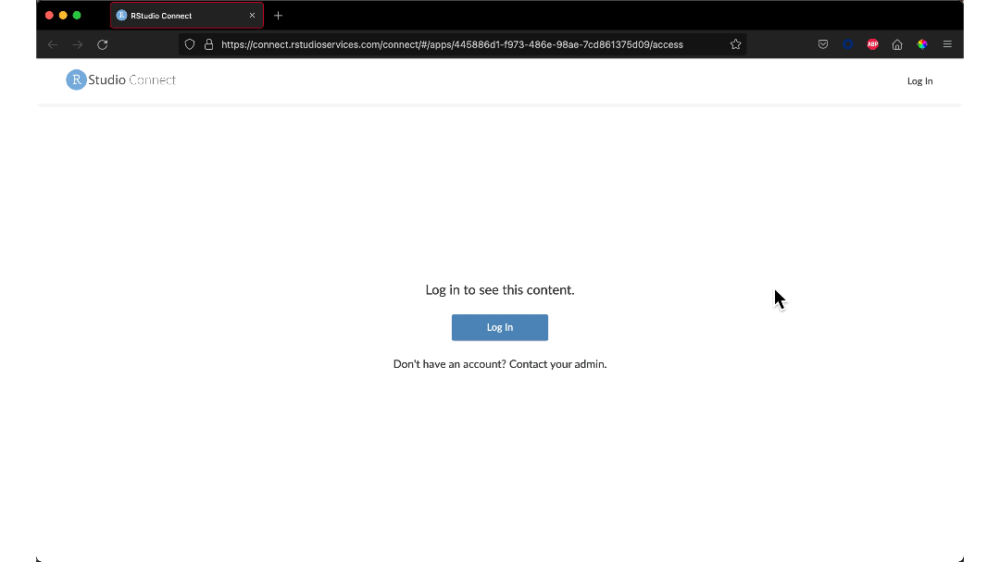

<a href="https://shiny.rstudio.com/" target = "_blank">Shiny</a> is an R package that makes it easy for data scientists to build interactive web apps straight from R, without having to learn any new languages or frameworks. Once you’ve created a Shiny app, it’s time to share your great work!

However, how can you ensure that:

* Only authorized users can view the dashboard?
* Your data is secure once uploaded?
* Users don’t experience a lag time when exploring the data?

<a href="https://www.rstudio.com/products/connect/" target = "_blank">RStudio Connect</a> is an enterprise-level product from RStudio to securely host and share Shiny applications, as well as other data science products. You can publish Shiny apps with a push of a button from the RStudio IDE:

<i><caption>Push-button publishing from the RStudio IDE</caption></i>

RStudio Connect allows you to share your Shiny app knowing your viewers have the right permissions, your data is secure, and your app will display your results quickly and efficiently.

Let's explore RStudio Connect with a dashboard using the <a href="https://allisonhorst.github.io/palmerpenguins/" target = "_blank">Palmer Penguins</a> data. Check out the dashboard on <a href="https://colorado.rstudio.com/rsc/palmer-penguins-shiny-example/" target = "_blank">colorado.rstudio.com</a>.

## Control Viewership With User Authentication

Once you’ve uploaded a Shiny app to Connect, you have the option to:

* **Allow anybody to access, no login required:** Any visitor to RStudio Connect will be able to view the content. This includes anonymous users who are not authenticated with the system.
* **Allow anybody with a login to access:** Those with RStudio Connect accounts are permitted to view this content.
* **Allow only select users or groups to access:** Specific users (or groups of users) are allowed to view this content. Other users will not have access.

<i><caption>Changing sharing settings on RStudio Connect</caption></i>

This provides you flexibility over how uploaded content is shared. You can also assign roles to individuals or groups of team members. Viewers have read-only access while Collaborators can modify the content.

<i><caption>Adding a collaborator to a Shiny app</caption></i>

RStudio Connect also allows you to enable Single-Sign On so that your users won’t need to remember an additional log-in. Check out how we sign into our Shiny apps at RStudio!

<i><caption>Using single-sign to access the Shiny dashboard</caption></i>

## Deploy Shiny Applications Securely, on Premises or in Your VPC

While SaaS solutions also allow you to share Shiny apps, the data and application are accessible on someone else’s cloud. This is an issue if your data is private or sensitive.

With RStudio Connect, the application is kept secure within your organization’s own environment. You can prevent unauthorized access and ensure that you comply with all data security and privacy guidelines.

If your environment requires offline package access, we recommend you use a local repository option such as <a href="https://www.rstudio.com/products/package-manager/" target = "_blank">RStudio Package Manager</a>.

## Maintain Fast Response Times With Performance Tuning

RStudio Connect is built to scale content. After you publish an app, you can change RStudio Connect’s runtime settings to help tune and scale your Shiny applications. By selecting values that support your expected use, you can maximize the trade-off between app responsiveness and memory consumption/load time:

<i><caption>Increasing the maximum processes on the Shiny dashboard</caption></i>

Your users can rely on your app to show data in a timely manner, and you can adjust the configurations based on use and traffic.

## Learn More

With RStudio Connect, you can share your Shiny apps in a secure and scalable way.

* Find out the options for <a href="https://shiny.rstudio.com/tutorial/written-tutorial/lesson7/" target = "_blank">sharing your Shiny apps</a>.
    * <a href="https://support.rstudio.com/hc/en-us/articles/217240558-What-is-the-difference-between-RStudio-Connect-and-shinyapps-io-" target = "_blank">What is the difference between RStudio Connect and shinyapps.io?</a>

Want to see an example of secure, scalable Shiny apps?

* Read how the California Department of Public Health <a href="https://www.rstudio.com/blog/using-shiny-in-production-to-monitor-covid-19/" target = "_blank">created a Shiny app to quickly share data with millions of Californians</a>.
* Explore lessons learned from the Georgia Institute of Technology on <a href="https://www.rstudio.com/blog/how-do-you-use-shiny-to-communicate-to-8-million-people/" target = "_blank">building the COVID-19 Event Risk Assessment Planning Tool</a>.
* Join us for an **<a href="https://www.addevent.com/event/rV10488631" target = "_blank">R in Public Sector Meetup on January 27th: Organizational & Technical Aspects of Shiny in Production</a>.** Speakers from the Dutch National Institute for Public Health and the Environment will discuss the development of a Shiny app that provides actionable information to 300 health professionals.

In addition to Shiny, RStudio Connect publishes other types of applications, including Dash, Streamlit, and others. Find out more about <a href="https://www.rstudio.com/products/connect/" target = "_blank">RStudio Connect</a>.
