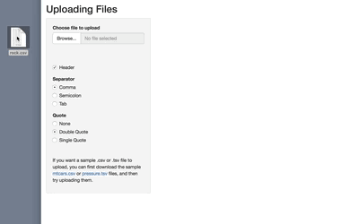

Shiny 1.0.4 is now available on CRAN. To install it, run:

```{{R}}
install.packages("shiny")
```

For most Shiny users, the most exciting news is that file inputs now support dragging and dropping:



It is now possible to add and remove tabs from a `tabPanel`, with the new functions `insertTab()`, `appendTab()`, `prependTab()`, and `removeTab()`. It is also possible to hide and show tabs with `hideTab()` and `showTab()`.

Shiny also has a new a function, `onStop()`, which registers a callback function that will execute when the application exits. (Note that this is different from the existing `onSessionEnded()`, which registers a callback that executes when a user's session ends. An application can serve multiple sessions.) This can be useful for cleaning up resources when an application exits, such as database connections.

This release of Shiny also has many minor new features and bug fixes. For a the full set of changes, see the [changelog](https://shiny.rstudio.com/reference/shiny/1.0.4/upgrade.html).
