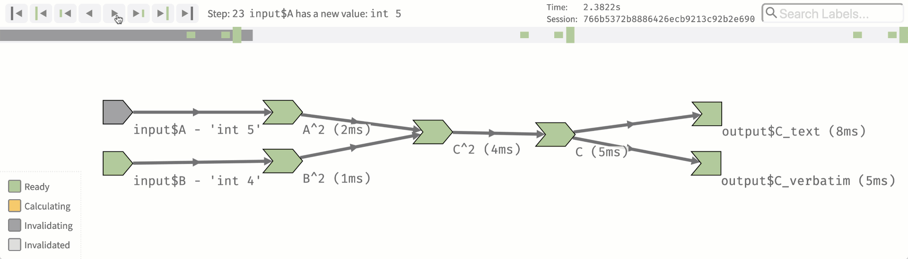

<blockquote>
<p class="body-md-regular body-sm-regular">
Please note that the information presented in this post reflects the package as it stood when initially released, and may now be outdated. For the most up-to-date information, kindly refer to <https://shiny.posit.co/>.
</p>
</blockquote>

We're excited to announce the release of Shiny v1.3.2. This release has two main features: a new reactivity debugging tool we call [`reactlog`](https://rstudio.github.io/reactlog/), and much faster serving of static file assets.

## Introducing reactlog: Visually debug your reactivity issues

Debugging faulty reactive logic can be challenging, as we've [written](https://shiny.rstudio.com/articles/debugging.html) and [talked](https://www.rstudio.com/resources/videos/debugging-techniques/) about in the past. In particular, some of the most difficult Shiny app bugs to track down are when reactive expressions and observers re-execute either too often (i.e. plots that render multiple times in succession after a single change), or not often enough (i.e. outputs that don't update when you expected them to).

This release has an important new addition to the Shiny debugging toolbox: **`reactlog`**! To use `reactlog`, execute this line before running your Shiny app:

```r
options(shiny.reactlog = TRUE)
```

This will instruct Shiny to keep a record of all the interactions between reactive objects.

Then, use your app, reproducing the problematic symptoms. Once you have done that, press `Ctrl+F3` (Mac users: `Cmd+F3`) from within your browser, and you'll see something like this:



This screen lets you interactively explore the reactive history of your Shiny session. You can step forwards and backwards through time, watching as reactive objects execute, create and sever relationships, invalidate, etc.

### Filtering the reactlog

For medium and large Shiny apps, the reactive graph may be pretty crowded when visualized in two dimensions. Two `reactlog` features help you separate the signal from the noise.

* First, you can use the search field in the upper-right corner to filter by name (such as input or output ID, or the variable name of a reactive expression).


* Second, you can double-click a node or edge in the graph to focus in on it, which will remove all unrelated reactive elements. Double-click on the background to restore the original view.


Together, these features make it easy to find and focus on the relevant objects in your app.

You can find out more in [this rstudio::conf talk](https://resources.rstudio.com/rstudio-conf-2019/reactlog-2-0-debugging-the-state-of-shiny) by Barret Schloerke, or read the docs at the [`reactlog` website](https://rstudio.github.io/reactlog/).

## Improved performance for serving JavaScript and CSS files

In previous versions of Shiny, every HTTP request was handled by R, including requests for static JavaScript and CSS files. For apps that have many add-on interactive components, there could be a dozen or more of these requests. As an R process becomes heavily loaded with long-running computations, the requests for these static files have to fight for a slice of R's attention.

This is most noticeable when one user's session affects the startup of another user's session. A single R process can serve multiple Shiny user sessions, and in previous versions of Shiny, a user's session could be blocked from loading startup-related JavaScript and CSS files because another user happened to be doing an intensive computation at that moment.

With the new version of Shiny, static files are always served up at lightning speed, no matter what's going on in R. We accomplished this by adding new static-file serving options to **`httpuv`**, using dedicated C++ code paths running on a background thread. This means that computations in R won't affect the serving of static files, and serving static files won't affect computations in R. The experience for users of heavily-loaded Shiny applications should be noticeably better. Note that it has always been possible with RStudio Connect and Shiny Server Pro to improve performance by increasing the number of R processes serving an application, but now Shiny itself is more efficient and multithreaded, so each R process can effectively handle more user sessions.

The best part is that you don't need to do anything to take advantage of these speed improvements&mdash;just upgrading Shiny to v1.3.2 will do it!

See the [full list of v1.3.0 changes](http://shiny.rstudio.com/reference/shiny/1.3.0/upgrade.html) (and [v1.3.1](http://shiny.rstudio.com/reference/shiny/1.3.1/upgrade.html), [v1.3.2](http://shiny.rstudio.com/reference/shiny/1.3.2/upgrade.html)) to learn about minor bug fixes and improvements we've made in this release.

**Note:** A number of users have reported that upgrading to Shiny v1.3.0 (or higher) breaks their apps when running behind an Nginx proxy: the HTML loads, but none of the styles are applied and none of the calculations run. This occurs when Nginx is subtly misconfigured. We've posted details and a fix in [this RStudio Community post](https://community.rstudio.com/t/having-problems-with-shiny-v1-3-0-and-nginx/28180).

