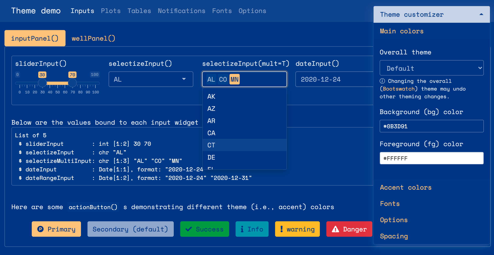
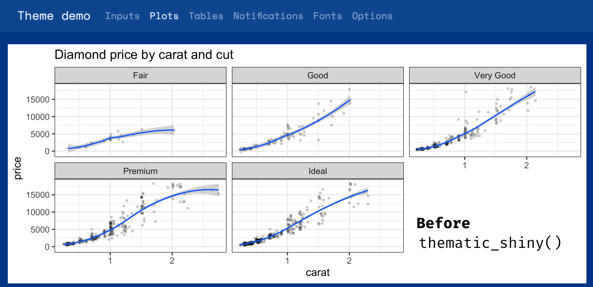
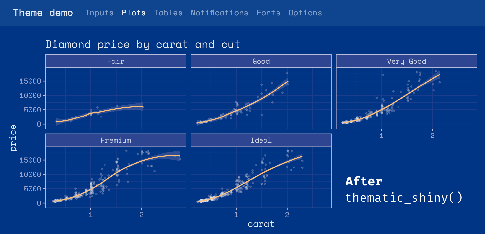
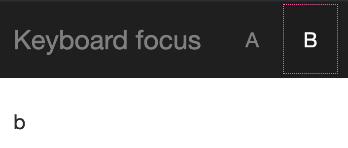
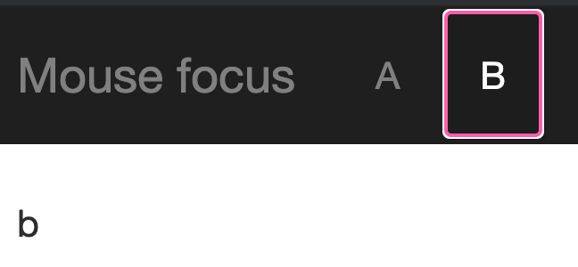

<blockquote>
<p class="body-md-regular body-sm-regular">
Please note that the information presented in this post reflects the package as it stood when initially released, and may now be outdated. For the most up-to-date information, kindly refer to <https://shiny.posit.co/>.
</p>
</blockquote>

We are thrilled to announce that Shiny 1.6.0 is now on CRAN! Install it now with:

```{{r}}
install.packages("shiny")
```

A lot of hard work went to this release to vastly improve four main areas: [theming](#theming), [caching](#caching), [accessibility](#accessibility), and [developer experience](#devmode).

## Improved theming (and Bootstrap 4) support {#theming}

This version of Shiny makes it much easier to customize the appearance of your applications. Shiny now integrates with the `{bslib}` package, which provides Bootstrap 4 and [Bootswatch](https://bootswatch.com/) themes, and also makes it much easier to modify colors, fonts, and more. It also provides an interactive theming widget ([`bslib::bs_themer()`](https://rstudio.github.io/bslib/reference/run_with_themer.html)) which can be used inside any Shiny app (as well as any `rmarkdown::html_document()` with `runtime: shiny`) to more quickly preview different theme variations. Here's a screen recording of that interactive theming tool in action (also [see here](https://testing-apps.shinyapps.io/themer-demo) for a hosted version):

```{{r}}
bslib::bs_theme_preview()
```
<div>
<video class="w-100" src="images/real-time-theming.mp4" controls="">
  <a href="images/real-time-theming.mp4" alt="A screen recording of interaction applying different colors and fonts to a Shiny application."></a>
</video></div>

To use `{bslib}` in your own Shiny app, provide a [`bslib::bs_theme()`](https://rstudio.github.io/bslib/reference/bs_theme.html) to the `theme` argument of `fluidPage()`, `navbarPage()`, and `bootstrapPage()` (for usage with R Markdown, [see here](https://rstudio.github.io/bslib/#r-markdown-usage)). Inside `bs_theme()`, you can specify a version of [Bootstrap](https://getbootstrap.com/docs/4.6/getting-started/introduction/) (4 and 3 currently supported), as well as any [Bootswatch](https://bootswatch.com/) theme, including new ones like [minty](https://bootswatch.com/minty/)!

```{{r}}
ui <- fluidPage(
  theme = bslib::bs_theme(version = 4, bootswatch = "minty"),
  ...
)
```

For years, Shiny has supported Bootswatch 3 themes via the `{shinythemes}` package, but any further customization of the theme required writing complex CSS rules by hand. Now, thanks to `{bslib}`, it's way easier to control [main colors & fonts](https://rstudio.github.io/bslib/articles/theming.html#main-colors) and/or any of the [100s of more specific theming  options](https://rstudio.github.io/bslib/articles/bs4-variables.html), directly from R. When it comes to custom font(s) that may not be available on the end users machine, make sure to leverage `{bslib}`'s helper functions like [`font_google()`](https://rstudio.github.io/bslib/reference/font_face.html), [`font_link()`](https://rstudio.github.io/bslib/reference/font_face.html), and [`font_face()`](https://rstudio.github.io/bslib/reference/font_face.html), which assist in including font file(s) in an convenient, efficient, and responsible way.

```{{r}}
library(bslib)
theme <- bs_theme(
    bg = "#0b3d91", fg = "white", primary = "#FCC780",
    base_font = font_google("Space Mono"),
    code_font = font_google("Space Mono")
)
bs_theme_preview(theme)
```



One main reason why `{bslib}` makes it so much easier to implement custom themes is that `bs_theme()` leverages [Bootstrap Sass variables](https://rstudio.github.io/bslib/articles/theming.html#theming-variables), allowing you to change only a few color(s) and font(s) to impact potentially hundreds of Bootstrap's CSS rules. Also, thanks to Bootstrap 4's [Utility Classes](https://rstudio.github.io/bslib/articles/theming.html#utility-classes), you can now more easily tackle complicated UI issues that Sass variables alone won't solve like adjustments to spacing, alignment, borders, background colors, and more.

To accommodate this new level of customization, a significant portion of shiny UI has also been revamped so that default styles now properly inherit from the `theme` setting (i.e., notice how `sliderInput()`, `selectInput()`, and `dateInput()` properly reflect the main colors and fonts). We hope that Shiny and `{htmlwidgets}` developers also find `{bslib}`'s [tools for theming custom components](https://rstudio.github.io/bslib/articles/theming.html#themeable-components) useful for implementing components that also "just work" with custom themes.

While a lot of custom theming can be done via `bs_theme()` (i.e., CSS), it fundamentally can't effect things like `renderPlot()`, because the image is rendered by R, not by the web browser. To help solve this problem, we've also created the [`{thematic}` package](https://rstudio.github.io/thematic/) which can effectively translate CSS to new R plotting defaults by just calling [`thematic::thematic_shiny()`](https://rstudio.github.io/thematic/reference/thematic_on.html) before running an app.

<div align="center">
  
  
</div>

This 'auto theming' behavior that `{thematic}` provides works great in Shiny with any CSS framework (not just `{bslib}`). Also, more generally, `{thematic}` can help simplify plot theming inside any R environment, using any graphics device, and also makes it super easy to use [Google Fonts](https://fonts.google.com/) inside your R plots.

To learn more about what `{bslib}` and `{thematic}` are able to do, see <https://rstudio.github.io/bslib/> and <https://rstudio.github.io/thematic/>.

By the way, Shiny 1.6 also adds to methods to [the `session` object](https://shiny.rstudio.com/reference/shiny/latest/session.html), namely `setCurrentTheme()` and `getCurrentTheme()`, to dynamically update (or obtain) the page's `theme` after initial load. These methods power `{bslib}'s` interactive theming tool ([`bslib::bs_themer()`](https://rstudio.github.io/bslib/reference/run_with_themer.html)), but can also be used to implement dynamic theming widgets [like a dark mode switch](https://rstudio.github.io/bslib/articles/theming.html#dynamic-theming-in-shiny).

## Improved caching {#caching}

In many Shiny applications, the performance bottlenecks are pieces of code that perform the exact same computation over and over again. For example, you might have a dashboard that displays the same information for many users, and so for those users, it does the exact same data processing and plotting steps.

Instead of repeating these computations, you can now have your app _cache_ the steps, with the new `bindCache()` function. Here's how to use it: simply pass your `reactive()` or `renderPlot()` (or other `render` function) to `bindCache()`, and tell it what to use for the _cache key_.

Suppose this is our reactive expression which does a slow operation; in this case, it's calling `fetchData()`, which retrieves data from a web API:

```{{r}}
weatherData <- reactive({
  fetchData(input$city)
})
```

To cache the values, we'll pass it to `bindCache()`:

```{{r}}
weatherData <- reactive({
    fetchData(input$city)
  }) %>%
  bindCache(input$city)
```

The call to `bindCache(input$city)` tells it to use `input$city` as the _cache key_ (you can use more than one item for the cache key, if needed). The first time it sees a value for `input$city` (for example, `"Boston"`), it will execute the reactive expression and save the value in the cache. In the future, if it sees the same value of `input$city` again, instead of executing the reactive expression, it will simply retrieve the value from the cache.

In addition to `reactive()`, `bindCache()` works with most `render` functions. For example:

```{{r}}
output$plot <- renderPlot({ ... }) %>% bindCache(input$city)

output$text <- renderText({ ... }) %>% bindCache(input$city)

output$plot1 <- plotly::renderPlotly({ ... }) %>% bindCache(input$city)
```

To learn more about using caching in Shiny, see [this article](https://shiny.rstudio.com/articles/caching.html).

In addition to `bindCache()`, we've added a companion function, `bindEvent()`, which makes it easy to make reactive code run only when specified reactive values are invalidated. For example, if you have a plot that you want to redraw only when a button is clicked, you could do this:

```{{r}}
output$plot <- renderPlot({
    plot(cars[seq_len(input$nrows), ])
  }) %>%
  bindEvent(input$button)
```

And what's more, `bindCache()` and `bindEvent()` can be used together:

```{{r}}
output$plot <- renderPlot({
    plot(cars[seq_len(input$nrows), ])
  }) %>%
  bindCache(input$nrows) %>%
  bindEvent(input$button)
```

This would cache the plot based on the value of `input$nrows`, and also make it so the plot redraws only when `input$button` is clicked.

You may be familiar with the existing `eventReactive()` and `observeEvent()` functions. `bindEvent()` can be used with `reactive()` and `observe()` to do the same thing (and in fact, the older functions are now implemented using `bindEvent()`):

```{{r}}
# These are equivalent:
eventReactive(input$button, { ... })
reactive({ ... }) %>% bindEvent(input$button)

# These are equivalent:
observeEvent(input$button, { ... })
observe({ ... }) %>% bindEvent(input$button)
```

## Improved accessibility {#accessibility}

Shiny 1.6 also includes many accessibility improvements to Shiny UI. Most improvements automatically make most existing Shiny apps more accessible, but some features such as [alternative text for plots](#alt-text) require some effort to fully implement. And while this release is a big step forward for Shiny's overall accessibility, we're still in the process of learning more about this area, so expect more improvements in future releases!

### Hello ARIA attributes

Nearly all of Shiny's (previously in-accessible) UI (e.g., `selectizeInput()`, `dateInput()`, `icon()`, etc.) now automatically includes suitable [ARIA attributes](https://developer.mozilla.org/en-US/docs/Web/Accessibility/ARIA), which helps make content more discoverable via keyboard and also assists [screen readers](https://en.wikipedia.org/wiki/Screen_reader) to make proper announcements when focus has shifted.

More specifically, a black line is now shown around content that is brought into focus via keyboard. And, thanks to `{bslib}`, customizing the focus [outline](https://developer.mozilla.org/en-US/docs/Web/CSS/outline)'s style is fairly straight-forward:

```{{r}}
ui <- navbarPage(
  theme = bslib::bs_theme("keyboard-outline-style" = "dotted", "keyboard-outline-color" = "hotpink", version = 3),
  title = "Keyboard focus", inverse = TRUE,
  tabPanel("A", "a"),
  tabPanel("B", "b")
)
shinyApp(ui, function(input, output) {})
```




By default, an outline isn't shown for a mouse-based focus, but one may be added by setting `mouse-outline-style` to something other than `none` (it's default value). This helps makes the app more accessible to visually impaired users that use a mouse.

```{{r}}
ui <- navbarPage(
  theme = bslib::bs_theme("mouse-outline-style" = "auto", "mouse-outline-color" = "hotpink", version = 3),
  title = "Mouse focus", inverse = TRUE,
  tabPanel("A", "a"),
  tabPanel("B", "b")
)
shinyApp(ui, function(input, output) {})
```



### Language attribute

A `lang` argument has been added to all `*Page()` functions (e.g., `fluidPage()`, `bootstrapPage()`) for control over the document-level language used by screen readers and search-engine parsers. By default, it is set to empty string which is commonly recognized as a browser's default locale, so in most situations, this value won't need to be changed. BTW, the same argument has been added to the `save_html()` function from the `{htmltools}` package, so your static HTML pages may now reap the same benefits.

### Alternate text for `renderPlot()` {#alt-text}

It's now easy to include an [alternative text description](https://webaim.org/techniques/alttext/) of static plots generated with `renderPlot()`. Most good descriptions will be a function of reactive values, so keep in mind that you can pass a `reactive()` expression directly to the new `alt` argument of `renderPlot()`:

```{{r}}
ui <- fluidPage(
  sidebarPanel(
    sliderInput("obs", "Number of observations:", min = 1, max = 1000, value = 500)
  ),
  mainPanel(plotOutput("plot"))
)

server <- function(input, output, session) {
  vals <- reactive(rnorm(input$obs))
  # A textual description of the histogram of values. Also checkout the BrailleR 
  # package to easily generate description(s) of common statistical objects
  # https://github.com/ajrgodfrey/BrailleR
  alt_text <- reactive({
    bins <- hist(vals(), plot = FALSE)
    bin_info <- glue::glue_data(bins, "{round(100*density, 1)}% falling around {mids}")
    paste(
      "A histogram of", input$obs, "random values with ",
      paste(bin_info, collapse = "; ")
    )
  })
  output$plot <- renderPlot({
    hist(vals())
  }, alt = alt_text)
}

shinyApp(ui, server)
```

## Shiny Developer Mode {#devmode}

Shiny 1.6 also adds a [Developer Mode](https://shiny.rstudio.com/reference/shiny/latest/devmode.html) which is enabled by calling `devmode()` and disabled by calling `devmode(FALSE)`.

With Developer Mode enabled, defaults for numerous `options()` are altered to enhance the developer experience (but may not be best for published applications), this includes:

* Defaulting `shiny.autoreload` to `TRUE` which reloads the app when a sourced R file changes.
* Defaulting `shiny.minified` to `FALSE` which ensures that JavaScript files are not minified (e.g., `shiny.js`), making it easier to debug.
* Defaulting `shiny.fullstacktrace` to `TRUE` which displays the full stack trace when errors occur during execution.
* Defaulting `sass.cache` to `FALSE` which prevents any possible caching of Sass -> CSS compilation (done via `sass::sass()`). This is relevant whenever `{bslib}` is used with Shiny or R Markdown. Note that Sass -> CSS compilation of Bootstrap is costly in production, but caching during development may provide misleading false-positive results. 
* To learn more about implementing your own option, see the reference for [`devmode()`](https://shiny.rstudio.com/reference/shiny/latest/devmode.html).

If you have manually set any of these options, your provided value will take precedence. When a default Developer Mode option is used, a notification will be displayed every eight hours to remind you of the altered behavior.

Developer Mode also includes notifications about best practices within Shiny (such as avoiding `shinyServer()`).

## Learn more

For more details on Shiny's 1.6 release, see the [NEWS file](https://github.com/rstudio/shiny/blob/master/NEWS.md). There you'll find more details on accessibility improvements and the many bug fixes that also come with this release. Thanks for reading, and happy developing!
