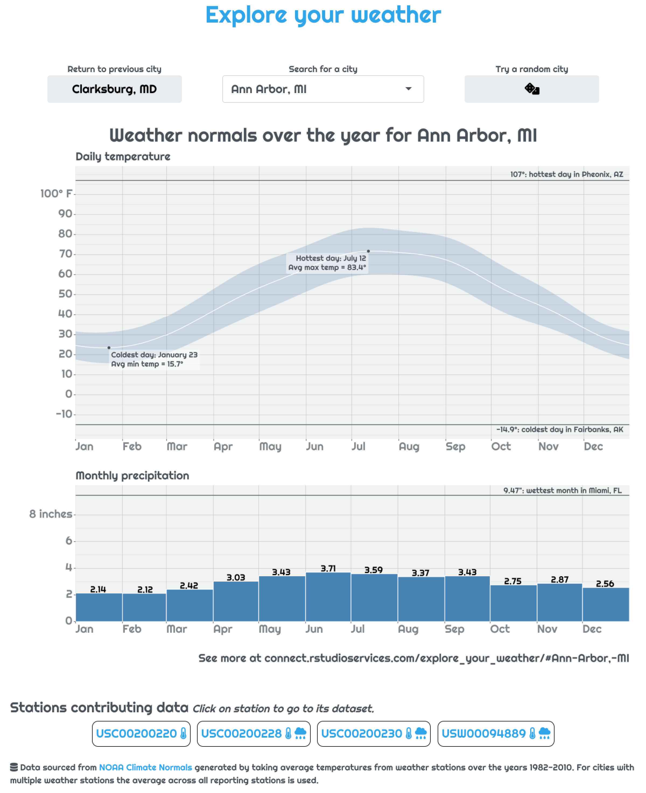

Today we're introducing [App Stories](https://shiny.rstudio.com/app-stories/) to the [Shiny website](https://shiny.rstudio.com/). If you've spent any time learning about Shiny, there's a good chance you've already seen our [Shiny User Showcase](https://shiny.rstudio.com/gallery/#user-showcase). These are applications that Shiny users around the world have allowed us to share, and it's an excellent place to get ideas about what you can do with Shiny.

App Stories are a bit different from the User Showcase: an App Story will center around a Shiny application, but the application will be designed specifically to show off specific features, and it will also include explanations of how to use those features.

We're kicking off App Stories with an application for [exploring weather patterns](https://connect.rstudioservices.com/explore_your_weather/) in US cities. This story shows off some of Shiny 1.6.0's new features, and it has two parts: [About the app](https://shiny.rstudio.com/app-stories/weather-lookup-about.html) describing the application's functionality and motivation, and [Using `bindCache()` to speed up an app](https://shiny.rstudio.com/app-stories/weather-lookup-caching.html) which shows how Shiny's new `bindCache()` function can be used to easily speed up your apps with very little code.

Both posts for the weather explorer go deeper into motivations and real-use-case scenarios than traditional documentation, and they provide insight into the development process of a nice-looking and high-performance Shiny app.

<em>Articles are written trying to explain why in addition to how to use new features in Shiny</em>

Going forward we will continue to add new applications along with posts about those applications. We're experimenting with this kind of documentation, so we welcome feedback about what topics you would like explored or what could be improved. Feel free to tweet at us (Winston: [@winston_chang](https://twitter.com/winston_chang), Nick: [@NicholasStrayer](https://twitter.com/NicholasStrayer)) with your thoughts and ideas. Happy app making!
