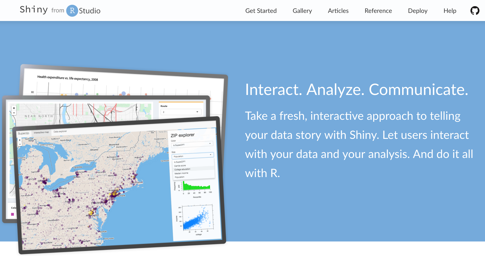
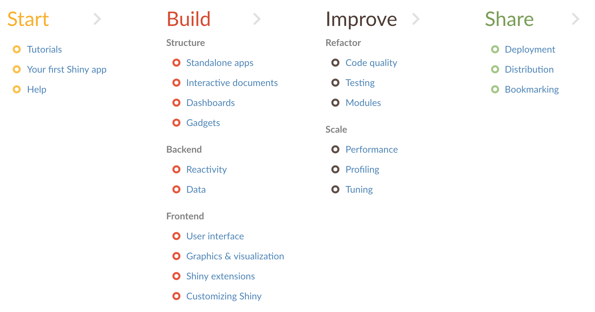

I am excited to announce the redesign and reorganization of [shiny.rstudio.com](https://shiny.rstudio.com/), also known as the Shiny Dev Center. The Shiny Dev Center is the place to go to [learn](https://shiny.rstudio.com/tutorial/) about [all things Shiny](https://shiny.rstudio.com/articles/) and to [keep up to date](http://shiny.rstudio-staging.com/reference/shiny/) with it as it evolves.

The goal of this refresh is to provide a clear learning path for those who are just starting off with developing Shiny apps as well as to make advanced Shiny topics easily accessible to those building large and complex apps. The [articles overview](https://shiny.rstudio.com/articles/) that we designed to help navigate the wealth of information on the Shiny Dev Center aims to achieve this goal.

Other highlights of the refresh include:

- A brand new look!
- New articles
- Updated articles with modern Shiny code examples
- Explicit linking, where relevant, to other RStudio resources like webinars, support docs, etc.
- A prominent link to our ever growing [Shiny User Showcase](https://www.rstudio.com/products/shiny/shiny-user-showcase/)
- A [guide](https://shiny.rstudio.com/contribute/) for contributing to Shiny (inspired by the [Tidyverse contribute guide](http://www.tidyverse.org/contribute/))

Stay tuned for more updates to the Shiny Dev Center in the near future!

