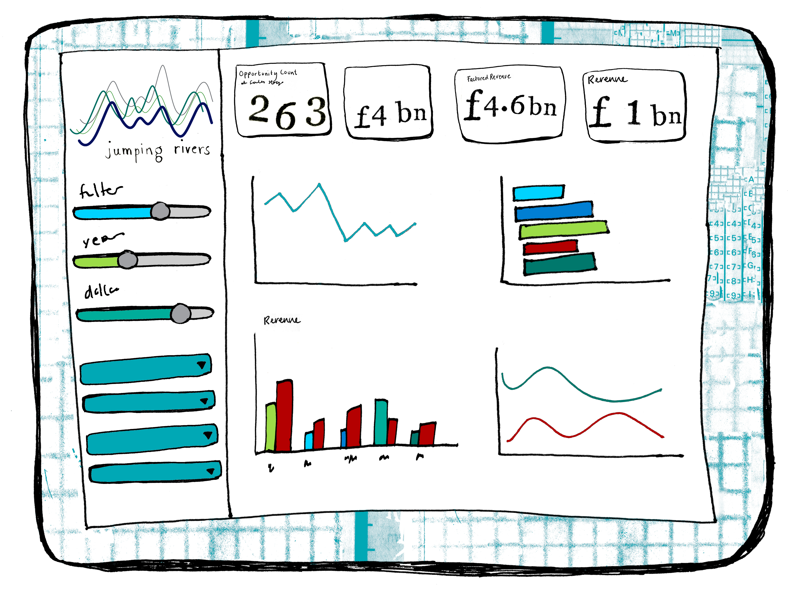

Shiny is a great way of building interactive web applications without having to have extensive web development knowledge - as long as you know the problem you’re trying to solve, have some ideas of how to display the data, and of course, a bit of R knowledge, you’re good to go. 

Back in 2017, Jumping Rivers, an analytics company based in the UK, took on a project with Fujifilm, collaboratively building a Shiny dashboard for experimental risk assessment. Prior to engaging JR, Fujifilm used an Excel-based tool for this, which collated all data surrounding the process, including experimental parameters, comments, recommendations, and scoring data for a number of metrics.

The tool was difficult to update and prone to breaking due to the rigid structure imposed by Excel. Further, versioning the reports and keeping track of the data was impossible without some central management of the process for updating the document.

Building a tool in Shiny meant that the tool was easily accessible to all staff and scalable if necessary. Information is all stored in a centralised location in an accessible, consistent structure.

 

Shiny allows for templated data entry, which keeps things consistent. This is convenient for searching, but also avoids mistakes; no more wondering if someone has entered the dates in the UK, where 08/06/2022 is the 8th June 2022, or the US, where it’s August 6th, and you’d be very, very late.

The dashboard could also be used to explore data at any historic snapshot throughout the risk assessment process, allowing the process to be reviewed at any stage. Shiny also allows a user to automatically generate reports and other documents tailored specifically to the user.

This is just one example of the many uses of <a href="https://shiny-in-production.jumpingrivers.com/" target = "_blank">Shiny in Production</a>. This October, Jumping Rivers is hosting a conference based on just this, with talks from speakers across the UK and Europe, sharing how they utilise Shiny in their work. We can't wait to see you there!

<a class="btn btn-primary" href="https://shiny-in-production.jumpingrivers.com/" target="_blank">Click here to register for Shiny in Production!</a>

