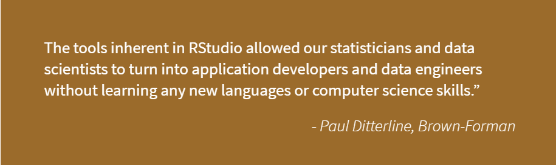
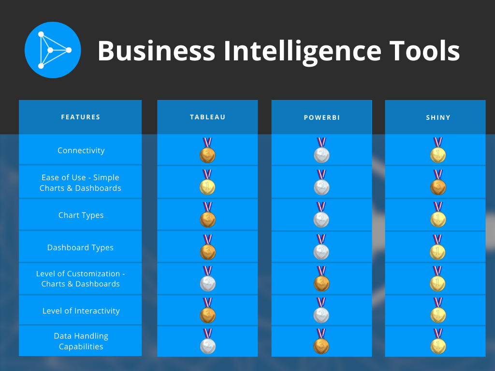

<i>This is a guest post from Marcin Dubel, a 2021 Shiny Contest Grand Prize winner and Software Engineer at <a href="https://appsilon.com/" target="_blank" rel="noopener noreferrer">Appsilon</a>, a Full Service RStudio Partner.</i>

## Finding The Right Tool For The Job

With strong competition in the Business Intelligence market, choosing the best option for your project can be challenging. There are numerous options, and even though some tools outperform in key areas, there is no clear winner-take-all. To find the best fit, you must clarify your needs and identify project objectives. Some questions you might ask yourself:

- Will you integrate within other web applications? 
- What are your connectivity needs? 
- What’s the level of user input? 
- What level of data science or machine learning might be useful?

We compared the features and capabilities of Shiny, Tableau, and PowerBI for delivering insights in enterprise organizations. This is our opinion on how they stack up.

>For in-depth 1 vs 1 analyses see <a href="https://appsilon.com/tableau-vs-r-shiny/" target="_blank" rel="noopener noreferrer">Tableau vs R Shiny</a> or <a href="https://appsilon.com/powerbi-vs-r-shiny/" target="_blank" rel="noopener noreferrer">PowerBI vs R Shiny</a>.

We encourage you to read through Lou Bajuk’s series on <a href="https://blog.rstudio.com/tags/bi-tools/" target="_blank" rel="noopener noreferrer">Data Science and Business Intelligence</a>. <a href="https://blog.rstudio.com/2021/03/04/bi-and-ds-part1/" target="_blank" rel="noopener noreferrer">Part 1</a> provides valuable insights into the <i>why</i> and <i>how</i> BI and Data Science tools can augment each other. Other posts in the series discuss important topics and <a href="https://blog.rstudio.com/2021/03/11/bi-and-ds2-strengths-challenges/" target="_blank" rel="noopener noreferrer">different approaches to BI tools</a>. 

## Quick Overview

### Tableau

Since its inception in 2003, Tableau has amassed a large community of users and can provide end-to-end services from data prep to deployment. With Tableau you can connect to almost any data source and handle massive datasets - Tableau has no row limits and is designed to scale. Its point-and-click functionality makes use a breeze, however it also means there is no source code to really dig into and replicate results.

### PowerBI

PowerBI is a collection of cloud-based apps and software services, rather than a single app or software package. As a Microsoft product, Power BI excels with ease-of-use for beginners/non-technical users and has full integration with the Microsoft ecosystem. However, mastery of PowerBI means learning the entire suite of Microsoft tools, and just as with Tableau, it is read-only, so there is no access to source code, and good luck trying to maintain proper version control.  

Learn more about Paul's experience in the <a href="https://www.rstudio.com/about/customer-stories/brown-forman/" target="_blank" rel="noopener noreferrer">Brown-Forman customer story</a>.

### Shiny

Shiny is a full web framework that allows R users to create interactive web applications from their preferred language. Shiny is the obvious choice for those looking for complete control over UI/UX and a single integrated web solution. For wider and faster adoption of an app, user experience (UX) is vital, and for a better experience, you need better-performing tools and complete control over customization. This is where Shiny shines. The drawback here is that a code-based solution like Shiny can be more challenging to create. But fear not - the RStudio <a href="https://shiny.rstudio.com/" target="_blank" rel="noopener noreferrer">Shiny developer center</a> and <a href="https://community.rstudio.com/c/shiny/8" target="_blank" rel="noopener noreferrer">Community</a> have plenty of free learning tools and resources. <a href="https://www.rstudio.com/products/connect/" target="_blank" rel="noopener noreferrer">RStudio Connect</a> provides a secure, scalable way to deploy Shiny applications in your organization and is our preferred delivery tool. If time is of the essence, consider reaching out to Appsilon. Our engineers are leading experts in Shiny and can help you quickly implement a Proof-of-Concept application. 

>To see why Shiny is the preferred option for enterprise applications:  <a href="https://appsilon.com/why-you-should-use-r-shiny-for-enterprise-application-development/" target="_blank" rel="noopener noreferrer">Why You Should Use Shiny for Enterprise Application Development</a>

## Categories and Scoring

## Making the Right Choice - Defining Your Needs

### Shiny

At Appsilon we prefer total control over UI customization and R’s data handling capabilities, and our engineers have the skillset to handle the complexities of a code-friendly approach. We have developed some of the most advanced R Shiny dashboards and produced several open-source packages to help users create their apps. So to say we are biased towards R Shiny is fair. But the reason why we do what we do is that at the enterprise level, self-service options simply don’t match the level of creative freedom afforded by open-source data science tools.

### PowerBI

Not everyone requires a higher level of customization and control. For those in need of a quick start, PowerBI is an excellent choice. With the best connectivity options available, great looks right out of the box, and full integration with the Microsoft ecosystem, PowerBI is your best budget-friendly option.

### Tableau

If you can foot the bill, Tableau is a great option for those looking to combine big data (similar to the power of Shiny) and PowerBI’s ready, drag-and-drop designs for the inexperienced user. Tableau beats out PowerBI for ease of use, but you’ll have to decide if the benefits justify the cost.

## Conclusion

The clear winner here is you. With so many options, it’s a buyer’s market. Be wary of the one-stop-shop sellers because even the industry leaders don’t cover all the bases. Take the time to understand your goals and project requirements. There are plenty of strong, easy-to-use self-service options for producing simple dashboards and simple charts. But as project complexity increases, there is no substitute for code-friendly enterprise options like Shiny.

## Shiny from Concept to Production: An RStudio Community X-Session

Level up your Shiny developer skills on August 10th with the leading Shiny experts at Appsilon. Discover how you can improve your Shiny app's performance, scale for widespread adoption, and deployment through RStudio Connect. This collaborative webinar by RStudio and Appsilon was designed for all levels of Shiny developers - whether a beginner moving beyond simple dashboards or a senior developer needing to improve infrastructure. Register <a href="https://www.rstudio.com/registration/shiny-from-concept-to-production/" target="_blank" rel="noopener noreferrer">here</a> and be sure to check out presentations by two RStudio Shiny Contest Grand Prize winners.

