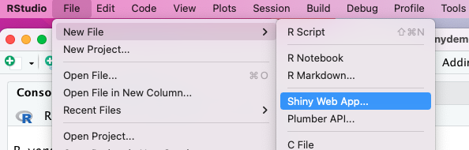
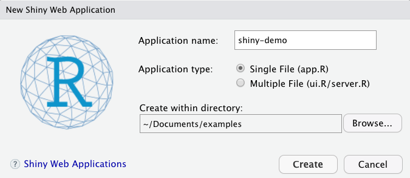
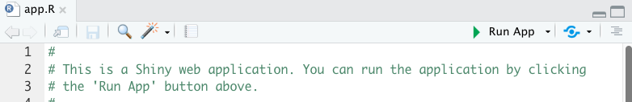
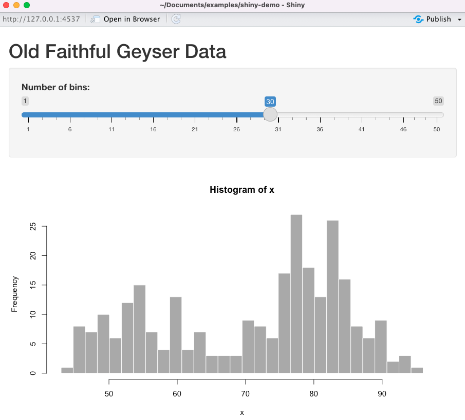
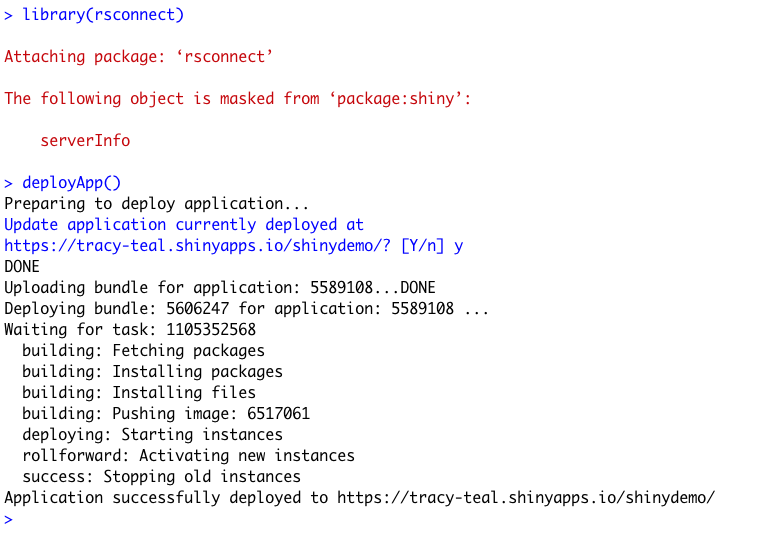
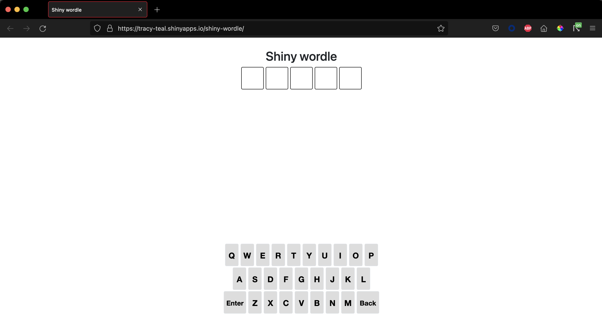
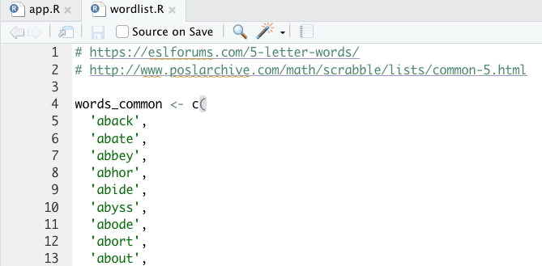
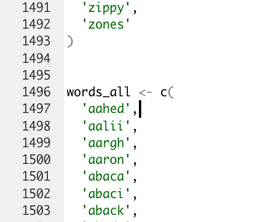

<div class="lt-gray-box">
A couple of weeks ago, Winston Chang showed how to create a Wordle app in Shiny in a four-part video series. Go watch the video series to <a href="https://www.youtube.com/playlist?list=PL9HYL-VRX0oQnWIeY_ydYBdU76iQ-tchU" target = "_blank">see how he did it</a>! Also, follow along on the first steps to start with Shiny in this tutorial. 
</div>

In our house, we like puzzles and Wordle. My family noticed while playing the deployed version that there were some words that, while amusing to younger children, were not necessarily what we were expecting to be included. So, with Winston's support, we decided to take a look at the word list and see if we could make some updates. 

I've used GitHub and R, so I could start from there. I started with a few steps:

* Fork the <a href="https://github.com/wch/shiny-wordle" target = "_blank">GitHub repository</a>
* Clone the forked repository to my computer
* Open the file 'wordlist.R' in the RStudio IDE

I was expecting to just modify a word list, basically by parsing and modifying the text file 'wordlist.R', putting in a pull request and waiting for it to be merged by Winston to see our changes. But, of course, we didn't want to wait that long, so we decided to try deploying the Shiny app on our own instead. 

First, we wanted to see if we could deploy it as it is without any modifications. I saw that Winston's was deployed at <a href="https://www.shinyapps.io/" target = "_blank">shinyapps.io</a>, so I too went to shinyapps.io to get set up.

* Go to <a href="https://www.shinyapps.io/" target = "_blank">shinyapps.io</a>
* Register an account (I just used a Gmail account)
* Once logged in, follow the <a href="https://shiny.rstudio.com/articles/shinyapps.html" target = "_blank">instructions</a>
    * Install <a href="https://rstudio.github.io/rsconnect/" target = "_blank">rsconnect</a>
    * Configure rsconnect

Then, I went back to my RStudio IDE to try to deploy a Shiny app.

I thought I'd try the demo one first to make sure things were working, so I did **File** \-\> **New File** \-\> **Shiny Web App**:

<center>

</center>

That brought up a 'New Shiny Web Application' window. I named the it 'shiny-demo' and clicked 'Create'.

<center>

</center>

That opened a window with the file 'app.R' that told me to click the button 'Run App', so I did!

<center>

</center>

And up opened a Shiny app on Old Faithful!

<center>

</center>

Great, so we had it working locally. We're basically the coolest now; we did something interactive! Now, could we deploy it to shinyapps.io to share this exciting app with the world?

I went down to the console, first loaded the rsconnect package, and then deployed the app.

```r
library('rsconnect')
```

(If you forget to load the library, fear not, it won't work, so you'll be reminded that you need to do it).

```r
deployApp()
```

<center>

</center>

Then 🎉! There it was at [https://tracy-teal.shinyapps.io/shiny-demo/](https://tracy-teal.shinyapps.io/shiny-demo/).

Empowered by deploying something, we wanted to go on to deploy the Shiny Wordle app. If we could, it would give us all the power to create whatever word lists we wanted!

I went back to my 'shiny-wordle' directory:

* Set the working directory to that folder using `setwd()`
* Open the file 'app-final.R' and click 'Run App'

It opened locally! It was working!

Now to deploy. 

I tried `deployApp('app-final.R')`.

That didn't work. It said `Error in deployApp("app-final.R")`: 

```bash
"/Users/tracyteal/Documents/git/fork/shiny-wordle/app-final.R must be a directory, an R Markdown document, or an HTML document."
```

So, I renamed `app-final.R` to `app.R` and ran:

```r
deployApp()
```

(But I could have done `shiny::shinyAppFile("app-final.R")`).

Then, it started and took awhile and then success!

There my app was at [https://tracy-teal.shinyapps.io/shiny-wordle/](https://tracy-teal.shinyapps.io/shiny-wordle/).

<center>

</center>

Now to try editing the files.

We edited 'wordlist.R'. The vector `words_common` contains the set of words that are chosen to be the correct ones. So, rather than a whole list, we put in just a few words that we wanted to have as the answers.

<center>

</center>

If you want to add new words that aren't necessarily actual words, like people's names, you need to add them to both the `words_common` and `words_all` lists.

<center>

</center>

Then, we redeployed by running `deployApp()` again.

We had to hit 'y' when it asked if we wanted to 'Update application currently deployed'. 

It ran and then, 🎉! We had our very own Wordle with our very own words!

A customized word list could be a very good gift for family or friends. ☺️

We went on to modify the whole word list, and put in that PR for Winston. 

We learned a lot and are excited to try more. We were super excited to get an interactive app up and running so quickly. 

So, with the Shiny app, we'll keep working on the words, and maybe even a version with a different number of letters, as long as we can find a wordlist… 
