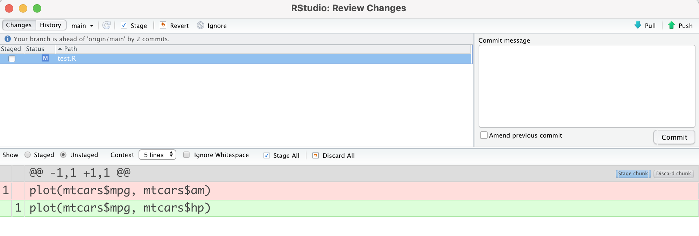

Data scientists concentrate on making sense of data through exploratory analysis, statistics, and models. Software developers apply a separate set of knowledge with different tools. Although their focus may seem unrelated, data science teams can benefit from adopting software development best practices. Version control, automated testing, and other dev skills help create reproducible, production-ready code and tools.

Rachael Dempsey recently <a href="https://twitter.com/_RachaelDempsey/status/1518578015978266625?s=20&t=niXllzayd4AoZ8GWGV8Pqw" target = "_blank">asked the Twitter community</a> for suggestions on resources that data scientists can use to improve their software development skill set.

We received so many great recommendations that we wanted to summarize and share them here. This blog post walks through software development best practices that your team may want to adopt and where to find out more.

The areas discussed below are:

* [Project structure](#structure-your-data-science-projects-so-that-everything-just-runs-the-first-time)
* [Automatic testing](#test-functions-so-that-they-do-what-you-expect-them-to-do)
* [Reproducible environments](#create-reproducible-environments-so-that-results-are-consistent)
* [Version control](#use-version-control-to-track-and-control-changes-across-a-team)

## Structure your data science projects so that everything "just runs the first time"

It'd be great if we could open an R script, click Run, and we have the output we need. However, code doesn't always "just work." As our projects get bigger and more complex, we need structure so that they are easy to manage and understand.

As Daniel Chen says in his <a href="https://youtu.be/UQHz38s3DyA" target = "_blank">Structuring Your Data Science Projects</a> talk, a proper project structure gets us to the happy place where our code runs. Existing principles, templates, and tools can guide you:

* Make a project for your work so that file directories are easy to work with
* Organize work into subfolders so that anybody can open up your project and understand what is going on
* Create functions to organize what your code is doing
* Write reports that show your stakeholders what they care about (and hide what they don't)
* Use workflow orchestrators to see which tasks depend on each other and to rebuild your analysis (<a href="https://books.ropensci.org/targets/" target = "_blank">the targets package</a> is an option for R users)


<center><i><caption>A workflow diagram showing a project's activities and dependencies<br>Source: <a href="https://wlandau.github.io/targets-tutorial/#1" target = "_blank">Reproducible computation at scale in R, Will Landau</a></center></i></caption>
<br>
Organized projects allow data scientists to remain productive as their projects grow.

### Project Structure Resources

* <a href="https://rstats.wtf/save-source.html" target = "_blank">What They Forgot to Teach You About R - A Holistic Workflow</a>
* <a href="https://slides.djnavarro.net/project-structure/#1" target = "_blank">Project Structure Slides by Danielle Navarro</a>
* <a href="https://goodresearch.dev/" target = "_blank">Good Research Code Handbook</a>
* <a href="https://workflowr.github.io/workflowr/" target = "_blank">workflowr package</a>
* <a href="https://swcarpentry.github.io/make-novice/" target = "_blank">Data Carpentries Automation and Make Course</a>

## Test functions so that they do what you expect them to do

A data scientist can test a function by inputting some values, seeing if the output is what you expect, modifying the code if there are issues, and rerunning to check the values again. However, this process leaves a lot of room for error. It's easy to forget what changed and cause something else to break.

Automated testing offers a better option, such as with the <a href="https://docs.pytest.org/en/latest/" target = "_blank">pytest package</a> or <a href="https://testthat.r-lib.org/" target = "_blank">testthat package</a>. Automated testing focuses on small, well-defined pieces of code. Data scientists write out explicit expectations. Tests are saved in a single location, making them easy to rerun. When a test fails, it's clear where to look for the problem.

```python
from foobar import foo, bar

def test_foo_values():
    assert foo(4) == 8
    assert foo(2.2) == 1.9

def test_bar_limits():
    assert bar(4, [1, 90], option=True) < 8

# If you want to test that bar() raises an exception when called with certain
# arguments, e.g. if bar() should raise an error when its argument is negative:
def test_bar_errors():
    with pytest.raises(ValueError):
        bar(-4, [2, 10])  # test passes if bar raises a ValueError
```
<center><i><caption>Example Python Test<br>Source: <a href="https://36-750.github.io/practices/unit-testing/" target = "_blank">Statistical Computing Course, Alex Reinhart and Christopher R. Genovese</a></center></i></caption>

Incorporating automated testing in a workflow exposes problems early and makes it easier to alter code.

### Testing Resources

* <a href="https://goodresearch.dev/" target = "_blank">Good Research Code Handbook</a>
* <a href="https://36-750.github.io/practices/unit-testing/" target = "_blank">Statistical Computing - Unit Testing</a>
* <a href="https://r-pkgs.org/tests.html" target = "_blank">R Packages - Testing</a>
* <a href="https://testthat.r-lib.org/" target = "_blank">testthat package</a>

## Create reproducible environments so that results are consistent

Have you ever had a script that worked great, but now you can't reproduce the results on a new laptop? This may happen because of changes in the operating system, package versions, or other factors. You have to spend time figuring out why the output is suddenly different.

A reproducible environment ensures workflows run as they did in the past. Your team controls everything needed to run a project in a reproducible environment. Each person running the code can expect the same behavior since everything is standardized.

Virtual environments for Python or the <a href="https://rstudio.github.io/renv/articles/renv.html" target = "_blank">renv package</a> for R are examples of the tools that can help a data science team reproduce their work. They record the version of loaded packages in a project and can re-install the declared versions of those packages.

For example, say one of your projects uses `dplyr::group_map()`, introduced in dplyr v0.8.0. If a team member runs the code with an older version of dplyr, they will run into an error. The renv package captures the state of the environment in which the code was written and shares that environment with others so that they can run the code without issue. (Try out <a href="https://github.com/JosiahParry/renv-example" target = "_blank">Josiah Parry's example</a> on GitHub.)

With reproducible environments, data scientists can collaborate on work and validate results regardless of when and where they are running code.

### Reproducible Environments Resources

* <a href="https://rstats.wtf/get-to-know-your-r-installation.html" target = "_blank">What They Forgot to Teach You About R - Personal R Admin</a>
* <a href="https://environments.rstudio.com/" target = "_blank">RStudio - Reproducible Environments</a>
* <a href="https://solutions.rstudio.com/python/minimum-viable-python/" target = "_blank">Minimal Viable Python</a>
* <a href="https://education.molssi.org/python-package-best-practices/" target = "_blank">Python Package Best Practices</a>
* <a href="https://docs.python.org/3/tutorial/venv.html" target = "_blank">Python virtual environments</a>, <a href="https://rstudio.github.io/renv/articles/renv.html" target = "_blank">renv package</a>, and <a href="https://youtu.be/yjlEbIDevOs" target = "_blank">renv webinar</a>

## Use version control to track and control changes across a team

Data scientists produce many files. As these files evolve throughout a project, keeping track of the latest version becomes more challenging. If the team collaborates on the same file, someone may use an outdated version and has to spend time reconciling mismatched lines of code.

Version control with tools like Git and GitHub can alleviate these pains. Teams can manage asynchronous work and avoid conflict or confusion. It's easy to track the evolution of files, find (and revert) changes, and resolve differences between versions.



<center><i><caption>Quick check of differences between two versions of a file<br>(current version uses <code>mtcars$hp</code> instead of <code>mtcars$am</code>)</center></i></caption>

Using version control in data science projects makes collaboration and maintenance more manageable.

### Version Control Resources

* <a href="https://happygitwithr.com/" target = "_blank">Happy Git and GitHub for the useR</a>
* <a href="https://peerj.com/preprints/3159v2/" target = "_blank">Excuse me, do you have a moment to talk about version control?</a>
* <a href="https://lab.github.com/" target = "_blank">GitHub Learning Lab</a>
* <a href="https://support.rstudio.com/hc/en-us/articles/200532077-Version-Control-with-Git-and-SVN" target = "_blank">Git GUI in RStudio IDE</a>
* Other Git GUIs: <a href="https://www.gitkraken.com/" target = "_blank">GitKraken</a>, <a href="https://www.sourcetreeapp.com/" target = "_blank">Sourcetree</a>

## Learn More

These are just a few areas that data science teams should concentrate on to improve their software development skill set. We hope that you find them helpful and are excited to learn more!

* Read the <a href="https://twitter.com/_RachaelDempsey/status/1518578015978266625?s=20&t=SfEXfXBBkuzeKzUOgh70KA" target = "_blank">original Twitter thread</a> for more links.
* Watch helpful <a href="https://youtube.com/playlist?list=PLXKlQEvIRus_oupGJ3rxMC0wtXunhz5N0" target = "_blank">YouTube videos</a> on this topic.

**Interested in developing holistic workflows, improving debugging processes, and writing non-repetitive code? Register for What They Forgot to Teach You About R at rstudio::conf(2022), a two-day session led by Shannon McClintock Pileggi, Jenny Bryan, and David Aja. Learn more on the rstudio::conf <a href="https://www.rstudio.com/conference/2022/workshops/wtf-rstats/" target = "_blank">workshop page</a>.**
