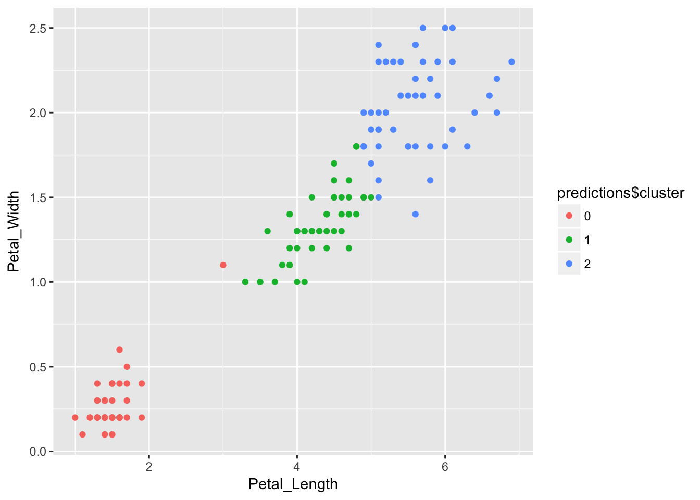

We are excited to share that [sparklyr 0.7](https://cran.r-project.org/web/packages/sparklyr/index.html) is now available on CRAN! Sparklyr provides an R interface to Apache Spark. It supports dplyr syntax for working with Spark DataFrames and exposes the full range of machine learning algorithms available in Spark. You can also learn more about Apache Spark and sparklyr in [spark.rstudio.com](http://spark.rstudio.com) and our new [webinar series on Apache Spark](https://www.rstudio.com/resources/webinars/introducing-an-r-interface-for-apache-spark/). Features in this release:

- Adds support for **ML Pipelines** which provide a uniform set of high-level APIs to help create, tune, and deploy machine learning pipelines at scale.
- Enhances **Machine Learning** capabilities by supporting the full range of ML algorithms and feature transformers.
- Improves **Data Serialization**, specifically by adding support for date columns.
- Adds support for [YARN cluster mode](https://spark.rstudio.com/guides/connections/#cluster-mode) connections.
- Adds various other improvements as listed in the [NEWS](https://spark.rstudio.com/news/) file.

In this blog post, we highlight Pipelines, new ML functions, and enhanced support for data serialization. To follow along in the examples below, you can upgrade to the latest stable version from CRAN with:

```r
install.packages("sparklyr")
```

## ML Pipelines

The [ML Pipelines](https://spark.apache.org/docs/latest/ml-pipeline.html) API is a high-level interface for building ML workflows in Spark. Pipelines provide a uniform approach to compose feature transformers and ML routines, and are interoperable across the different Spark APIs (R/sparklyr, Scala, and Python.)

First, let's go over a quick overview of terminology. A `Pipeline` consists of a sequence of  stages---`PipelineStage`s---that act on some data in order. A `PipelineStage` can be either a `Transformer` or an `Estimator`. A `Transformer` takes a data frame and returns a transformed data frame, whereas an `Estimator` take a data frame and returns a `Transformer`. You can think of an `Estimator` as an algorithm that can be fit to some data, e.g. the ordinary least squares (OLS) method, and a `Transformer` as the fitted model, e.g. the linear formula that results from OLS. A `Pipeline` is itself a `PipelineStage` and can be an element in another `Pipeline`. Lastly, a `Pipeline` is always an `Estimator`, and its fitted form is called `PipelineModel` which is a `Transformer`.

Let's look at some examples of creating pipelines. We establish a connection and copy some data to Spark:

```r
library(sparklyr)
library(dplyr)

# If needed, install Spark locally via `spark_install()`
sc <- spark_connect(master = "local")
iris_tbl <- copy_to(sc, iris)

# split the data into train and validation sets
iris_data <- iris_tbl %>%
  sdf_partition(train = 2/3, validation = 1/3, seed = 123)
```

Then, we can create a new `Pipeline` with `ml_pipeline()` and add stages to it via the `%>%` operator. Here we also define a transformer using dplyr transformations using the newly available `ft_dplyr_transformer()`.

```r
pipeline <- ml_pipeline(sc) %>%
  ft_dplyr_transformer(
    iris_data$train %>%
      mutate(Sepal_Length = log(Sepal_Length),
             Sepal_Width = Sepal_Width ^ 2)
  ) %>%
  ft_string_indexer("Species", "label")
pipeline
```
```
## Pipeline (Estimator) with 2 stages
## <pipeline_c75757b824f> 
##   Stages 
##   |--1 SQLTransformer (Transformer)
##   |    <dplyr_transformer_c757fa84cca> 
##   |     (Parameters -- Column Names)
##   |--2 StringIndexer (Estimator)
##   |    <string_indexer_c75307cbfec> 
##   |     (Parameters -- Column Names)
##   |      input_col: Species
##   |      output_col: label
##   |     (Parameters)
##   |      handle_invalid: error
```

Under the hood, `ft_dplyr_transformer()` extracts the SQL statements associated with the input and creates a Spark `SQLTransformer`, which can then be applied to new datasets with the appropriate columns.
We now fit the `Pipeline` with `ml_fit()` then transform some data using the resulting `PipelineModel` with `ml_transform()`.

```r
pipeline_model <- pipeline %>%
  ml_fit(iris_data$train)

# pipeline_model is a transformer
pipeline_model %>%
  ml_transform(iris_data$validation) %>%
  glimpse()
```
```
## Observations: ??
## Variables: 6
## $ Petal_Length <dbl> 1.4, 1.3, 1.3, 1.0, 1.6, 1.9, 3.3, 4.5, 1.6, 1.5,...
## $ Petal_Width  <dbl> 0.2, 0.2, 0.2, 0.2, 0.2, 0.2, 1.0, 1.7, 0.2, 0.2,...
## $ Species      <chr> "setosa", "setosa", "setosa", "setosa", "setosa",...
## $ Sepal_Length <dbl> 1.482, 1.482, 1.482, 1.526, 1.548, 1.569, 1.589, ...
## $ Sepal_Width  <dbl> 8.41, 9.00, 10.24, 12.96, 10.24, 11.56, 5.76, 6.2...
## $ label        <dbl> 1, 1, 1, 1, 1, 1, 0, 2, 1, 1, 1, 0, 1, 1, 1, 1, 1...
```

### A predictive modeling pipeline

Now, let's try to build a classification pipeline on the `iris` dataset.

Spark ML algorithms require that the label column be encoded as numeric and predictor columns be encoded as one vector column. We'll build on the pipeline we created in the previous section, where we have already included a `StringIndexer` stage to encode the label column.

```r
# define stages
# vector_assember will concatenate the predictor columns into one vector column
vector_assembler <- ft_vector_assembler(
  sc, 
  input_cols = setdiff(colnames(iris_data$train), "Species"), 
  output_col = "features"
)
logistic_regression <- ml_logistic_regression(sc)

# obtain the labels from the fitted StringIndexerModel
labels <- pipeline_model %>%
  ml_stage("string_indexer") %>%
  ml_labels()

# IndexToString will convert the predicted numeric values back to class labels
index_to_string <- ft_index_to_string(sc, "prediction", "predicted_label", 
                                      labels = labels)

# construct a pipeline with these stages
prediction_pipeline <- ml_pipeline(
  pipeline, # pipeline from previous section
  vector_assembler, 
  logistic_regression,
  index_to_string
)

# fit to data and make some predictions
prediction_model <- prediction_pipeline %>%
  ml_fit(iris_data$train)
predictions <- prediction_model %>%
  ml_transform(iris_data$validation)
predictions %>%
  select(Species, label:predicted_label) %>%
  glimpse()
```
```
## Observations: ??
## Variables: 7
## $ Species         <chr> "setosa", "setosa", "setosa", "setosa", "setos...
## $ label           <dbl> 1, 1, 1, 1, 1, 1, 0, 2, 1, 1, 1, 0, 1, 1, 1, 1...
## $ features        <list> [<1.482, 8.410, 1.400, 0.200>, <1.482, 9.000,...
## $ rawPrediction   <list> [<-67.48, 2170.98, -2103.49>, <-124.4, 2365.8...
## $ probability     <list> [<0, 1, 0>, <0, 1, 0>, <0, 1, 0>, <0, 1, 0>, ...
## $ prediction      <dbl> 1, 1, 1, 1, 1, 1, 0, 2, 1, 1, 1, 0, 1, 1, 1, 1...
## $ predicted_label <chr> "setosa", "setosa", "setosa", "setosa", "setos...
```

### Model persistence

Another benefit of pipelines is reusability across programing languages and easy deployment to production. We can save a pipeline from R as follows:

```r
ml_save(prediction_model, "path/to/prediction_model")
```

When you call `ml_save()` on a `Pipeline` or `PipelineModel` object, all of the information required to recreate it will be saved to disk. You can then load it in the future to, in the case of a `PipelineModel`, make predictions or, in the case of a `Pipeline`, retrain on new data.

## Machine learning

Sparklyr 0.7 introduces more than 20 new feature transformation and machine learning functions to include the full set of [Spark ML](https://spark.rstudio.com/reference/#section-spark-machine-learning) algorithms. We highlight just a couple here.

### Bisecting K-means

Bisecting k-means is a variant of k-means that can sometimes be much faster to train. Here we show how to use `ml_bisecting_kmeans()` with `iris` data.

```r
library(ggplot2)
model <- ml_bisecting_kmeans(iris_tbl, Species ~ Petal_Length + Petal_Width, k = 3, seed = 123)
predictions <- ml_predict(model, iris_tbl) %>%
  collect() %>%
  mutate(cluster = as.factor(prediction))
ggplot(predictions, aes(
  x = Petal_Length, 
  y = Petal_Width, 
  color = predictions$cluster)
) + 
  geom_point()
```



### Frequent pattern mining

`ml_fpgrowth()` enables [frequent pattern mining](https://en.wikipedia.org/wiki/Association_rule_learning) at scale using the FP-Growth algorithm. See the [Spark ML documentation](https://spark.apache.org/docs/2.2.0/ml-frequent-pattern-mining.html) for more details. Here we briefly showcase the sparklyr API.

```r
# create an item purchase history dataset
items <- data.frame(items = c("1,2,5", "1,2,3,5", "1,2"),
                    stringsAsFactors = FALSE)

# parse into vector column
items_tbl <- copy_to(sc, items) %>%
  mutate(items = split(items, ","))

# fit the model
fp_model <- items_tbl %>%
  ml_fpgrowth(min_support = 0.5, min_confidence = 0.6)

# use the model to predict related items based on
#  learned association rules
fp_model %>%
  ml_transform(items_tbl) %>%
  collect() %>%
  mutate_all(function(x) sapply(x, paste0, collapse = ","))
```
```
## # A tibble: 3 x 2
##   items   prediction
##   <chr>   <chr>     
## 1 1,2,5   ""        
## 2 1,2,3,5 ""        
## 3 1,2     5
```

## Data serialization

Various improvements were made to better support serialization and collection of data frames. Most notably, dates are now supported:

```r
copy_to(sc, nycflights13::flights) %>%
  select(carrier, flight, time_hour)
```
```
## # Source:   lazy query [?? x 3]
## # Database: spark_connection
##    carrier flight time_hour          
##    <chr>    <int> <dttm>             
##  1 UA        1545 2013-01-01 05:00:00
##  2 UA        1714 2013-01-01 05:00:00
##  3 AA        1141 2013-01-01 05:00:00
##  4 B6         725 2013-01-01 05:00:00
##  5 DL         461 2013-01-01 06:00:00
##  6 UA        1696 2013-01-01 05:00:00
##  7 B6         507 2013-01-01 06:00:00
##  8 EV        5708 2013-01-01 06:00:00
##  9 B6          79 2013-01-01 06:00:00
## 10 AA         301 2013-01-01 06:00:00
## # ... with more rows
```

We can't wait to see what you'll build with the new features! As always, comments, issue reports, and contributions are welcome on the [sparklyr GitHub repo](https://github.com/rstudio/sparklyr).

