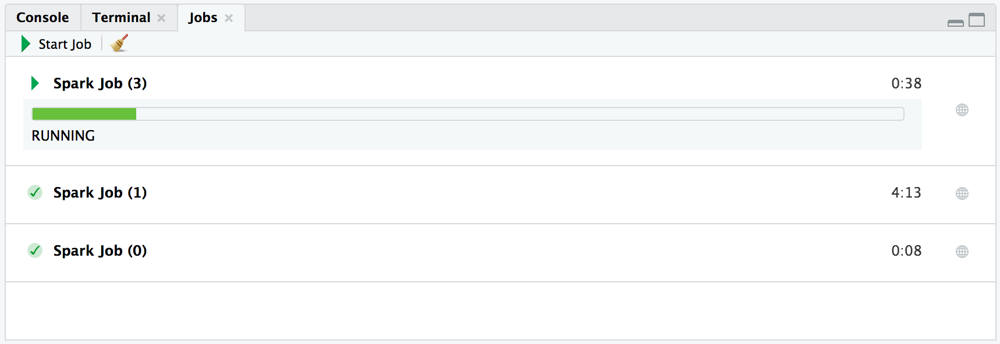

Today we are excited to share that a new release of [sparklyr](https://spark.rstudio.com/) is [available on CRAN](https://CRAN.R-project.org/package=sparklyr)! This `0.9` release enables you to:

- Create Spark structured **streams** to process real time data from many data sources using [dplyr](https://dplyr.tidyverse.org/), [SQL](https://CRAN.R-project.org/package=DBI), [pipelines](https://spark.rstudio.com/guides/pipelines/), and arbitrary R code.
- Monitor connection progress with upcoming [RStudio Preview 1.2](https://www.rstudio.com/products/rstudio/download/preview/) features and support for properly **interrupting** Spark jobs from R.
- Use **Kubernetes** clusters with `sparklyr` to simplify deployment and maintenance.

In addition, `sparklyr 0.9` adds support for **Spark 2.3.1** and **Spark 2.2.3** and [extends](https://github.com/rstudio/sparklyr/blob/master/NEWS.md#broom) [broom](https://broom.tidyverse.org/) models in `sparklyr`. An extensive list of improvements and fixes is available in the [sparklyr NEWS](https://github.com/rstudio/sparklyr/blob/master/NEWS.md) file.

## Streams

Spark [structured streams](https://spark.apache.org/docs/latest/structured-streaming-programming-guide.html) provide parallel and fault-tolerant data processing, useful when analyzing real time data. You create a stream in `sparklyr` by defining sources, transformations and a destination:

- The **sources** are defined using any of the `stream_read_*()` functions to read streams of data from various data sources.
- The **transformations** can be specified using `dplyr`, `SQL`, scoring pipelines or R code through `spark_apply()`.
- The **destination** is defined with the `stream_write_*()` functions, it is often also referenced as a sink.

For instance, after connecting with `sc <- spark_connect(master = "local")`, the simplest stream we can define is one to continuously copy text files between a `source` folder and a `destination` folder as follows:

```r
stream_read_text(sc, "source/") %>% stream_write_text("destination/")
```
```
Stream: 1857a67b-38f7-4f78-8a4c-959594bf0c70
Status: Waiting for next trigger
Active: TRUE
```

Once this is executed, `sparklyr` creates the stream and starts running it; the stream will be destroyed when the R session terminates or when `stream_stop()` is called on the stream instance.

There are many useful use cases for streams. For example, you can use streams to analyze access logs in an Amazon S3 bucket in real time. The following example creates a stream over an S3 bucket containing access logs, parses the log entries using the [webreadr](https://CRAN.R-project.org/package=webreadr) through [spark_apply()](https://spark.rstudio.com/guides/distributed-r/), finds the most accessed objects using `dplyr` and, writes the results into an in-memory data frame:

```r
urls_stream <- stream_read_text(sc, "s3a://your-s3-bucket/") %>%
  spark_apply(
    ~webreadr::read_s3(paste(c(.x$line, ""), collapse = "\n")),
    columns = lapply(webreadr::read_s3("\n"), class)
  ) %>%
  group_by(uri) %>%
  summarize(n = n()) %>%
  arrange(desc(n)) %>%
  stream_write_memory("urls_stream", mode = "complete")
```

Now that the `urls_stream` is running, we can view data being processed through:

```r
stream_view(urls_stream)
```


You can also easily display streaming data using [Shiny](https://shiny.rstudio.com/). Use the `sparklyr::reactiveSpark()` function to create a Shiny reactive from streaming data that can then be used to interact with other Shiny components and visualizations.

For instance, we can create a Shiny app using Spark streams that counts words from text files under a `source/` folder as follows:

```r
library(shiny)
library(sparklyr)
library(ggplot2)
library(dplyr)

sc <- spark_connect(master = "local")

dir.create("source")
reactiveCount <- stream_read_text(sc, "source/") %>%
    ft_tokenizer("line", "tokens") %>%
    ft_stop_words_remover("tokens", "words") %>%
    transmute(words = explode(words)) %>%
    filter(nchar(words) > 0) %>%
    group_by(words) %>%
    summarize(n = n()) %>%
    arrange(desc(n)) %>%
    filter(n > 100) %>%
    reactiveSpark()

ui <- fluidPage(plotOutput("wordsPlot"))

server <- function(input, output) {
    output$wordsPlot <- renderPlot({
        reactiveCount() %>%
          head(n=10) %>%
          ggplot() + aes(x=words, y=n) + geom_bar(stat="identity")
    })
}

shinyApp(ui = ui, server = server)
```

We can then write Jane Austen's books to this folder starting with `writeLines(janeaustenr::emma, "source/emma.txt")` and similar code for the remaining ones, each time a book is saved, the Shiny app updates accordingly:


You can learn more about `sparklyr` streaming at <https://spark.rstudio.com/guides/streaming/>.

## Monitoring and Interrupting Jobs

In `sparklyr 0.9`, you can now gracefully interrupt long-running operations and reuse the Spark connection to execute other operations. This is useful when you execute a query or modeling function that is taking longer than expected, or when you didn't quite execute the code you wanted to. For example:

```r
# Stop the following long-running operation with `ctrl+c` or 'stop' in RStudio
sdf_len(sc, 10) %>% spark_apply(~ Sys.sleep(60 * 10))

# Start a new operation without having to restart the Spark context.
sdf_len(sc, 10)
```

While running `sparklyr 0.9` under [RStudio Preview 1.2](https://www.rstudio.com/products/rstudio/download/preview/), long running jobs will be displayed in the console tab and under the Jobs panel:



## Kubernetes

`sparklyr 0.9` enables support for Kubernetes. A cluster from a properly configured client can be launched as follows:

```r
sc <- spark_connect(config = spark_config_kubernetes("k8s://hostname:8443"))
```

Please note that Spark on Kubernetes requires a proper container image, see `?spark_config_kubernetes` for details. In addition, Kubernetes support [was just added in Spark 2.3.0](https://spark.apache.org/docs/2.3.0/running-on-kubernetes.html) and the Kubernetes scheduler is currently experimental in Spark.

We hope you enjoy all new features in sparklyr 0.9! You can read more about these features and others at <https://spark.rstudio.com/>, get help from the R community at <https://community.rstudio.com/tags/sparklyr>, and report issues with sparklyr at  <https://github.com/rstudio/sparklyr>.

