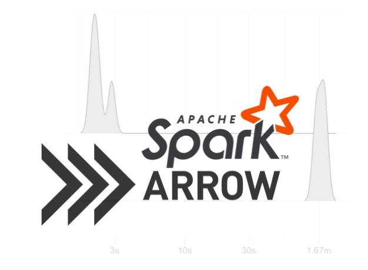

With much excitement built over the past three years, we are thrilled to share that [sparklyr](https://github.com/rstudio/sparklyr) `1.0` is now available on [CRAN](https://CRAN.R-project.org/package=sparklyr)!

The `sparklyr` package provides an R interface to [Apache Spark](http://spark.apache.org). It supports [dplyr](https://dplyr.tidyverse.org/), [MLlib](https://spark.apache.org/mllib/), [streaming](https://spark.rstudio.com/guides/streaming/), [extensions](https://spark.rstudio.com/extensions/) and many other features; however, this particular release enables the following new features:

- **[Arrow](#arrow)** enables **faster** and **larger** data transfers between Spark and R.
- **[XGBoost](#xgboost)** enables training **gradient boosting** models over distributed datasets.
- **[Broom](#broom)** converts Spark's models into **tidy** formats that you know and love.
- **[TFRecords](#tfrecords)** writes TensorFlow records from Spark to support **deep learning** workflows.

This release also brings support for [Spark 2.4](https://spark.apache.org/releases/spark-release-2-4-0.html), the ability to collect and copy in batches, increased Livy performance, and many more improvements listed in the sparklyr [NEWS](https://github.com/rstudio/sparklyr/blob/master/NEWS.md) file. You can install `sparklyr 1.0` from CRAN as follows:

```r
install.packages("sparklyr")
```

## Arrow

[Apache Arrow](https://arrow.apache.org/) is a cross-language development platform for in-memory data, you can read more about this in the [Arrow and beyond](https://blog.rstudio.com/2018/04/19/arrow-and-beyond/) blog post. In `sparklyr 1.0`,  we are embracing Arrow as an efficient bridge between R and Spark, conceptually:


In practice, this means faster data transfers and support for larger datasets; specifically, this improves `collect()`, `copy_to()` and `spark_apply()`. The following benchmarks make use of the [bench](http://bench.r-lib.org/) package to measure performance with and without `arrow`.

We will first benchmark `copy_to()` over a dataframe with 1M and 10M rows. Notice that, with the default memory configuration, `copy_to()` can't handle 10M rows while `arrow` can.

```r
library(sparklyr)
sc <- spark_connect(master = "local")

bench::press(rows = c(10^6, 10^7), {
  bench::mark(
    arrow_on = {
      library(arrow)
      sparklyr_df <<- copy_to(sc, data.frame(y = 1:rows), overwrite = T)
    },
    arrow_off = if (rows <= 10^6) {
      if ("arrow" %in% .packages()) detach("package:arrow")
      sparklyr_df <<- copy_to(sc, data.frame(y = 1:rows), overwrite = T)
    } else NULL, iterations = 4, check = FALSE)
})
```


Next, we will benchmark `collect()` over 10M and 50M records; collecting 50M+ records is only possible with `arrow`.

```r
bench::press(rows = c(10^7, 5 * 10^7), {
  bench::mark(
    arrow_on = {
      library(arrow)
      collected <- sdf_len(sc, rows) %>% collect()
    },
    arrow_off = if (rows <= 10^7) {
      if ("arrow" %in% .packages()) detach("package:arrow")
      collected <- sdf_len(sc, rows) %>% collect()
    } else NULL, iterations = 4, check = FALSE)
})
```


Last but not least, `spark_apply()` over 100K and 1M rows shows the most significant improvements. A **40x speedup** when running R on Spark, additional details are available in the Arrow project [post](https://arrow.apache.org/blog/2019/01/25/r-spark-improvements/).

```r
bench::press(rows = c(10^5, 10^6), {
  bench::mark(
    arrow_on = {
      library(arrow)
      sdf_len(sc, rows) %>% spark_apply(~ .x / 2) %>% dplyr::count() %>% collect
    },
    arrow_off = if (rows <= 10^5) {
      if ("arrow" %in% .packages()) detach("package:arrow")
      sdf_len(sc, rows) %>% spark_apply(~ .x / 2) %>% dplyr::count() %>% collect
    } else NULL, iterations = 4, check = FALSE)
})
```


To use `arrow`, you will first have to install the Apache Arrow runtime followed by installing the R `arrow` package, additional instructions are available under [spark.rstudio.com/guides/arrow](https://spark.rstudio.com/guides/arrow).

## XGBoost

[sparkxgb](https://github.com/rstudio/sparkxgb) is a new `sparklyr` extension that can be used to train [XGBoost](https://xgboost.ai/) models in Spark. `sparkxgb` is available on CRAN and can be installed as follows:

```r
install.packages("sparkxgb")
```

We can then use `xgboost_classifier()` to train and `ml_predict()` to predict over large datasets with ease:

```r
library(sparkxgb)
library(sparklyr)
library(dplyr)

sc <- spark_connect(master = "local")
iris <- copy_to(sc, iris)

xgb_model <- xgboost_classifier(iris,
                                Species ~ .,
                                num_class = 3,
                                num_round = 50,
                                max_depth = 4)

xgb_model %>%
  ml_predict(iris) %>%
  select(Species, predicted_label, starts_with("probability_")) %>%
  glimpse()
```
```
#> Observations: ??
#> Variables: 5
#> Database: spark_connection
#> $ Species                <chr> "setosa", "setosa", "setosa", "setosa", "…
#> $ predicted_label        <chr> "setosa", "setosa", "setosa", "setosa", "…
#> $ probability_versicolor <dbl> 0.003566429, 0.003564076, 0.003566429, 0.…
#> $ probability_virginica  <dbl> 0.001423170, 0.002082058, 0.001423170, 0.…
#> $ probability_setosa     <dbl> 0.9950104, 0.9943539, 0.9950104, 0.995010…
```

You can read more about `sparkxgb` under its [README](https://github.com/rstudio/sparkxgb#sparkxgb) file. Note that Windows is currently unsupported.

## Broom

While support for [broom](https://broom.tidyverse.org/) in Spark through `sparklyr` has been under development for quite some time, this release marks the completion of all modeling functions. For instance, we can now augment using an ALS model with ease:

```r
movies <- data.frame(user   = c(1, 2, 0, 1, 2, 0),
                     item   = c(1, 1, 1, 2, 2, 0),
                     rating = c(3, 1, 2, 4, 5, 4))

copy_to(sc, movies) %>%
  ml_als(rating ~ user + item) %>%
  augment()
```
```
# Source: spark<?> [?? x 4]
   user  item rating .prediction
  <dbl> <dbl>  <dbl>       <dbl>
1     2     2      5        4.86
2     1     2      4        3.98
3     0     0      4        3.88
4     2     1      1        1.08
5     0     1      2        2.00
6     1     1      3        2.80
```

## TFRecords

[sparktf](https://github.com/rstudio/sparktf) is a new `sparklyr` extension allowing you to write TensorFlow records in Spark. This can be used to preprocess large amounts of data before processing them in GPU instances with Keras or TensorFlow. `sparktf` is now available on CRAN and can be installed as follows:

```r
install.packages("sparktf")
```

You can simply preprocess data in Spark and write it as TensorFlow records using `spark_write_tf()`:

```r
library(sparktf)
library(sparklyr)

sc <- spark_connect(master = "local")

copy_to(sc, iris) %>%
  ft_string_indexer_model(
    "Species", "label",
    labels = c("setosa", "versicolor", "virginica")
  ) %>%
  spark_write_tfrecord(path = "tfrecord")
```

You can then use TensorFlow and Keras from R to load this recordset and train deep learning models; for instance, using [tfrecord_dataset()](https://tensorflow.rstudio.com/tools/tfdatasets/reference/tfrecord_dataset.html). Please read the `sparktf` [README](https://github.com/rstudio/sparktf#sparktf) for more details.

## [Moar](https://i.kym-cdn.com/entries/icons/original/000/000/574/moar-cat.jpg)?

When connecting to Spark running in YARN, RStudio's connection pane can now launch YARN's web application.


We also made it possible to copy and collect larger datasets by using callbacks. For instance, you can collect data incrementally in batches of 100K rows; this is configurable through the `sparklyr.collect.batch` setting. The following example collects 300K rows using batches and prints the total records collected; in practice, you save and load from disk.

```r
sdf_len(sc, 3 * 10^5) %>% collect(
  callback = ~message("(", .y, ") Collecting ", nrow(.x), " rows.")
)
```
```
(1) Collecting 100000 rows.
(2) Collecting 100000 rows.
(3) Collecting 100000 rows.
```

For Livy connections, performance is improved when setting the `spark_version` parameter in `livy_config()`, this allows `sparklyr` to start a connection using JARs instead of loading sources.

In addition, [extensions](https://spark.rstudio.com/extensions/#examples) are now also supported in Livy. For example, you can run pagerank with Livy and [graphframes](https://github.com/rstudio/graphframes) as follows:

```r
library(graphframes)
library(sparklyr)

livy_service_start()
sc <- spark_connect(master = "local", method = "livy", version = "2.4.0")

gf_pagerank(gf_friends(sc), tol = 0.01, reset_probability = 0.15)
```
```
GraphFrame
Vertices:
  Database: spark_connection
  $ id       <chr> "f", "g", "a", "e", "d", "b", "c"
  $ name     <chr> "Fanny", "Gabby", "Alice", "Esther", "David", "Bob", "Charlie"
  $ age      <int> 36, 60, 34, 32, 29, 36, 30
  $ pagerank <dbl> 0.3283607, 0.1799821, 0.4491063, 0.3708523, 0.3283607, 2.6555078, 2.6878300
Edges:
  Database: spark_connection
  $ src          <chr> "a", "b", "e", "e", "c", "a", "f", "d"
  $ dst          <chr> "b", "c", "f", "d", "b", "e", "c", "a"
  $ relationship <chr> "friend", "follow", "follow", "friend", "follow", "friend", "follow", "friend"
  $ weight       <dbl> 0.5, 1.0, 0.5, 0.5, 1.0, 0.5, 1.0, 1.0
```

The [sparklyr NEWS](https://github.com/rstudio/sparklyr/blob/master/NEWS.md) contains a complete list of changes and features for this release. To catch up on previously released features, you can read the blog posts that got us here:

- [sparklyr 0.9](https://blog.rstudio.com/2018/10/01/sparklyr-0-9/): Streams and Kubernetes.
- [sparklyr 0.8](https://blog.rstudio.com/2018/05/14/sparklyr-0-8/): Production pipelines and graphs.
- [sparklyr 0.7](https://blog.rstudio.com/2018/01/29/sparklyr-0-7/): Spark Pipelines and Machine Learning.
- [sparklyr 0.6](https://blog.rstudio.com/2017/07/31/sparklyr-0-6/): Distributed R and external sources.
- [sparklyr 0.5](https://blog.rstudio.com/2017/01/24/sparklyr-0-5/): Livy and dplyr improvements.
- [sparklyr 0.4](https://blog.rstudio.com/2016/09/27/sparklyr-r-interface-for-apache-spark/): R interface for Apache Spark.

We hope you enjoy this exciting release!

