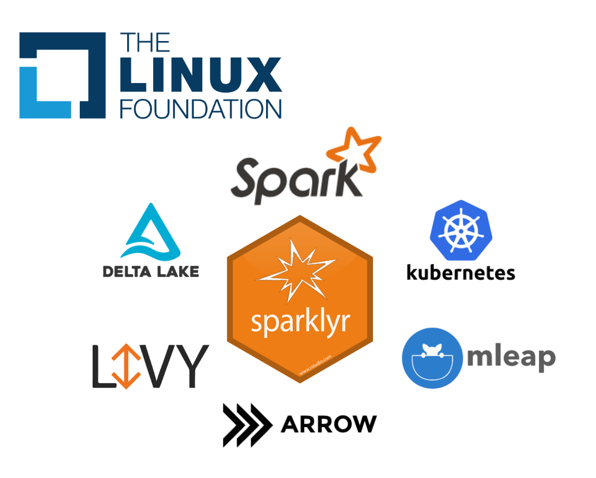
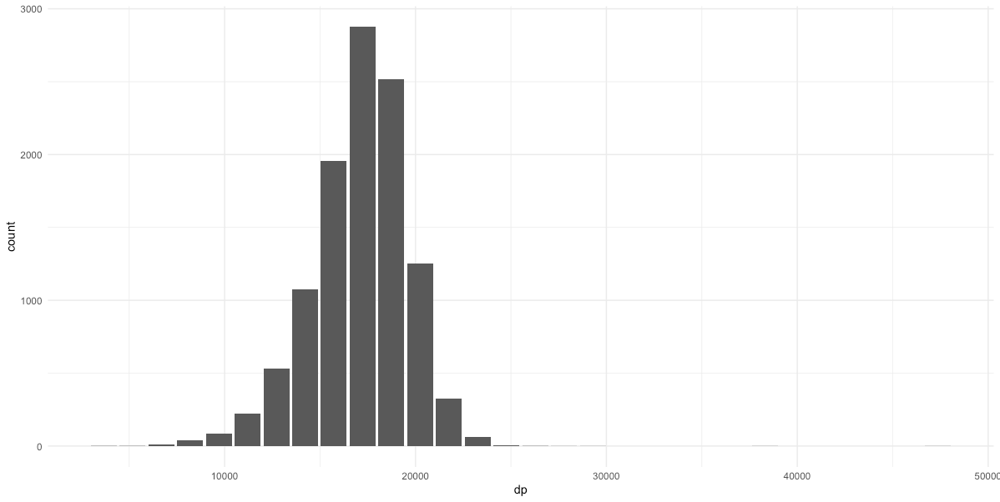
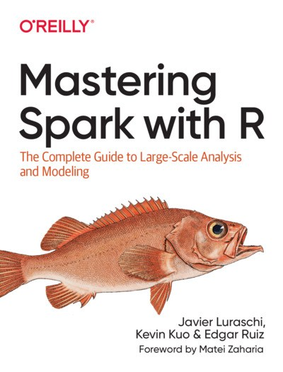

Today we are excited to share that [sparklyr](https://github.com/sparklyr/sparklyr) `1.1` is now available on [CRAN](https://CRAN.R-project.org/package=sparklyr)!

In a nutshell, you can use sparklyr to scale datasets across computing clusters running [Apache Spark](http://spark.apache.org). For this particular release, we would like to highlight the following new features:

- **[Delta Lake](#delta-lake)** enables database-like properties in Spark.
- **[Spark 3.0](#spark-3-0)** preview is now available through sparklyr. 
- **[Barrier Execution](#barrier-execution)** paves the way to use Spark with deep learning frameworks.
- **[Qubole](#qubole)** clusters running Spark can be easily used with sparklyr.

In addition, new community **[Extensions](#extensions)** enable natural language processing and genomics, sparklyr is now being hosted within the **[Linux Foundation](#linux-foundation)**, and the **[Mastering Spark with R](#mastering-spark-with-r)** book is now available and free-to-use online.

You can install `sparklyr 1.1` from CRAN as follows:

```r
install.packages("sparklyr")
```

## Delta Lake

The [Delta Lake](https://delta.io/) project is an open-source storage layer that brings [ACID transactions](https://en.wikipedia.org/wiki/ACID) to Apache Spark. To use Delta Lake, first connect using the new `packages` parameter set to `"delta"`.

```r
library(sparklyr)
sc <- spark_connect(master = "local", version = "2.4", packages = "delta")
```

As a simple example, let's write a small data frame to Delta using `spark_write_delta()`, overwrite it, and then read it back with  `spark_read_delta()`:

```r
sdf_len(sc, 5) %>% spark_write_delta(path = "delta-test")
sdf_len(sc, 3) %>% spark_write_delta(path = "delta-test", mode = "overwrite")

spark_read_delta(sc, "/tmp/delta-1")
```
```
# Source: spark<delta1> [?? x 1]
     id
  <int>
1     1
2     2
3     3
```

Now, since Delta is capable of tracking all versions of your data, you can easily time travel to retrieve the version that we overwrote:

```r
spark_read_delta(sc, "delta-test", version = 0L)
```
```
# Source: spark<delta1> [?? x 1]
     id
  <int>
1     1
2     2
3     3
4     4
5     5
```

## Spark 3.0

To install and try out Spark 3.0 preview, simply run:

```r
library(sparklyr)
spark_install("3.0.0-preview")

sc <- spark_connect(master = "local", version = "3.0.0-preview")
```

You can then preview upcoming features, like the ability to read binary files. To demonstrate this, we can use [pins](https://blog.rstudio.com/2019/09/09/pin-discover-and-share-resources/) to download a 237MB subset of [ImageNet](http://www.image-net.org/), and then load them into Spark:

```r
tiny_imagenet <- pins::pin("http://cs231n.stanford.edu/tiny-imagenet-200.zip")
spark_read_source(sc, dirname(tiny_imagenet[1]), source = "binaryFile")
```
```
# Source: spark<images> [?? x 4]
   path                       modificationTime    length content   
   <chr>                      <dttm>               <dbl> <list>    
 1 file:images/test_2009.JPEG 2020-01-08 20:36:41   3138 < [3,138]>
 2 file:images/test_8245.JPEG 2020-01-08 20:36:43   3066 < [3,066]>
 3 file:images/test_4186.JPEG 2020-01-08 20:36:42   2998 < [2,998]>
 4 file:images/test_403.JPEG  2020-01-08 20:36:39   2980 < [2,980]>
 5 file:images/test_8544.JPEG 2020-01-08 20:36:38   2958 < [2,958]>
 6 file:images/test_5814.JPEG 2020-01-08 20:36:38   2929 < [2,929]>
 7 file:images/test_1063.JPEG 2020-01-08 20:36:41   2920 < [2,920]>
 8 file:images/test_1942.JPEG 2020-01-08 20:36:39   2908 < [2,908]>
 9 file:images/test_5456.JPEG 2020-01-08 20:36:42   2906 < [2,906]>
10 file:images/test_5859.JPEG 2020-01-08 20:36:39   2896 < [2,896]>
# … with more rows
```

Please notice that the [Spark 3.0.0 preview](https://spark.apache.org/news/spark-3.0.0-preview.html) not a stable release in terms of either API or functionality.

## Barrier Execution

Barrier execution is a new feature introduced in [Spark 2.4](https://spark.apache.org/releases/spark-release-2-4-0.html) which enables Deep Learning on Apache Spark by implementing an all-or-nothing scheduler into Apache Spark. This allows Spark to not only process analytic workflows, but also to use Spark as a high-performance computing cluster where other framework, like [OpenMP](https://www.openmp.org/) or [TensorFlow Distributed](https://www.tensorflow.org/guide/distributed_training), can reuse cluster machines and have them directly communicate with each other for a given task.

In general, we don't expect most users to use this feature directly; instead, this is a feature relevant to advanced users interested in creating extensions that support additional modeling frameworks. You can learn more about barrier execution in Reynold Xin's [keynote](https://vimeo.com/274267107).

To use barrier execution from R, set the `barrier = TRUE` parameter in `spark_apply()` and then make use of a new  parameter in the R closure to retrieve the network address of the additional nodes available for this task. A simple example follows:

```r
library(sparklyr)
sc <- spark_connect(master = "local", version = "2.4")

sdf_len(sc, 1, repartition = 1) %>%
  spark_apply(~ .y$address, barrier = TRUE, columns = c(address = "character")) %>%
  collect()
```
```
# A tibble: 1 x 1
  address        
  <chr>          
1 localhost:50693
```

## Qubole

[Qubole](https://www.qubole.com/product/data-platform/) is a fully self-service multi-cloud data platform based on enterprise-grade data processing engines including Apache Spark.

If you are using Qubole clusters, you can now easily connect to a Spark through a new `"qubole"` connection method:

```r
library(sparklyr)
sc <- spark_connect(method = "qubole")
```

Once connected, you can use Spark and R as usual. To learn more, visit [RStudio for Running Distributed R Jobs](https://docs.qubole.com/en/latest/user-guide/engines/spark/rstudio_spark.html).

## Extensions

The new [github.com/r-spark](https://github.com/r-spark) repo contains new community extensions. To mention a few, [variantspark](https://CRAN.R-project.org/package=variantspark) and [sparkhail](https://CRAN.R-project.org/package=sparkhail ) are two new extensions for genomic research, [sparknlp](https://github.com/r-spark/sparknlp) adds support for natural language processing.

For those of you with background in genomics, you can use `sparkhail` by first installing this extension from CRAN. Followed by connecting to Spark, creating a Hail Context, and then loading a subset of the [1000 Genomes](https://www.internationalgenome.org/data/) dataset using [Hail](https://hail.is/):

```r
library(sparklyr)
library(sparkhail)

sc <- spark_connect(master = "local", version = "2.4", config = hail_config())
hc <- hail_context(sc)

hail_data <- pins::pin("https://github.com/r-spark/sparkhail/blob/master/inst/extdata/1kg.zip?raw=true")

hail_df <- hail_read_matrix(hc, file.path(dirname(hail_data[1]), "1kg.mt")) %>%
  hail_dataframe()
```

You can then analyze it with packages like `dplyr`, `sparklyr.nested`, and `dbplot`:

```r
library(dplyr)

sdf_separate_column(hail_df, "alleles") %>% 
  group_by(alleles_1, alleles_2) %>% 
  tally() %>% 
  arrange(-n)
```
```
# Source:     spark<?> [?? x 3]
# Groups:     alleles_1
# Ordered by: -n
   alleles_1 alleles_2     n
   <chr>     <chr>     <dbl>
 1 C         T          2436
 2 G         A          2387
 3 A         G          1944
 4 T         C          1879
 5 C         A           496
 6 G         T           480
 7 T         G           468
 8 A         C           454
 9 C         G           150
10 G         C           112
# … with more rows
```

Notice that these frequencies come in pairs, C/T and G/A are actually the same mutation, just viewed from opposite strands. You can then create a histogram over the DP field, depth of the proband, as follows:

```r
sparklyr.nested::sdf_select(hail_df, dp = info.DP) %>%
  dbplot::dbplot_histogram(dp)
```



This code was adapted from Hail's [Genome Wide Association-Study](https://hail.is/docs/0.2/tutorials/01-genome-wide-association-study.html). You can learn more about this Hail community extensions from [r-spark/sparkhail](https://github.com/r-spark/sparkhail).

## Linux Foundation

The [Linux Foundation](https://www.linuxfoundation.org) is home of projects such as [Linux](https://www.linuxfoundation.org/projects/linux/), [Kubernetes](https://kubernetes.io/), [Node.js](https://js.foundation/) and umbrella foundations such as [LF AI](https://lfai.foundation/), [LF Edge](https://www.lfedge.org/), and [LF Network](https://www.lfnetworking.org/). We are very excited to have sparklyr be hosted as an incubation project within LF AI alongside [Acumos](https://www.acumos.org/), [Angel](https://lfai.foundation/projects/angel-ml/), [Horovod](https://lfai.foundation/projects/horovod/), [Pyro](https://pyro.ai/), [ONNX](https://onnx.ai/) and several others.

Hosting sparklyr in LF AI within the Linux Foundation provides a neutral entity to hold the project assets and open governance. Furthermore, we believe hosting with LF AI will also help bring additional talent, ideas, and shared components from other Linux Foundation projects like [Delta Lake](https://delta.io), [Horovod](https://eng.uber.com/horovod/), [ONNX](https://onnx.ai), and so on into sparklyr as part of cross-project and cross-foundation collaboration. 

This makes it a great time for you to join the sparklyr community, contribute, and help this project grow. You can learn more about this in [sparklyr.org](https://sparklyr.org).

## Mastering Spark with R

[Mastering Spark with R](https://therinspark.com) is a new book to help you learn and master Apache Spark with R from start to finish. It introduces data analysis with well-known tools like [dplyr](https://dplyr.tidyverse.org/), and covers everything else related to processing large-scale datasets, modeling, productionizing pipelines, using extensions, distributing R code, and processing real-time data -- if you are not yet familiar with Spark, this is a great resource to get started!

<a href="https://therinspark.com"></a>

This book was published by [O'Reilly](http://shop.oreilly.com/product/0636920223764.do), is available on [Amazon](https://www.amazon.com/gp/product/149204637X), and is also free-to-use [online](https://therinspark.com/). We hope you find this book useful and easy to read.

To catch up on previous releases, take a look at the [sparklyr 1.0](https://blog.rstudio.com/2019/03/15/sparklyr-1-0/) post or watch various video tutorials in the [mlverse](https://www.youtube.com/channel/UCAwJMtPx4HgmMXEDTvZBJ4A/playlists) channel.

Thank you for reading along!

