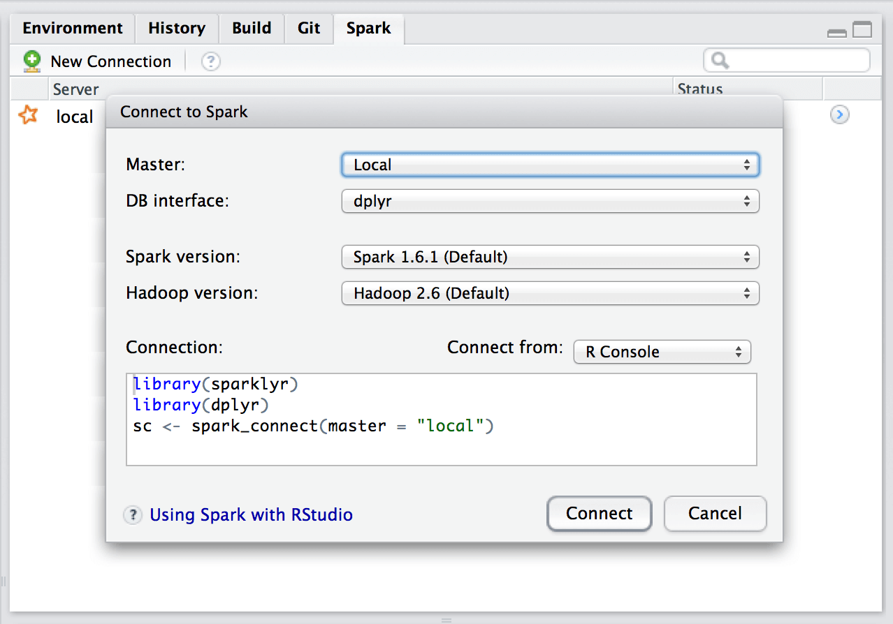

We're excited today to announce [sparklyr](http://spark.rstudio.com), a new package that provides an interface between R and [Apache Spark](http://spark.apache.org/).


Over the past couple of years we've heard time and time again that people want a native [dplyr](https://github.com/hadley/dplyr) interface to Spark, so we built one! sparklyr also provides interfaces to Spark's distributed machine learning algorithms and much more. Highlights include:

  * Interactively manipulate Spark data using both [dplyr](https://github.com/hadley/dplyr) and SQL (via DBI).

  * Filter and aggregate Spark datasets then bring them into R for analysis and visualization.

  * Orchestrate distributed machine learning from R using either [Spark MLlib](https://spark.rstudio.com/mllib.html) or [H2O SparkingWater](https://spark.rstudio.com/guides/h2o.html).

  * Create [extensions](https://spark.rstudio.com/extensions.html) that call the full Spark API and provide interfaces to Spark packages.

  * Integrated support for establishing Spark connections and browsing Spark data frames within the RStudio IDE.

We're also excited to be working with several industry partners. [IBM](http://www.ibm.com/) is incorporating sparklyr into their Data Science Experience, [Cloudera](http://www.cloudera.com/) is working with us to ensure that sparklyr meets the requirements of their enterprise customers, and [H2O](http://www.h2o.ai/) has provided an integration between sparklyr and H2O Sparkling Water.

## Getting Started

You can install sparklyr from CRAN as follows:

```r
install.packages("sparklyr")
```

You should also install a local version of Spark for development purposes:

```r
library(sparklyr)
spark_install(version = "1.6.2")
```

If you use the RStudio IDE, you should also download the latest [preview release](https://www.rstudio.com/products/rstudio/download/preview/) of the IDE which includes several enhancements for interacting with Spark.

Extensive documentation and examples are available at <http://spark.rstudio.com>.

## Connecting to Spark

You can connect to both local instances of Spark as well as remote Spark clusters. Here we'll connect to a local instance of Spark:

```r
library(sparklyr)
sc <- spark_connect(master = "local")
```

The returned Spark connection (`sc`) provides a remote dplyr data source to the Spark cluster.

## Reading Data

You can copy R data frames into Spark using the dplyr copy_to function (more typically though you'll read data within the Spark cluster using the [spark_read](https://spark.rstudio.com/dplyr.html#reading_data) family of functions). For the examples below we'll copy some datasets from R into Spark (note that you may need to install the nycflights13 and Lahman packages in order to execute this code):

```r
library(dplyr)
iris_tbl <- copy_to(sc, iris)
flights_tbl <- copy_to(sc, nycflights13::flights, "flights")
batting_tbl <- copy_to(sc, Lahman::Batting, "batting")
```

## Using dplyr

We can now use all of the available dplyr verbs against the tables within the cluster. Here's a simple filtering example:

```r
# filter by departure delay
flights_tbl %>% filter(dep_delay == 2)
```

[Introduction to dplyr](https://cran.rstudio.com/web/packages/dplyr/vignettes/introduction.html) provides additional dplyr examples you can try. For example, consider the last example from the tutorial which plots data on flight delays:

```r
delay <- flights_tbl %>%
  group_by(tailnum) %>%
  summarise(count = n(), dist = mean(distance), delay = mean(arr_delay)) %>%
  filter(count > 20, dist < 2000, !is.na(delay)) %>%
  collect()

# plot delays
library(ggplot2)
ggplot(delay, aes(dist, delay)) +
  geom_point(aes(size = count), alpha = 1/2) +
  geom_smooth() +
  scale_size_area(max_size = 2)
```


Note that while the dplyr functions shown above look identical to the ones you use with R data frames, with sparklyr they use Spark as their back end and execute remotely in the cluster.

### Window Functions

dplyr [window functions](https://cran.r-project.org/web/packages/dplyr/vignettes/window-functions.html) are also supported, for example:

```r
batting_tbl %>%
  select(playerID, yearID, teamID, G, AB:H) %>%
  arrange(playerID, yearID, teamID) %>%
  group_by(playerID) %>%
  filter(min_rank(desc(H)) <= 2 & H > 0)
```

For additional documentation on using dplyr with Spark see the [dplyr](https://spark.rstudio.com/dplyr.html) section of the sparklyr website.

## Using SQL

It's also possible to execute SQL queries directly against tables within a Spark cluster. The `spark_connection` object implements a [DBI](https://github.com/rstats-db/DBI) interface for Spark, so you can use `dbGetQuery` to execute SQL and return the result as an R data frame:

```r
library(DBI)
iris_preview <- dbGetQuery(sc, "SELECT * FROM iris LIMIT 10")
```

## Machine Learning

You can orchestrate machine learning algorithms in a Spark cluster via either [Spark MLlib](http://spark.rstudio.org/mllib.html) or via the [H2O Sparkling Water](http://spark.rstudio.org/h2o.html) extension package. Both provide a set of high-level APIs built on top of DataFrames that help you create and tune machine learning workflows.

### Spark MLlib

In this example we'll use ml_linear_regression to fit a linear regression model. We'll use the built-in `mtcars` dataset, and see if we can predict a car's fuel consumption (`mpg`) based on its weight (`wt`) and the number of cylinders the engine contains (`cyl`). We'll assume in each case that the relationship between `mpg` and each of our features is linear.

```r
# copy mtcars into spark
mtcars_tbl <- copy_to(sc, mtcars)

# transform our data set, and then partition into 'training', 'test'
partitions <- mtcars_tbl %>%
  filter(hp >= 100) %>%
  mutate(cyl8 = cyl == 8) %>%
  sdf_partition(training = 0.5, test = 0.5, seed = 1099)

# fit a linear model to the training dataset
fit <- partitions$training %>%
  ml_linear_regression(response = "mpg", features = c("wt", "cyl"))
```

For linear regression models produced by Spark, we can use `summary()` to learn a bit more about the quality of our fit, and the statistical significance of each of our predictors.

```r
summary(fit)
```

Spark machine learning supports a wide array of algorithms and feature transformations, and as illustrated above it's easy to chain these functions together with dplyr pipelines. To learn more see the [Spark MLlib](https://spark.rstudio.com/mllib.html) section of the sparklyr website.

### H2O Sparkling Water

Let's walk the same `mtcars` example, but in this case use H2O's machine learning algorithms via the [H2O Sparkling Water](https://spark.rstudio.com/guides/h2o.html) extension. The dplyr code used to prepare the data is the same, but after partitioning into test and training data we call `h2o.glm` rather than `ml_linear_regression`:

```r
# convert to h20_frame (uses the same underlying rdd)
training <- as_h2o_frame(partitions$training)
test <- as_h2o_frame(partitions$test)

# fit a linear model to the training dataset
fit <- h2o.glm(x = c("wt", "cyl"),
               y = "mpg",
               training_frame = training,
               lamda_search = TRUE)

# inspect the model
print(fit)
```

For linear regression models produced by H2O, we can use either `print()` or `summary()` to learn a bit more about the quality of our fit. The `summary()` method returns some extra information about scoring history and variable importance.

To learn more see the [H2O Sparkling Water](https://spark.rstudio.com/guides/h2o.html) section of the sparklyr website.

## Extensions

The facilities used internally by sparklyr for its dplyr and machine learning interfaces are available to extension packages. Since Spark is a general purpose cluster computing system there are many potential applications for extensions (e.g. interfaces to custom machine learning pipelines, interfaces to 3rd party Spark packages, etc.).

The [sas7bdat](https://github.com/bnosac/spark.sas7bdat) extension enables parallel reading of SAS datasets in the sas7bdat format into Spark data frames. The [rsparkling]https://spark.rstudio.com/guides/h2o.html) extension provides a bridge between sparklyr and H2O's [Sparkling Water](http://www.h2o.ai/product/sparkling-water/).

We're excited to see what other sparklyr extensions the R community creates. To learn more see the [Extensions](https://spark.rstudio.com/extensions.html) section of the sparklyr website.

## RStudio IDE

The latest RStudio [Preview Release](https://www.rstudio.com/products/rstudio/download/preview/) of the RStudio IDE includes integrated support for Spark and the sparklyr package, including tools for:

  * Creating and managing Spark connections

  * Browsing the tables and columns of Spark DataFrames

  * Previewing the first 1,000 rows of Spark DataFrames

Once you've installed the sparklyr package, you should find a new **Spark** pane within the IDE. This pane includes a **New Connection** dialog which can be used to make connections to local or remote Spark instances:



Once you've connected to Spark you'll be able to browse the tables contained within the Spark cluster:


The Spark DataFrame preview uses the standard RStudio data viewer:


The RStudio IDE features for sparklyr are available now as part of the [RStudio Preview Release](https://www.rstudio.com/products/rstudio/download/preview/). The final version of RStudio IDE that includes integrated support for sparklyr will ship within the next few weeks.

## Partners

We're very pleased to be joined in this announcement by IBM, Cloudera, and H2O, who are working with us to ensure that sparklyr meets the requirements of enterprise customers and is easy to integrate with current and future deployments of Spark.

### IBM

"With our latest contributions to Apache Spark and the release of sparklyr, we continue to emphasize R as a primary data science language within the Spark community. Additionally, we are making plans to include sparklyr in Data Science Experience to provide the tools data scientists are comfortable with to help them bring business-changing insights to their companies faster," said Ritika Gunnar, vice president of Offering Management, IBM Analytics.

### Cloudera

"At Cloudera, data science is one of the most popular use cases we see for Apache Spark as a core part of the Apache Hadoop ecosystem, yet the lack of a compelling R experience has limited data scientists' access to available data and compute," said Charles Zedlewski, vice president, Products at Cloudera. "We are excited to partner with RStudio to help bring sparklyr to the enterprise, so that data scientists and IT teams alike can get more value from their existing skills and infrastructure, all with the security, governance, and management our customers expect."

### H2O

"At H2O.ai, we've been focused on bringing the best of breed open source machine learning to data scientists working in R & Python. However, the lack of robust tooling in the R ecosystem for interfacing with Apache Spark has made it difficult for the R community to take advantage of the distributed data processing capabilities of Apache Spark.

We're excited to work with RStudio to bring the ease of use of dplyr and the distributed machine learning algorithms from H2O's Sparkling Water to the R community via the sparklyr & rsparkling packages"

