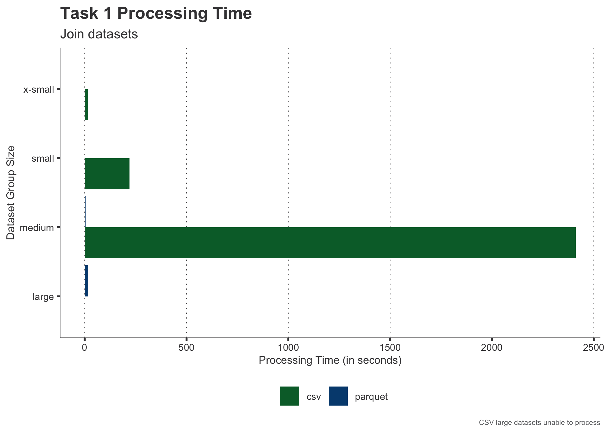
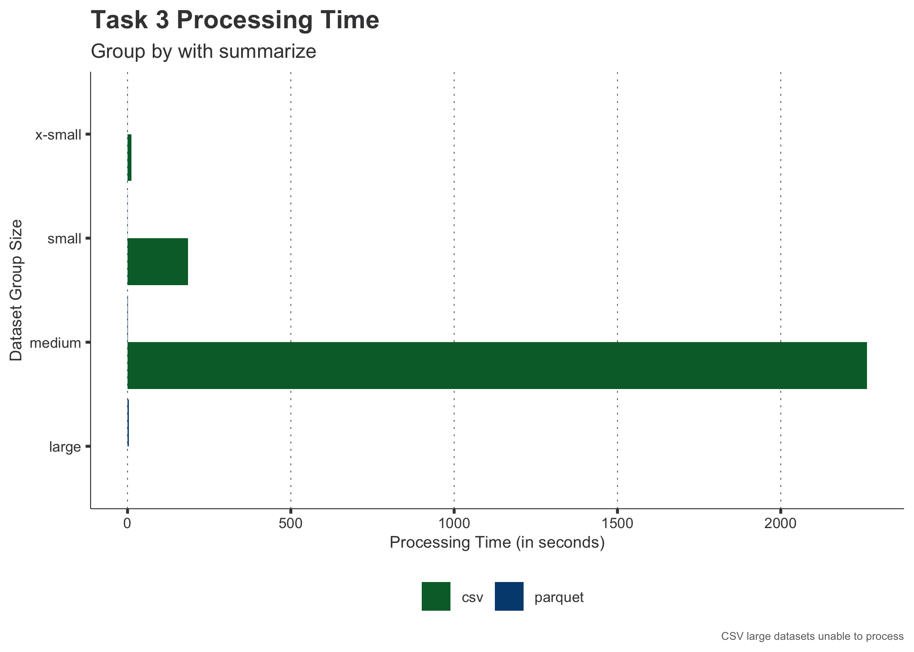
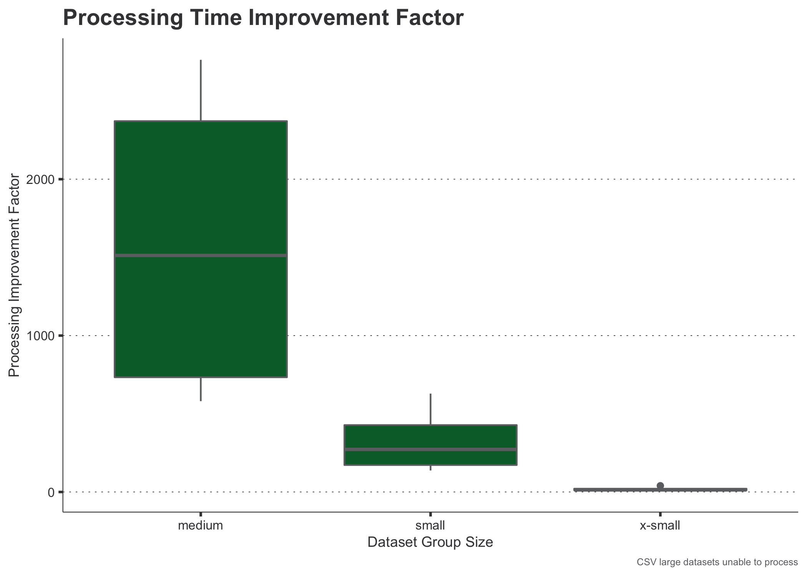
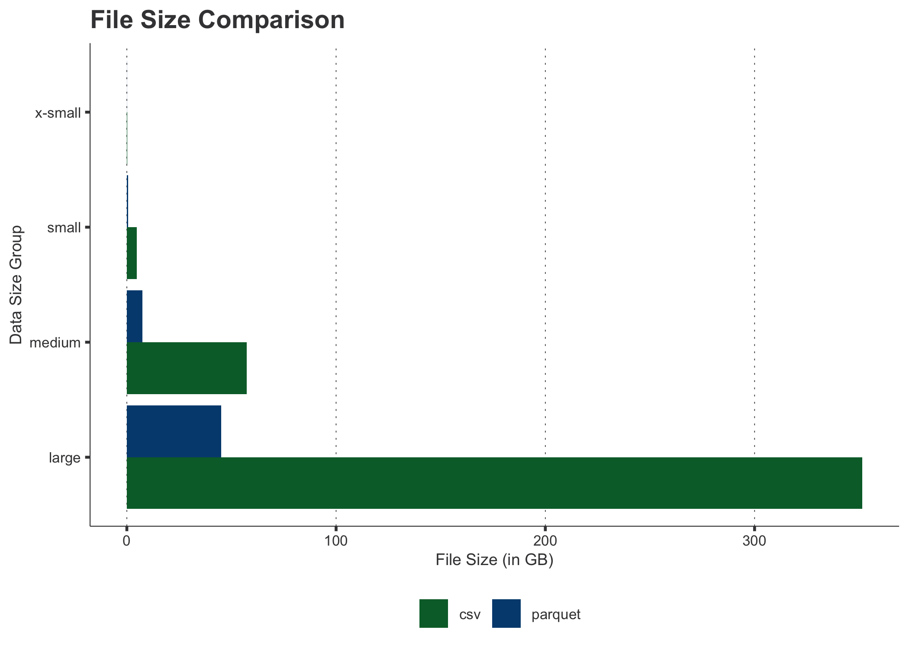

<sup>Photo by <a href="https://unsplash.com/@jakegivens?utm_source=unsplash&utm_medium=referral&utm_content=creditCopyText">Jake Givens</a> on <a href="https://unsplash.com/s/photos/fast?utm_source=unsplash&utm_medium=referral&utm_content=creditCopyText">Unsplash</a>
</sup>

<div class="lt-gray-box">
This is a guest post from Ryan Garnett, Ray Wong, and Dan Reed from Green Shield Canada. <a href="https://www.greenshield.ca/en-ca/" target = "_blank">Green Shield Canada</a>, a social enterprise and one of the country’s largest health benefits carriers, currently serves over 4.5 million Canadians across health and dental benefits and pharmacy benefits management. GSC also provides clients with an integrated experience that includes health care delivery via an ever-expanding digital health ecosystem and full benefits administration support.
</div>

<link href="style.css" rel="stylesheet"></link>

## The Challenge

Data is increasing in value for many organizations --- an asset leveraged
to help make informed business decisions. Unfortunately, this sentiment
has not been the norm throughout the life of most organizations, with
vast amounts of data locked in legacy data management systems and
designs. The majority of organizations use relational database
management systems (RDBMS) like Oracle, Postgres, Microsoft SQL, or
MySQL to store and manage their enterprise data. Typically these systems
were designed to collect and process data quickly within a transactional
data model. While these models are excellent for applications, they can pose challenges for performing business intelligence, data analytics, or predictive analysis. Many organizations are realizing their legacy systems are not sufficient for data analytics initiatives, providing an opportunity for analytics teams to present tangible options to improve their organization’s data analytics infrastructure.

Regardless if you are engineering data for others to consume for
analysis, or performing the analytics, reducing the time to
perform data processing is critically important. Within this post, we are
going to evaluate the performance of two distinct data storage
formats; row-based (CSV) and columnar (parquet); with CSV being a tried
and tested standard data format used within the data analytics field,
and parquet becoming a viable alternative in many data platforms.

## Setup

We performed the analysis for the post on Green Shield Canada’s
analytics workstation. Our workstation is a shared resource for our
analytics team that is running RStudio Workbench with the following
configurations:

<table>
<tbody>
<tr class="odd">
<td><em>Operating system</em></td>
<td>Ubuntu 20</td>
</tr>
<tr class="even">
<td><em>Cores</em></td>
<td>16</td>
</tr>
<tr class="odd">
<td><em>CPU speed</em></td>
<td>2.30GHz</td>
</tr>
<tr class="even">
<td><em>RAM</em></td>
<td>1TB</td>
</tr>
</tbody>
</table>

### Load Packages

We use the following packages throughout the post:

```{{R}}
# Importing data
library(arrow)
library(readr)

# Data analysis and wrangling
library(dplyr)

# Visualization and styling
library(ggplot2)
library(gt)
```

### Data Sources

We store Green Shield Canada’s source data in a transactional data
model within an Oracle database. The purpose of the transaction model
within Oracle is to quickly adjudicate medical claims within Green
Shield’s Advantage application, and it has been performing exceptionally
well. While a transactional data model provides great performance for
transactional applications, the data model design is less than optimal
for data analytics uses. Green Shield Canada, like many organizations,
is undergoing a significant digital transformation with a high emphasis
on data analytics. During the digital transformation, an analytical data
model will be developed, built from many of the source tables currently
stored in Oracle database tables, with the need to perform numerous data
wrangling tasks.

Within Green Shield Canada, data is sized based on the following four
groups:

-   x-small dataset &lt; 1M rows (day)
-   small dataset 1-10M rows (month)
-   medium data 10-100M rows (year)
-   large data > 100M-1B rows (decade)

The main dataset used within the analysis is Green Shield Canada’s claim
history data. This dataset includes various data elements related to the
transactional claims submitted by Green Shield’s clients. This dataset
is critically important to the organization, providing valuable insights
into how the company operates and the service provided to our
customers. The following is a table with the characteristics related to
the claim history dataset.

<div id="ktsbzxnuih" style="overflow-x:auto;overflow-y:auto;width:auto;height:auto;">
<style>

</style>
<table class="gt_table">
  <thead class="gt_header">
    <tr>
      <th colspan="6" class="gt_heading gt_title gt_font_normal" style="background-color: #005028; color: #FFFFFF; font-size: x-large; text-align: left; vertical-align: top; font-weight: bold; border-top-width: 3px; border-top-style: solid; border-top-color: #B6B6B6;">Dataset Characteristics</th>
    </tr>
    <tr>
      <th colspan="6" class="gt_heading gt_subtitle gt_font_normal gt_bottom_border" style="background-color: #005028; color: #FFFFFF; font-size: small; text-align: left; vertical-align: top; border-bottom-width: 3px; border-bottom-style: solid; border-bottom-color: #B6B6B6;">Claim History Data</th>
    </tr>
  </thead>
  <thead class="gt_col_headings">
    <tr>
      <th class="gt_col_heading gt_columns_bottom_border gt_left" rowspan="1" colspan="1" style="background-color: #8DC63F; color: #414042; font-size: medium; text-align: center; vertical-align: middle; border-bottom-width: 3px; border-bottom-style: solid; border-bottom-color: #B6B6B6;">Dataset Size Group</th>
      <th class="gt_col_heading gt_columns_bottom_border gt_left" rowspan="1" colspan="1" style="background-color: #8DC63F; color: #414042; font-size: medium; text-align: center; vertical-align: middle; border-bottom-width: 3px; border-bottom-style: solid; border-bottom-color: #B6B6B6;">Dataset Name</th>
      <th class="gt_col_heading gt_columns_bottom_border gt_right" rowspan="1" colspan="1" style="background-color: #8DC63F; color: #414042; font-size: medium; text-align: center; vertical-align: middle; border-bottom-width: 3px; border-bottom-style: solid; border-bottom-color: #B6B6B6;">Number of Rows</th>
      <th class="gt_col_heading gt_columns_bottom_border gt_right" rowspan="1" colspan="1" style="background-color: #8DC63F; color: #414042; font-size: medium; text-align: center; vertical-align: middle; border-bottom-width: 3px; border-bottom-style: solid; border-bottom-color: #B6B6B6;">Number of Columns</th>
      <th class="gt_col_heading gt_columns_bottom_border gt_left" rowspan="1" colspan="1" style="background-color: #8DC63F; color: #414042; font-size: medium; text-align: center; vertical-align: middle; border-bottom-width: 3px; border-bottom-style: solid; border-bottom-color: #B6B6B6;">CSV File Size</th>
      <th class="gt_col_heading gt_columns_bottom_border gt_left" rowspan="1" colspan="1" style="background-color: #8DC63F; color: #414042; font-size: medium; text-align: center; vertical-align: middle; border-bottom-width: 3px; border-bottom-style: solid; border-bottom-color: #B6B6B6;">Parquet File Size</th>
    </tr>
  </thead>
  <tbody class="gt_table_body">
    <tr><td class="gt_row gt_left" style="color: #414042; text-align: center; vertical-align: middle; white-space: pre; border-bottom-width: 1px; border-bottom-style: solid; border-bottom-color: #B6B6B6;">x-small</td>
<td class="gt_row gt_left" style="color: #414042; text-align: center; vertical-align: middle; white-space: pre; border-bottom-width: 1px; border-bottom-style: solid; border-bottom-color: #B6B6B6;">claim_history_day</td>
<td class="gt_row gt_right" style="color: #414042; text-align: center; vertical-align: middle; white-space: pre; border-bottom-width: 1px; border-bottom-style: solid; border-bottom-color: #B6B6B6;">317,617</td>
<td class="gt_row gt_right" style="color: #414042; text-align: center; vertical-align: middle; white-space: pre; border-bottom-width: 1px; border-bottom-style: solid; border-bottom-color: #B6B6B6;">201</td>
<td class="gt_row gt_left" style="color: #414042; text-align: center; vertical-align: middle; white-space: pre; border-bottom-width: 1px; border-bottom-style: solid; border-bottom-color: #B6B6B6;">281.8 MB</td>
<td class="gt_row gt_left" style="color: #414042; text-align: center; vertical-align: middle; white-space: pre; border-bottom-width: 1px; border-bottom-style: solid; border-bottom-color: #B6B6B6;">38.1 MB</td></tr>
    <tr><td class="gt_row gt_left" style="color: #414042; text-align: center; vertical-align: middle; white-space: pre; border-bottom-width: 1px; border-bottom-style: solid; border-bottom-color: #B6B6B6;">small</td>
<td class="gt_row gt_left" style="color: #414042; text-align: center; vertical-align: middle; white-space: pre; border-bottom-width: 1px; border-bottom-style: solid; border-bottom-color: #B6B6B6;">claim_history_month</td>
<td class="gt_row gt_right" style="color: #414042; text-align: center; vertical-align: middle; white-space: pre; border-bottom-width: 1px; border-bottom-style: solid; border-bottom-color: #B6B6B6;">5,548,609</td>
<td class="gt_row gt_right" style="color: #414042; text-align: center; vertical-align: middle; white-space: pre; border-bottom-width: 1px; border-bottom-style: solid; border-bottom-color: #B6B6B6;">202</td>
<td class="gt_row gt_left" style="color: #414042; text-align: center; vertical-align: middle; white-space: pre; border-bottom-width: 1px; border-bottom-style: solid; border-bottom-color: #B6B6B6;">4.8 GB</td>
<td class="gt_row gt_left" style="color: #414042; text-align: center; vertical-align: middle; white-space: pre; border-bottom-width: 1px; border-bottom-style: solid; border-bottom-color: #B6B6B6;">711.9 MB</td></tr>
    <tr><td class="gt_row gt_left" style="color: #414042; text-align: center; vertical-align: middle; white-space: pre; border-bottom-width: 1px; border-bottom-style: solid; border-bottom-color: #B6B6B6;">medium</td>
<td class="gt_row gt_left" style="color: #414042; text-align: center; vertical-align: middle; white-space: pre; border-bottom-width: 1px; border-bottom-style: solid; border-bottom-color: #B6B6B6;">claim_history_year</td>
<td class="gt_row gt_right" style="color: #414042; text-align: center; vertical-align: middle; white-space: pre; border-bottom-width: 1px; border-bottom-style: solid; border-bottom-color: #B6B6B6;">66,001,292</td>
<td class="gt_row gt_right" style="color: #414042; text-align: center; vertical-align: middle; white-space: pre; border-bottom-width: 1px; border-bottom-style: solid; border-bottom-color: #B6B6B6;">201</td>
<td class="gt_row gt_left" style="color: #414042; text-align: center; vertical-align: middle; white-space: pre; border-bottom-width: 1px; border-bottom-style: solid; border-bottom-color: #B6B6B6;">57.3 GB</td>
<td class="gt_row gt_left" style="color: #414042; text-align: center; vertical-align: middle; white-space: pre; border-bottom-width: 1px; border-bottom-style: solid; border-bottom-color: #B6B6B6;">7.5 GB</td></tr>
    <tr><td class="gt_row gt_left" style="color: #414042; text-align: center; vertical-align: middle; white-space: pre; border-bottom-width: 1px; border-bottom-style: solid; border-bottom-color: #B6B6B6;">large</td>
<td class="gt_row gt_left" style="color: #414042; text-align: center; vertical-align: middle; white-space: pre; border-bottom-width: 1px; border-bottom-style: solid; border-bottom-color: #B6B6B6;">claim_history</td>
<td class="gt_row gt_right" style="color: #414042; text-align: center; vertical-align: middle; white-space: pre; border-bottom-width: 1px; border-bottom-style: solid; border-bottom-color: #B6B6B6;">408,197,137</td>
<td class="gt_row gt_right" style="color: #414042; text-align: center; vertical-align: middle; white-space: pre; border-bottom-width: 1px; border-bottom-style: solid; border-bottom-color: #B6B6B6;">201</td>
<td class="gt_row gt_left" style="color: #414042; text-align: center; vertical-align: middle; white-space: pre; border-bottom-width: 1px; border-bottom-style: solid; border-bottom-color: #B6B6B6;">351.5 GB</td>
<td class="gt_row gt_left" style="color: #414042; text-align: center; vertical-align: middle; white-space: pre; border-bottom-width: 1px; border-bottom-style: solid; border-bottom-color: #B6B6B6;">45.1 GB</td></tr>
  </tbody>
  
</table>
</div>

The second dataset used within the analysis is Green Shield Canada’s
provider data. This dataset includes various data elements related to
the provider network that provides medical services for Green Shield
Canada’s customers. The following is a table with the characteristics
associated with the provider dataset.

<div id="pbnzuofvii" style="overflow-x:auto;overflow-y:auto;width:auto;height:auto;">
<style>

</style>
<table class="gt_table">
  <thead class="gt_header">
    <tr>
      <th colspan="5" class="gt_heading gt_title gt_font_normal" style="background-color: #005028; color: #FFFFFF; font-size: x-large; text-align: left; vertical-align: top; font-weight: bold; border-top-width: 3px; border-top-style: solid; border-top-color: #B6B6B6;">Dataset Characteristics</th>
    </tr>
    <tr>
      <th colspan="5" class="gt_heading gt_subtitle gt_font_normal gt_bottom_border" style="background-color: #005028; color: #FFFFFF; font-size: small; text-align: left; vertical-align: top; border-bottom-width: 3px; border-bottom-style: solid; border-bottom-color: #B6B6B6;">Provider Data</th>
    </tr>
  </thead>
  <thead class="gt_col_headings">
    <tr>
      <th class="gt_col_heading gt_columns_bottom_border gt_left" rowspan="1" colspan="1" style="background-color: #8DC63F; color: #414042; font-size: medium; text-align: center; vertical-align: middle; border-bottom-width: 3px; border-bottom-style: solid; border-bottom-color: #B6B6B6;">Dataset Name</th>
      <th class="gt_col_heading gt_columns_bottom_border gt_right" rowspan="1" colspan="1" style="background-color: #8DC63F; color: #414042; font-size: medium; text-align: center; vertical-align: middle; border-bottom-width: 3px; border-bottom-style: solid; border-bottom-color: #B6B6B6;">Number of Rows</th>
      <th class="gt_col_heading gt_columns_bottom_border gt_right" rowspan="1" colspan="1" style="background-color: #8DC63F; color: #414042; font-size: medium; text-align: center; vertical-align: middle; border-bottom-width: 3px; border-bottom-style: solid; border-bottom-color: #B6B6B6;">Number of Columns</th>
      <th class="gt_col_heading gt_columns_bottom_border gt_left" rowspan="1" colspan="1" style="background-color: #8DC63F; color: #414042; font-size: medium; text-align: center; vertical-align: middle; border-bottom-width: 3px; border-bottom-style: solid; border-bottom-color: #B6B6B6;">CSV File Size</th>
      <th class="gt_col_heading gt_columns_bottom_border gt_left" rowspan="1" colspan="1" style="background-color: #8DC63F; color: #414042; font-size: medium; text-align: center; vertical-align: middle; border-bottom-width: 3px; border-bottom-style: solid; border-bottom-color: #B6B6B6;">Parquet File Size</th>
    </tr>
  </thead>
  <tbody class="gt_table_body">
    <tr><td class="gt_row gt_left" style="color: #414042; text-align: center; vertical-align: middle; white-space: pre; border-bottom-width: 1px; border-bottom-style: solid; border-bottom-color: #B6B6B6;">provider</td>
<td class="gt_row gt_right" style="color: #414042; text-align: center; vertical-align: middle; white-space: pre; border-bottom-width: 1px; border-bottom-style: solid; border-bottom-color: #B6B6B6;">1,077,046</td>
<td class="gt_row gt_right" style="color: #414042; text-align: center; vertical-align: middle; white-space: pre; border-bottom-width: 1px; border-bottom-style: solid; border-bottom-color: #B6B6B6;">18</td>
<td class="gt_row gt_left" style="color: #414042; text-align: center; vertical-align: middle; white-space: pre; border-bottom-width: 1px; border-bottom-style: solid; border-bottom-color: #B6B6B6;">146.1 MB</td>
<td class="gt_row gt_left" style="color: #414042; text-align: center; vertical-align: middle; white-space: pre; border-bottom-width: 1px; border-bottom-style: solid; border-bottom-color: #B6B6B6;">31 MB</td></tr>
  </tbody>
</table>
</div>

## The Solution

Green Shield Canada has decided to convert data sources used for
analytics from row-based sources to a columnar format, specifically
<a href="https://parquet.apache.org/" target = "_blank">Apache Parquet</a>.

> *Apache Parquet is an open source, column-oriented data file format
> designed for efficient data storage and retrieval. It provides
> efficient data compression and encoding schemes with enhanced
> performance to handle complex data in bulk.* <br> *--- Apache Foundation*

We leverage the <a href="https://arrow.apache.org/docs/r/" target = "_blank">arrow R package</a> to convert our row-based datasets
into parquet files. Parquet partitions data into
smaller chunks and enables improved performance when filtering
against columns that have partitions.

Parquet file formats have three main benefits for analytical usage:

-   **Compression**: low storage consumption
-   **Speed**: efficiently reads data in less time
-   **Interoperability**: can be read by many different languages

Converting our datasets from row-based (CSV) to columnar (parquet) has
significantly reduced the file size. The CSV files range from **4.7** to
**7.8** times larger than parquet files.

We will explore computationally expensive tasks in
both data engineering and data analysis processes. We will perform four specific tasks on all four of the data sizes groups (x-small, small,
medium, and large) produced from our claim history dataset.

1.  join provider information to claim history
2.  processed claims volume by benefit type per time interval (i.e., day,
    month, and/or year)
3.  processed claims statistics by benefit type per time interval
    (i.e., day, month, and/or year)
4.  provider information with processed claims statistics by benefit
    type per time interval (i.e., day, month, and/or year)

### X-Small Data

The x-small data consists of data collected on a single day in January
2021. The dataset has **317,617** rows of data.

#### CSV Data

The CSV file used in this section was **281.8 MB** in size.

<html>
<div id="tab" class="tab">
  <button class="tablinks" onclick="clickHandle(event, 'Task 1_1', 'Task 1')">Task 1</button>
  <button class="tablinks" onclick="clickHandle(event, 'Task 1_2', 'Task 1')">Task 2</button>
  <button class="tablinks" onclick="clickHandle(event, 'Task 1_3', 'Task 1')">Task 3</button>
  <button class="tablinks" onclick="clickHandle(event, 'Task 1_4', 'Task 1')">Task 4</button>
</div>

<div id="Task 1_1" class="tabcontent" style="display:block;">

    # Task 1 - join
    start <- Sys.time()
    
    claims_columns <-
      cols_only(CLAIM_STATUS_TYPE_CD = col_character(),
                CH_SUBM_PROVIDER_ID = col_double(),
                BNFT_TYPE_CD = col_character(),
                CH_REND_AMT = col_double())

    provider_columns <-
      cols_only(provider_id = col_double(),
                provider_type = col_character(),
                benefit_description = col_character())

    left_join(
      read_csv("/home/data/CLAIM_HISTORY_DAY.csv",
               col_types = claims_columns) %>%
        filter(CLAIM_STATUS_TYPE_CD == "PC"),
      read_csv("/home/data/PROVIDER.csv",
               col_types = provider_columns),
      by = c("CH_SUBM_PROVIDER_ID" = "provider_id"))
      
    end <- Sys.time()
    end - start

The task took **16.006 secs** to execute.

</div>

<div id="Task 1_2" class="tabcontent" style="none">

    # Task 2 - group_by + count
    start <- Sys.time()
    
    claims_columns <-
      cols_only(CLAIM_STATUS_TYPE_CD = col_character(),
                CH_SUBM_PROVIDER_ID = col_double(),
                BNFT_TYPE_CD = col_character(),
                CH_REND_AMT = col_double())

    read_csv("/home/data/CLAIM_HISTORY_DAY.csv",
             col_types = claims_columns) %>%
      filter(CLAIM_STATUS_TYPE_CD == "PC") %>%
      group_by(BNFT_TYPE_CD) %>%
      count() %>%
      ungroup() %>%
      arrange(desc(n))
      
    end <- Sys.time()
    end - start

The task took **10.84989 secs** to execute.

</div>

<div id="Task 1_3" class="tabcontent">

    # Task 3 - group_by + summarize
    start <- Sys.time()
    
    claims_columns <-
      cols_only(CLAIM_STATUS_TYPE_CD = col_character(),
                CH_SUBM_PROVIDER_ID = col_double(),
                BNFT_TYPE_CD = col_character(),
                CH_REND_AMT = col_double())

    provider_columns <-
      cols_only(provider_id = col_double(),
                provider_type = col_character(),
                benefit_description = col_character())

    read_csv("/home/data/CLAIM_HISTORY_DAY.csv",
             col_types = claims_columns) %>%
      filter(CLAIM_STATUS_TYPE_CD == "PC") %>%
      group_by(BNFT_TYPE_CD) %>%
      summarize(minimum_amount =
                  min(CH_REND_AMT, na.rm = TRUE),
                mean_amount =
                  mean(CH_REND_AMT, na.rm = TRUE),
                max_amount =
                  max(CH_REND_AMT, na.rm = TRUE)) %>%
      ungroup()
      
    end <- Sys.time()
    end - start

The task took **11.8559 secs** to execute.

</div>

<div id="Task 1_4" class="tabcontent">

    # Task 4 - join + group_by + summarize
    start <- Sys.time()
    
    claims_columns <-
      cols_only(CLAIM_STATUS_TYPE_CD = col_character(),
                CH_SUBM_PROVIDER_ID = col_double(),
                BNFT_TYPE_CD = col_character(),
                CH_REND_AMT = col_double())

    provider_columns <-
      cols_only(provider_id = col_double(),
                provider_type = col_character(),
                benefit_description = col_character())

    left_join(
      read_csv("/home/data/CLAIM_HISTORY_DAY.csv",
               col_types = claims_columns) %>%
        filter(CLAIM_STATUS_TYPE_CD == "PC"),
      read_csv("/home/data/PROVIDER.csv",
               col_types = provider_columns),
      by = c("CH_SUBM_PROVIDER_ID" = "provider_id")) %>%
      group_by(benefit_description, BNFT_TYPE_CD) %>%
      summarize(minimum_amount =
                  min(CH_REND_AMT, na.rm = TRUE),
                mean_amount =
                  mean(CH_REND_AMT, na.rm = TRUE),
                max_amount =
                  max(CH_REND_AMT, na.rm = TRUE)) %>%
      ungroup()
      
    end <- Sys.time()
    end - start

The task took **16.02928 secs** to execute.

</div>

<script>
function clickHandle(evt, tableNum, groupID) {
  let i, tabcontent, tablinks;

  // This is to clear the previous clicked content.
  tabcontent = document.getElementsByClassName("tabcontent");
  for (i = 0; i < tabcontent.length; i++) {
    if (tabcontent[i].id.startsWith(groupID))
      tabcontent[i].style.display = "none";
  }

  // Set the tab to be "active".
  tablinks = document.getElementsByClassName("tablinks");
  for (i = 0; i < tablinks.length; i++) {
    if (tabcontent[i].id.startsWith(groupID)) 
      tablinks[i].className = tablinks[i].className.replace(" active", "");
  }

  // Display the clicked tab and set it to active.
  document.getElementById(tableNum).style.display = "block";
  evt.currentTarget.className += " active";
}
</script>

</html>

#### Parquet Data

The parquet file used in this section was **38.1 MB** in size.

<html>
<div id="tab2" class="tab">
  <button class="tablinks" onclick="clickHandle(event, 'Task 2_1', 'Task 2')">Task 1</button>
  <button class="tablinks" onclick="clickHandle(event, 'Task 2_2', 'Task 2')">Task 2</button>
  <button class="tablinks" onclick="clickHandle(event, 'Task 2_3', 'Task 2')">Task 3</button>
  <button class="tablinks" onclick="clickHandle(event, 'Task 2_4', 'Task 2')">Task 4</button>
</div>
  
<div id="Task 2_1" class="tabcontent" style="display:block">

    # Task 1 - join
    start <- Sys.time()
    
    left_join(
      open_dataset(source = "/home/data/CLAIM_HISTORY_DAY") %>%
        filter(CLAIM_STATUS_TYPE_CD == "PC") %>%
        select(CH_SUBM_PROVIDER_ID, BNFT_TYPE_CD, CH_REND_AMT),
      open_dataset(sources = "/home/data/Provider") %>%
        select(provider_id,
               provider_type,
               benefit_description),
      by = c("CH_SUBM_PROVIDER_ID" = "provider_id")) %>%
      collect()
      
    end <- Sys.time()
    end - start

The task took **1.776429 secs** to execute.

</div>

<div id="Task 2_2" class="tabcontent">

    # Task 2 - group_by + count
    start <- Sys.time()
    
    open_dataset(source = "/home/data/CLAIM_HISTORY_DAY") %>%
      filter(CLAIM_STATUS_TYPE_CD == "PC") %>%
      select(BNFT_TYPE_CD) %>%
      group_by(BNFT_TYPE_CD) %>%
      count() %>%
      ungroup() %>%
      arrange(desc(n)) %>%
      collect()
      
    end <- Sys.time()
    end - start

The task took **0.7456837 secs** to execute.

</div>

<div id="Task 2_3" class="tabcontent">

    # Task 3 - group_by + summarize
    start <- Sys.time()
    
    open_dataset(source = "/home/data/CLAIM_HISTORY_DAY") %>%
      filter(CLAIM_STATUS_TYPE_CD == "PC") %>%
      select(BNFT_TYPE_CD, CH_REND_AMT) %>%
      group_by(BNFT_TYPE_CD) %>%
      summarize(minimum_amount =
                  min(CH_REND_AMT, na.rm = TRUE),
                mean_amount =
                  mean(CH_REND_AMT, na.rm = TRUE),
                max_amount =
                  max(CH_REND_AMT, na.rm = TRUE)) %>%
      ungroup() %>%
      collect()
      
    end <- Sys.time()
    end - start

The task took **0.2979383 secs** to execute.

</div>

<div id="Task 2_4" class="tabcontent">

    # Task 4 - join + group_by + summarize
    start <- Sys.time()
    
    left_join(
      open_dataset(source = "/home/data/CLAIM_HISTORY_DAY") %>%
        filter(CLAIM_STATUS_TYPE_CD == "PC") %>%
        select(CH_SUBM_PROVIDER_ID, BNFT_TYPE_CD, CH_REND_AMT),
      open_dataset(sources = "/home/data/Provider") %>%
        select(provider_id,
               provider_type,
               benefit_description),
      by = c("CH_SUBM_PROVIDER_ID" = "provider_id")) %>%
      group_by(benefit_description, BNFT_TYPE_CD) %>%
      summarize(minimum_amount =
                  min(CH_REND_AMT, na.rm = TRUE),
                mean_amount =
                  mean(CH_REND_AMT, na.rm = TRUE),
                max_amount =
                  max(CH_REND_AMT, na.rm = TRUE)) %>%
      ungroup() %>%
      collect()
      
    end <- Sys.time()
    end - start

The task took **1.359842 secs** to execute.

</div>

</html>

### Small Data

The small data consists of data collected in January 2021. The dataset
has **5,548,609** rows of data.

#### CSV Data

The CSV file used in this section was **4.8 GB** in size.

<html>
<div id="tab3" class="tab">
  <button class="tablinks" onclick="clickHandle(event, 'Task 3_1', 'Task 3')">Task 1</button>
  <button class="tablinks" onclick="clickHandle(event, 'Task 3_2', 'Task 3')">Task 2</button>
  <button class="tablinks" onclick="clickHandle(event, 'Task 3_3', 'Task 3')">Task 3</button>
  <button class="tablinks" onclick="clickHandle(event, 'Task 3_4', 'Task 3')">Task 4</button>
</div>
  
<div id="Task 3_1" class="tabcontent" style="display:block">

    # Task 1 - join
    start <- Sys.time()
    
    claims_columns <-
      cols_only(CLAIM_STATUS_TYPE_CD = col_character(),
                CH_SUBM_PROVIDER_ID = col_double(),
                BNFT_TYPE_CD = col_character(),
                CH_REND_AMT = col_double())

    provider_columns <-
      cols_only(provider_id = col_double(),
                provider_type = col_character(),
                benefit_description = col_character())

    left_join(
      read_csv("/home/data/CLAIM_HISTORY_MONTH.csv",
               col_types = claims_columns) %>%
        filter(CLAIM_STATUS_TYPE_CD == "PC"),
      read_csv("/home/data/PROVIDER.csv",
               col_types = provider_columns),
      by = c("CH_SUBM_PROVIDER_ID" = "provider_id"))
      
    end <- Sys.time()
    end - start

The task took **3.677011 mins** to execute.

</div>
  
<div id="Task 3_2" class="tabcontent" style="display:none">

    # Task 2 - group_by + count
    start <- Sys.time()
    
    claims_columns <-
      cols_only(CLAIM_STATUS_TYPE_CD = col_character(),
                CH_SUBM_PROVIDER_ID = col_double(),
                BNFT_TYPE_CD = col_character(),
                CH_REND_AMT = col_double(),
                PROCESS_DAY = col_double())

    read_csv("/home/data/CLAIM_HISTORY_MONTH.csv",
             col_types = claims_columns) %>%
      filter(CLAIM_STATUS_TYPE_CD == "PC") %>%
      group_by(BNFT_TYPE_CD, PROCESS_DAY) %>%
      count() %>%
      ungroup() %>%
      arrange(desc(n))
      
    end <- Sys.time()
    end - start

The task took **3.161771 mins** to execute.

</div>
  
<div id="Task 3_3" class="tabcontent" style="display:none">

    # Task 3 - group_by + summarize
    start <- Sys.time()
    
    claims_columns <-
      cols_only(CLAIM_STATUS_TYPE_CD = col_character(),
                CH_SUBM_PROVIDER_ID = col_double(),
                BNFT_TYPE_CD = col_character(),
                CH_REND_AMT = col_double(),
                PROCESS_DAY = col_double())

    provider_columns <-
      cols_only(provider_id = col_double(),
                provider_type = col_character(),
                benefit_description = col_character())

    read_csv("/home/data/CLAIM_HISTORY_MONTH.csv",
             col_types = claims_columns) %>%
      filter(CLAIM_STATUS_TYPE_CD == "PC") %>%
      group_by(BNFT_TYPE_CD, PROCESS_DAY) %>%
      summarize(minimum_amount =
                  min(CH_REND_AMT, na.rm = TRUE),
                mean_amount =
                  mean(CH_REND_AMT, na.rm = TRUE),
                max_amount =
                  max(CH_REND_AMT, na.rm = TRUE)) %>%
      ungroup()
      
    end <- Sys.time()
    end - start

The task took **3.095256 mins** to execute.

</div>
  
<div id="Task 3_4" class="tabcontent" style="display:none">

    # Task 4 - join + group_by + summarize
    start <- Sys.time()
    
    claims_columns <-
      cols_only(CLAIM_STATUS_TYPE_CD = col_character(),
                CH_SUBM_PROVIDER_ID = col_double(),
                BNFT_TYPE_CD = col_character(),
                CH_REND_AMT = col_double(),
                PROCESS_DAY = col_double())

    provider_columns <-
      cols_only(provider_id = col_double(),
                provider_type = col_character(),
                benefit_description = col_character())

    left_join(
      read_csv("/home/data/CLAIM_HISTORY_MONTH.csv",
               col_types = claims_columns) %>%
        filter(CLAIM_STATUS_TYPE_CD == "PC"),
      read_csv("/home/data/PROVIDER.csv",
               col_types = provider_columns),
      by = c("CH_SUBM_PROVIDER_ID" = "provider_id")) %>%
      group_by(benefit_description,
               BNFT_TYPE_CD,
               PROCESS_DAY) %>%
      summarize(minimum_amount =
                  min(CH_REND_AMT, na.rm = TRUE),
                mean_amount =
                  mean(CH_REND_AMT, na.rm = TRUE),
                max_amount =
                  max(CH_REND_AMT, na.rm = TRUE)) %>%
      ungroup()
      
    end <- Sys.time()
    end - start

The task took **3.44803 mins** to execute.

</div>

</html>

#### Parquet Data

The parquet file used in this section was **711.9 MB** in size.

<html>
<div id="tab4" class="tab">
  <button class="tablinks" onclick="clickHandle(event, 'Task 4_1', 'Task 4')">Task 1</button>
  <button class="tablinks" onclick="clickHandle(event, 'Task 4_2', 'Task 4')">Task 2</button>
  <button class="tablinks" onclick="clickHandle(event, 'Task 4_3', 'Task 4')">Task 3</button>
  <button class="tablinks" onclick="clickHandle(event, 'Task 4_4', 'Task 4')">Task 4</button>
</div>
  
<div id="Task 4_1" class="tabcontent" style="display:block">

    # Task 1 - join
    start <- Sys.time()
    
    left_join(
      open_dataset(
        source = "/home/data/CLAIM_HISTORY_MONTH"
      ) %>%
        filter(CLAIM_STATUS_TYPE_CD == "PC") %>%
        select(CH_SUBM_PROVIDER_ID,
               BNFT_TYPE_CD, 
               CH_REND_AMT),
      open_dataset(sources = "/home/data/Provider") %>%
        select(provider_id, provider_type, benefit_description),
      by = c("CH_SUBM_PROVIDER_ID" = "provider_id")) %>%
      collect()
      
    end <- Sys.time()
    end - start

The task took **1.604066 secs** to execute.

</div>
  
<div id="Task 4_2" class="tabcontent" style="display:none">

    # Task 2 - group_by + count
    start <- Sys.time()
    
    open_dataset(source = "/home/data/CLAIM_HISTORY_MONTH") %>%
      filter(CLAIM_STATUS_TYPE_CD == "PC") %>%
      select(BNFT_TYPE_CD) %>%
      group_by(BNFT_TYPE_CD) %>%
      count() %>%
      ungroup() %>%
      arrange(desc(n)) %>%
      collect()
      
    end <- Sys.time()
    end - start

The task took **0.3016093 secs** to execute.

</div>
  
<div id="Task 4_3" class="tabcontent" style="display:none">

    # Task 3 - group_by + summarize
    start <- Sys.time()
    
    open_dataset(source = "/home/data/CLAIM_HISTORY_MONTH") %>%
      filter(CLAIM_STATUS_TYPE_CD == "PC") %>%
      select(BNFT_TYPE_CD, CH_REND_AMT, PROCESS_DAY) %>%
      group_by(BNFT_TYPE_CD, PROCESS_DAY) %>%
      summarize(minimum_amount =
                  min(CH_REND_AMT, na.rm = TRUE),
                mean_amount = 
                  mean(CH_REND_AMT, na.rm = TRUE),
                max_amount = 
                  max(CH_REND_AMT, na.rm = TRUE)) %>%
      ungroup() %>%
      collect()
      
    end <- Sys.time()
    end - start

The task took **0.5149045 secs** to execute.

</div>
  
<div id="Task 4_4" class="tabcontent" style="display:none">

    # Task 4 - join + group_by + summarize
    start <- Sys.time()
    
    left_join(
      open_dataset(
        source = "/home/data/CLAIM_HISTORY_MONTH"
      ) %>%
        filter(CLAIM_STATUS_TYPE_CD == "PC") %>%
        select(CH_SUBM_PROVIDER_ID,
               BNFT_TYPE_CD, 
               CH_REND_AMT, 
               PROCESS_DAY),
      open_dataset(sources = "/home/data/Provider") %>%
        select(provider_id, 
               provider_type,
               benefit_description),
      by = c("CH_SUBM_PROVIDER_ID" = "provider_id")) %>%
      group_by(benefit_description,
               BNFT_TYPE_CD, 
               PROCESS_DAY) %>%
      summarize(minimum_amount =
                  min(CH_REND_AMT, na.rm = TRUE),
                mean_amount = 
                  mean(CH_REND_AMT, na.rm = TRUE),
                max_amount = 
                  max(CH_REND_AMT, na.rm = TRUE)) %>%
      ungroup() %>%
      collect()
      
    end <- Sys.time()
    end - start

The task took **1.12566 secs** to execute.

</div>
</html>

### Medium Data

The medium data consists of data collected over 2021. The dataset has
**66,001,292** rows of data.

#### CSV Data

The CSV file used in this section was **57.3 GB** in size.

<html>
<div id="tab5" class="tab">
  <button class="tablinks" onclick="clickHandle(event, 'Task 5_1', 'Task 5')">Task 1</button>
  <button class="tablinks" onclick="clickHandle(event, 'Task 5_2', 'Task 5')">Task 2</button>
  <button class="tablinks" onclick="clickHandle(event, 'Task 5_3', 'Task 5')">Task 3</button>
  <button class="tablinks" onclick="clickHandle(event, 'Task 5_4', 'Task 5')">Task 4</button>
</div>
  
<div id="Task 5_1" class="tabcontent" style="display:block">

    # Task 1 - join
    start <- Sys.time()
    
    claims_columns <-
      cols_only(CLAIM_STATUS_TYPE_CD = col_character(),
                CH_SUBM_PROVIDER_ID = col_double(),
                BNFT_TYPE_CD = col_character(),
                CH_REND_AMT = col_double())

    provider_columns <- 
      cols_only(provider_id = col_double(),
                provider_type = col_character(),
                benefit_description = col_character())

    left_join(
      read_csv("/home/data/CLAIM_HISTORY_YEAR.csv",
               col_types = claims_columns) %>%
        filter(CLAIM_STATUS_TYPE_CD == "PC"),
      read_csv("/home/data/PROVIDER.csv",
               col_types = provider_columns),
      by = c("CH_SUBM_PROVIDER_ID" = "provider_id"))
      
    end <- Sys.time()
    end - start

The task took **40.19741 mins** to execute.

</div>
  
<div id="Task 5_2" class="tabcontent" style="display:none">

    # Task 2 - group_by + count
    start <- Sys.time()
    
    claims_columns <-
      cols_only(CLAIM_STATUS_TYPE_CD = col_character(),
                CH_SUBM_PROVIDER_ID = col_double(),
                BNFT_TYPE_CD = col_character(),
                CH_REND_AMT = col_double(),
                PROCESS_MONTH = col_double())

    read_csv("/home/data/CLAIM_HISTORY_YEAR.csv",
             col_types = claims_columns) %>%
      filter(CLAIM_STATUS_TYPE_CD == "PC") %>%
      group_by(BNFT_TYPE_CD, PROCESS_MONTH) %>%
      count() %>%
      ungroup() %>%
      arrange(desc(n))
      
    end <- Sys.time()
    end - start

The task took **38.88081 mins** to execute.

</div>
  
<div id="Task 5_3" class="tabcontent" style="display:none">

    # Task 3 - group_by + summarize
    start <- Sys.time()
    
    claims_columns <-
      cols_only(CLAIM_STATUS_TYPE_CD = col_character(),
                CH_SUBM_PROVIDER_ID = col_double(),
                BNFT_TYPE_CD = col_character(),
                CH_REND_AMT = col_double(),
                PROCESS_MONTH = col_double())

    provider_columns <-
      cols_only(provider_id = col_double(),
                provider_type = col_character(),
                benefit_description = col_character())

    read_csv("/home/data/CLAIM_HISTORY_YEAR.csv",
             col_types = claims_columns) %>%
      filter(CLAIM_STATUS_TYPE_CD == "PC") %>%
      group_by(BNFT_TYPE_CD, PROCESS_MONTH) %>%
      summarize(minimum_amount =
                  min(CH_REND_AMT, na.rm = TRUE),
                mean_amount =
                  mean(CH_REND_AMT, na.rm = TRUE),
                max_amount =
                  max(CH_REND_AMT, na.rm = TRUE)) %>%
      ungroup()
      
    end <- Sys.time()
    end - start

The task took **37.73755 mins** to execute.

</div>
  
<div id="Task 5_4" class="tabcontent" style="display:none">

    # Task 4 - join + group_by + summarize
    start <- Sys.time()
    
    claims_columns <-
      cols_only(CLAIM_STATUS_TYPE_CD = col_character(),
                CH_SUBM_PROVIDER_ID = col_double(),
                BNFT_TYPE_CD = col_character(),
                CH_REND_AMT = col_double(),
                PROCESS_MONTH = col_double())

    provider_columns <-
      cols_only(provider_id = col_double(),
                provider_type = col_character(),
                benefit_description = col_character())

    left_join(
      read_csv("/home/data/CLAIM_HISTORY_YEAR.csv",
               col_types = claims_columns) %>%
        filter(CLAIM_STATUS_TYPE_CD == "PC"),
      read_csv("/home/data/PROVIDER.csv",
               col_types = provider_columns),
      by = c("CH_SUBM_PROVIDER_ID" = "provider_id")) %>%
      group_by(benefit_description,
               BNFT_TYPE_CD, 
               PROCESS_MONTH) %>%
      summarize(minimum_amount =
                  min(CH_REND_AMT, na.rm = TRUE),
                mean_amount = 
                  mean(CH_REND_AMT, na.rm = TRUE),
                max_amount = 
                  max(CH_REND_AMT, na.rm = TRUE)) %>%
      ungroup()
      
    end <- Sys.time()
    end - start

The task took **40.0343 mins** to execute.

</div>
</html>

#### Parquet Data

The parquet file used in this section was **7.5 GB** in size.

<html>
<div id="tab6" class="tab">
  <button class="tablinks" onclick="clickHandle(event, 'Task 6_1', 'Task 6')">Task 1</button>
  <button class="tablinks" onclick="clickHandle(event, 'Task 6_2', 'Task 6')">Task 2</button>
  <button class="tablinks" onclick="clickHandle(event, 'Task 6_3', 'Task 6')">Task 3</button>
  <button class="tablinks" onclick="clickHandle(event, 'Task 6_4', 'Task 6')">Task 4</button>
</div>
  
<div id="Task 6_1" class="tabcontent" style="display:block">

    # Task 1 - join
    start <- Sys.time()
    
    left_join(
      open_dataset(
        source = "/home/data/CLAIM_HISTORY_YEAR"
      ) %>%
        filter(CLAIM_STATUS_TYPE_CD == "PC") %>%
        select(CH_SUBM_PROVIDER_ID, BNFT_TYPE_CD, CH_REND_AMT),
      open_dataset(sources = "/home/data/Provider") %>%
        select(provider_id,
               provider_type, 
               benefit_description),
      by = c("CH_SUBM_PROVIDER_ID" = "provider_id")) %>%
      collect()
      
    end <- Sys.time()
    end - start

The task took **4.153103 secs** to execute.

</div>
  
<div id="Task 6_2" class="tabcontent" style="display:none">

    # Task 2 - group_by + count
    start <- Sys.time()
    
    open_dataset(source = "/home/data/CLAIM_HISTORY_YEAR") %>%
      filter(CLAIM_STATUS_TYPE_CD == "PC") %>%
      select(BNFT_TYPE_CD, PROCESS_MONTH) %>%
      group_by(BNFT_TYPE_CD, PROCESS_MONTH) %>%
      count() %>%
      ungroup() %>%
      arrange(desc(n)) %>%
      collect()
      
    end <- Sys.time()
    end - start

The task took **0.844259 secs** to execute.

</div>
  
<div id="Task 6_3" class="tabcontent" style="display:none">

    # Task 3 - group_by + summarize
    start <- Sys.time()
    
    open_dataset(source = "/home/data/CLAIM_HISTORY_YEAR") %>%
      filter(CLAIM_STATUS_TYPE_CD == "PC") %>%
      select(BNFT_TYPE_CD, CH_REND_AMT, PROCESS_MONTH) %>%
      group_by(BNFT_TYPE_CD, PROCESS_MONTH) %>%
      summarize(minimum_amount =
                  min(CH_REND_AMT, na.rm = TRUE),
                mean_amount = 
                  mean(CH_REND_AMT, na.rm = TRUE),
                max_amount = 
                  max(CH_REND_AMT, na.rm = TRUE)) %>%
      ungroup() %>%
      collect()
      
    end <- Sys.time()
    end - start

The task took **1.010546 secs** to execute.

</div>
  
<div id="Task 6_4" class="tabcontent" style="display:none">

    # Task 4 - join + group_by + summarize
    start <- Sys.time()
    
    left_join(
      open_dataset(
        source = "/home/data/CLAIM_HISTORY_YEAR"
      ) %>%
        filter(CLAIM_STATUS_TYPE_CD == "PC") %>%
        select(CH_SUBM_PROVIDER_ID, 
               BNFT_TYPE_CD,
               CH_REND_AMT, 
               PROCESS_MONTH),
      open_dataset(sources = "/home/data/Provider") %>%
        select(provider_id,
               provider_type, 
               benefit_description),
      by = c("CH_SUBM_PROVIDER_ID" = "provider_id")) %>%
      group_by(benefit_description,
               BNFT_TYPE_CD, 
               PROCESS_MONTH) %>%
      summarize(minimum_amount = 
                  min(CH_REND_AMT, na.rm = TRUE),
                mean_amount = 
                  mean(CH_REND_AMT, na.rm = TRUE),
                max_amount = 
                  max(CH_REND_AMT, na.rm = TRUE)) %>%
      ungroup() %>%
      collect()
      
    end <- Sys.time()
    end - start

The task took **3.062172 secs** to execute.
</div>
</html>

### Large Data

The large data consists of data collected between 2014 and 2022. The
dataset has **408,197,137** rows of data.

#### CSV Data

The CSV file used in this section was **351.5 GB** in size.
<html>
<div id="tab7" class="tab">
  <button class="tablinks" onclick="clickHandle(event, 'Task 7_1', 'Task 7')">Task 1</button>
  <button class="tablinks" onclick="clickHandle(event, 'Task 7_2', 'Task 7')">Task 2</button>
  <button class="tablinks" onclick="clickHandle(event, 'Task 7_3', 'Task 7')">Task 3</button>
  <button class="tablinks" onclick="clickHandle(event, 'Task 7_4', 'Task 7')">Task 4</button>
</div>
  
<div id="Task 7_1" class="tabcontent" style="display:block">

    # Task 1 - join
    start <- Sys.time()
    
    claims_columns <- 
      cols_only(CLAIM_STATUS_TYPE_CD = col_character(),
                CH_SUBM_PROVIDER_ID = col_double(),
                BNFT_TYPE_CD = col_character(),
                CH_REND_AMT = col_double())

    provider_columns <- 
      cols_only(provider_id = col_double(),
                provider_type = col_character(),
                benefit_description = col_character())

    left_join(
      read_csv("/home/data/CLAIM_HISTORY_DECADE.csv",
               col_types = claims_columns) %>%
        filter(CLAIM_STATUS_TYPE_CD == "PC"),
      read_csv("/home/data/PROVIDER.csv",
              col_types = provider_columns),
      by = c("CH_SUBM_PROVIDER_ID" = "provider_id"))
      
    end <- Sys.time()
    end - start

The task did not complete, producing **Error: std::bad\_alloc**.

</div>
  
<div id="Task 7_2" class="tabcontent" style="display:none">

    # Task 2 - group_by + count
    start <- Sys.time()
    claims_columns <- 
      cols_only(CLAIM_STATUS_TYPE_CD = col_character(),
                CH_SUBM_PROVIDER_ID = col_double(),
                BNFT_TYPE_CD = col_character(),
                CH_REND_AMT = col_double(),
                PROCESS_YEAR = col_double(),
                PROCESS_MONTH = col_double())

    read_csv("/home/data/CLAIM_HISTORY_DECADE.csv",
             col_types = claims_columns) %>%
      filter(CLAIM_STATUS_TYPE_CD == "PC") %>%
      group_by(BNFT_TYPE_CD, PROCESS_YEAR, PROCESS_MONTH) %>%
      count() %>%
      ungroup() %>%
      arrange(desc(n))
      
    end <- Sys.time()
    end - start

The task did not complete, producing **Error: std::bad\_alloc**.

</div>
  
<div id="Task 7_3" class="tabcontent" style="display:none">

    # Task 3 - group_by + summarize
    start <- Sys.time()
    
    claims_columns <-
      cols_only(CLAIM_STATUS_TYPE_CD = col_character(),
                CH_SUBM_PROVIDER_ID = col_double(),
                BNFT_TYPE_CD = col_character(),
                CH_REND_AMT = col_double(),
                PROCESS_YEAR = col_double(),
                PROCESS_MONTH = col_double())

    provider_columns <- 
      cols_only(provider_id = col_double(),
                provider_type = col_character(),
                benefit_description = col_character())

    read_csv("/home/data/CLAIM_HISTORY_DECADE.csv",
             col_types = claims_columns) %>%
      filter(CLAIM_STATUS_TYPE_CD == "PC") %>%
      group_by(BNFT_TYPE_CD, PROCESS_YEAR, PROCESS_MONTH) %>%
      summarize(minimum_amount = 
                  min(CH_REND_AMT, na.rm = TRUE),
                mean_amount = 
                  mean(CH_REND_AMT, na.rm = TRUE),
                max_amount = 
                  max(CH_REND_AMT, na.rm = TRUE)) %>%
      ungroup()
      
    end <- Sys.time()
    end - start

The task did not complete, producing **Error: std::bad\_alloc**.

</div>
  
<div id="Task 7_4" class="tabcontent" style="display:none">

    # Task 4 - join + group_by + summarize
    start <- Sys.time()
    
    claims_columns <-
      cols_only(CLAIM_STATUS_TYPE_CD = col_character(),
                CH_SUBM_PROVIDER_ID = col_double(),
                BNFT_TYPE_CD = col_character(),
                CH_REND_AMT = col_double(),
                PROCESS_YEAR = col_double(),
                PROCESS_MONTH = col_double())

    provider_columns <- 
      cols_only(provider_id = col_double(),
                provider_type = col_character(),
                benefit_description = col_character())

    left_join(
      read_csv("/home/data/CLAIM_HISTORY_DECADE.csv",
               col_types = claims_columns) %>%
        filter(CLAIM_STATUS_TYPE_CD == "PC"),
      read_csv("/home/data/PROVIDER.csv",
               col_types = provider_columns),
      by = c("CH_SUBM_PROVIDER_ID" = "provider_id")) %>%
      group_by(benefit_description, 
               BNFT_TYPE_CD, 
               PROCESS_YEAR, 
               PROCESS_MONTH) %>%
      summarize(minimum_amount = 
                  min(CH_REND_AMT, na.rm = TRUE),
                mean_amount = 
                  mean(CH_REND_AMT, na.rm = TRUE),
                max_amount = 
                  max(CH_REND_AMT, na.rm = TRUE)) %>%
      ungroup()
      
    end <- Sys.time()
    end - start

The task did not complete, producing **Error: std::bad\_alloc**.

</div>
</html>

#### Parquet Data

The parquet file used in this section was **45.1 GB** in size.

<html>
<div id="tab8" class="tab">
  <button class="tablinks" onclick="clickHandle(event, 'Task 8_1', 'Task 8')">Task 1</button>
  <button class="tablinks" onclick="clickHandle(event, 'Task 8_2', 'Task 8')">Task 2</button>
  <button class="tablinks" onclick="clickHandle(event, 'Task 8_3', 'Task 8')">Task 3</button>
  <button class="tablinks" onclick="clickHandle(event, 'Task 8_4', 'Task 8')">Task 4</button>
</div>
  
<div id="Task 8_1" class="tabcontent" style="display:block">

    # Task 1 - join
    start <- Sys.time()
    
    left_join(
      open_dataset(
        source = "/home/data/CLAIM_HISTORY_DECADE"
      ) %>%
        filter(CLAIM_STATUS_TYPE_CD == "PC") %>%
        select(CH_SUBM_PROVIDER_ID, BNFT_TYPE_CD, CH_REND_AMT),
      open_dataset(sources = "/home/data/Provider") %>%
        select(provider_id, 
               provider_type, 
               benefit_description),
      by = c("CH_SUBM_PROVIDER_ID" = "provider_id")) %>%
      collect()
      
    end <- Sys.time()
    end - start

The task took **16.42989 secs** to execute.

</div>
  
<div id="Task 8_2" class="tabcontent" style="display:none">

    # Task 2 - group_by + count
    start <- Sys.time()
    
    open_dataset(
      source = "/home/data/CLAIM_HISTORY_DECADE"
    ) %>%
      filter(CLAIM_STATUS_TYPE_CD == "PC") %>%
      select(BNFT_TYPE_CD) %>%
      group_by(BNFT_TYPE_CD) %>%
      count() %>%
      ungroup() %>%
      arrange(desc(n)) %>%
      collect()
      
    end <- Sys.time()
    end - start

The task took **4.389257 secs** to execute.

</div>
  
<div id="Task 8_3" class="tabcontent" style="display:none">

    # Task 3 - group_by + summarize
    start <- Sys.time()
    
    open_dataset(
      source = "/home/data/CLAIM_HISTORY_DECADE"
    ) %>%
      filter(CLAIM_STATUS_TYPE_CD == "PC") %>%
      select(BNFT_TYPE_CD, CH_REND_AMT) %>%
      group_by(BNFT_TYPE_CD) %>%
      summarize(minimum_amount = 
                  min(CH_REND_AMT, na.rm = TRUE),
                mean_amount = 
                  mean(CH_REND_AMT, na.rm = TRUE),
                max_amount = 
                  max(CH_REND_AMT, na.rm = TRUE)) %>%
      ungroup() %>%
      collect()
      
    end <- Sys.time()
    end - start

The task took **4.441824 secs** to execute.

</div>
  
<div id="Task 8_4" class="tabcontent" style="display:none">

    # Task 4 - join + group_by + summarize
    start <- Sys.time()
    
    left_join(
      open_dataset(
        source = "/home/data/CLAIM_HISTORY_DECADE"
      ) %>%
        filter(CLAIM_STATUS_TYPE_CD == "PC") %>%
        select(CH_SUBM_PROVIDER_ID, BNFT_TYPE_CD, CH_REND_AMT),
      open_dataset(sources = "/home/data/Provider") %>%
        select(provider_id,
               provider_type, 
               benefit_description),
      by = c("CH_SUBM_PROVIDER_ID" = "provider_id")) %>%
      group_by(benefit_description, BNFT_TYPE_CD) %>%
      summarize(minimum_amount =
                  min(CH_REND_AMT, na.rm = TRUE),
                mean_amount = 
                  mean(CH_REND_AMT, na.rm = TRUE),
                max_amount = 
                  max(CH_REND_AMT, na.rm = TRUE)) %>%
      ungroup() %>%
      collect()
      
    end <- Sys.time()
    end - start

The task took **14.93252 secs** to execute.

</div>
</html>

## Our Findings

The results from our analysis were remarkable. Converting our data from
row-based to columnar in parquet format significantly improved
processing time. Processes that would take tens of
minutes to an hour are now possible within seconds…**game changer**! The
parquet format is a low/no-cost solution that provides immediate
analytical improvements for both our data engineering and data analytics
teams.

### Processing Time

CSV processing time varied from **10.85** seconds to **2,411.84**
seconds (40.2 minutes), whereas parquet file processing time ranged from
**0.3** seconds to **16.43** seconds for all four dataset size groups.
Note that the CSV large dataset errored (*Error\:
std\:\:bad\_alloc*) and did not complete. The *Error: std::bad\_alloc* is
synonymous with out-of-memory, yes insufficient memory even with our 1TB
workstation!

<html>
<div id="tab9" class="tab">
  <button class="tablinks" onclick="clickHandle(event, 'Task 9_1', 'Task 9')">Task 1</button>
  <button class="tablinks" onclick="clickHandle(event, 'Task 9_2', 'Task 9')">Task 2</button>
  <button class="tablinks" onclick="clickHandle(event, 'Task 9_3', 'Task 9')">Task 3</button>
  <button class="tablinks" onclick="clickHandle(event, 'Task 9_4', 'Task 9')">Task 4</button>
</div>
  
<div id="Task 9_1" class="tabcontent" style="display:block">



</div>
  
<div id="Task 9_2" class="tabcontent" style="display:none">


</div>
  
<div id="Task 9_3" class="tabcontent" style="display:none">



</div>
  
<div id="Task 9_4" class="tabcontent" style="display:none">


</div>
</html>

### Improvement Factor

Not only did our processing efficiency improve across all categories of
sizes of data, but storage size efficiency of the same datasets is also not to be overlooked. Being able to compute common analytical querying
quicker and with a smaller footprint is an unrefutable win. Optimization
in both size and speed is an attainable innovation for any Data
Engineer/Analyst that is quantifiable and beneficial for any
organization.

The following illustrates the improvement factor (aka the number of
times improvement using parquet provides over CSV) for each of the four
tasks, as well as the storage size improvements obtained using columnar
storage.

<html>
<div id="tab0" class="tab">
  <button class="tablinks" onclick="clickHandle(event, 'Task 0_1', 'Task 0')">Processing Improvement</button>
  <button class="tablinks" onclick="clickHandle(event, 'Task 0_2', 'Task 0')">Improvement Distribution</button>
  <button class="tablinks" onclick="clickHandle(event, 'Task 0_3', 'Task 0')">Average Improvement</button>
    <button class="tablinks" onclick="clickHandle(event, 'Task 0_4', 'Task 0')">File Storage Improvement</button>
</div>
  
<div id="Task 0_1" class="tabcontent" style="display:block">

<div id="pfwhzcnkop" style="overflow-x:auto;overflow-y:auto;width:auto;height:auto;">

<table class="gt_table">
  <thead class="gt_header">
    <tr>
      <th colspan="5" class="gt_heading gt_title gt_font_normal gt_bottom_border" style="background-color: #005028; color: #FFFFFF; font-size: x-large; text-align: left; vertical-align: top; font-weight: bold; border-top-width: 3px; border-top-style: solid; border-top-color: #B6B6B6;">Processing Improvements with Parquet Files</th>
    </tr>
    
  </thead>
  <thead class="gt_col_headings">
    <tr>
      <th class="gt_col_heading gt_columns_bottom_border gt_left" rowspan="1" colspan="1" style="background-color: #8DC63F; color: #414042; font-size: medium; text-align: center; vertical-align: middle; border-bottom-width: 3px; border-bottom-style: solid; border-bottom-color: #B6B6B6;">Dataset Size Group</th>
      <th class="gt_col_heading gt_columns_bottom_border gt_left" rowspan="1" colspan="1" style="background-color: #8DC63F; color: #414042; font-size: medium; text-align: center; vertical-align: middle; border-bottom-width: 3px; border-bottom-style: solid; border-bottom-color: #B6B6B6;">Task</th>
      <th class="gt_col_heading gt_columns_bottom_border gt_right" rowspan="1" colspan="1" style="background-color: #8DC63F; color: #414042; font-size: medium; text-align: center; vertical-align: middle; border-bottom-width: 3px; border-bottom-style: solid; border-bottom-color: #B6B6B6;">CSV Processing Time (in seconds)</th>
      <th class="gt_col_heading gt_columns_bottom_border gt_right" rowspan="1" colspan="1" style="background-color: #8DC63F; color: #414042; font-size: medium; text-align: center; vertical-align: middle; border-bottom-width: 3px; border-bottom-style: solid; border-bottom-color: #B6B6B6;">Parquet Processing Time (in seconds)</th>
      <th class="gt_col_heading gt_columns_bottom_border gt_right" rowspan="1" colspan="1" style="background-color: #8DC63F; color: #414042; font-size: medium; text-align: center; vertical-align: middle; border-bottom-width: 3px; border-bottom-style: solid; border-bottom-color: #B6B6B6;">Parquet Improvement Factor</th>
    </tr>
  </thead>
  <tbody class="gt_table_body">
    <tr><td class="gt_row gt_left" style="color: #414042; text-align: center; vertical-align: middle; white-space: pre; border-bottom-width: 1px; border-bottom-style: solid; border-bottom-color: #B6B6B6;">x-small</td>
<td class="gt_row gt_left" style="color: #414042; text-align: center; vertical-align: middle; white-space: pre; border-bottom-width: 1px; border-bottom-style: solid; border-bottom-color: #B6B6B6;">join</td>
<td class="gt_row gt_right" style="color: #414042; text-align: center; vertical-align: middle; white-space: pre; border-bottom-width: 1px; border-bottom-style: solid; border-bottom-color: #B6B6B6;">16.01</td>
<td class="gt_row gt_right" style="color: #414042; text-align: center; vertical-align: middle; white-space: pre; border-bottom-width: 1px; border-bottom-style: solid; border-bottom-color: #B6B6B6;">1.78</td>
<td class="gt_row gt_right" style="color: #414042; text-align: center; vertical-align: middle; white-space: pre; border-bottom-width: 1px; border-bottom-style: solid; border-bottom-color: #B6B6B6;">9</td></tr>
    <tr><td class="gt_row gt_left" style="color: #414042; text-align: center; vertical-align: middle; white-space: pre; border-bottom-width: 1px; border-bottom-style: solid; border-bottom-color: #B6B6B6;">x-small</td>
<td class="gt_row gt_left" style="color: #414042; text-align: center; vertical-align: middle; white-space: pre; border-bottom-width: 1px; border-bottom-style: solid; border-bottom-color: #B6B6B6;">group_by + count</td>
<td class="gt_row gt_right" style="color: #414042; text-align: center; vertical-align: middle; white-space: pre; border-bottom-width: 1px; border-bottom-style: solid; border-bottom-color: #B6B6B6;">10.85</td>
<td class="gt_row gt_right" style="color: #414042; text-align: center; vertical-align: middle; white-space: pre; border-bottom-width: 1px; border-bottom-style: solid; border-bottom-color: #B6B6B6;">0.75</td>
<td class="gt_row gt_right" style="color: #414042; text-align: center; vertical-align: middle; white-space: pre; border-bottom-width: 1px; border-bottom-style: solid; border-bottom-color: #B6B6B6;">15</td></tr>
    <tr><td class="gt_row gt_left" style="color: #414042; text-align: center; vertical-align: middle; white-space: pre; border-bottom-width: 1px; border-bottom-style: solid; border-bottom-color: #B6B6B6;">x-small</td>
<td class="gt_row gt_left" style="color: #414042; text-align: center; vertical-align: middle; white-space: pre; border-bottom-width: 1px; border-bottom-style: solid; border-bottom-color: #B6B6B6;">group_by + summarize</td>
<td class="gt_row gt_right" style="color: #414042; text-align: center; vertical-align: middle; white-space: pre; border-bottom-width: 1px; border-bottom-style: solid; border-bottom-color: #B6B6B6;">11.86</td>
<td class="gt_row gt_right" style="color: #414042; text-align: center; vertical-align: middle; white-space: pre; border-bottom-width: 1px; border-bottom-style: solid; border-bottom-color: #B6B6B6;">0.30</td>
<td class="gt_row gt_right" style="color: #414042; text-align: center; vertical-align: middle; white-space: pre; border-bottom-width: 1px; border-bottom-style: solid; border-bottom-color: #B6B6B6;">40</td></tr>
    <tr><td class="gt_row gt_left" style="color: #414042; text-align: center; vertical-align: middle; white-space: pre; border-bottom-width: 1px; border-bottom-style: solid; border-bottom-color: #B6B6B6;">x-small</td>
<td class="gt_row gt_left" style="color: #414042; text-align: center; vertical-align: middle; white-space: pre; border-bottom-width: 1px; border-bottom-style: solid; border-bottom-color: #B6B6B6;">join + group_by + summarize</td>
<td class="gt_row gt_right" style="color: #414042; text-align: center; vertical-align: middle; white-space: pre; border-bottom-width: 1px; border-bottom-style: solid; border-bottom-color: #B6B6B6;">16.03</td>
<td class="gt_row gt_right" style="color: #414042; text-align: center; vertical-align: middle; white-space: pre; border-bottom-width: 1px; border-bottom-style: solid; border-bottom-color: #B6B6B6;">1.36</td>
<td class="gt_row gt_right" style="color: #414042; text-align: center; vertical-align: middle; white-space: pre; border-bottom-width: 1px; border-bottom-style: solid; border-bottom-color: #B6B6B6;">12</td></tr>
    <tr><td class="gt_row gt_left" style="background-color: #E4E4E5; color: #414042; text-align: center; vertical-align: middle; white-space: pre; border-bottom-width: 1px; border-bottom-style: solid; border-bottom-color: #B6B6B6;">small</td>
<td class="gt_row gt_left" style="background-color: #E4E4E5; color: #414042; text-align: center; vertical-align: middle; white-space: pre; border-bottom-width: 1px; border-bottom-style: solid; border-bottom-color: #B6B6B6;">join</td>
<td class="gt_row gt_right" style="background-color: #E4E4E5; color: #414042; text-align: center; vertical-align: middle; white-space: pre; border-bottom-width: 1px; border-bottom-style: solid; border-bottom-color: #B6B6B6;">220.62</td>
<td class="gt_row gt_right" style="background-color: #E4E4E5; color: #414042; text-align: center; vertical-align: middle; white-space: pre; border-bottom-width: 1px; border-bottom-style: solid; border-bottom-color: #B6B6B6;">1.60</td>
<td class="gt_row gt_right" style="background-color: #E4E4E5; color: #414042; text-align: center; vertical-align: middle; white-space: pre; border-bottom-width: 1px; border-bottom-style: solid; border-bottom-color: #B6B6B6;">138</td></tr>
    <tr><td class="gt_row gt_left" style="background-color: #E4E4E5; color: #414042; text-align: center; vertical-align: middle; white-space: pre; border-bottom-width: 1px; border-bottom-style: solid; border-bottom-color: #B6B6B6;">small</td>
<td class="gt_row gt_left" style="background-color: #E4E4E5; color: #414042; text-align: center; vertical-align: middle; white-space: pre; border-bottom-width: 1px; border-bottom-style: solid; border-bottom-color: #B6B6B6;">group_by + count</td>
<td class="gt_row gt_right" style="background-color: #E4E4E5; color: #414042; text-align: center; vertical-align: middle; white-space: pre; border-bottom-width: 1px; border-bottom-style: solid; border-bottom-color: #B6B6B6;">189.71</td>
<td class="gt_row gt_right" style="background-color: #E4E4E5; color: #414042; text-align: center; vertical-align: middle; white-space: pre; border-bottom-width: 1px; border-bottom-style: solid; border-bottom-color: #B6B6B6;">0.30</td>
<td class="gt_row gt_right" style="background-color: #E4E4E5; color: #414042; text-align: center; vertical-align: middle; white-space: pre; border-bottom-width: 1px; border-bottom-style: solid; border-bottom-color: #B6B6B6;">629</td></tr>
    <tr><td class="gt_row gt_left" style="background-color: #E4E4E5; color: #414042; text-align: center; vertical-align: middle; white-space: pre; border-bottom-width: 1px; border-bottom-style: solid; border-bottom-color: #B6B6B6;">small</td>
<td class="gt_row gt_left" style="background-color: #E4E4E5; color: #414042; text-align: center; vertical-align: middle; white-space: pre; border-bottom-width: 1px; border-bottom-style: solid; border-bottom-color: #B6B6B6;">group_by + summarize</td>
<td class="gt_row gt_right" style="background-color: #E4E4E5; color: #414042; text-align: center; vertical-align: middle; white-space: pre; border-bottom-width: 1px; border-bottom-style: solid; border-bottom-color: #B6B6B6;">185.72</td>
<td class="gt_row gt_right" style="background-color: #E4E4E5; color: #414042; text-align: center; vertical-align: middle; white-space: pre; border-bottom-width: 1px; border-bottom-style: solid; border-bottom-color: #B6B6B6;">0.51</td>
<td class="gt_row gt_right" style="background-color: #E4E4E5; color: #414042; text-align: center; vertical-align: middle; white-space: pre; border-bottom-width: 1px; border-bottom-style: solid; border-bottom-color: #B6B6B6;">361</td></tr>
    <tr><td class="gt_row gt_left" style="background-color: #E4E4E5; color: #414042; text-align: center; vertical-align: middle; white-space: pre; border-bottom-width: 1px; border-bottom-style: solid; border-bottom-color: #B6B6B6;">small</td>
<td class="gt_row gt_left" style="background-color: #E4E4E5; color: #414042; text-align: center; vertical-align: middle; white-space: pre; border-bottom-width: 1px; border-bottom-style: solid; border-bottom-color: #B6B6B6;">join + group_by + summarize</td>
<td class="gt_row gt_right" style="background-color: #E4E4E5; color: #414042; text-align: center; vertical-align: middle; white-space: pre; border-bottom-width: 1px; border-bottom-style: solid; border-bottom-color: #B6B6B6;">206.88</td>
<td class="gt_row gt_right" style="background-color: #E4E4E5; color: #414042; text-align: center; vertical-align: middle; white-space: pre; border-bottom-width: 1px; border-bottom-style: solid; border-bottom-color: #B6B6B6;">1.13</td>
<td class="gt_row gt_right" style="background-color: #E4E4E5; color: #414042; text-align: center; vertical-align: middle; white-space: pre; border-bottom-width: 1px; border-bottom-style: solid; border-bottom-color: #B6B6B6;">184</td></tr>
    <tr><td class="gt_row gt_left" style="color: #414042; text-align: center; vertical-align: middle; white-space: pre; border-bottom-width: 1px; border-bottom-style: solid; border-bottom-color: #B6B6B6;">medium</td>
<td class="gt_row gt_left" style="color: #414042; text-align: center; vertical-align: middle; white-space: pre; border-bottom-width: 1px; border-bottom-style: solid; border-bottom-color: #B6B6B6;">join</td>
<td class="gt_row gt_right" style="color: #414042; text-align: center; vertical-align: middle; white-space: pre; border-bottom-width: 1px; border-bottom-style: solid; border-bottom-color: #B6B6B6;">2,411.84</td>
<td class="gt_row gt_right" style="color: #414042; text-align: center; vertical-align: middle; white-space: pre; border-bottom-width: 1px; border-bottom-style: solid; border-bottom-color: #B6B6B6;">4.15</td>
<td class="gt_row gt_right" style="color: #414042; text-align: center; vertical-align: middle; white-space: pre; border-bottom-width: 1px; border-bottom-style: solid; border-bottom-color: #B6B6B6;">581</td></tr>
    <tr><td class="gt_row gt_left" style="color: #414042; text-align: center; vertical-align: middle; white-space: pre; border-bottom-width: 1px; border-bottom-style: solid; border-bottom-color: #B6B6B6;">medium</td>
<td class="gt_row gt_left" style="color: #414042; text-align: center; vertical-align: middle; white-space: pre; border-bottom-width: 1px; border-bottom-style: solid; border-bottom-color: #B6B6B6;">group_by + count</td>
<td class="gt_row gt_right" style="color: #414042; text-align: center; vertical-align: middle; white-space: pre; border-bottom-width: 1px; border-bottom-style: solid; border-bottom-color: #B6B6B6;">2,332.85</td>
<td class="gt_row gt_right" style="color: #414042; text-align: center; vertical-align: middle; white-space: pre; border-bottom-width: 1px; border-bottom-style: solid; border-bottom-color: #B6B6B6;">0.84</td>
<td class="gt_row gt_right" style="color: #414042; text-align: center; vertical-align: middle; white-space: pre; border-bottom-width: 1px; border-bottom-style: solid; border-bottom-color: #B6B6B6;">2,763</td></tr>
    <tr><td class="gt_row gt_left" style="color: #414042; text-align: center; vertical-align: middle; white-space: pre; border-bottom-width: 1px; border-bottom-style: solid; border-bottom-color: #B6B6B6;">medium</td>
<td class="gt_row gt_left" style="color: #414042; text-align: center; vertical-align: middle; white-space: pre; border-bottom-width: 1px; border-bottom-style: solid; border-bottom-color: #B6B6B6;">group_by + summarize</td>
<td class="gt_row gt_right" style="color: #414042; text-align: center; vertical-align: middle; white-space: pre; border-bottom-width: 1px; border-bottom-style: solid; border-bottom-color: #B6B6B6;">2,264.25</td>
<td class="gt_row gt_right" style="color: #414042; text-align: center; vertical-align: middle; white-space: pre; border-bottom-width: 1px; border-bottom-style: solid; border-bottom-color: #B6B6B6;">1.01</td>
<td class="gt_row gt_right" style="color: #414042; text-align: center; vertical-align: middle; white-space: pre; border-bottom-width: 1px; border-bottom-style: solid; border-bottom-color: #B6B6B6;">2,241</td></tr>
    <tr><td class="gt_row gt_left" style="color: #414042; text-align: center; vertical-align: middle; white-space: pre; border-bottom-width: 1px; border-bottom-style: solid; border-bottom-color: #B6B6B6;">medium</td>
<td class="gt_row gt_left" style="color: #414042; text-align: center; vertical-align: middle; white-space: pre; border-bottom-width: 1px; border-bottom-style: solid; border-bottom-color: #B6B6B6;">join + group_by + summarize</td>
<td class="gt_row gt_right" style="color: #414042; text-align: center; vertical-align: middle; white-space: pre; border-bottom-width: 1px; border-bottom-style: solid; border-bottom-color: #B6B6B6;">2,402.06</td>
<td class="gt_row gt_right" style="color: #414042; text-align: center; vertical-align: middle; white-space: pre; border-bottom-width: 1px; border-bottom-style: solid; border-bottom-color: #B6B6B6;">3.06</td>
<td class="gt_row gt_right" style="color: #414042; text-align: center; vertical-align: middle; white-space: pre; border-bottom-width: 1px; border-bottom-style: solid; border-bottom-color: #B6B6B6;">784</td></tr>
    <tr><td class="gt_row gt_left" style="background-color: #E4E4E5; color: #414042; text-align: center; vertical-align: middle; white-space: pre; border-bottom-width: 1px; border-bottom-style: solid; border-bottom-color: #B6B6B6;">large</td>
<td class="gt_row gt_left" style="background-color: #E4E4E5; color: #414042; text-align: center; vertical-align: middle; white-space: pre; border-bottom-width: 1px; border-bottom-style: solid; border-bottom-color: #B6B6B6;">join</td>
<td class="gt_row gt_right" style="background-color: #E4E4E5; color: #414042; text-align: center; vertical-align: middle; white-space: pre; border-bottom-width: 1px; border-bottom-style: solid; border-bottom-color: #B6B6B6;">NA</td>
<td class="gt_row gt_right" style="background-color: #E4E4E5; color: #414042; text-align: center; vertical-align: middle; white-space: pre; border-bottom-width: 1px; border-bottom-style: solid; border-bottom-color: #B6B6B6;">16.43</td>
<td class="gt_row gt_right" style="background-color: #E4E4E5; color: #414042; text-align: center; vertical-align: middle; white-space: pre; border-bottom-width: 1px; border-bottom-style: solid; border-bottom-color: #B6B6B6;">NA</td></tr>
    <tr><td class="gt_row gt_left" style="background-color: #E4E4E5; color: #414042; text-align: center; vertical-align: middle; white-space: pre; border-bottom-width: 1px; border-bottom-style: solid; border-bottom-color: #B6B6B6;">large</td>
<td class="gt_row gt_left" style="background-color: #E4E4E5; color: #414042; text-align: center; vertical-align: middle; white-space: pre; border-bottom-width: 1px; border-bottom-style: solid; border-bottom-color: #B6B6B6;">group_by + count</td>
<td class="gt_row gt_right" style="background-color: #E4E4E5; color: #414042; text-align: center; vertical-align: middle; white-space: pre; border-bottom-width: 1px; border-bottom-style: solid; border-bottom-color: #B6B6B6;">NA</td>
<td class="gt_row gt_right" style="background-color: #E4E4E5; color: #414042; text-align: center; vertical-align: middle; white-space: pre; border-bottom-width: 1px; border-bottom-style: solid; border-bottom-color: #B6B6B6;">4.39</td>
<td class="gt_row gt_right" style="background-color: #E4E4E5; color: #414042; text-align: center; vertical-align: middle; white-space: pre; border-bottom-width: 1px; border-bottom-style: solid; border-bottom-color: #B6B6B6;">NA</td></tr>
    <tr><td class="gt_row gt_left" style="background-color: #E4E4E5; color: #414042; text-align: center; vertical-align: middle; white-space: pre; border-bottom-width: 1px; border-bottom-style: solid; border-bottom-color: #B6B6B6;">large</td>
<td class="gt_row gt_left" style="background-color: #E4E4E5; color: #414042; text-align: center; vertical-align: middle; white-space: pre; border-bottom-width: 1px; border-bottom-style: solid; border-bottom-color: #B6B6B6;">group_by + summarize</td>
<td class="gt_row gt_right" style="background-color: #E4E4E5; color: #414042; text-align: center; vertical-align: middle; white-space: pre; border-bottom-width: 1px; border-bottom-style: solid; border-bottom-color: #B6B6B6;">NA</td>
<td class="gt_row gt_right" style="background-color: #E4E4E5; color: #414042; text-align: center; vertical-align: middle; white-space: pre; border-bottom-width: 1px; border-bottom-style: solid; border-bottom-color: #B6B6B6;">4.44</td>
<td class="gt_row gt_right" style="background-color: #E4E4E5; color: #414042; text-align: center; vertical-align: middle; white-space: pre; border-bottom-width: 1px; border-bottom-style: solid; border-bottom-color: #B6B6B6;">NA</td></tr>
    <tr><td class="gt_row gt_left" style="background-color: #E4E4E5; color: #414042; text-align: center; vertical-align: middle; white-space: pre; border-bottom-width: 1px; border-bottom-style: solid; border-bottom-color: #B6B6B6;">large</td>
<td class="gt_row gt_left" style="background-color: #E4E4E5; color: #414042; text-align: center; vertical-align: middle; white-space: pre; border-bottom-width: 1px; border-bottom-style: solid; border-bottom-color: #B6B6B6;">join + group_by + summarize</td>
<td class="gt_row gt_right" style="background-color: #E4E4E5; color: #414042; text-align: center; vertical-align: middle; white-space: pre; border-bottom-width: 1px; border-bottom-style: solid; border-bottom-color: #B6B6B6;">NA</td>
<td class="gt_row gt_right" style="background-color: #E4E4E5; color: #414042; text-align: center; vertical-align: middle; white-space: pre; border-bottom-width: 1px; border-bottom-style: solid; border-bottom-color: #B6B6B6;">14.93</td>
<td class="gt_row gt_right" style="background-color: #E4E4E5; color: #414042; text-align: center; vertical-align: middle; white-space: pre; border-bottom-width: 1px; border-bottom-style: solid; border-bottom-color: #B6B6B6;">NA</td></tr>
  </tbody>
  <tfoot class="gt_sourcenotes">
    <tr>
      <td class="gt_sourcenote" style="background-color: #FFFFFF; color: #414042; font-size: x-small; text-align: left; vertical-align: middle;" colspan="5">CSV large dataset did not complete <br>
Producing Error: std::bad_alloc</td>
    </tr>
  </tfoot>
  
</table>
</div>

</div>
  
<div id="Task 0_2" class="tabcontent" style="display:none">



</div>
  
<div id="Task 0_3" class="tabcontent" style="display:none">

<div id="xqnbigurhc" style="overflow-x:auto;overflow-y:auto;width:auto;height:auto;">

<table class="gt_table">
  <thead class="gt_header">
    <tr>
      <th colspan="2" class="gt_heading gt_title gt_font_normal" style="background-color: #005028; color: #FFFFFF; font-size: x-large; text-align: left; vertical-align: top; font-weight: bold; border-top-width: 3px; border-top-style: solid; border-top-color: #B6B6B6;">Average Processing Improvements with Parquet Files</th>
    </tr>
    <tr>
      <th colspan="2" class="gt_heading gt_subtitle gt_font_normal gt_bottom_border" style="background-color: #005028; color: #FFFFFF; font-size: small; text-align: left; vertical-align: top; border-bottom-width: 3px; border-bottom-style: solid; border-bottom-color: #B6B6B6;">By Dataset Group Size</th>
    </tr>
  </thead>
  <thead class="gt_col_headings">
    <tr>
      <th class="gt_col_heading gt_columns_bottom_border gt_left" rowspan="1" colspan="1" style="background-color: #8DC63F; color: #414042; font-size: medium; text-align: center; vertical-align: middle; border-bottom-width: 3px; border-bottom-style: solid; border-bottom-color: #B6B6B6;">Dataset Size Group</th>
      <th class="gt_col_heading gt_columns_bottom_border gt_right" rowspan="1" colspan="1" style="background-color: #8DC63F; color: #414042; font-size: medium; text-align: center; vertical-align: middle; border-bottom-width: 3px; border-bottom-style: solid; border-bottom-color: #B6B6B6;">Average Parquet Improvement Factor</th>
    </tr>
  </thead>
  <tbody class="gt_table_body">
    <tr><td class="gt_row gt_left" style="color: #414042; text-align: center; vertical-align: middle; white-space: pre; border-bottom-width: 1px; border-bottom-style: solid; border-bottom-color: #B6B6B6;">x-small</td>
<td class="gt_row gt_right" style="color: #414042; text-align: center; vertical-align: middle; white-space: pre; border-bottom-width: 1px; border-bottom-style: solid; border-bottom-color: #B6B6B6;">19</td></tr>
    <tr><td class="gt_row gt_left" style="color: #414042; text-align: center; vertical-align: middle; white-space: pre; border-bottom-width: 1px; border-bottom-style: solid; border-bottom-color: #B6B6B6;">small</td>
<td class="gt_row gt_right" style="color: #414042; text-align: center; vertical-align: middle; white-space: pre; border-bottom-width: 1px; border-bottom-style: solid; border-bottom-color: #B6B6B6;">328</td></tr>
    <tr><td class="gt_row gt_left" style="color: #414042; text-align: center; vertical-align: middle; white-space: pre; border-bottom-width: 1px; border-bottom-style: solid; border-bottom-color: #B6B6B6;">medium</td>
<td class="gt_row gt_right" style="color: #414042; text-align: center; vertical-align: middle; white-space: pre; border-bottom-width: 1px; border-bottom-style: solid; border-bottom-color: #B6B6B6;">1,592</td></tr>
    <tr><td class="gt_row gt_left" style="color: #414042; text-align: center; vertical-align: middle; white-space: pre; border-bottom-width: 1px; border-bottom-style: solid; border-bottom-color: #B6B6B6;">large</td>
<td class="gt_row gt_right" style="color: #414042; text-align: center; vertical-align: middle; white-space: pre; border-bottom-width: 1px; border-bottom-style: solid; border-bottom-color: #B6B6B6;">NA</td></tr>
  </tbody>
  <tfoot class="gt_sourcenotes">
    <tr>
      <td class="gt_sourcenote" style="background-color: #FFFFFF; color: #414042; font-size: x-small; text-align: left; vertical-align: middle;" colspan="2">CSV large dataset did not complete <br>
Producing Error: std::bad_alloc</td>
    </tr>
  </tfoot>
  
</table>
</div>
</div>
  
<div id="Task 0_4" class="tabcontent" style="display:none">



</div>
</html>

## Closing Remarks

The time it takes to process data impacts all users, data engineers,
data analytics, data scientists, decision makers, business users, and
clients. Reducing processing time will improve the experience for all
users along the data journey. Parquet files allow for
analytical teams to reduce their analytical time significantly, be that
data engineering, modelling, or data analytics. With parquet not
requiring all the data to be read into memory prior to analysis, the
file format provides an option for all organizations, regardless of their
existing data infrastructure investment.

Analytics looks to provide value to business; many times it focuses on
improving efficiencies of models or adding new technology. Sometimes we
can get significant improvements that pay value to business with simple
solutions, like changing data storage formats. Boring yes, but **1,500**
times faster processing is super!

<div class="lt-gray-box">
<b>Correction:</b> The original version of this post was missing <code>col_types</code> in <code>read_csv()</code>.
</div>
