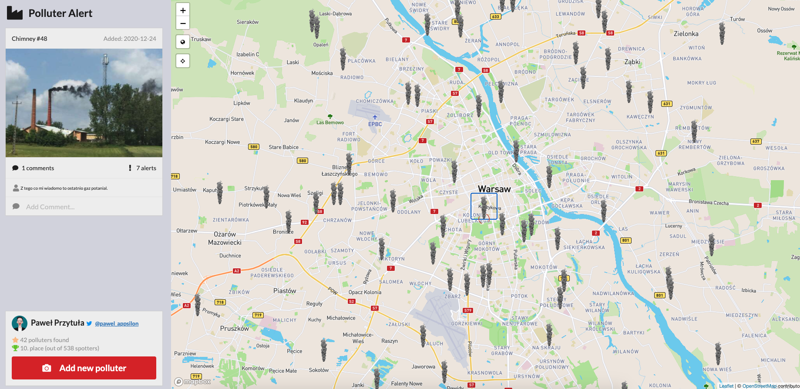
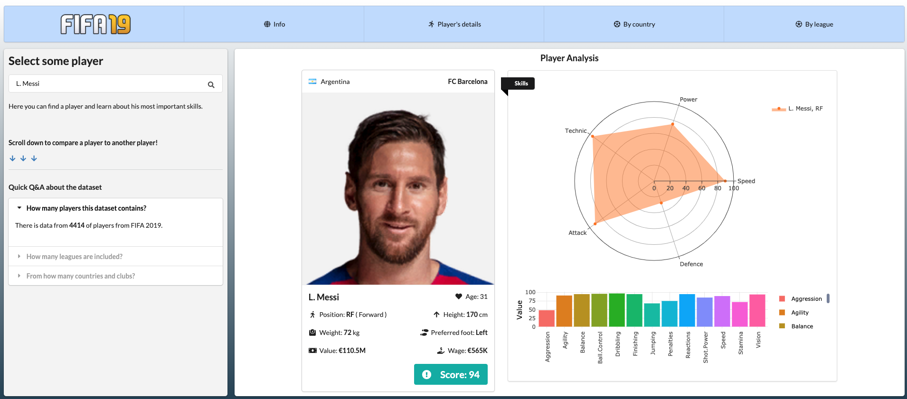
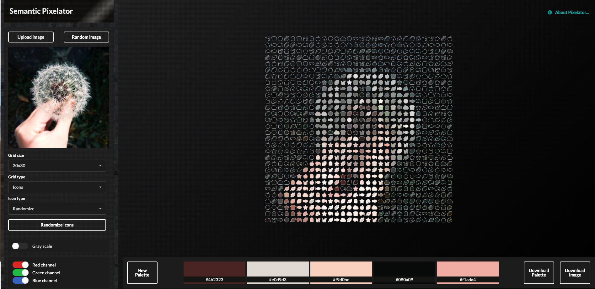
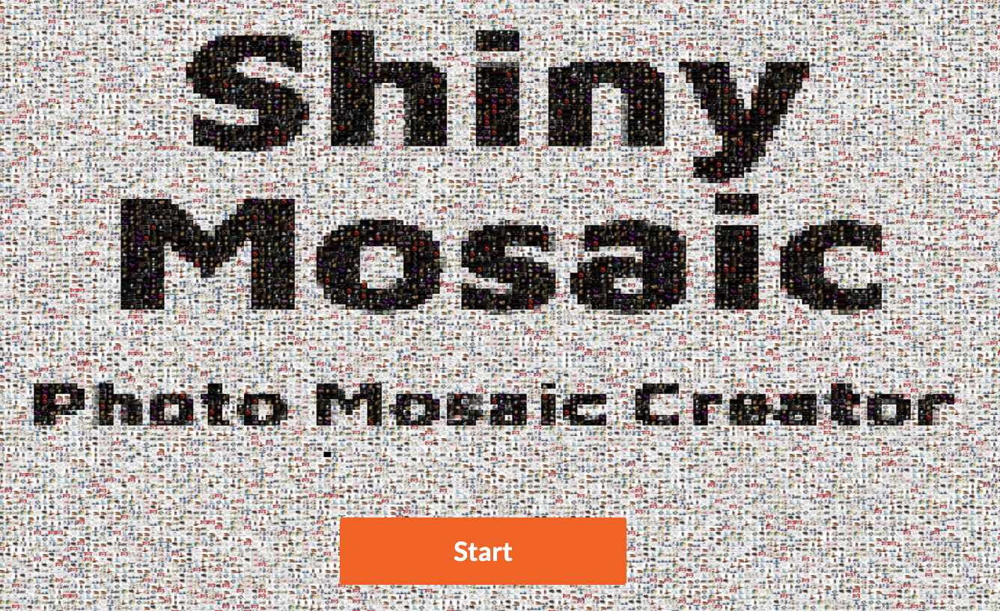
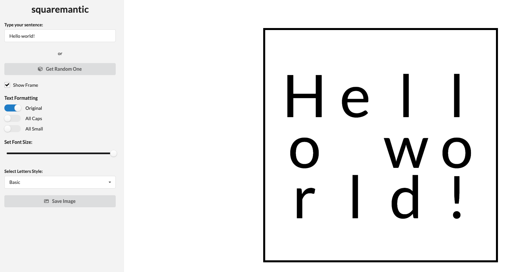
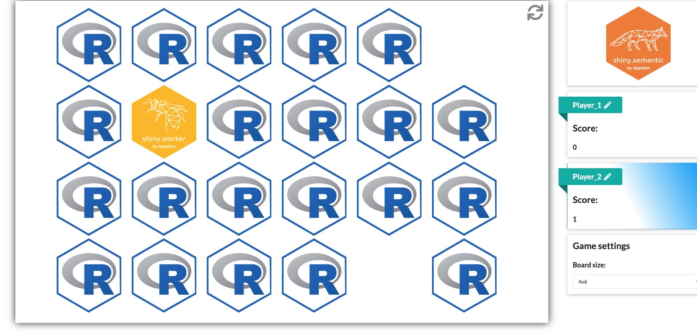

One of our Full Service Partners, <a href="https://appsilon.com/shiny" target="_blank" rel="noopener noreferrer">Appsilon</a>, recently held an internal competition to help test an open source R package they developed called <a href="https://github.com/Appsilon/shiny.semantic" target="_blank" rel="noopener noreferrer">`shiny.semantic`</a>. This package is designed to quickly help create proof-of-concept Shiny apps using the Fomantic UI library. To make the competition a little more interesting, Appsilon reached out and asked if we would judge the submissions on their technical and creative merit. Here’s a sneak peek of the apps we got to review, and a summary of the winners. 

The goal of the `shiny.semantic` library is to help developers create beautiful, sophisticated apps rapidly for demoing or proof-of-concept (PoC) purposes. By quickly creating a visually appealing PoC, users are able to showcase the capabilities of Shiny without having to invest in a lot of development time up front. 

While `shiny` works with the Bootstrap library under the hood, `shiny.semantic` uses <a href="https://fomantic-ui.com/" target="_blank" rel="noopener noreferrer">Fomantic UI</a> (formerly Semantic UI) to develop its layout structure. Fomantic UI groups elements with similar layout concepts together, letting users create beautiful reactive HTML outputs. Because the structure is semantically grouped, users can add related elements more easily, allowing them to create complex layouts with little development overhead. 

Appsilon wanted to prove that with `shiny.semantic`, it’s possible to create a great looking and high quality Shiny app in under 24 hours. As a result, they ran an internal competition to test this theory. 

Contest Rules:

1. You must use the `shiny.semantic` package.
2. Your demonstration must be built by a single person.
3. Development time must not exceed 24 hours. 

Below are the winners of the competition along with some honorable mentions. 

### Most Technically Impressive: <a href="https://demo.appsilon.ai/apps/polluter/" target="_blank" rel="noopener noreferrer">Polluter Alert</a>

This is a Shiny dashboard created by Appsilon co-founder <a href="https://appsilon.com/author/pawel/" target="_blank" rel="noopener noreferrer">Pawel Przytula</a> that allows the user to view and report sources of air pollution in a particular area over time. The app is made up of a Leaflet map that shows live pollution sources and additional data about the sources as gathered from the <a href="https://developer.airly.eu/" target="_blank" rel="noopener noreferrer">Airly API</a>. In addition to exploring current air pollution sources, the user can also upload their own polluters using their webcam and GPS location.

This application is quite sophisticated in that it uses multiple APIs and leverages different tools to connect them. Even though it’s just a proof of concept, this app would be widely helpful for local governments. 

Development Time: 17 hours
 
<a href="https://github.com/Appsilon/shiny.semantic-hackathon-2020/tree/master/polluter-alert" target="_blank" rel="noopener noreferrer">Github Repository</a>

### Runner up: <a href="https://demo.appsilon.ai/apps/fifa19/" target="_blank" rel="noopener noreferrer">FIFA '19</a>

Inspired by <a href="https://ekrem-bayar.shinyapps.io/FifaDash/" target="_blank" rel="noopener noreferrer">Ekrem Bayar’s FIFA '19 Shiny dashboard</a> and using data from the <a href="https://sofifa.com/" target="_blank" rel="noopener noreferrer">SoFIFA dataset</a>, this application by <a href="https://appsilon.com/author/dominik/" target="_blank" rel="noopener noreferrer">Dominik Krzemiński</a> lets users explore FIFA '19 data by comparing teams, players, and leagues. This app is a great example of all the different visualizations available in Shiny, and for being developed in under 10 hours, we are quite impressed! Dominik leads the development of <a href="http://shiny.tools" target="_blank" rel="noopener noreferrer">open source packages at Appsilon</a>, so it’s no surprise that he has such a great handle on `shiny.semantic`’s capabilities. 

Development Time: 9 hours
 
<a href="https://github.com/Appsilon/shiny.semantic-hackathon-2020/tree/master/fifa19" target="_blank" rel="noopener noreferrer">Github Repository</a>

### Most Creatively Impressive: <a href="https://demo.appsilon.ai/apps/pixelator/" target="_blank" rel="noopener noreferrer">Semantic Pixelator</a>

Created  by <a href="https://appsilon.com/author/pedro/" target="_blank" rel="noopener noreferrer">Pedro Silva</a>, one of the Grand Prize Winners of the <a href="https://blog.rstudio.com/2020/07/13/winners-of-the-2nd-shiny-contest/" target="_blank" rel="noopener noreferrer">2020 RStudio Shiny Contest</a>, Semantic Pixelator is a clever way for users to explore images by composing them into a mosaic using loaders, icons, and other semantically-related UI elements. 

The user can start with a random image or upload their own picture (as you might have recognized in the header photo at the top of this article) to start. The user can then use the sidebar to refine different parameters such as the size of the generated grid, the base element type, and different color options. The user can then use the palette generator to generate a color palette based on the result, as well as download both the current palette details and the generated composition. The app is also full of Easter eggs, so try exploring and even typing in random words!

Development Time: 24 hours
 
<a href="https://github.com/Appsilon/shiny.semantic-hackathon-2020/tree/master/semantic.pixelator" target="_blank" rel="noopener noreferrer">Github Repository</a>

## Honorable Mentions

### <a href="https://demo.appsilon.ai/apps/mosaic/" target="_blank" rel="noopener noreferrer">Shiny Mosaic</a>

This application allows users to create a photo mosaic using their own photo. First, users select a theme for the final image, either dogs, cats, or a custom one. Then, either by using their webcam or uploading a photo, the user can generate and download a photo collage of their image generated from an image library of the selected theme. So, for instance, you could make a photo mosaic of a picture of your dog that is composed of hundreds of images of other dogs. 

Development Time: 24 hours
 
<a href="https://github.com/Appsilon/shiny.semantic-hackathon-2020/tree/master/mosaic" target="_blank" rel="noopener noreferrer">Github Repository</a>

### <a href="hhttps://demo.appsilon.ai/apps/squaremantic/" target="_blank" rel="noopener noreferrer">Squaremantic</a>

This application developed by Jakub Chojna creates a visually appealing square layout from text input. The user can update the formatting of the letters via the sidebar input and eventually download the final result as a PDF file. We can definitely see a graphic design team using this application to generate ideas and proof of concepts. Now if only it helped to create hex-shaped images of R package logos...

Development Time: 20 hours
 
<a href="https://github.com/Appsilon/shiny.semantic-hackathon-2020/tree/master/squaremantic" target="_blank" rel="noopener noreferrer">Github Repository</a>

### <a href="https://demo.appsilon.ai/apps/semantic_memory/" target="_blank" rel="noopener noreferrer">Semantic Memory</a>

Inspired by one of the 2019 Shiny Contest winners, <a href="https://community.rstudio.com/t/shiny-contest-submission-hex-memory-game/25336" target="_blank" rel="noopener noreferrer">Hex Memory Game</a>, Semantic Memory was created by <a href="https://appsilon.com/author/kuba/" target="_blank" rel="noopener noreferrer">Jakub Nowicki</a>, using `shiny.semantic`. Two players try to find as many pairs of RStudio and Appsilon package hex logos as they can, while the app tallies scores and displays a winner for each game.

Development Time: 12 hours
 
<a href="https://github.com/Appsilon/shiny.semantic-hackathon-2020/tree/master/semantic_memory" target="_blank" rel="noopener noreferrer">Github Repository</a>

### Vote for the People’s Choice Winner

Which `shiny.semantic` PoC app is your favorite? Click <a href="https://forms.gle/KPvtkdKSTsY94h6a8" target="_blank" rel="noopener noreferrer">here</a> to browse all six submissions and vote for the People’s Choice Award. The PoC app with the most votes from the R community will win a special prize from the Appsilon team. 

### To Learn More

If you’d like learn more about using and deploying Shiny applications, we encourage you to check out the following links:

- The ever-popular <a href="https://github.com/rstudio/cheatsheets/raw/master/shiny.pdf" target="_blank" rel="noopener noreferrer">Shiny Cheatsheet</a> provides a tour of the Shiny package and explains how to build and customize an interactive app. 
- The <a href="https://shiny.rstudio.com/" target="_blank" rel="noopener noreferrer">Shiny project site</a> provides tutorials, resources and many examples of Shiny applications.
- If you need to deploy and share your Shiny applications, <a href="https://www.shinyapps.io/" target="_blank" rel="noopener noreferrer">shinyapps.io</a> lets you deploy your apps on the web in minutes, while <a href="https://rstudio.com/products/connect/" target="_blank" rel="noopener noreferrer">RStudio Connect</a> allows you to share Shiny apps (and many other types of data science content) within your organization. 
