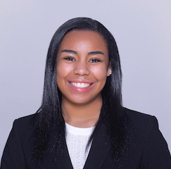
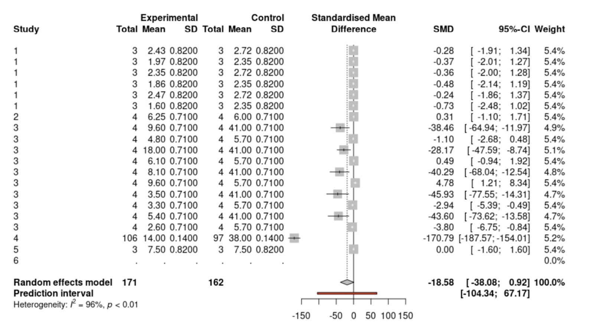
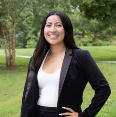
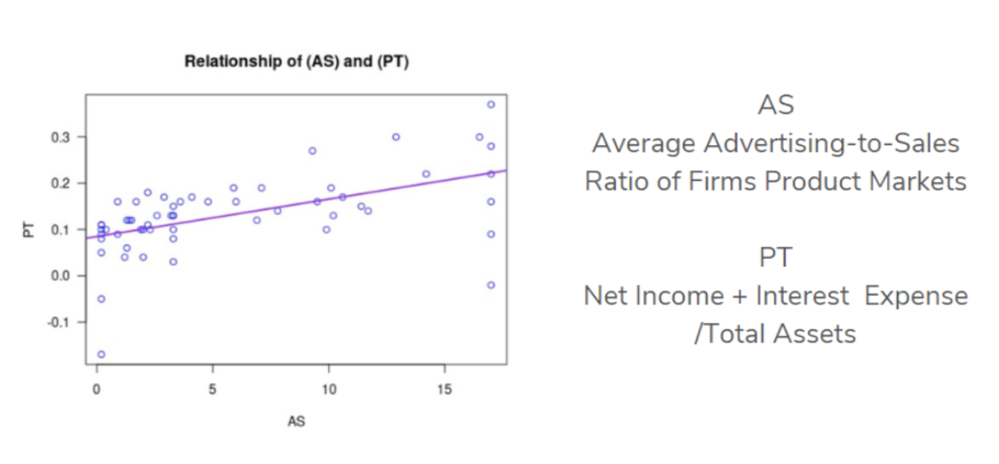

> This is a guest post from Kathleen Bostic (Spelman College) and Michel Ruiz-Fuentes (Smith College), participants in the INSPIRE U2 summer site directed by <a   href="https://anayenablanksonphd.weebly.com/" target = "_blank" rel = "noopener noreferrer">Dr. A. Nayena Blankson</a>. The INSPIRE U2 Program provides a learning pathway for underrepresented female students to enter advanced degrees and careers in statistical fields. Learn more in our previous <a   href="https://blog.rstudio.com/2021/10/20/the-inspire-u2-program/" target = "_blank" rel = "noopener noreferrer">blog post</a> and on the <a   href="https://sites.spelman.edu/inspireu2-reu/" target = "_blank" rel = "noopener noreferrer">program website</a>.

### Navigating Leadership and Learning Through RStudio

#### Kathleen Bostick

I served as the Junior Mentor for the INSPIRE U2 Scholars. As a Junior Mentor, part of my role included participating in various aspects of the summer program, such as attending the RStudio Bootcamp taught by Dr. Blankson and completing an independent project. My experience with RStudio was such an incredible opportunity that allowed me to immerse myself in coding.

My RStudio mentor was Mine Çetinkaya-Rundel, who helped me through the process of enhancing my coding skills. We met once a week and she really took the time to walk me step by step on how to code. We were able to create something incredible together! I am so grateful for the teachings of Dr. Blankson that gave me the foundation necessary to take my research to the next level with Mine. Jessica Coates and Dr. Mentewab Ayalew were both critical to helping me piece everything together. With the materials I created with Dr. Blankson and Mine, I was able to produce a presentation unique to the research Jessica Coates and Dr. Ayalew guided me through. Thanks to the great teams at INSPIRE U2 and RStudio, my research is in the process of being published!

Learning and using RStudio, and being involved with the INSPIRE U2 Program, have played a critical role in the evolution of my coding skills, leadership skills, research skills, and presentation skills. If anyone has the opportunity to learn how to code, I highly recommend starting with RStudio and utilizing their mentors because it will make all the difference in the world.

### Reflecting on INSPIRE U2
#### Michel Ruiz-Fuentes

My name is Michel Ruiz-Fuentes, and I’m a sophomore at Smith College. I am passionate about advocacy and innovation, and INSPIRE U2 was a memorable opportunity that has allowed me to see the intersection of my passions with Statistics and Data Science.

During my first year in college, I explored a plethora of disciplines, intending to find a field that I enjoyed and allowed me to lead meaningful change. Taking a statistics course in my first semester titled *Communicating with Data* exposed me to the crucial role that statistics and data science play in our everyday lives. In particular, it showed me how statistics helps us identify, analyze, and articulate information that is crucial for decision-making processes. In class, we conducted projects to combat barriers in statistics like data accessibility and created visualizations that are understandable for any individual regardless of their background in statistics. I was particularly fascinated in learning what statistics was and how to use it ethically to make well-versed decisions. My professor, Sara Stoudt, shared the INSPIRE U2 research opportunity with our class and encouraged historically underrepresented students to apply!

I am fortunately now able to reflect on being a part of a robust cohort and research experience. I worked with Dr. Tharu, Assistant Professor of Mathematics at Spelman, and Mr. Jeff Allen, RStudio Mentor, to analyze a market research question and precisely measure the strength of the relationship between elements of market structure with the net income of large marketing-intensive firms. I sourced secondary data from the Industrial Book of Economics, performed multiple regression and Box-Cox transformations, and created data visualizations, such as scatterplots, to show my findings.

I enjoyed working with RStudio because it required critical thought, patience, and purpose. Every line of code has a meaning. It is a delicate and rewarding process to write your code and transform your raw data into a story with meaning. I hope to share my research findings — that marketing is a crucial aspect of increasing your company’s net income — with women of color or immigrant entrepreneurs to help their companies enter the market and be strong competitors in their industry.

I had never used R nor taken an introductory statistics course before INSPIRE U2, so it was both thrilling and overwhelming to read over our syllabus and see what was planned for our summer. However, I had immense support from my mentors in navigating difficult concepts and code. Therefore, I would encourage any student, despite their background in statistics or coding, to apply! Dr. Blankson and Dr. Tharu were excellent teachers and empowered me to search for answers and keep working hard. The Bootcamp led by Dr. Blankson and the homework practice I did with Dr. Tharu prepared me for the research component of our program. In addition to engaging in the Bootcamp and research, I worked on an individual project to create a personal website with Mr. Allen! I shared with him that I wanted to build my proficiency and explore other ways R can be used, so we brainstormed possible projects, and my favorite idea was to create a website and build a portfolio! 

INSPIRE U2 challenged me to dream big, persist through obstacles, and explore uncertainty. I am grateful for this opportunity because through this experience, I pursued my interests and found a new passion!

### Learn More

For more information about the INSPIRE U2 Program, visit <a href="https://sites.spelman.edu/inspireu2-reu/" target = "_blank" rel = "noopener noreferrer">sites.spelman.edu/inspireu2-reu</a>. Applications for the 2022 program will open on November 15, 2021.

This post is cross-posted on the <a   href="https://sites.spelman.edu/inspireu2-reu/" target = "_blank" rel = "noopener noreferrer">INSPIRE U2 website</a>.
