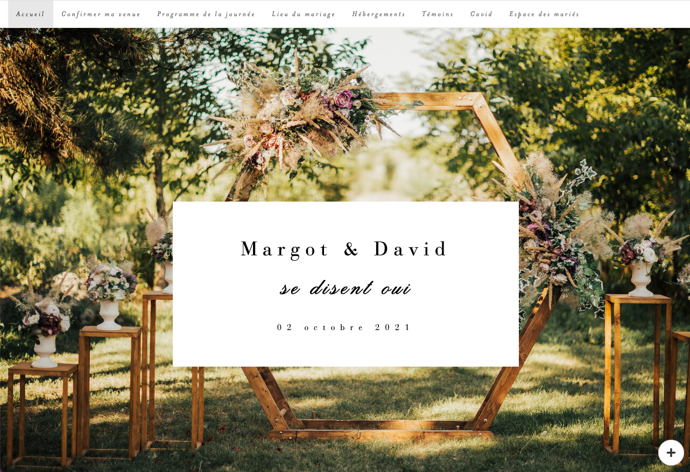

Recently we [wrapped up another round of the Shiny Contest](https://www.rstudio.com/blog/winners-of-the-3rd-annual-shiny-contest/), and, as always, the entries were terrific. A previous post announced and discussed the winners, but we wanted to take a moment to highlight some of the examples of fantastic code we saw in the entries. In this post, we have selected three apps that demonstrate Shiny best practices. The apps are [RestoR](https://community.rstudio.com/t/restor-shiny-contest-submission/104903) by Luka Negoita and Anna Calle, the [Commute Explorer](https://community.rstudio.com/t/commute-explorer-shiny-contest-submission/104651) by Stefan Schliebs, and [{wedding}: a Shiny app to help future grooms](https://community.rstudio.com/t/wedding-a-shiny-app-to-help-future-grooms-shiny-contest-submission/104657) by Margot Brard.

While many of the apps submitted implement every one of the best practices we touch on (along with many other best practices), the three we're highlighting illustrate their respective best practices excellently.

The three points we will discuss are

- [Modules](#modules)
- [Using custom styles](#custom-styles)
- [Smart organization of reactive variables](#reactive-variables)


## Best practice #1: Modules {#modules}

### Commute Explorer


_Links:_ [App](https://nz-stefan.shinyapps.io/commute-explorer-2/) - [Code](https://github.com/nz-stefan/commute-explorer-2/) - [Community Post](https://community.rstudio.com/t/commute-explorer-shiny-contest-submission/104651)


[Modules](https://shiny.rstudio.com/articles/modules.html) are used to abstract complicated sections of an app into self-contained and reusable UI and server functions. As your app grows larger and and more complicated, well utilized modules result in cleaner code that is easier to read and understand, both for the original author and any collaborators interacting with your code.

Commute Explorer does a great job not only of using modules but of simplifying the interfaces to those modules by passing reactive variables into the module's server function. A common mistake in using modules is to call them inside of some other reactive statement like `observe()`...

    # Bad module calling example
    observe({
      # Process data before sending it into the module
      if (input$filterTo != "special") {
        myModuleServer(
          data %>% 
            filter(val == input$filterTo)
        )
      } else {
        # Handle special case 
        myModuleServer(
          data %>% 
            ...
        )
      }
    })

Compare this to the (edited-for-brevity) [server function from the Commute Explorer app](https://github.com/nz-stefan/commute-explorer-2/blob/master/app/server.R). (The modules used are prefixed with `mod_` .)

    # Server function from Commute Explorer app 
    server <- function(input, output, session) {
      
      # initialise the app state...
      app_state <- reactiveValues(...)
      
      ... 
      
      # add server logic for the commute explorer
      mod_commute_mode("mode", app_state)
      mod_commute_map("map", app_state)
      mod_commute_table("table", app_state)
      mod_commute_filter("filter", app_state)
    }

By using reactives as inputs to its modules, the app's code makes it clear what the module depends on, leaving the logic for how it depends on that thing abstracted away from your main app script. See the [article on communication between modules](https://shiny.rstudio.com/articles/communicate-bet-modules.html) for a more in-depth exploration into this concept.

## Best practice #2: Using custom styles {#custom-styles}

### {wedding}: a Shiny app to help future grooms 

_Links:_ [App](https://connect.thinkr.fr/wedding/) - [Code](https://github.com/ThinkR-open/wedding) - [Community Post](https://community.rstudio.com/t/wedding-a-shiny-app-to-help-future-grooms-shiny-contest-submission/104657)

 _Screenshot of the landing page for the {wedding} app. Custom fonts and a background image make for a striking first impression._


The {wedding} app is a fantastic example of an app that you would never know was written primarily in a statistical programming language. The app has an entirely bespoke look thanks to the use of custom style sheets.

A great way of getting the use of Shiny accepted, either at your company (or by your spouse), is to keep it "on brand." The {wedding} app does this by leveraging custom CSS to beautifully match the style of a wedding invitation, creating a seamless experience for the guests/users.

The app uses the Shiny framework [Golem](https://thinkr-open.github.io/golem/)'s helpers to add the CSS to the page, but there are plenty of other ways to do it. To learn more about customizing the look and feel of your Shiny apps, see the [bslib package](https://rstudio.github.io/bslib/) and the article [Using custom CSS in your app](https://shiny.rstudio.com/articles/css.html).


## Best practice #3: Smart organization of reactive variables {#reactive-variables}

### RestoR


_Links:_ [App](https://gv2050.shinyapps.io/gv2050-platform-submission/) - [Code](https://github.com/LukaNeg/gv2050-platform-submission) - [Community Post](https://community.rstudio.com/t/restor-shiny-contest-submission/104903)

As R is a scripting language, one of the most challenging parts about learning Shiny is that the code doesn't just run down the script but as a series of "reactive" calls of code chunks that listen to each other. A common source of poor Shiny performance and maintainability is placing a large amount of logic within a single reactive statement such as an `observe()`. Burdening your observe statements with lots of `renderPlot()` calls is tempting because it is how an R programmer's script-oriented mindset works. However, once you learn to trust Shiny's reactive system and liberally use reactive variables, your code becomes much cleaner, faster, and more maintainable.


The RestorR app does a great job at this. One way to tell is that you see very few nested brackets when looking through the `server.r` file. Instead, you see nice compact reactive variables like...


```
datasheet_df <- reactive({
  sample_data %>%
  filter(site %in% input$selectSiteDatasheets) %>% 
  ...
})

## Download button
output$download_datasheet <- downloadHandler(
  filename = function() {
    paste("spreadsheet_", input$selectSiteDatasheets, ".csv", sep = "")
  },
  content = function(file) {
    write.csv(datasheet_df(), file, row.names = FALSE)
  }
)
```

Here `datasheet_df` is a reactive variable that Shiny will always keep up to date. Therefore the download button only needs to describe that it uses whatever the current value of that reactive is. This separation keeps the code easy to reason about and allows easy use of `datasheet_df` in other contexts than just the download button. 

Contrast this with a naive implementation such as:

```
observe({
  # Build datasheet_df based on current selectSiteDatasheets input
  datasheet_df <- sample_data %>%
    filter(site %in% input$selectSiteDatasheets) %>%
    ....
    
  # Setup download button so it downloads filtered data
  output$download_datasheet <- downloadHandler(
    filename = function() {
      paste("spreadsheet_", input$selectSiteDatasheets, ".csv", sep = "")
    },
    content = function(file) {
      write.csv(datasheet_df, file, row.names = FALSE)
    }
  )
})
```

Here changes in `input$selectedSiteDatasheets` trigger an `observe()` statement that filters some data and then sets up a download button. This code is not ideal because it re-initializes the download button every time the input changes. In addition, this style makes it much harder to reuse the filtered `datasheet_df` anywhere else in your app, hindering future enhancements like showing `datasheet_df` in a table. 

The compact and simple reactives result in a clean and easy-to-understand reactive dependency graph. Neat dependency graphs make your app's logic easier to parse both for humans reading the code and Shiny when executing that code. Want to see what the dependency graph looks like for your app? Try out the [React Log](https://rstudio.github.io/reactlog/).


## Learning more

The Shiny contest, both this year and in the past, was an awe-inspiring demonstration of Shiny excellence from all participants with something to learn from every app submitted. If you're eager to learn more about writing great Shiny apps by looking at outstanding examples, check out the winners from the [announcement post](https://www.rstudio.com/blog/winners-of-the-3rd-annual-shiny-contest/). Another resource for learning more is the [Shiny website](https://shiny.rstudio.com/), where you can look at [articles](https://shiny.rstudio.com/articles/) covering topics from [beginner](https://shiny.rstudio.com/articles/basics.html) to [advanced](https://shiny.rstudio.com/articles/building-inputs.html), an [app gallery](https://shiny.rstudio.com/gallery/) for more inspiration, and ["app stories"](https://shiny.rstudio.com/app-stories/) that look at the decision processes behind building apps.
