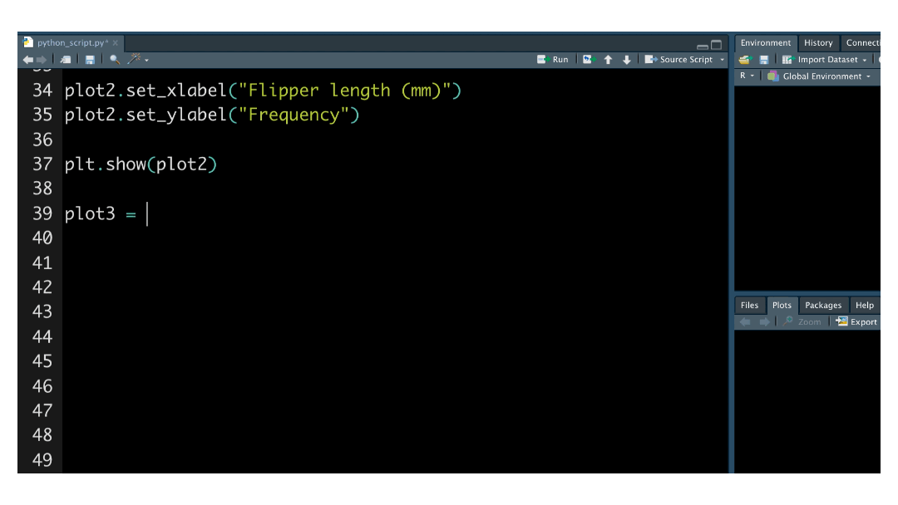

<caption>
Photo by <a href="https://unsplash.com/@timothycdykes?utm_source=unsplash&utm_medium=referral&utm_content=creditCopyText">Timothy Dykes</a> on <a href="https://unsplash.com/?utm_source=unsplash&utm_medium=referral&utm_content=creditCopyText">Unsplash</a>
</caption>

RStudio is known for making excellent tools and packages for R programming. But did you know that you can use RStudio for Python programming, as well? Whether you want to use R and Python together or work solely in Python, there are a variety of ways for you to develop your code. You can:

* [Run Python Scripts in the RStudio IDE](#1-run-python-scripts-in-the-rstudio-ide)
* [Use R and Python in a single project with the reticulate Package](#2-use-r-and-python-in-a-single-project-with-the-reticulate-package)
* [Use your Python editor of choice within RStudio tools](#3-use-your-python-editor-of-choice-within-rstudio-tools)

Let's explore these features using the <a href="https://allisonhorst.github.io/palmerpenguins/" target = "_blank">Palmer Penguins</a> dataset.

## 1. Run Python Scripts in the RStudio IDE

The <a href="https://www.rstudio.com/products/rstudio" target = "_blank">RStudio IDE</a> is a free and open-source IDE for Python, as well as R. You can write scripts, import modules, and interactively use Python within the RStudio IDE.

To get started writing Python in the RStudio IDE, go to File, New File, then Python Script. Code just as you would in an R script.

The RStudio IDE provides several useful tools for your Python development:

* The RStudio environment pane displays the contents of Python modules.
* Explore Python objects either by calling the `View()` function or by using the associated right-most buttons in the Environment pane.
* The RStudio IDE presents matplotlib and seaborn plots within the Viewer pane.


Need help remembering your Python function? RStudio also provides code completion for Python scripts:



**Learn more about <a href="https://rstudio.github.io/reticulate/articles/rstudio_ide.html" target = "_blank">RStudio IDE Tools for reticulate</a>.**

## 2. Use R and Python in a Single Project With the reticulate Package

Once installed, you can call Python in R scripts. In this example, we turn the Palmer Penguins dataset into a Pandas data frame. Then, we run the 
`pandas.crosstab` function.


We can turn the Pandas data frame back into an R object:


Interoperability works in R Markdown as well. Create and execute Python chunks in your .Rmd file:

````
```{{python}}
from palmerpenguins import load_penguins
penguins = load_penguins()
penguins.describe()
```
````

With reticulate, you can use Python in R packages, Shiny apps, and more.

**Find out more about the <a href="https://rstudio.github.io/reticulate/articles/r_markdown.html" target = "_blank">R Markdown Python engine</a> and how to <a href="https://rstudio.github.io/reticulate/articles/calling_python.html" target = "_blank">call Python from R</a>.**

## 3. Use Your Python Editor of Choice Within RStudio Tools

RStudio tools, such as RStudio Workbench and RStudio Cloud, integrate with interfaces beyond the RStudio IDE.

### RStudio Workbench

As your data science team grows, your tools need to scale as well. With <a href="https://www.rstudio.com/products/workbench/" target = "_blank">RStudio Workbench</a>, data scientists collaboratively work from a centralized server using their editor of choice: RStudio, JupyterLab, Jupyter Notebook, or VSCode.


Within the editor, data scientists can write Python code with:

* **Better collaboration:** Data scientists use the same back-end infrastructure, which makes it easier for them to share files, data, libraries, and other resources.
* **Concurrent sessions:** RStudio Workbench enables users to have multiple concurrent R or Python sessions on a single server or a load-balanced cluster of servers.
* **Security:** Python programmers can work in securely-managed session sandboxes.

In the RStudio IDE, data scientists can also collaborate in real time. When multiple users are active in the project at once, you can see each others' activity and work together.

**Learn more about <a href="https://www.rstudio.com/products/workbench/" target = "_blank">RStudio Workbench</a>.**

### RStudio Cloud

<a href="https://www.rstudio.com/products/cloud/" target = "_blank">RStudio Cloud</a> is a cloud-based solution that allows you to run, share, teach and learn Python. Jupyter Notebook projects are now available to Premium, Instructor, or Organization account holders. Once in RStudio Cloud, it is easy to install modules, share Jupyter notebooks, and run Python code:


Want to try out this notebook? Check it out in <a href="https://rstudio.cloud/project/2997990" target = "_blank">your browser</a> (no paid subscription needed but login required).

**Learn more about <a href="https://www.rstudio.com/products/cloud/" target = "_blank">RStudio Cloud</a>.**

## Conclusion

We want you to do your best work in your preferred environment and language. RStudio provides exciting options for your Python projects: Python scripts in the RStudio IDE, mixed language development with reticulate, and editor options in RStudio Cloud and RStudio Workbench.

Data science goes beyond coding. With RStudio, you can also:

* **Manage your Python packages:** With <a href="https://www.rstudio.com/products/package-manager/" target = "_blank">RStudio Package Manager</a>, you can mirror the Python Package Index (PyPI) to organize and centralize packages behind your firewall.

* **Share Python content via RStudio Connect:** Need to publish and share your Python content? <a href="https://www.rstudio.com/products/connect/" target = "_blank">RStudio Connect</a> allows data scientists to publish Jupyter Notebooks, Flask applications, Shiny applications that call Python scripts, and much more.

**See RStudio Connect and Jupyter notebooks in action during Tom Mock's live webinar on Thursday, December 9th at 11-12 ET - <a href="https://www.youtube.com/watch?v=iJspIB-Wh38" target = "_blank">Cut down on the grunt work and deliver insights more effectively with RStudio Connect, R Markdown, and Jupyter.</a>**

Read more about how RStudio can support your Python development:

* <a href="https://www.rstudio.com/solutions/r-and-python/" target = "_blank">RStudio: A Single Home for R & Python</a>
* Solutions page for <a href="https://solutions.rstudio.com/python/" target = "_blank">Python with RStudio</a>
