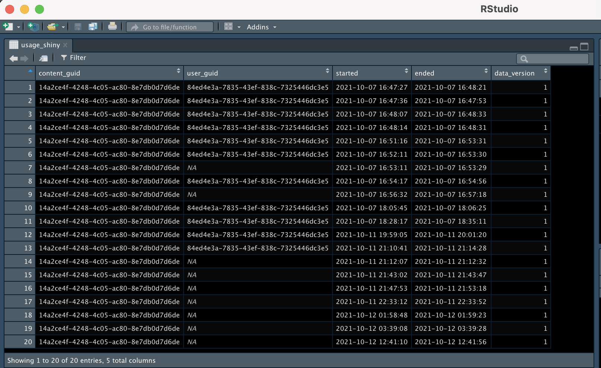
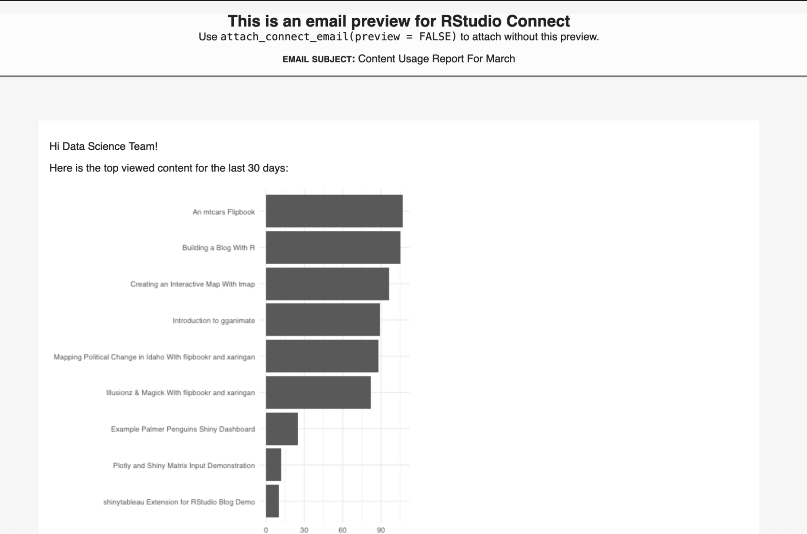

Data scientists spend a lot of time creating apps, dashboards, and reports. All of this effort is often hampered by siloed workflows between coworkers and across teams, which leads to delays in presenting your insights to stakeholders and clients.

After all that time and effort, are you even sure what you're sharing is relevant to your audience? You may start to wonder: who looked at this recently? What content is most popular? Having the numbers to back up your work can help you determine your next move and justify your efforts to your stakeholders.

<a href="https://www.rstudio.com/products/connect/" target = "_blank">RStudio Connect</a> is designed to help you share and understand your data products in real-time. Connect is RStudio's enterprise publishing platform for data science products like R Markdown documents, Shiny apps, Flask APIs, and more. Using the <a href="https://docs.rstudio.com/connect/api" target = "_blank">RStudio Connect Server API</a>, you can extend Connect to see advanced usage metrics to answer important questions and focus your data science work.

Cole Arendt from RStudio presented on the topic during a <a href="https://www.youtube.com/watch?v=0iljqY9j64U" target = "_blank">YouTube Live event</a>. Watch the webinar here:

<center>
<iframe width="640" height="360" src="https://www.youtube.com/embed/0iljqY9j64U" title="YouTube video player" frameborder="0" allow="accelerometer; autoplay; clipboard-write; encrypted-media; gyroscope; picture-in-picture" allowfullscreen></iframe>
</center>

## Collecting Instrumentation Data From RStudio Connect

RStudio Connect automatically records “instrumentation data”, or data from when users visit your server. As a publisher or administrator, you have access to these data: who logged in, when they logged in, what they looked at, and how long they spent on that piece of content.

Here is an example of Shiny instrumentation data from Connect:



You can use instrumentation data to answer questions like:

* How many Shiny apps are on this server?
* Who looked at this app recently and for how long?
* Which users have access to which app?
* Is viewership increasing?

With this information, you can track progress against your goals and efficiently set up your next steps. This will cut down on overhead and free up time to allocate towards other efforts.

If you are interested in ways of boosting viewership, you can create a custom gallery of your content using the <a href="https://rstudio.github.io/connectwidgets/" target = "_blank">connectwidgets</a> package. This makes it easy for your audience to discover your work without scrolling through your entire Connect server. Have some restricted apps in your gallery? The permissions feature directs non-authenticated viewers to request access. Read more about <a href="https://www.rstudio.com/blog/rstudio-connect-1-9-0/" target = "_blank">RStudio Connect's content creation features</a>.

## Extending Connect With the RStudio Connect Server API

The RStudio Connect Server API provides easy access to your server's instrumentation data. With the <a href="https://pkgs.rstudio.com/connectapi/" target = "_blank">R</a> and <a href="https://github.com/rstudio/rsconnect-python/" target = "_blank">Python</a> clients, you can load your server's instrumentation data into your IDE.

To install connectapi in R, run the below:

``` R
remotes::install_github('rstudio/connectapi')
```

Create a client:

``` R
library(connectapi)

client <- connect(
  server = 'https://connect.example.com',
  api_key = '<SUPER SECRET API KEY>'
)

# If your server is defined by your environment variables, you can just run:

client <- connect()
```

Once you set up your client, you can use it to interact with RStudio Connect. Say you want to retrieve the instrumentation data from all of your Shiny apps:

``` R
usage_shiny <- get_usage_shiny(client)
```

This results in a data frame with the instrumentation data mentioned above.

## Creating a Report With Connect Server API Data

Once you have access to the Connect server data, you can make custom informative reports for your stakeholders. For example, <a href="https://colorado.rstudio.com/rsc/usage/rsc-usage.html" target = "_blank">this flexdashboard</a> shows the most popular Shiny applications and static content from RStudio's demo server:

<script src="https://fast.wistia.com/embed/medias/c8xjq88vc7.jsonp" async></script><script src="https://fast.wistia.com/assets/external/E-v1.js" async></script><div class="wistia_responsive_padding" style="padding:60.63% 0 0 0;position:relative;"><div class="wistia_responsive_wrapper" style="height:100%;left:0;position:absolute;top:0;width:100%;"><div class="wistia_embed wistia_async_c8xjq88vc7 videoFoam=true" style="height:100%;position:relative;width:100%">&nbsp;</div></div></div>

Since this dashboard is built with R Markdown, you can schedule emails with RStudio Connect and the <a href="https://pkgs.rstudio.com/blastula/" target = "_blank">blastula</a> package. Send an email to your team anytime the dashboard is refreshed. Find out how on the <a href="https://solutions.rstudio.com/r/blastula/" target = "_blank">Solutions website</a>.



Need something more interactive? You can create a <a href="https://colorado.rstudio.com/rsc/usage-interactive/" target = "_blank">Shiny app</a> for users to explore the data in real-time. This one shows the most popular apps and most active viewers over time.

<script src="https://fast.wistia.com/embed/medias/03wpixim0r.jsonp" async></script><script src="https://fast.wistia.com/assets/external/E-v1.js" async></script><div class="wistia_responsive_padding" style="padding:60.63% 0 0 0;position:relative;"><div class="wistia_responsive_wrapper" style="height:100%;left:0;position:absolute;top:0;width:100%;"><div class="wistia_embed wistia_async_03wpixim0r videoFoam=true" style="height:100%;position:relative;width:100%">&nbsp;</div></div></div>

Want to try these out with your RStudio Connect server? You can download the code from our <a href="https://github.com/sol-eng/connect-usage" target = "_blank">Github repository</a>, add your environment variables, and display your own data.

## Learn More

With the RStudio Connect API, you can access data that helps quantify your work's reach and make content more relevant to your stakeholders.

* Watch the full webinar on <a href="https://www.youtube.com/watch?v=0iljqY9j64U" target = "_blank">YouTube</a> and review Cole's <a href="https://github.com/RStudioEnterpriseMeetup/Presentations/blob/main/shiny-app-usage.pdf" target = "_blank">slides</a>.
* Check out the <a href="https://docs.rstudio.com/connect/cookbook/" target = "_blank">RStudio Connect Server API Cookbook</a> for useful recipes when accessing your usage data.
* Read the Solutions Engineering team's documentation on <a href="https://solutions.rstudio.com/data-science-admin/tracking/" target = "_blank">how to create the dashboard shown above</a> and <a href="https://solutions.rstudio.com/data-science-admin/connect-apis/" target = "_blank">a showcase of different types of Connect API reports</a>.
* Access the <a href="https://pkgs.rstudio.com/connectapi/" target = "_blank">R client</a> and <a href="https://github.com/rstudio/rsconnect-python/" target = "_blank">Python client</a> for the Connect Server API.

Want to make the RStudio Connect Server API bigger and better? We have a variety of spots to check out.

* Join the discussion on <a href="https://community.rstudio.com/t/rstudio-connect-usage-data-thread-to-discuss-ideas-improvements-and-share-how-youve-done-this/130581" target = "_blank">RStudio Community</a>.
* Contribute to <a href="https://github.com/sol-eng/connect-usage" target = "_blank">open-source packages and tools</a>. We welcome pull requests, examples, feature requests, issues, and comments.
